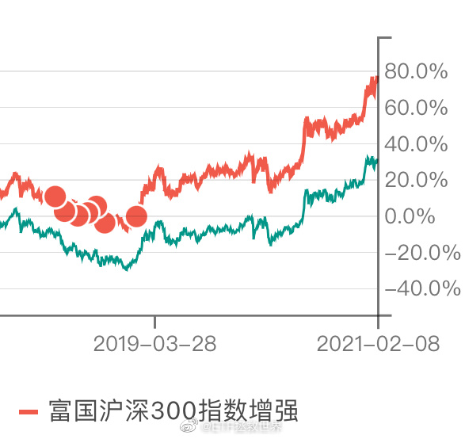
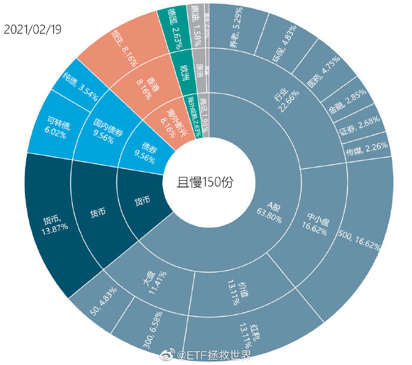
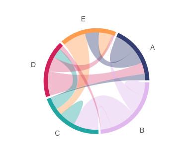
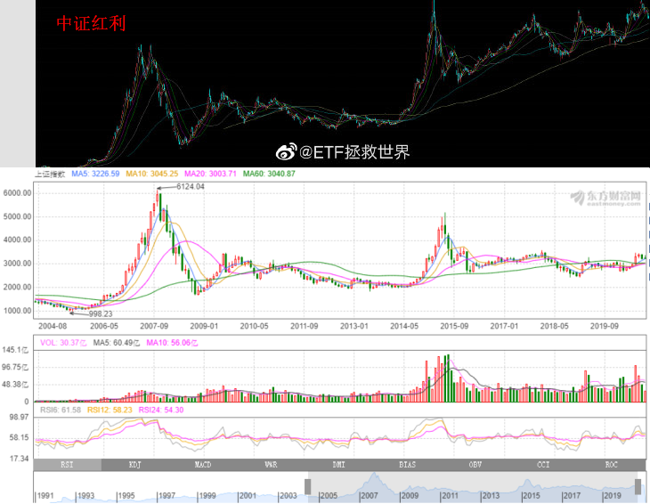
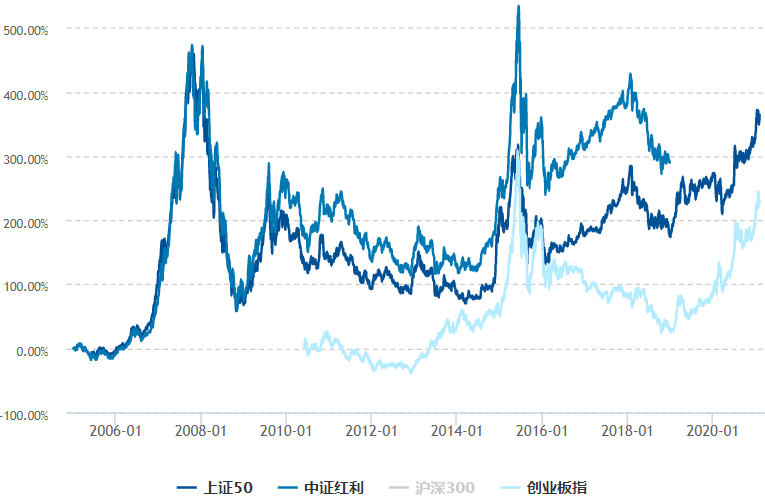
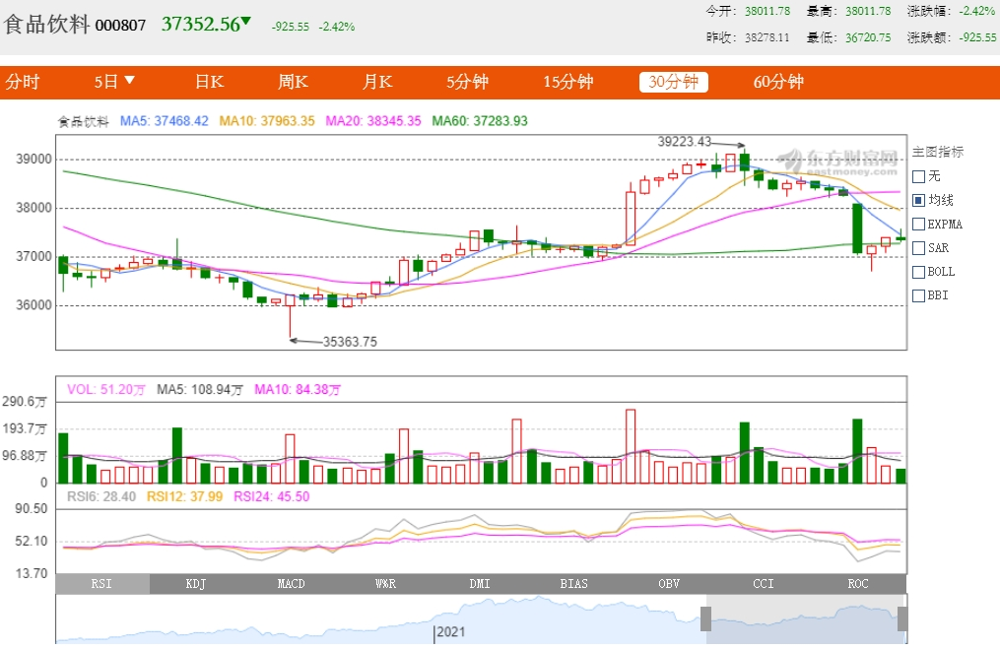
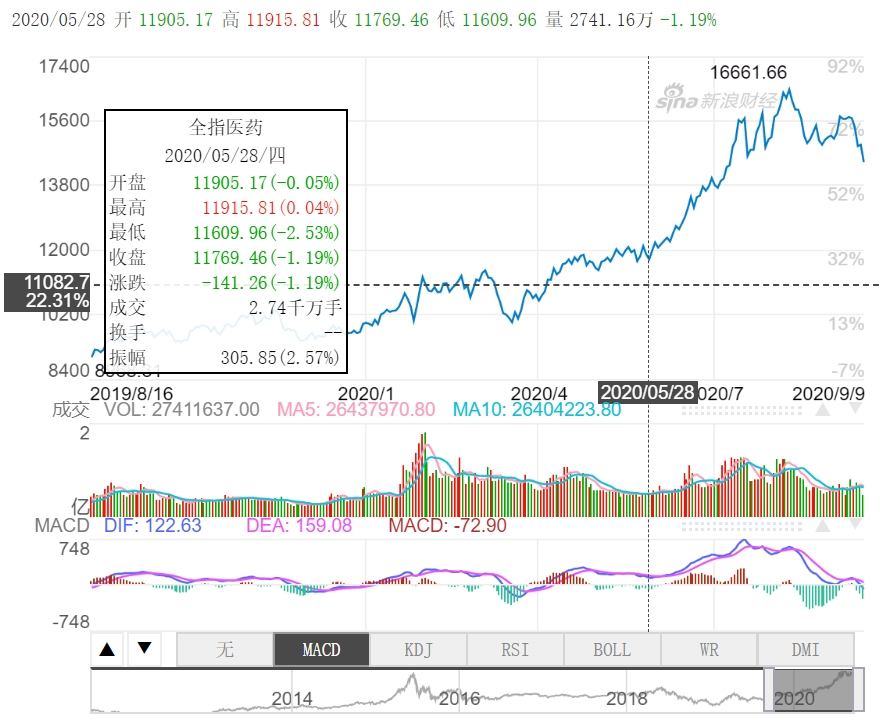
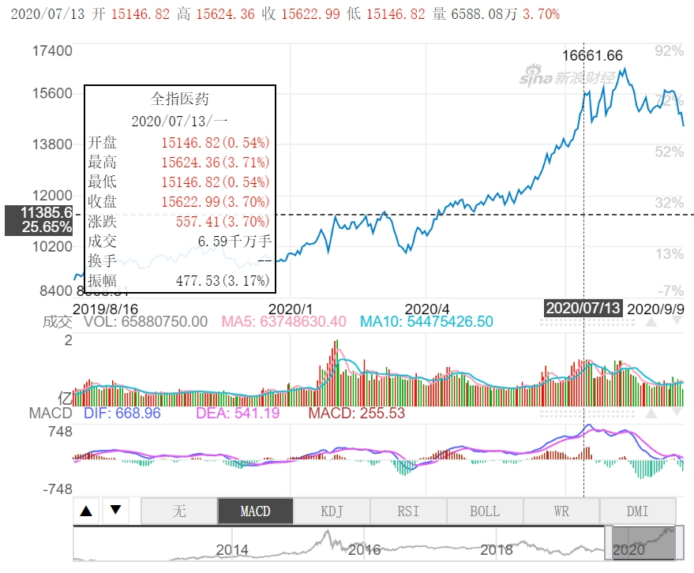
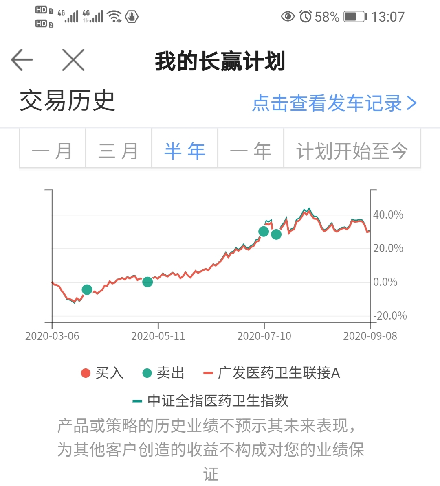

------------------------------------------------
长赢公众号中2015年7月开始的发车文章读起

1、“基本面研究、估值、交易系统”，是投资的三大能力 ???

------------------------------------------------

## 香港银行账户有什么优势

国内QDII的一个问题就是底部限购甚至关闭申购，高位又打开。这样底部场外买不进去，场内大幅溢价。【注册雪盈，能解决QDII的这个问题吗？20210305 https://weibo.com/chinaetfs?is_all=1#_rnd1614921295319 】

## 香港证券账户有什么优势 富途证券、老虎证券、雪盈证券 ...
在内地如何买港股，怎么开户？有什么条件和要求吗？ - App小公主的回答 - 知乎
https://www.zhihu.com/question/19734704/answer/1352572890

如何购买港股，总结下一共有两种，一种是直接在A股券商开通门槛很高沪港通和深港通（至少需要50万资金才能开通），另一种是直接开通港美股券商，基本上两万人民币就可以直接投资港股了。

如果不去券商开户，直接用香港的银行APP买，这样也是一样的吗？除了手续费可能不一样？
App小公主App小公主 (作者) 回复夏至2020-10-26
那手续费非常贵了

佣金：基本上是0～万10之间，主流是万3，所以我们挑选的时候只要佣金不超过万3都是可以选择；
平台费：基本上是在0～15港币之间；
现金打新费用：在0～100之间；

diycode.cc美港股优惠导航，如果你开户，也可以去这个网站寻找个优惠链接，能帮你节省不少钱。
港股交易费用主要是包含：

1、香港政府、香港证监会、香港交易所，香港结算中心等机构收取的固定费用。

2、券商收取的费用，主要是佣金和平台使用费。

长期投资选择券商考虑的更多，在此我只推荐老虎证券、富途证券、雪盈证券（背后是盈透）三家，在交易的多样性、社区氛围、App 体验等等多方面综合评分都远高于其他的。当然了，如果你英文还不错，直接使用盈透证券、TD、Robinhood 等美国券商则会有更加优惠的佣金以及融资利率。

## 如何定投香港和美国的ETF指数基金？https://mednoter.com/invest-etf.html

哪些美国和香港的指数基金比较好？
可以从流通性，资金量，管理费等角度来评估基金的好坏。

香港指数基金

基金名称	跟踪指数	公司	管理费
盈富基金	恒生指数	道富	0.09%
美国指数基金

巴菲特推荐跟踪标普500指数基金。先锋，贝莱德两家公司的产品资金量大，管理费低，最受欢迎。

基金名称	缩写	跟踪指数	公司	管理费
iShares S&P 500	IVV	标普500	贝莱德	0.04%
SPDR S&P 500	SPY	标普500	道富	0.09%
Vanguard S&P 500	VOO	标普500	先锋	0.04%
美国纳斯达克汇集了全世界最优秀的科技公司，纳斯达克100指数基金也是一个很好的投资选择。

基金名称	缩写	跟踪指数	公司	管理费
PowerShares QQQ Trust	QQQ	NASDAQ 100 指数	Invesco	0.20%

### 96年A股将涨跌停幅度从无限制调整到10%
在10%涨跌停板的制度安排下，当股价接近涨跌停板的时候，往往出现“磁吸效应”迅速封板，而买入一只涨停或接近涨停的股票，往往在第二天或者此后出现“溢价效应”，这种打板或连板策略，常常导致股价大幅偏离其合理价格，不利于市场定价以及价值投资。 我们认为，涨跌幅将放开至20%后，股票“涨跌停”以及“连板”的频率将出现大幅降低，从而减少市场短期投机策略的有效性，进一步提高市场的连续性和流动性

##  大学教材《金融学》、《投资学》和《公司理财》

翻翻CFA（特许金融分析师）的官方教材和辅导资料

# E大回顾

刚才看了一下自己的记账软件，还是有点感慨的。

十几年前刚入股市的时候，所有的投资资产加起来，没有现在一天的变动数字大。

所以我觉得对于刚开始投资的，本金比较少的人来说，不重要和重要的是什么呢。

不重要的

是你现在的本金让你赚了多少。因为本金不多，所以收益率是多少也不多。

重要的

是如何建立一套可以长期持续赚钱的、不大幅回撤的投资体系。我本人十几年投资经历中，只有3年发生了回撤，回撤幅度都小于15%，深知这一条的重要性。在你的资产越来越大后，一次致命回撤可能会导致你十几年的辛苦全部白费，可能就此一蹶不振。

重要的

是想办法增加本金。因为也许你随便多挣点本金放到账户里，可能都比你挣100%多。这一点在财富积累初期以及中期是非常重要的。到了后期，你的本金增加已经对账户波动起不到什么作用了。

很多年后，你会发现这条微博有多重要。

------------------------------------------------

# 值博率 E大 ???

什么叫钻石坑，很多人两年后才懂​​​-20210209

巴菲特???：当成功概率很高的时刻，下最大的赌注。其余时间按兵不动。

2020年7月8日 

对我来说，只有一个指标是最核心的：值博率。

目前的值博率，大致回到了5:5的阶段。也就是说涨跌概率差不多。这种时候一动不如一静，踏实持仓，等待值博率变化再动。

对了，钻石坑的值博率大致是9:1。

来自 <https://weibo.com/chinaetfs?is_all=1> 

## 值博率例子

一支股票目前的价格和合理估值均为10元，随着业绩增长，一年后可能上涨25%，但如果无法实现业绩预测，没有业绩增量，根据历史估值，很可能下跌25%，那么，它的值博率就是1，处于既不好也不坏的状态。

这样一支股票，如果下跌到9元，基本面又没有变化，上涨和下跌空间就分别为3.5元和1.5元，赔率就提高到2.33，属于赔率不错的机会。相反，如果涨到11元，基本面又没有变化，值博率就低于1。

值博率是买卖和持有决策的重要指标，

第一，值博率一定要高于某一个点，比如1.5，才值得开仓，低于某一个点，比如0.7，才可以卖出；第二，值博率高的，仓位可以高一点，赔率低的，仓位低一点。

如果你的自选股里有A~Z共26只股票，那我们就需要建立一个统一的估值体系，然后分别估值，判断这26支股票目前的赔率排序。

是不是赔率好的，就一定有机会呢？

不一定，还要看另一个指标——“确定性”。

确定性就是上涨与下跌的概率的比值。

 

确定性跟赔率的区别很容易被忽视，很多股票虽然上涨空间大，但上涨的概率却不高，这就是赔率好，但确定性差，最典型的是因为业绩低于预期而出现短期连续爆跌的股票。

## 计算值搏率的四项原则：
1.估计最坏情况（worst-case scenario）一旦发生时，最大的损失如何?
2.最好情况（blue sky scenario）一旦发生时，最大的回报如何?
3.能买多大?
4.估计发生的机会率?
https://articles.zkiz.com/?rbid=176453

## 想要保证“买入的品种比卖出的品种，估值更合理”，必须有一套适用所有股票的标准，做为个人投资者，最核心最简化的标准有两个：值博率和确定性。  ???

### A股到了值博率很大的时候 天道骑牛  原创 2019-01-18 
【】2019-01-31
开盘2497．88
收盘2584．57
最高2630．32
最低2440．91
涨跌幅+3．64％
涨跌额90．67
成交量33．86亿
成交额28042．32亿
振幅7．59％
换手8．91％

### 赔率、获胜机会、值博率 ???
通过几个例子加深对赔率、获胜机会、值博机会的理解。
公式一：公平赔率 ＝ 1 ÷ 投注比例
公式二：马会赔率 ＝ 公平赔率 × 0.82 ＝ 1 ÷ 投注比例 × 0.82
公式三：投注比例 ＝ 公众估计的马匹胜出机会 ＝ 1 ÷ 马会赔率 × 0.82
公式四：值博的马匹是
投注者估计的胜出机会 > 马会赔率返推的胜出机会
投注者估计的赔率 < 马会赔率
例一：独赢彩池赔率、获胜机会的例子 https://shixiongfei.com/odds-calc.html

## 市盈率PE+市净率PB-ROE=估值.png

PE：股价/盈利
PB：股价/净资产
ROE=PB/PE=盈利/净资产

坐标图中，ROE高而PE低，则为低估值！

蛋卷基金目前使用的是PE或者PB百分位估值法
乌龟量化，是做量化分析比较好的网站，免费版的足够用。

> PE，千万别以为PE计算的是公司的真实价值，它只是股票与股票之间的相对价值。用来比较不同股票的相对合理性???

-------------------------------------------------------------------------

1. 只有指数基金能用估值法来判断买卖
2. 相比看估值，更应该研究行业发展
3. 周期性强的行业不适用市盈率来估值，需要用市净率来进行估值。

来自 <https://zhuanlan.zhihu.com/p/111595584> 

## 投资理念入门： https://www.zhihu.com/question/326998351
复利理念、合理的投资回报预期；

三大投资体系：价值投资（含成长投资）、趋势投资（含主题投资）、量化投资；

经典投资理论：波浪理论、道氏理论、江恩理论（我一个都不会）。

部分常识：市场有效性/反身性、事实与预期、确定性、值博率、弹性、安全边际；

可以偷师的名人：

利弗莫尔、欧奈尔、索罗斯、巴菲特、格林厄姆、彼得林奇等；

段永平、冯柳、裘国根、（李大霄）。

4、技术入门：
量价时空；

均线系统（包括15分钟/周线）；

K线系统；

MACD/KDJ/RSI/布林线；

筹码分布；

上升/下降/震荡整理趋势；

跳空缺口；

主升浪/主跌浪；

创新高/新低。

5、信息获取：
常用渠道：

股东大会；

互动易；

企业官网/微信公众号；

行业垂直网站；

社交媒体；

搜索引擎。

6、公告常识：
一季报、中报、三季报、年报；

业绩预告、业绩快报；

公司重组/并购/出售资产；

非公开增发/配股/可转债；

公司回购/分红（除息）/送股（除权）；

大股东增减持/股权质押/转让控股权；

股权激励、员工持股计划。

1、宏观观察：
经济指标：GDP、PMI、固投、进出口、社零总额、工业增加值/工业企业利润、就业率、财政收支；

物价指标：CPI/PPI；

货币指标：基准利率、存款准备金、M0M1M2、社融总额 GC001（国债逆回购利率）、shibor(银行间拆解利率)；

汇率指标：USDCNH（美元离岸人民币）、美元指数；

关联指数：B股、H股（恒生/国企指数）、美股（道琼斯、纳斯达克、标准普尔）、日本日经、英国富时等；

股指期货：IF、IC、IH（股指期货）、CN00Y（A50期指）；

大宗商品：原油（NYMEX、北海布伦特）、黄金、BDI指数；

其它：新闻联播、新华网微信公众号、特朗普推特等。

2、市场阶段定性：
美林投资时钟；

市场阶段：牛市/熊市/震荡市；

市场估值：低风险/中风险/高风险区间；

市场资金：增量市场/减量市场。

3、选股线索：
自上而下：

行业景气周期/趋势分析；

产业政策倾向；

市场主线/风口板块；

市场风格/资金偏好。

自下而上：

财务指标选股（如ROE、ROIC、毛利率、自由现金流）；

技术指标选股（太多了）；

欧奈尔RPS指标选股；

低市盈率、低市净率、高股息率选股法等。

## 【】本人定投定制\-止盈方式

1）平时盈利20%；牛市时盈利40%止盈； 

2）根据估值\-仓位表；

3）日线破50均线时，止盈！" 

"基金定投的存量期（有存量资金，需要密集投资）的市值恒定投资法：

满仓值（例如500）\-上次基金投资的总市值；

增量期：移山填海

## 【】主观风险偏好：稳健性

客观：资产规模：100万

主客观\-估值\-仓位水平："

## A股???关键节点

2008年股灾最低点1664.93，近期股灾大盘最低点2638.30 2017-4-7 收评大盘指数：3286点 点位 20170511 3052

股市10年整体点位水平2700-3000。

  

# E大???基金买入标准：

1）盈利收益率EG>10%

2）EG>5年期国债

投资额年增长率\=12%（相当于月增长1%），如果起投金额1000，一年后变为1120。

n为从起投月份开始，当前月份的编号，例如第二年的第3个月，n=15；K为该指数买入的PE估值边界，例如恒生为10PE

波动公式： 投入\=起投 X1.01^n X ( K / 当前PE)

或投入\=起投 X1.01^n X ( K / 当前PE) ^2

## 螺丝钉：估值法

上证50指数\=H股指数的估值并不是历史最低，但毫无疑问属于绝对的低估范畴 /// 推荐规模最大的一只华夏上证 50ETF（510050）\-华夏上证50ETF联接(001051) 卖掉 001051-上证50 

  • 【证券：高弹；食品饮料：韧性】刘鹏程 20200424
• 对照上证行情读E大语录时间线与大盘点位（历史百分点？） 上证指数历史数据19951013-20200424.xlsx https://shimo.im/sheets/Qt3DkTRk6RwQxCvV/MODOC 20200424
有限和无限的游戏 孟岩

• 二鸟 “以回撤定仓位”。具体来说，就是根据单只基金的最大回撤，可以大概确定出符合自己风险承受力的基金仓位：仓位=可承受最大亏损/基金最大回撤。比如某基金的最大回撤是30%，而自己能承受的风险是持仓下跌15%，那么建议购买50%的基金，剩下的仓位做一些稳健的投资。20200924
• 【273】且慢问答ETF 拯救世界投资系统参赛版 2019-10-02 https://mm.edrawsoft.cn/template/21739
• ETF E大 https://www.chinaetfs.net/category
• https://mp.weixin.qq.com/s/S74QK4iNhpNM0QrsdGW1uA 祖屋
• https://content.qieman.com/items/436
• https://content.qieman.com/items/429
• https://content.qieman.com/items/417
• 搜集整理E大信息https://zhuanlan.zhihu.com/c_1251162102267924480
• ETF拯救世界策略分析第14期-分级A(1) 2019-07-21  <http://www.etf.group/lib/article/320671.html> 
• 指数基金计划第015期：卖出三份医药 小鱼量化 2020-05-13 13:30 <https://www.ershicimi.com/p/b497f056f7cda063024c625796fc4161> 
• 简单解读长赢指数投资本次卖出一份医药 小鱼量化 2020-07-10 15:38 https://www.ershicimi.com/p/309cbbf450eec02d93d8b4a9872a7ba8>
中欧创新

## 力哥：

技术派\-看趋势

价值派\-估值法

  • 上证50+创业板50
• 长线底仓，以新基建和券商为主  
• 总结均线表格  MA60    刘鹏程      |||   上证指数 关键分界线2780 分歧 布衣先生 4月24日上证50跌破10日均线触发止盈 <https://zhuanlan.zhihu.com/p/138331616>
• 理财 单笔 轮动
• 【精英弟子】三戒(471937335) 2020/5/3 19:43:38 @江南style 我也是做轮动的，但是有一个问题，比如说某一段时间某个板块比较好，那么轮动时候选出的标的都是这一个板块的，会不会刻意的剔除一些标的选择其他板块的标的 同一类型的标底最多选2个就行，比如3月中旬-4月份，肯定是选医药 选个医药c就行，最好是主动基金 比如这个，我是3.26上车的，如果51假期回来继续下跌的话，我会选择卖出 你可以以20日均线，30日涨幅为依据，是否上下车--股票账户自定义 
• http://data.stats.gov.cn/adv.htm?cn=C01   国家统计数据 备忘  
• 预警，警惕：非标，以底层债权为资产的固收。P2P、信托、私募，各自企业债 网叔 20200614
• 
• 目前中证银行指数的PB百分位仅为1.07%，历史上98.93%的时间都便宜
• 从2005年1月31日上市至2019年12月31日，沪深300价值指数年化涨幅高达11.57%，跑赢沪深300指数，长期涨幅同样也是非常地不错！
• 目前300价值PB百分位为0.48%，也就是说，比过去99.52%的时间都要低。
• 从2005年1月4日上市至2019年12月31日，中证银行指数涨幅达到585.09%,远远跑赢沪深300指数309.66%的涨幅，长期来看涨幅还是非常不错的。
• 中国人寿 保费返还电话 87859298
• https://m.touker.com/adviser/index/live/liveVideoDetail.htm?liveId=119243526&tgId=1706 华宝
• 归恺 朱少醒 董承非  ||  
• 备忘 资产间的相关性（多图） <https://zhuanlan.zhihu.com/p/145987341> 
• http://mp.weixin.qq.com/s?__biz=MzUzOTQ1NDI2Nw==&mid=2247484171&idx=1&sn=e90947c9b07dcd2c74995d6288b9065f&chksm=fac97d5fcdbef449af611c11178f6a333c6f7d1be2d67f34ba0667c05f8c5bb856284db23971&mpshare=1&scene=23&srcid=&sharer_sharetime=1591493776002&sharer_shareid=3fde455f5c767c439eb2110b1e94db55#rd   组合净值创五年新高    投基小玩 家   Smart贝塔    全天候大类资产配置，基于成分的长期收益期望、波动性和负相关性构建组合，根据指数均值回归构建量化模型。权益类投资聚焦宽基、行业、主题及多种策略风格的指数基金。坚持纪律，被动交易。 20200607
• 推荐的蛋卷组合???  20200529
• 20180411-阿土哥a_ 我的投资体系----续 我的投资体系----续 我个人感觉投资体系，... - 雪球.pdf 20200401 
• E大-长盈-投资体系-圆盘-20190205.jpg
• 网格 搜索图片 比较~~~
• 滚雪球：我的投资体系2019（优化版）.pdf 20200113
中国最优质的新经济资产ETF：中概互联； 中国最有活力的优质资产ETF：深红利； 中国最优质的国有性质资产ETF：上证50； 美国最优质的资产ETF：纳斯达克指数100；
• https://mp.weixin.qq.com/s/aD1G4kk7rlueuwdwqKidIg    硬资产的不变应万变 今年雪球嘉年华的主题是_十年如一_。投资，如果以十年为期进行规划，需要预测和应对未来无数不确定的变量... - 雪球.pdf
• 《读财报》 
• 会计恒等式：资产=负债 + 所有者权益 + 收入 - 费用  ||  收入包括 现金 + 应收款  ||  利润=收入-费用  || 虚增 ??? ||   20190828
• 三张表
• 资产负债表 in：  持续力-底子，可以跨年
• 利润表：=f(in)，表征 动态加工能力，函数特征 ???  含年内费用 ???
• 现金流表：  出入口
• 资产端  负债端   ???

• 今天，讲点干货 创业板50操作经验 布衣书生 <https://zhuanlan.zhihu.com/p/147385134> 
• 【青铜基民】随心所遇(13188992)  等到2700买那种难得低估得。比如沪深300本体，深基本面60这种
• 创业50比创业板更好
• 【青铜基民】随心所遇(13188992)   定投三个低估值：红利 银行 沪深300价值。你们肯定不会投得
E大-主动基金持仓前十的算术平均市盈率是67.23-1.jpg 20200731

## 投资组合 广发医药 养老产业 中证红利 中证500 国开债

债基\-美债

指基\-大盘基 + 中小创 + 港指

主动基

题材基/主题基：

消费，环保，军工

贵金属

量化基金

  

## 大盘小盘

### 大盘：

上证50，上证180，中证100，沪深300等指数

### 中小盘

中证500，中小板指，中证1000等指数  

  

## 【基金TODO】 ||

· 基金 人物 经理 王华 徐彦 **万琼** **周豪** **雷鸣** **||** 力哥，简七，三公子，螺丝钉

## 备忘：

· **2008****年股灾最低点****1664.93**，近期股灾大盘最低点2638.30 2017-4-7 收评大盘指数：3286点 点位 20170511 3052

·  

· **股市****10****年整体点位水平****2700-3000****，** **寻找一个估值点？，高于估值则减少投入金额，低于估值则加码买入**

#### 上证点位与定投比例关系图

· |||| 基金 以上证50ETF为例：上证50低于2500的时候净买入，以目前的点位为基准点，大盘每下降200点的时候可以加仓一次。点位高于3000的时候，每涨200点减仓20%就可以了。

· A股历史上重要底部\-325，512，998，1664，1949-周线级别MA888均线及其延长线

#### 抄底必要的两个信号

一个是15分钟线级别均线系统变成多头排列（也就是说数值大的均线要在数值小的均线下面，而不是像现在这样数值大的MA99在数值小的MA60上面），不懂多头排列的小伙伴可以看一下前面那个红圈里的状态，就是空头排列变成了多头排列。

#### 购买基金一般有3个费用:

· **申购费，托管费，赎回费** **3****个指标，净值，拆分，分红** |

· 叫glide path，意思是下滑曲线，这是一个构建退休基金 （也叫目标退休基金，Target Date Funds）的方法。Vanguard 先锋基金的glide path例 |

· 投资组合  
债基\-美债 指基\-大盘基 + 中小创 + 港指 主动基 题材基/主题基： 消费，环保，军工 贵金属 量化基金

· 【】定投\-加减仓

· 看大盘点位，以及基金估值???

· 基金选择：基金的基本面???

·  

·  **基金产品用历史绝对收益衡量，它的初始认购者一直持有或许是赚钱的，但是在该私募基金表现最优异时候认购的投资者却不一定赚钱，还甚至有可能巨亏** **|||** 以基金复权净值作为评判的唯一标准

· 【定投】指数基金 股票基金

· **定投：长期纯债基金** **+** **指数基金** **|**

· 选基金：**344333****法则** **？？？**

· 货币型基金：活期类似

· **选指基的要点是，你有没有选择对行业** **？？？** **指数基金** **【】**易方达消费行业股票(110022)

· 单一持有大市值混合型基金的风险，比任何基金组合更低。 ???

· 混合基金：用导购，选出3个月，6个月，1年，2年，3年，排名都是前100 的基金。几百只里大浪淘沙后剩下7只。**3****年不用的闲钱**

· 不推荐分级基金：B是加杠杆的 **【】南方中证互联网指数分级****160137** **周豪** **||** 不会下折的分级基金主要有深成指B和H股B？？？

· **定投进阶：定额投资改为不定额投资** 定投最爱熊长牛短？ 只有把时间连贯起来了，你才能完整的通过 定投平滑整个股市巨幅波动的风险。 可以在定投的比例上**将沪深****300****、恒生指数、标普****500**上各分配60%、20%、20%，用以规避A股市场上时而暴涨时而暴跌的阶段性风险以及系统性风险。 | 定投与投资组合一样，都是在分散风险 |||

· Todo 找到适合自己的投资组合，制定止损止盈的上下限，花了3周的时间基本**圈定了几只重点债券、混合和股票基金**。再根据自己手头的资金情况，确定好每月多少用于股基定投，一次性买入多少债基。三周的功课 变成手册上密密麻麻的一堆字，那个瞬间，有一种莫名而生的幸福感

### ||| 组合投资：

· **上证****50****、中证****500****、沪深****300**相关性: 上证与沪深组合适合中长线价差套利，沪深与中证组合适合中短线价差套利，上证与中证组合适合大小盘走势差异的策略 |||| 组合数量的比例：上证、**中证、沪深****)****是****15****、****27****、****22****手** **???** ||| | **指数：**百发100指数 上证50、中证100 ||| **中证****500-****、中证消费、中证医药****100****指数**

· 建议是均衡配置，三个部分：**蓝筹股**，以**50ETF**为代表的一系列ETF；深成长为代表的**成长股****ETF**； 看好的**行业****ETF**，如消费、能源、医药、互联网等

·  

### 【3-6万活期 18-30万保本】家庭理财\-资产配置：

· 个人的水库应该分成三份：**应急**\-6个月至一年的生活费\-活期【3-6万】；**保命**\-三至五年生活费\-定存、国债、商业保险\-保本不赔；**闲钱**\-五年到十年不用的钱\-股票、基金、房地产、P2P、生意 https://www.zhihu.com/question/20961741/answer/52940753

· 水湄物语http://www.douban.com/people/foxsshome/ 水晶苍蝇拍：“投资感悟1- 10” 水晶苍蝇拍的博客地址：http://blog.sina.com.cn/s/articlelist\_1576966507\_0\_1.html

· 基金风险的自我测试（或其他一些网站）：

· http://fund.jrj.com.cn/survey/20090813.shtml

· 巴菲特，要想了解的价值投资的含义，直接去读他的传记

· 学会节流，做好存款”是理财大学里的小学课程，我应该顺利毕业了。现在我开始学习 中学的课程：定投黄金和基金。

·  

### 标的选择 |||| |||

· 1、A股：**510300-****华泰柏瑞沪深****300ETF** ||| **ETF** **联接** **160119****南方中证****500****指数****ETF****联接****(LOF) =510500****南方中证****ETF** **110019****易方达深证****100****联接****\=159901****易方达深证****100ETF ||** 易方达创业板ETF(159915)???

· **中证****500** 富国**中证****500****增强**\-前端**161017** **后端****161021** 建信中证500增强**000478** ||| 广发中证500ETF联接A(**162711**) ???  
161017 富国中证500 FGZZ500 基金

· 2、债券：**511010-****国泰上证****5****年期国债****ETF**，511220

· 债券基金推荐：**汇添富价值、南方价值、中证****500****指数**。

· 首先**找出近几年收益排名前****100****名内的基金，然后再用****1****年收益排名相比较，选出前****50** **名，再用近****6****个月的收益排名比较，挑出****25****名**，就从这25名内挑好基金就可以了。

· 价值和成长的配置。大盘基金中大概区分为**偏蓝筹、平衡和远蓝筹**三种形式代替价值型、平衡型和成长型。 价值投资的风险比成长投资的风险低。价值投资是投资在打折的产品上，成长投资是投 资在未来的收益。 蓝筹是低市盈率的？？？，比较有价值，而远蓝筹是高市盈率股票，较具有成长性

· 做货币基金比较优秀的公司有：**工银瑞信、建信、南方、融通、万家**

· 投资理财 股票 市盈率 ??? 超过30年的记录，美元的趋势与黄金呈现反比； 国际之间，债务相当于存款； 巴菲特：房产出租 - **租金回报率**??? **高净值率** 买房可以高杠杆 加州房产挂出21天即可卖出；

· 3、美股：**513100-****纳指****ETF**，513500，159920（ 港股）

· 4、黄金：**518880-****华安黄金易****ETF**

· 5、货币基金：**511880-****银华日利****A**

· 【】债券基金：避开**可转债**（减少高风险）？？？**1****年不用的闲钱**

· **基金原理****…**

· 股票基金 债券基金 货币基金 ==>混合基金 ???

· 哪里购买？  
请教下答主，我考虑每月定投ETF，自己在场内购买。我现在的手续费是万三，那么每月定投1000的话，佣金是按万三算还是按照5元的最低起步价算呢？谢谢答主。 豆芽（作者）回复贾治国4 个月前 ￥1000 X 3/10000 = ￥0.3 ￥0.3 < ￥5 就是按￥5/笔算 在￥5/笔的最低收费门槛下，能拿到万分之三的费率，你每笔必须要在： ￥5 ÷ 3/10000 = ￥16666.67 每笔成交额在￥16666.67以上的，才有万分之三的费率，否则按￥5/笔收取最低收费，你每月￥1000，要被收取￥5，费率就是： ￥5 ÷ ￥1000 = 0.5% 而指数基金的场外定投申购费率已经降低到了一折，通常纯指数基金的申购费原价是1.2%，一折就是0.12%，你在场内手工买入要0.5%，劳命伤财啊！ 3

· **渠道：数米基金**、天天基金**、**好买基金 海通 手续费万分之五 ??? 股票佣金万三；

· 指数基金三个主要渠道：银行 第三方代销 基金公司直销平台

· ETF vs. 开放式基金  
指数基金 ETF 交易 申赎 申赎／买卖 成交 收盘价 随机价 定投 可以 不可以 适用人群 上班族 专业人士 源文档 <https://www.zhihu.com/question/30170486> 开放式基金可以零申购费，但是短期赎回要0.5%赎回费 || 定期不定额的定投，非常繁琐 主流指数基金的直销平台，选择后端收费的B类 开放式基金准备5%左右的现金仓位应付赎回 ??? 购买ETF只需要佣金（一般在万分之5以下），而不需要印花税 ETF费用更低，买入卖出更灵活，但是受交易时段和成交量影响。开放式指数基金购买更简单，但是手续费高一些。 源文档 <https://www.zhihu.com/question/30170486> 

· 收袋  
**【】小步快跑落袋** **// 2.5% / 3% 5% ||||** 牛市来时，初期每月落袋两次，平均半月一次，每次2.75%－3%的比例落袋，持续半年后，增加每月落袋次数为3－4次，平均每周一次，每次2%－2.5%。落袋后不再追入股票，而是增加债券的比例。 ||| 可以关注一下股市的大环境，把上证指数4500-5000点作为退出的时点；再比如，可以设定自己心目中的收益期望，有些投资者就把基金投资获得50%的总回报，当做退出的点。 **止盈不止损**操作方法：**大牛行情时，****macd****周线出现死叉** **???****，停止定投**，果断卖出一半。之后观察。只要出现死叉就出一半，直到这波牛市结束。进入熊市重现布局。同时，我还认为：**macd****月线出现金叉，要加大定投额度****???**。这样才不辜负几年一遇的大牛。

· 基金 计算 ||| 如何跟踪基金经理变更???基金经理人的变化 ||| 创业板 |||人物　傅海棠　马明超 ||| 在监管大限来临以前，所有互联网理财平台必须解决3个问题：大标问题、资金存管问题以及数据披露问题。  
参考基金累计净值增长率，基金累计净值增长率\=(份额累计净值\-单位面值)÷单位面值。例如，某基金目前的份额累计净值为1.18元，单位面值1.00元，则该基金的累计净值增长率为18%。 参考基金分红比率，基金分红比率\=基金分红累计金额÷基金面值，有一定的盈利时基金才有可能分红，作为基金分红的前提之一，且能实现分红甚至持续分红，一定程度上反映该基金较为理想的运作状况。

· P2P C轮融资 130403196909201865 积木盒子民生控件无法安装\-手机端一直连接不上 **工商信息查询网** **||** **谁牛金融** **||||** ［宜信 玖富 宜贷这些大平台不必团贷差。银狐和银豆］  
**拍拍贷** 积木盒子 **有利网** 信而富 **点融网** 大麦理财 理财范 **微贷网** 银客理财 团贷网 网信理财 点牛金融 截止2016年11月25日：

· B轮融资  
**宜人贷** **PPmoney**

· 2016微信排名  
拍拍贷 点融网 有利网 团贷网 **PPmoney-B****轮** 爱钱进 小牛在线 红岭创投 新联在线

· **紧急联系人** **团贷****KJ** **红岭****KJYQ** **天天基金（不支持紧急联系人****???****）** **蚂蚁聚宝****\-****汇添富价值债券** **网商银行** PerPeTu.co:在线遗嘱托管服务平台 设置定时发送的邮件???  
您的民生存管账户信息 收款方户名：李翠莲 9595 1053 8314 2004

· 推荐**择时买入（怎么投）****+****一次性投入指数增强型基金**（投什么），或者定投 （怎么投）+**长期定投类择时混合型基金**（投什么） |||| 基金定投 长期定投的**收益率中位数是****15%****，均值是****29%** 回测 郑志勇 **有仓位择时性质的混合型基金****\>****指数基金** **|||** **经济学** **路径依赖****???**

· 长线基本面投资者，手头有50%左右的股票是从2013年股市2000点左右的时候买入，一直持有到现在；还有40%的股票是2016年年初两次熔断股票跌倒惨不忍睹的时候买入，持有到现在；余下的10%的股票是前段日子开始建仓的港股。

· P2P || 团贷 **红岭** **微贷** 拍拍贷 **有利** **点融****????** 积木 人人 || 红岭创投数据分析\_安全性分析\_贷罗盘.pdf 积木盒子数据分析 安全性分析\_贷罗盘.pdf BM打卡 极简投资 学习笔记.pdf 央行的最新规定把银行账户做了一二三类区分，一类最强，就是线下开的储蓄卡，核身要求严格。网商和微众目前开的都是二类户 || 网贷之家披露！ || 已获C轮融资的P2P ONENOTE 2015年完成C轮融资的网贷平台分别是**拍拍贷、品钛集团（积木盒子）、有利网、信而富和点融网，****2016****年完成****C****轮融资的网贷平台是大麦理财、范****FAN****（理财范）、微贷网、合时代以及银客集团（银客网**） 这10家完成C轮融资的网贷平台，如何引领P2P走进2.pdf

· 红岭创投  
同一网贷平台借款上限100万？红岭创投还在发1亿大标 2016年08月30日10:32 红岭创投 被南京欠款企业恶意举报 2015年12月 红岭的收益比较高，不过，安全性比较让人担心，毕竟是屡屡曝出安全问题 2015-04-20 1、平台信息披露不健全， 2、平台的发展目标其实是走P2P贷款的交易平台，类似于债权交易所。宝葫芦功能开通后，很多人都在上面炒债权，而不关心企业的真实背景、还款能力等

· **拍拍贷**  
2016-03-26 几个交大的草根在2007年创立 融资信息A轮：456万美元 （红杉资本） B轮：5000万美元 （光速投资，红杉资本，诺亚财富） C轮：4000万美元（君联资本，海纳亚洲，周大福）。 综合排名稳居前5 最让投资人担心的是它的逾期率，一直居高不下。 2015-04-20 

· P2C：积木盒子、爱投资、银客网 || 2014年3月25日 目前拿到风投的平台有：爱投资，积木盒子，有利网

· **爱投资**  
爱投资成立之初是与国企“中援应急”有合作，同时有电子合同认证，这在P2P行业里属于半个正规军了。 但发展了一年多，网站2014年仍没有真正意思的第三方监管

· 积木盒子  
2015-04-20 年华利率10%左右，也是个问题不断的P2P平台 平均借款在3100元左右 1、投资标大都由中外合资成立的云南中铭担保公司承担 2、平台有自己专业的风控团队，企乐汇\--客服聊天告知 3、资金由汇付天下第三方托管，平台无法接触资金。 致命的缺陷，1、项目风险都有一家担保公司承担；\==>积木盒子担保单一的问题已经完全解决 20141015 2、平台的创始人前身就是中铭担保的创始人，根据之前浙江出来的法律，担保公司是不能成立平台的。 

· 真正P2P || 人人贷的优选理财和有利网的定存宝都是先有资金池，后有标，严格说绝对是非法集资，特别是有利网的合同，漏洞很大

· 人人贷  
2014年获得了挚信资本领头的1.3亿美元的A轮融资 人人贷始创于2010年4月，隶属于人人友信集团

· 有利网 刘雁南

· 融资性担保公司：不受银监会监管，受地方金融办监管。的确需要牌照，但门槛低  
普通的担保公司，不是融资性担保，风控措施很差

· 陆金所：三类产品：#网贷、#理财、#贴现  
三类产品： #网贷：稳盈安e， 稳盈安业， 专享理财（分为彩虹、财富汇、安鑫三个系列），稳盈变现通，点金计划（其实就是重新包装过的稳盈安e，有6个月的封闭期） #理财：富盈人生，珠江人寿，零活宝 #贴现

· 微贷网  
2014年和2015年分别完成汉鼎宇佑集团和盛大亿元投资、浙商创投A+轮融资和汉鼎股份亿元B轮融资 微贷网是一家主要以车贷产品为主的P2P网贷平台，专注度高，车贷产品占比近乎100% 2015-04-20 

· 指数基金 价格低于价值的品种 ？？？ ||| 建信中证500，嘉实基本面，银河定投宝，易方达创业版指数，华夏医疗健康混合 ||| 红利ETF、H股ETF、黄金ETF和纳指ETF

**基金**  |||||**【】标的：**富国**中证****500****增强**\-前端**161017**  **后端****161021** 建信中证500增强**000478** **160119****南方中证****500****指数****ETF****联接** 110019易方达深证100联接 |||| 老舅的30万 |||| LCL 理财基金OUTPUT 专题.docx 赵丹阳???

· 购买基金一般有**3****个费用****:** **申购费，托管费，赎回费** **3****个指标，净值，拆分，分红** |

· 叫glide path，意思是下滑曲线，这是一个构建退休基金 （也叫目标退休基金，Target Date Funds）的方法。Vanguard 先锋基金的glide path例 |

· 定投 ??? ||||**A****股****???** **定投指数基金并不适合中国市场** ???

· 【定投】指数基金 股票基金

· **定投：长期纯债基金** **+** **指数基金** **|**

· 选基金：344333法则

· 货币型基金：活期类似

· **选指基的要点是，你有没有选择对行业**

· 单一持有大市值混合型基金的风险，比任何基金组合更低。 ???

· 混合基金：用导购，选出3个月，6个月，1年，2年，3年，排名都是前100 的基金。几百只里大浪淘沙后剩下7只。**3****年不用的闲钱**

· 不推荐分级基金：B是加杠杆的

· **定投进阶：定额投资改为不定额投资** 定投最爱熊长牛短？ 只有把时间连贯起来了，你才能完整的通过 定投平滑整个股市巨幅波动的风险。 可以在定投的比例上将沪深300、恒生指 数、标普500上各分配60%、20%、20%，用以规避A股市场上时而暴涨时而暴跌的阶段性风 险以及系统性风险。 | 股市10年整体点位水平2700-3000， 寻找一个**估值点？**，高于估值则减少投入金额，低于估值则加 码买入 不会下折的分级基金主要有深成指B和H股B？？？ 上证点位与定投比例关系图？？？ 定投与投资组合一样，都是在分散风险 |||

· Todo 找到适合自己的投资组合，制定止损止盈的上下限，花了3周的时间基本圈定了几只重点债券、混合和股票基金。再 根据自己手头的资金情况，确定好每月多少用于股基定投，一次性买入多少债基。三周的功课 变成手册上密密麻麻的一堆字，那个瞬间，有一种莫名而生的幸福感

·  

### 理财Archive

· 沪深300指数中，银行的比重就很大

· 2016商业趋势 http://tech2ipo.com/10026835 #理财 #投资

· 理财TODO  
个人资产6步走！ 1. 理财目标、投资风格： 风险矩阵??? --- 平衡型??? + 中高等风险**接受能力** **+** 中等风险**接受态度**。 2. 资产配置：**100-****年纪**法 --- **应急资金****3-6****个月储蓄****+****固定收益类****30%+****权益类****??? 70%**。 3.寻找产品搭建投资组合：不相关性原则（分散投资 四种 投资比例） 目标收益率 波动率可控下收益率高 有哪些不相关资产??? **懒人组合：** **中证****500****、美国标普****500****、固定收益类产品各四分之一（**沪深300 XXX**）**。 一次性申购或者每月定投，固定收益类：万能险、P2P、货币基金、银行理财、债券基金等等。 ——背后逻辑是：固定收益类资产+国内大型公司股票+国内小型公司股票+国外大型公司股票+国外小型公司股票。

#### 证券指数基金：161720-

螺丝钉的估值法推荐过低估，但有人说 证券公司可以不要\-161720，【】XX 161720-基金豆不建议，说业绩差

------------------------------------------------
## **1** **MACD**

MACD-2016年5月中下旬铁矿石1609合约出现的MACD底背离\-日线图\-形态一.jpeg

MACD-2017年4月19日白线达到最低点①之后开始出现背离\-形态二.jpeg

MACD-底背离.jpg

MACD-顶背离+底背离.jpeg

MACD-顶背离\-为什么股价突然新高但均值没有\--因为新高前后大部分时间点都低？\-.jpg

MACD背离：位置关系和指数的位置关系差异很大.jpg

MACD金叉\-20180413053745.png

双底的第二只脚\-最好的买入机会\-MACD出现第二个低位金叉\-日线上的双底\-20200601-2.jpg

双底的第二只脚\-最好的买入机会\-MACD出现第二个低位金叉\-日线上的双底\-20200601-3.jfif

双底的第二只脚\-最好的买入机会\-MACD出现第二个低位金叉\-日线上的双底\-20200601-4.jfif

双底的第二只脚\-最好的买入机会\-MACD出现第二个低位金叉\-日线上的双底\-20200601.jpg

2020年3月25日

18:01

【

回看当时的文章和评论，一阵感慨：

哪能想到，两个多月后，世界会陷入让人忧心忡忡、前景不明的危机？！

来自 <[*https://zhuanlan.zhihu.com/p/94002980*](https://zhuanlan.zhihu.com/p/94002980)\>

】

2020.03.25 “海王级“救市协议

[刘鹏程Sai.L](https://www.zhihu.com/people/liu-peng-cheng-sai-l)

操作上，周一和昨天分别在2680以下回补了一部分仓位，

主要是因为前期按照交易计划在上证指数跌破2970和2850时减了一部分仓位，【一直对于这样的减仓不以为然，今天终于有体会了！ 至少那些高估的指数\-比如创业板、信息技术等行业应该减仓相当比例！这样大跌时候总有机会网格捡回来！】

经过周一和昨天的回补仓位操作，目前仓位基本回归减仓前的水平，

主要回补的还是证券ETF和创业板ETF，仅是完成仓位的低位回补，新增仓位还没上

双底形态有两个基本要求，

一是下跌过程当中有明显放量，在第二个低点出现时，有明显横盘缩量。

目前的行情走势当中，下跌过程中没有明显放量，

且没有在第二次触及前期低点是进行横盘缩量整理，而是在底部波动较大的情况下缩量。

二是K线双底形态一般要配合MACD底背离，

目前的行情走势当中，K线很接近双底形态，但MACD没有形成底背离。

加上外围市场虽然在无限量QE和“海王版”救市协议的抢救下暴力反弹，

但尚未出现完全的止跌企稳状态，外围市场和境外疫情尚有重大不确定性，

所以不排除后续A股市场的行情会有所反复，因此不太急于低位加仓，

今天美国国会终于通过了财政政策方面的救市协议，

（之前美联储给的都是货币政策方面的）

远远超越了2008年金融危机之后国会通过的七千亿美元刺激措施

来自 <[*https://zhuanlan.zhihu.com/p/116892374*](https://zhuanlan.zhihu.com/p/116892374)\>

2020年3月23日

14:00

地量地价主要是指指数或股价，在经历下跌后，于低位横盘震荡时明显缩量，

这种情况一般会被视为短期机会，配合其他技术指标可以用于判断短期底部。

但下跌过程中的反弹，尤其是反弹幅度比较大的情况下，成交量却很小，

这种情况一般暂时不能视为机会，需要继续跟进观察。

另外，上证指数目前的点位和前期“疫情底”位置比较相近，

但MACD没有出现底背离迹象，暂时还不能马上定义为双底成立。

上证指数周期性历史低位连线目前在2550附近，这个位置会有强力支撑【今天到达过2675】

来自 <[*https://zhuanlan.zhihu.com/p/115385942*](https://zhuanlan.zhihu.com/p/115385942)\>

2020年3月27日

1:07

大家看图，现在走势和去年五月份走势是类似的结构，不过当时是跌破六十日均线，现在是跌破年线。

从技术分析上理解，上次是走向中期调整行情，这次是直接走熊了。

只有等到MACD金叉确认之后才可以确认进入中期反弹行情，也就是所谓的B浪反弹。

套住的，B浪反弹就是市场为你提供的第二次逃跑的机会，并不是挣钱的机会。

市场其实是很仁慈的，总是会给很多机会，大家回顾一下被深套过的股票，是不是市场一直都会给很多次减亏卖出的机会，然而你总是在等回本，从来不肯认错，最终才酿成大错的？

操作策略：前面我一直在等一个B浪反弹认错出来，不过现在看起来连A浪下跌都还没有走完，现在只是走出了一个60分钟的反弹行情，早盘我就大减仓了。

操作策略：前面我一直在等一个B浪反弹认错出来，不过现在看起来连A浪下跌都还没有走完，现在只是走出了一个60分钟的反弹行情，早盘我就大减仓了。

大减仓的原因，是早盘反弹太弱，而且我看到了我最不愿意看到的现象，上证50和银行股在拉抬指数，大多数个股上涨无力。

这种情况往往就是短期做顶的信号。

现在并不是谁都能挣钱的时候，今年这行情，只要能够保持不亏，或者小亏，其实你已经跑赢大多数人了，好好保存实力，等待真正的大底到来就好了。

*来自* *<*[*https://zhuanlan.zhihu.com/p/117576935*](https://zhuanlan.zhihu.com/p/117576935)*\>*

2017年12月27日 星期三

11:10

macd死叉不应该买入，金叉不应该卖出

|   |
| --- |
| 死叉：5日\-20日均线 |
| 金叉：60日均线 |

2019年8月18日

8:37

TA-Lib库

 http://tadoc.org/ function index

输入到MACD、STOCH这些方法中的股票数据类型，要求输入为numpy.ndarray

慕课网手记

来自 <https://www.zhihu.com/question/24590883/answer/473556258>

MACD是一个滞后指标，周期比较长，有时MACD死叉前，就会有产生一波较大的跌幅，死叉后反而不继续下跌

源文档 <[*https://www.zhihu.com/question/27179000*](https://www.zhihu.com/question/27179000)\>

如果是在股票的上涨过程中出现了死叉，有可能是主力的洗盘行为

源文档 <[*http://www.sohu.com/a/30160132\_141869*](http://www.sohu.com/a/30160132_141869)\>

2020年6月1日

23:32

看图，第二个底比第一个低高一些，股价不再创新低，这就是双底，双底的第二只脚就是最好的买入机会。注意，要MACD出现第二个低位金叉才算是双底，MACD没有形成第二个金叉就不算是日线上的双底。

来自 <[*https://zhuanlan.zhihu.com/p/145121805*](https://zhuanlan.zhihu.com/p/145121805)\>

双底的第二只脚\-最好的买入机会\-MACD出现第二个低位金叉\-日线上的双底\-20200601.jpg

[一旦MACD底部出现“双金叉”，股价将突飞猛进，最佳的进场时机\- 知乎](https://www.google.com.hk/url?sa=i&url=https%3A%2F%2Fzhuanlan.zhihu.com%2Fp%2F79956273&psig=AOvVaw3vLL9NFBlQ6_vkWxq1uGJy&ust=1591113018367000&source=images&cd=vfe&ved=0CA0QjhxqFwoTCMjy8Ib84OkCFQAAAAAdAAAAABAM)

2019年3月1日

15:58

MACD的顶背离和底背离

经过一段时间上涨后，股价再创新高，但是MACD并没有创出新高，那么这就是MACD的顶背离

来自 <http://blog.sina.com.cn/s/blog\_17c8e119f0102zp80.html>

**2** **proposed plan**

2019年9月1日 星期日

22:01

【】上证指数周线级别MA888均线\-A股铁底\-998、1664、1849、2440.jpg

上证指数的周线级别MA888均线及其反向延长线——堪称A股铁底，各大著名历史底部，包括998、1664、1849、以及去年的2440

源文档 <https://zhuanlan.zhihu.com/p/80710189>

### **10****日均线???**

2020年6月17日 

股市里有许多听起来非常有道理，事后能解释所有行情，但实际上却没有用甚至有害的格言。对股评来说，观点当然越模糊越好，最好多留后路；但对行动者来说，我们不需要这种事后看起来很对的格言，需要的是能够精确度量的投资依据，需要的是行动指南而不是夸夸而谈。

在我看来，均线就是可以量化的客观依据。当创业板50跌破10日均线时，我会比较谨慎，考虑是否减点仓；当创业板50跌破30日均线时，我会看空后市，考虑是否清仓。

来自 <[*https://zhuanlan.zhihu.com/p/148816256*](https://zhuanlan.zhihu.com/p/148816256)\>

2020年4月20日 

上证50的止盈条件为：收盘价跌破10日均线。

来自 <https://zhuanlan.zhihu.com/p/133534931>

#### **30****日均线???**

10日均线 月线级别 30日均线 || 搜图

1、大盘的中期生命线。

投资者都知道，均线具有不同的时间周期。那么为什么说30日均线是沪深两市大盘的生命线呢?

1）30日线简单的说，就是该股30天以来的平均持股成本，是该股价值中枢；

2）30日线是证券市场散户投资心理线；

3）30日线是临界点，突破后30日线成强支撑线，跌破后30日线强压制线；

4）30日线是操盘的生命线，是自始至终的操盘核心，让我们更容易破译牛股密码。

来自 <https://zhuanlan.zhihu.com/p/131428477>

2019年8月17日 

[**投基行动派**](http://iguba.eastmoney.com/1629145325770344)

 2019-05-07

5月7日均线定投数据，谈谈均线止盈方法

长均线、大级差可以有效提高我们长期均线定投的收益率

每个止盈区间只需止盈一次，且止盈后定投无需停止

均线止盈策略有点偏波段和稳健，可能会错过大牛市

均线定投的止盈策略

*来自* *<*[*http://guba.eastmoney.com/news,of540012,824731761.html*](http://guba.eastmoney.com/news,of540012,824731761.html)*\>* 

#### 警惕尾部风险这一点，可能是大多数人都忽略掉的，特别是在资产的相关性上。

想看懂一项资产，至少要做到以下三件事。一是了解该资产的发展历史，尤其是历史上的危机事件。

二是搞清楚这项资产收益与风险的来源。

三成仓位的农业和医疗股

声明一下，我就是那个没醋乱晃的，我为什么不同意行业基金呢？因为我有个组合是行业轮动，收益跟股债平衡的收益基本相同（收益略好有限，极有限），后来我把这个轮动换成了主动基金轮动，收益大幅提高，提高多少呢？超越了股债平衡30个点

  

## **2** **E****大推荐的5星理财书**

《邻家的百万富翁》 托马斯·斯坦利

《投资者的未来》西格尔

《彼得·林奇的成功投资》彼得·林奇

《投资心理学》约翰 R.诺夫辛格

《聪明的投资者》本杰明·格雷厄姆

**2.1** **《邻家的百万富翁》 托马斯·斯坦利**

富有是一种心态而不是一种形式，可我们往往只注重形式

很多人觉得钱是挣出来

这位朋友认为，更多时候，钱是理出来的，在你拥有买宝马、奔驰、劳力士或LV的能力的时候，你是不是能够懂得自律，在年轻的时候保持简洁的生活，不一味的为虚荣心去消费

花出去的钱往往和最终自己的收获不成正比

真正的富人不会让你觉得他像个富人，但有个共通的地方，他们都有一个强大的内心世界。

来自 <https://book.douban.com/review/5407516/>

20190209

此书在夫妻理财和教育孩子的金钱观念都提出了很好的见解，作者同时也洞察了百万富翁背后的心理原因

一位百万富翁说：

“我一直是凡事都好定目标。我有一套经过明确阐释的每天目标、每周目标、每月目标和整个一生的目标。我甚至连洗澡都有个目标。我经常对我们那些年轻人经理说，他们必须定有目标。”

致富7大习惯：

1\. 他们过着显著的多入少出的生活；

2\. 他们很有效率的安排时间、精力和金钱，致力于财富的积累。

3\. 他们坚信，金钱上的充分自立是比展示自己高层次的社会地位更为重要的事。

4\. 他们的父母不会向他们提供“经济门诊病人照顾”（指子女在经济上不能自立，需父母给及金钱的补助。）

5\. 他们的成年孩子能在经济上自给自足。

6\. 他们在抓准市场机会上十分精明。

7\. 他们选择了合适的职业。

来自 [https://book.douban.com/review/6672046/](https://book.douban.com/review/6672046/)

**2.2** **《投资者的未来》西格尔**

**2.3** **《彼得·林奇的成功投资》彼得·林奇**

**2.4** **《投资心理学》约翰 R.诺夫辛格**

**2.5** **《聪明的投资者》本杰明·格雷厄姆**

---------------------------------------------------------------------

2019年8月17日 创业板应会挑战500日均线（目前位置1938点）

2020年1月2日 github 定投 均线

2020年1月2日 群聊 - 我的群聊 - 第一基金定投群

【消失的行动派】精彩定投(89034895) 2018-12-20 14:48:43

均线定投

【小冰掌门】佛系行动派(416222298) 2018-12-20 20:48:08

@坚持定投 你不是按均线投吗

【三长老】坚持定投(184237628) 2018-12-20 20:49:57

240日均线

【小冰掌门】佛系行动派(416222298) 2018-12-20 21:08:44

@坚持定投 不知道按钉大的低估值去倍投好还是均线乖离率倍投好

2311411704(2311411704) 2019-04-09 8:42:54

这个均线毕竟调动不大

【定投行动派】投基行动派<dc18008@qq.com> 2019-07-04 15:24:34

看看上文，可了解均线定投策略

【三长老】坚持定投(184237628) 2019-10-09 9:27:37

太鸡巴复杂，就按老大的一条500均线就OK

【基王】空仓鹊吉(33921600) 2019-10-09 9:27:52

一条500均线 是什么

【三长老】坚持定投(184237628) 2019-10-09 9:27:58

或250元均线

【基王】空仓鹊吉(33921600) 2019-10-09 9:28:23

250日均线？？@坚持定投

【小冰掌门】佛系行动派(416222298) 2019-10-18 9:36:53

均线回归

【消失的行动派】1024(690798880) 2019-10-23 9:43:14

我现在开始均线定投了

【消失的行动派】1024(690798880) 2019-10-25 11:20:38

价值平均，币值平均，均线定投

【三长老】坚持定投(184237628) 2019-10-25 11:20:47

均线定投

【消失的行动派】1024(690798880) 2019-10-25 11:21:27

均线定投可以全自动吗？

【三长老】坚持定投(184237628) 2019-10-25 11:23:07

均线定投好象在蚂蚁可以自动定投

【消失的行动派】精彩定投(89034895) 2019-10-25 11:35:31

慧定投严格来说不是均线定投

【消失的行动派】精彩定投(89034895) 2019-10-25 11:59:53

我觉得真正的均线不应该加这些

【消失的行动派】精彩定投(89034895) 2019-10-25 12:07:49

均线定投我也没严格执行，总之底部区域多买，高位少买的大原则

【定投行动派】投基行动派<dc18008@qq.com> 2019-11-05 9:25:08

行动派均线定投实盘组合净值再创新高

【单笔派】江南style(3325609794) 2019-11-19 12:00:02

@坚持定投 以宽基为主，行业基为辅，激进可以以13日均线和涨幅为依据买入，破线卖出，稳健的可以以23日均线为依据

【单笔派】江南style(3325609794) 2019-11-19 12:07:03

1、持有分级B条件：

跟踪指数当前价 >= 20日均线 + 20日ATR

满足条件即把A份额换成B份额

2、持有分级A条件：

跟踪指数当前价 < 20日均线

满足条件即把B份额换成A份额

【基王】♪亮亮(568561328) 2019-11-20 9:42:47

@牛逼吹一吹 @牛逼吹一吹 大佬，哪里可以看20日均线？

【基王】♪亮亮(568561328) 2019-11-20 9:59:27

@笑言天涯 @笑言天涯 天老师，您这个均线图是啥app啊

【基王】♪亮亮(568561328) 2019-11-20 10:04:24

应该可以选择显示多少日均线的啊

【基王】空仓鹊吉(33921600) 2019-11-20 10:06:39

查看前后消息

均线要仔细看 有很多条 都有不同的意义

【定投行动派】牛逼吹一吹(565647447) 2019-11-20 10:08:40

我参考720日均线，老大用250日均线

【定投行动派】投基行动派<dc18008@qq.com> 2019-11-20 10:10:55

@牛逼吹一吹 @牛逼吹一吹 我用的500日均线

【基王】笑言天涯(44814000) 2019-11-20 10:11:43

美股这个好多均线都是向上发散了

【基侠】Ares(2373264621) 2019-12-24 13:24:14

@投基行动派 你的均线定投都是手动买入吗

2018-05-11

*来自* *<*[*http://guba.eastmoney.com/news,cfhpl,759829481.html*](http://guba.eastmoney.com/news,cfhpl,759829481.html)*\>*

2019年8月17日

7:21

**看指数均线如何玩转智能定投**

2016-11-21

智能定投主要有两种方式

建议 增量改变的均线偏离法方式

测算，从2011年1月份开始投资到2015年12月底，5年的时间，如果用普通定投做投资，获得累计收益率大概是78.26%，如果用我们刚刚讲的“均线偏离法”去做，累计收益率大概是91.83%，收益率提升了大概20%???。

期限比较长，3年或3年以上可以选择250日均线

期限比较短的话，提升效果不会很明显

*来自* *<*[*http://www.360doc.com/content/16/1121/12/22752209\_608217790.shtml*](http://www.360doc.com/content/16/1121/12/22752209_608217790.shtml)*\>*

2019年8月17日

7:30

上证指数MA500日均线2429.03点平台整理

深证成指向今日MA500日均线10273.48点靠拢

2013-02-18

*来自* *<*[*http://blog.sina.com.cn/s/blog\_c04a9643010194ao.html*](http://blog.sina.com.cn/s/blog_c04a9643010194ao.html)*\>*

*来自* *<*[*http://blog.sina.com.cn/s/blog\_c04a9643010194ao.html*](http://blog.sina.com.cn/s/blog_c04a9643010194ao.html)*\>*

*来自* *<*[*http://blog.sina.com.cn/s/blog\_c04a9643010194ao.html*](http://blog.sina.com.cn/s/blog_c04a9643010194ao.html)*\>*

2019年8月15日

0:28

【】观察恒生500天均线得失

*来自* *<*[*http://blog.sina.com.cn/s/blog\_49fa75430102ykzg.html*](http://blog.sina.com.cn/s/blog_49fa75430102ykzg.html)*\>*

2019年8月14日

16:50

均线定投数据，谈谈均线止盈方法

*来自* *<*[*http://guba.eastmoney.com/news,of540012,824731761.html*](http://guba.eastmoney.com/news,of540012,824731761.html)*\>*

**2.1.3** **MA60****均线一向被市场视为中期“牛熊分界线**

2018年9月24日 星期一

6:22

5.19发生在1999年，彼时的A股市场体量很小，而现在已经是拥有3000多家上市公司的巨人了。

这波行情这刚止住高斜率的下挫，没有长期横盘，没有底部箱体

MA60均线一向被市场视为中期“牛熊分界线

来自 <https://zhuanlan.zhihu.com/p/45050745>

**1.1.1** **均线止盈???**

2019年8月18日

7:29

• 笔记：

谈谈均线止盈方法\_汇丰晋信恒生龙头指数A.pdf 5月7日均线定投数据

• 且慢管家\-E大\-长赢计划手册20190605.pdf 投资 理财

• READING复盘 E大语录 20190715

• 20190521 2）投资理财 网格研究：大网中网小网 【打印】

• 财通 成本计算 保本价 买入均价 持仓成本 摊薄持仓成本 投资理财 20190712

• https://zhuanlan.zhihu.com/p/76249076 投资理财 金融

• 20190801 理财品种 1）可以估值的 2）不可估值的\-不然黄金：其模型\=f(周期，趋势) || 转债与300相比，无论牛市还是熊市都表现更好，但大蓝筹独领风骚的时候不行！\--比如2017和2019上半年；转债的估值可以参看全市场，类同于证券

• 下跌27.8%和上涨52.4%会不会都开心？会，仓位合适。不会，调仓至满意为止。20190610 TODO

• 比对估值表 20190521 QQ群主\-投基行动派 LCL

• E大 20190527

华为这件事让我意识到一个虽然一直有意识但是从来没有系统考虑过的问题： 目前对我很重要的事情如果出现什么即使概率极低的不好的变化，我有没有plan B应对？ 比如工作，比如投资，比如健康，比如很多同样重要的事。

• 不唐捐子 感谢E大无私的分享，看完后写一下关于2.0增强版网格策略的一点思考，E大的文章把我之前的思考成型了~ （1）融入资产配置的网格交易：如果若干低估的高波动标的相关性较低，可以考虑按资产配置方式构建网格（比如华宝油气+50+500+恒生） （2）逐格加码的不对称网格和留利润的子策略：两者可以通过某APP的挂单操作融合在一起，设定多笔基准价不同条件单，比如A笔条件单按等金额10000元买入，B笔条件单按等金额500元（5%）买入，委托方式选择金额委托，这样便实现了逐格加码的不对称网格。而在上涨的过程中由于是等金额委托，卖出时会自动留存一部分份额，在上涨至网格上限是锁仓，这部分份额即以利润形式留存并实现长期持有； （3）同一标的不同间隔的网格交易； （4）加入趋势指标的网格交易：比如某APP买入有拐点买入和回落卖出功能，在趋势行情运行时可以买在相对更低点，卖在相对更高点

• AI智能盯盘 怎样利用 20190729

• 统计学的训练，自己看待数据时，会不自觉去关注同比、环比、平均、极致、相关等关系。 20190728

data information knowledge insight wisdom impact.jpg 因为工作前四年研究工作的经历，自己养成了分析问题时，先从「势」的角度入手，再具体到「行业」的维度，最后再结合公司当前的需要，找到破题口 源文档 <https://www.zhihu.com/follow>

• 指数均线定投参考表 日期 表头： 指数名称 指数点位 500日均线 偏移量 扣款比例 基金代码 || 指数点位和500日均线怎么得到？！ 爬虫???

• 老唐实盘表格 表头：持股公司 比例 3年后估值 买点 当前市值 当前股价 || 从2014-2019历年盈利：1.62\*1.13\*1.23\*1.62\*0.82\*1.3=3.89倍

**1.1.2** **极端行情???** **记录**

2019年3月16日

14:53

遇到极端行情之后，就追踪和记录一下这波极端行情的特征和后续，连续记录十个以上

值得记录的短期极端行情标准，

上证指数或者创业板指数单日暴涨或暴跌幅度超3%；指数三连阴或者三连阳。

记录的时候不要只看涨跌幅和连续涨跌天数，

同时记录一下极端行情和均线系统的关系（指数当前位置附近是否有支撑线或者压力线，有的话距离目前指数有多远）；极端情况出现前后的成交量情况；另外记录一个习惯使用的指标情况（可以是MACD，KDJ等等）。

记录的时间范围要达到2-3周，不要只记极端行情出现后一两天的情况，那样的话构不成参考案例或者经验累积的效果。

首先重点记录极端行情出现后的下一个交易日已经第一周是什么情况，是否延续暴涨或者暴跌；

其次重点记录极端行情出现3周后的最终结果；

另外重点关注一下这3周时间之内的最低点和最高点情况。

最关键的是，重点注意这段时间指数是否已经出现明显的趋势。

来自 <https://zhuanlan.zhihu.com/p/59408003>

来自 <https://zhuanlan.zhihu.com/p/59408003>

来自 <https://zhuanlan.zhihu.com/p/59408003>

**1.1.3** **E****大\-****均线**

2020年2月10日

15:15

• 我表达的意思就是说在低位的时候，如果我们有资金的话，还是应该更多的来投资权益类资金

• 为什么不能做纯右侧交易的原因。E大

左侧好不好？好啊。 研究价值，对比价格。价格低于价值就买。以后肯定赚啊。 但是，1块钱的东西，你8毛买，觉得赚了，结果跌到2毛。你能扛住吗？ 能，那你就适合左侧。 前提是，你真的能判断那个东西值1块。 右侧香不香？香啊。 左侧投资者熊市赔的欲哭无泪的时候，右侧空仓看着他们笑。 趋势好了我再进场呗——右侧投资者想。 然而判断趋势那么容易，世界上就没有踏空和震荡市反复打脸这两件事了。

• MA888均线作为超长期均线，A股市场的历史上是一条很关键的牛熊分界线。只有跨过这条超长期均线，并且完成回踩确认才是真正牛市的开端。2014，2007中期均线MA60处，一次回踩到中期均线MA99~

• 据说TWAP算法有用 自动交易系统。tushare 20191121

• 短线是高胜率，低赔率，长线是低胜率，高赔率，能平衡二者最好

• 每周二按计划执行对应的单周或双周5只基金的均线定投，均线定投每周二手动执行，基本没有进行额外操作。 20191114

• 不过我的另一个组合【均衡配置】中持有一部分的华宝油气，这个基金长期投资价值难以判断，但是波动性不小适合做短线波段。 人物 投基行动派

• 上证指数编制不合理，反映不了股市的实际涨跌，较为合理的万德全A和HS300指数都涨了不少。

## **新低** 2019年2月26日

8月24日 15:27 今日A股全市场估值再创2012年11月以来新低。 ​​​​ 虽然只比22日低了0.03……@ETF拯救世界 || 震惊！再创六年新低！比24日低了0.18！当然，距离2012年11月还差2个百分点 8月30日 15:27

根据历史经验，最终的底部，还缺少一根月线大阴线…… E大， 拿中证500来说， 05年7月的大底，\-5.9%；08年10月，\-26.87%；12年11月，\-11.09。 现在的2018年8月，\-7.21%。 从历史上看，这个月的阴线不小啊！ 拿沪深300来说， 05年11月的大底，\-0.28%；08年10月，\-5.85%；14年3月，\-1.5%。 现在的2018年8月，\-5.21%。 从历史上看，这个月的阴线也不小啊！ 8月31日 16:29 ETF拯救世界：14年3月是什么大底？大底在13年。 94年7月下跌29%是最低。96年12月下跌13%；96-99一直涨没感觉99是熊市，全年上涨19%。05年5月下跌8%。 过去熊市的月度大阴线出现在几月？ ETF拯救世界：2005年5月8.5%，2008年10月25%，2012年11月创业板12%，2013年6月沪深300是15%。 || 998、1664和1849 || 同时搜两个年代\-搜不到 ???

来自 <https://workflowy.com/#?q=%E5%80%BA>

A股\-指数\-熊市磨底.jpg A股分化\-ETF拯救世界\-E大\-20180425125650.jpg A股历史上重要底部\-325，512，998，1664，1949-周线级别MA888均线及其延长线.png A股历次牛市和熊市\-时间\-大盘点位.jpg A股市的历史估值走势\-PE-TTM-20180706.jpg PE比率\=PE/PE历史中位数 PB比率\=PE/PB历史中位数 PEG=PE/G(近三年年复合净利润增速) 盈利收益率\=1/PE\*100% ROE=净利润/净资产

来自 <https://workflowy.com/#?q=%E5%80%BA>

**1.1.1** **均线系统**  2020年6月2日 

2020.06.01 靴子落地一身轻松

比较积极的信号有两个，

一是A股市场持续的成交量低迷状态，终于在今天的大涨过程中出现了扭转，

今天的长阳线直接打满了（MA60）2850到（MA99）2900这段空间，

均线体系还未完成纠缠和反转，均线指向性依然倾向向下，

所以下一步要看K线是否围绕MA99（粉线）扎牢基础

适当增加仓位，加码吃一波MA99到MA888之前的上行空间，

MA60 ma99 ma888-1.png

MA60 ma99 ma888-2.png

来自 <[*https://zhuanlan.zhihu.com/p/145187216*](https://zhuanlan.zhihu.com/p/145187216)\>

### **月线级别BOLL****中轨**   20180803

从历史经验来看，指数处于MA888均线之下，且MA888均线向下弯折，意味着最难熬的时刻真正到来了

源文档 [https://zhuanlan.zhihu.com/p/41130776](https://zhuanlan.zhihu.com/p/41130776)

均线定投参考表\-投基行动派.jpg

均线定投扣款比例表\-投基行动派.png

2018年5月2日 

上一次，日线级别MA60、MA99与MA888形成死叉，发生在2010年年初

之后是四年漫长的熊市，不过那次熊市因为有大量的大小非和大小限解禁导致的“全流通后遗症”，所以格外的漫长。

因此，整个二季度最大的观察重点就是，上证指数到底还能不能蓄势之后，抢回到MA888均线以上。

如果整个二季度都不能完成这项挑战的话，基本上宣告A股市场从技术角度进入了寒冬期。

整个寒冬期只有指数严重偏离周线短期均线才能有做反弹的机会，

如果防御失败，一旦3050失守的话，注意仓位的控制。

源文档 <https://zhuanlan.zhihu.com/p/36315271?group\_id=974932372823715840>

### **月线级别均线系统???**

2020年4月24日
 

刘鹏程： 高弹性的指数收益率比较依赖市场活跃度，

市场活跃度越高，高弹性指数的收益表现越明显，

而一旦市场活跃度低迷，高弹性指数的收益下降速度也很快，

只有中证食品饮料为代表的大消费类白马型指数，才有较为强劲的韧性，

在市场较为低迷的时候，不仅能成为防守利器，还能逆势上行。

所以在市场尚未进入全面牛市，整体运行在大箱体区间时，

高弹性和高韧性的指数基金要均衡配置，等市场进入全面牛市之后再向高弹性指数倾斜。【证券：高弹；食品饮料：韧性】

*来自* *<*[*https://zhuanlan.zhihu.com/p/134697753*](https://zhuanlan.zhihu.com/p/134697753)*\>*

目前上证指数的月线级别均线系统，和2007年和2014年牛熊终极转换期间高度相似

均线之间的差距越大，等待时间要越久，

目前的市场行情当中，均线差值远小于2014年之前，所以等待期也会相对较短，

*来自* *<*[*https://zhuanlan.zhihu.com/p/134697753*](https://zhuanlan.zhihu.com/p/134697753)*\>*

中行原油宝这个情况比较复杂，在产品设计和操作执行上都有巨大缺陷，

理论上这种损失是不应该投资者来承担的

*来自* *<*[*https://zhuanlan.zhihu.com/p/134697753*](https://zhuanlan.zhihu.com/p/134697753)*\>*

### **各大指数的均线都是多头排列???**  2020年4月16日 

当下最需要做的，是收集便宜筹码，以指数为主，容错率高。等各大指数的均线都是多头排列时，再减仓指数去追强势龙头股，效果会更高，成功率也更高。

来自 <https://zhuanlan.zhihu.com/p/131013030>

2019年3月1日 

这波回升行情的幅度比较大，而且已经带动了日线级别MA5—MA60这一系列中短期均线形成多头排列，所以一般情况下，只要没有超级利空突袭的话，会走出一个比较明显的头部形态在回落调整

MACD出现了比较明显的顶背离迹象

来自 <https://zhuanlan.zhihu.com/p/57774289> 
来自 <https://www.zhihu.com/question/26009615/answer/31934728>

来自 [https://moodle.zwu.edu.cn/mod/choice/view.php?id=277967&notify=choicesaved&sesskey=bfVHTpUqKc](https://moodle.zwu.edu.cn/mod/choice/view.php?id=277967&notify=choicesaved&sesskey=bfVHTpUqKc)

2019年4月2日 
A股市场各大指数的中长期均线依然是空头排列状态，始终没有完成均线交缠的过程，而均线交缠的背后是市场整体持仓成本的统一和底部筹码的充分交换，没有这个作为基础，中短期行情再强势，也不是真正的牛市

密集的解套盘的抛压\-成交密集区

来自 <https://zhuanlan.zhihu.com/p/61116899>

2020年1月18日 

我对大刘哥文章其中修正均线滞后性，还有修正个股方法很感兴趣，最近用均线买股票感觉还可以，等均线形态变化再卖出利润回撤比较大

来自 <https://zhuanlan.zhihu.com/p/102750061>

2020年6月9日
 
2020.06.08 均线系统的压制规律（一）

【】MA888这条超长期均线的压制作用.jpg

均线是描述过去一段时间内投资者平均持仓成本

MA60均线目前在2830的话，就意味着过去60天投资者群体的平均成本在2830左右

个股会出现无量空涨或者空跌，一旦出现这种情况，对平均成本的描述就不够准确）

在3000点被套，在2800补仓，等指数再回到2900+的时候，

这类投资者也确实实现了解套

\===================

假设我是一个游资，手上有3亿资金要操作一只个股，

之前在低价的时候我建仓了1亿左右，现在市场反弹强劲，

我再继续加仓的话，成本就会明显偏高，且会加速和强化这一过程。

那么我完全可以选择在解套盘急于兑现这种时间点上，

抛出2000万筹码，一方面兑现一部分低价建仓的获利，

另一方面在这种特色时点上起到一个“四两拨千斤”的作用，????

进一步压低股价，让股价下行15%—20%，之后可以继续低成本加仓1亿，

反复3—4次之后，就完成了控制总成本并且顺利建仓的需求。

【】2018年下半年上证指数每次接近MA60均线\-短期风险.jpg

MA888均线作用一条标识3年左右平均成本的超长期均线，压制效果显著.jpg

*来自 <*[*https://zhuanlan.zhihu.com/p/146768458*](https://zhuanlan.zhihu.com/p/146768458)*\>*

  

**1.2** **模型研究**

2019年10月7日  

什么软件可以看 指数均线 MA60、MA99、MA888

**如何用excel回测均线定投收益率**

通达信 同花顺 大智慧 指数基金 均值

来自 <[*https://www.jisilu.cn/question/287103*](https://www.jisilu.cn/question/287103)\>

2019年10月7日 

可用于通达信的同花顺概念

通达信的概念没有同花顺合理，就去同花顺处导出了同花顺的概念。做成了通达信的格式。

因为概念个把月更新一次也没什么关系，除了新股外变化不会太大。本次更新到5月11日。

来自 <[*https://www.55188.com/thread-8898311-1-1.html*](https://www.55188.com/thread-8898311-1-1.html)\>

[同花顺概念20190511.txt]](https://www.55188.com/forum.php?mod=preview&aid=ODU2ODk4Nnw3YTYzY2I0M3wxNTcwNDYxMzkzfDB8ODg5ODMxMQ%3D%3D)

2019年10月7日 

#### **出手不凡优化选股公式**

**VAR2:=REF(LOW,1);**

**VAR3:=SMA(ABS(LOW-VAR2),3,1)/SMA(MAX(LOW-VAR2,0),3,1)\*100;**

**VAR4:=EMA(IF(CLOSE\*1.3,VAR3\*10,VAR3/10),3);**

**VAR5:=LLV(LOW,30);**

**VAR6:=HHV(VAR4,30);**

**VAR7:=IF(MA(CLOSE,58),1,0);**

**VAR8:=EMA(IF(LOW<=VAR5,(VAR4+VAR6\*2)/2,0),3)/618\*VAR7;**

**VAR9:=IF(VAR8>100,100,VAR8);**

**底部吸筹指标:=(CLOSE-MA(CLOSE,40))/MA(CLOSE,40)\*100, , COLOR00FF00;**

**先知:=(CLOSE-MA(CLOSE,5))/MA(CLOSE,5)\*100, , COLORFF00FF;**

**可能放量拉升:=IF(CROSS(底部吸筹指标,-24),1,0), , COLORFFFFFF;**

**VARK1:=(CLOSE-LLV(LOW,27))/(HHV(HIGH,27)-LLV(LOW,27))\*100;VARK2:=REVERSE(VARK1);**

**VARK3:=SMA(VARK1,3,1);****波段王:=SMA(VARK3,3,1), , COLORRED,LINETHICK2;**

**波段鬼:=SMA(波段王,2.5,1),COLORYELLOW,LINETHICK2;**

**趋势线:=3\*SMA((CLOSE-LLV(LOW,27))/(HHV(HIGH,27)-LLV(LOW,27))\*100,5,1)-2**

**\*SMA(SMA((CLOSE-LLV(LOW,27))/(HHV(HIGH,27)-LLV(LOW,27))\*100,5,1),3,1), ,**

**COLORFF6666,LINETHICK2;RSV9:=(CLOSE-LLV(LOW,9))/(HHV(HIGH,9)-LLV(LOW,9))\*100;**

**K1:=SMA(RSV9,3,1);DK1:=K1-REF(K1,1);**

**CS8:=(CLOSE-LLV(LOW,8))/(HHV(HIGH,8)-LLV(LOW,8))\*100;**

**DDFX8:=(SMA(CS8,3,1)-50)\*2;**

**DCS8:=(INDEXC-LLV(INDEXL,8))/(HHV(INDEXH,8)-LLV(INDEXL,8))\*100;**

**C8:=(SMA(DCS8,3,1)-50)\*2;**

**差值8:=DDFX8-C8;**

**出手就赢:IF(DK1>7 AND REF(DK1,1)<0 AND (DK1-REF(DK1,1))>9,50,0) AND 差值8>REF(差值8,1);**

倍量过左峰战法确实非常好，倍量过左峰有以下含义：

 （1）过左峰是股价创新高；

 （2）倍量暴露了主力真实意图；

 （3）倍量过左峰符合最经典的道氏理论；

 （4）是股价上涨的必经之路，是最佳的拦截位置。

倍量过左峰抓牛股选股公式【通达信:

SR1:=REF(HIGH,10)=HHV(HIGH,2\*10+1);

SR2:=FILTER(SR1,10);

SR3:=BACKSET(SR2,10+1);

HD:=FILTER(SR3,10);

前高:=REF(H,BARSLAST(HD));

倍量:=VOL/REF(VOL,1)>=1.9;

突破前高:=CROSS(C,前高);

选股: 倍量 and 突破前高;

涨停缩量回调:

 N:=8;

M:=13;

回踩线:=MA(C,M OR 60);

中期线:=MA(C,30);

长期线:=MA(C,60);

均线多头:=中期线\>REF(中期线,1) AND 长期线\>REF(长期线,1);

大阳:=C/REF(C,1)>=1.08;

DYSJ:=BARSLAST(大阳);

跟踪:=DYSJ<=13 AND COUNT(H>REF(L,DYSJ),DYSJ)=DYSJ AND C/REF(C,DYSJ)<0.95;

阻击点:=V/REF(V,DYSJ)<0.65 AND L<回踩线 AND C>回踩线;

机会:跟踪 AND 阻击点 AND 均线多头,COLOR00FF00;

三日上穿七日均价线。同时三日上穿五日均量线的选股公式 

选股:CROSS(MA(C,5),MA(C,10)) AND CROSS(MA(V,3),MA(V,5));

5日均线拐头向上

MA1:=MA(CLOSE,5);

向下天数:=COUNT(MA1

向下天数\>4 AND MA1>REF(MA1,1);

**5****日均线走平**

**last(between(ma(c,5),ref(ma(c,5),1)\*0.998,ref(ma(c,5),1)\*1.002))>=3;**

综合选股：1

收盘价连续7天都站在5日均线的股票

COUNT(C>MA(C,5),7)=7;

**中阴之后，跳拉阳”c/ref(c,1)>1.05;**

连续3天收盘全是阴线 COUNT(C

20天均线向上的股

XG:MA(C,20)>REF(MA(C,20),1);

5日均线倾角大于60度

X:(ATAN((MA(C,5)/REF(MA(C,5),1)-1)\*100)\*180/3.14115926)>60;

 跌破股价净值的选股公式\[通达信\]

XG:   IF( FINANCE(34)>0.001 , C/FINANCE(34)<1,0);

综合选股：2

55天均线向上的股

XG:MA(C,55)>REF(MA(C,55),1);

持续放量

参数：M  1   100   3

EVERY(VOL>=REF(VOL,1),M);

综合选股：3

持续放量

参数：M  1  100  3

EVERY(VOL>=REF(VOL,1),M);

5日均线倾角大于60度

X:(ATAN((MA(C,5)/REF(MA(C,5),1)-1)\*100)\*180/3.14115926)>60;

收盘价连续8天都站在5日均线的股票

c参数：M   3     9      6

COUNT(C>MA(C,5),M)=M;

综合选股：4

阶段放量

参数：N  1   100   10    M  1   100  15

100\*SUM(VOL,N)/CAPITAL>=M;

综合选股：5

持续放量 

参数：M  1   10    3

EVERY(VOL>=REF(VOL,1),M);

"阴转阳"的公式(也就是昨天收阴线,今天收阳线)

xg:ref(c,1)o;

两阳夹两阴选股指标

REF(BARSLAST(C>O),1)=2 AND

C>O;

**2****阳夹1阴**选股

**REF(C,2)>REF(O,2) AND REF(C,1)**

 **C>O AND C>=REF(O,1);**

**金针探底的选股公式**

(min(o,c)-l)/(h-l)>2/3 and l

收盘价连续6天都站在5日均线的股票

c参数：M   3     9      6

COUNT(C>MA(C,5),M)=M;

5日均线倾角大于60度

X:(ATAN((MA(C,5)/REF(MA(C,5),1)-1)\*100)\*180/3.14115926)>60;

60天均线向上的股

XG:MA(C,60)>REF(MA(C,60),1);

 回踩20日均线

XG:REF(C,1)>MA(C,20) AND CROSS(MA(C,20),C); 

回踩10均线

VAR1:=MA(C,10)>MA(C,20) AND MA(C,20)>MA(C,30) AND MA(C,30)>MA(C,60);

VAR2:=MA(C,10)>REF(MA(C,10),1) AND MA(C,20)>REF(MA(C,20),1) AND MA(C,30)>REF(MA(C,30),1) AND MA(C,60)>REF(MA(C,60),1);

COUNT(VAR1 AND VAR2,3)=3 AND ABS((MA(C,10)-L)/L)\*100<0.3 AND C>MA(C,10);

**横盘放量突破——抓强势股选股（四次优化）**

**LAST((H-L)/REF(C,1)<0.1,20,0) AND VOL>REF(VOL,1)\*2 AND C>REF(C,1)\*1.03** 

**AND "DMI.PDI">"DMI.MDI" AND CROSS("DMI.ADX","DMI.ADXR")** 

**AND"DMI.ADXR">"DMI.MDI" AND "DMI.PDI">"DMI.ADX" AND"KDJ.D">REF("KDJ.D",1);**

**突破在即选股公式**

用以下选股公式可选出即将（或正在）突破前期高点的股票，作为第二天及其后几天的跟踪关注

对象。至于能否买入，要看第二天的分时走势是否出现买点。以下公式虽然简单，但应是不错的

选股公式。

a1:=BARSLAST(C=HHV(C,20));

a2:=REF(C,a1);

a3:=CROSS(C,REF(a2,1));

COUNT(a3,5)=1 AND a3;

黄金坑:

RSV1:=(CLOSE-LLV(LOW,14))/(HHV(HIGH,14)-LLV(LOW,14))\*100;

RSV2:=(CLOSE-LLV(LOW,30))/(HHV(HIGH,30)-LLV(LOW,30))\*100;

短线:=SMA(SMA(RSV1,3,1),3,1)+3\*STD(CLOSE,14);

中线:=SMA(RSV2,5,1)+2\*STD(CLOSE,14);

RSV3:=(CLOSE-LLV(LOW,55))/(HHV(HIGH,55)-LLV(LOW,55))\*100;

长线:=SMA(RSV3,5,1);

黄金坑:短线<20 AND 中线<20 AND 长线<20;

附加：放量收阳 

两天内,累计下跌等于或超过20%选股.(在系统中使用“区间涨跌幅”同一个道理)

 xg:(ref(c,2)-c)/c>0.2;

n天内,累计下跌等于或超过15%选股.

N  2  10  4

xg:(ref(c,n)-c)/c>0.15;

**关于长期缩量下跌当天放量的选股公式****.**  

原选股公式:

CC:=(C-REF(C,1))/REF(C,1)>=(1/100);

XG:VOL>REF(HHV(VOL,10),1)\*2 AND CC;

 **放量后缩量，再放量的选股公式**

1, 在3-15个交易日内连续放巨量两天以上。

2,之后一直缩量回调。

3,回调后再次放量。

这是600679近期的K线图；

6月17号至21号放量上攻，然后是7天左右的缩量回 ...

 涨停板缩量回调信号买入法:

 T1:=C/REF(C,1)>1.095 ;

T2:=REF(C,1)/REF(C,2)>1.095 ;

TT:=T1 OR T2;

T3:=COUNT(TT,10)=1;

N:=BARSLAST(TT);

T4:=C1.06;

T5:=COUNT(C=1;

XG:T3  AND T4 AND T5;

来自 <[*http://www.360doc.com/content/18/0913/16/7674656\_786388988.shtml*](http://www.360doc.com/content/18/0913/16/7674656_786388988.shtml)\>

2020年1月2日

15:46

韭菜投资ABC：根据均线来定投基金

来自 <https://blog.csdn.net/fox64194167/article/details/89329798>

分享一个定投策略和回测程序

来自 <https://www.jisilu.cn/question/65383>

pandas+pyecharts 实践笔记：比特币价格分析

来自 <https://learnku.com/articles/34807>

  

**\>\*\*****时间线\*\***

**\>\*\*Changelog\*\*** 

2016-12-28 === \* Added \* Changed \* Removed \* Fixed 时长 1h

------------------------------------------------
### 策略评价指标的计算公式  关于策略评价指标的计算公式 - 知乎.pdf <https://zhuanlan.zhihu.com/p/26082917>   20200818
• 量化投资入门（三） 如何选取技术指标 <https://zhuanlan.zhihu.com/p/36457529> 
• SharpeRatio.py
• 指数基金量化投资编程 20200417
• 8月6日开始发行的国富港股通远见价值 天天基金，蛋卷基金 20200729 二鸟
• 宏观经济向好时，徐成偏好配置与宏观相关度高的板块，如大金融、有色、可选消费等；经济表现一般时，配置医药、教育、必选消费等。
• 1. 中国要加快调整储蓄和消费的关系，逐步成为内生性的需求大国，为全球提供巨大市场。
• 2. 要促进产业结构升级，加快技术进步和提高投资效率，提升服务业的比重，使产业结构和国内资源禀赋相匹配。
• 在新的环境下，中国要反思赶超型的工业化路径，努力走出一条依靠国内市场需求拉动、建立新的产业体系和形成创新能力的路径，同时用和平方式与资源供给国家形成互惠互利的战略分工
• 就像伟大的卫国战争一样，中国廉价的工业品与西部内陆庞大的内需，将是中国人民打赢这场经济战争最有利的法宝。
• 第一种，找一个不错的估值类指数基金策略；第二种，找一个不错的全球资产配置型策略；第三种，找一个满足风险偏好的管理型策略；第四种，找一个不错的基金经理定投它。
• 琢磨E大圆盘配置 比例 为什么？，编程跟踪年线 参考行动派价值定投？调整优化自己的持仓 形成原则 模式 配置 LCL TODO
• 对比行动派一大和螺丝钉的定投，持仓产品 基金 20200831？
• 公募基金业有两位“傅老师”，其中之一就是广发基金价值投资部总经理傅友兴 二鸟 20200811
• 公募基金主动管理TOP100人名单，价值连城（2020版）二鸟.pdf 20200817
• 20200811 二鸟 
• 李德辉将给大家带来最新力作，上投摩根慧见两年持有期混合基金（009998）即将发行 比例建议6:4或7:3
• 佩慈3134
• 谢谢老师。竞争力我一直定投。主要是问价值和成长
• 请问老师的这么多组合里，哪些是不择时、适合定投的组合?作者平衡五剑、绝对收益目标组合
• 博士的学科背景，和四年多的TMT行业研究员经验，
• 上投摩根基金的李德辉，就是一位“成长中的稳健派”。
• 李德辉，上海交通大学生物医学博士，2012年任TMT研究员，2014年加入上投摩根基金，2016年开始担任基金经理。现管理四只基金，管理最久的基金是上投摩根科技前沿灵活配置混合基金（001538）。
• 他管理的上投摩根科技前沿基金荣获了银河证券、海通证券、招商证券的三年期五星评级；上投摩根卓越制造基金（001126）荣获海通证券、招商证券三年期的五星评级，同时也荣获了海通证券五年期的五星评级；上投摩根智选30基金（370027）荣获海通证券、招商证券五年期五星评级。
• 老师，请问基金止盈，除了需要长期持有外，还有什么技术手段，觉得到了该止盈的时候及时止盈吗？作者一般情况下，可以先将盈利落袋为安。如果市场过于火热，各大板块均严重高估，可以分批赎回
• 是的，策略是一样的。你可以买新基金广发稳健回报的C类份额，没有认购费，大于30天免赎回费。每年收取0.4%的销售服务费。
• 新基金是广发稳健回报，目前广发直销平台可以认购。8月13号在各代销平台可认购净思新基金号码发一下吧作者009951
• 另一位应该是傅鹏博
• 逢低买入，这个低点是按照天来计算还是周来计算的作者可以按周。
• E大-填坑：仓位控制及主动基金20200815.pdf
• A股历史估值分为8个估值带，每个估值带对应不同的买入卖出额度。然而这还是不够精确。我们继续开发出了五年、十年百分比这个概念
• 考虑因素：全市场整体估值 上升趋势 下降趋势 情绪 资金
• 定期买入的原则：--任何的买入，都要以估值为基础。
• 1、仓位的确定：看全市场估值。要综合全市场PE、PB和加权PE五年、十年数据???。对于计划来说，大的原则是：100%-现处百分位，得出应该配置多少仓位【>50%及<35%时，加上非线性系数！】
• 2、买什么指数：1）跌破双均的指数    2）相关性问题；   3）与之前的买入拉开幅度
• 投资收益=股息率+盈利增长+市盈率变化。按这个模型算下来，公募基金偏股型产品，正常的长期年化收益率在10%-15%之间。
• 广发稳健增长（270002）。这只基金采用“股债平衡”策略
• 对于同一个指数，每档止盈线只执行1次卖出止盈操作，不要在同一档止盈区间反复卖出。20200820 投基行动派
• 格雷厄姆指数20年的历史数据显示当市场的盈利收益率是十年期国债收益率2倍时，那么市场出现了比较好的投资机会。
• 阶段性复盘总结：整理你自己的投资清单这是芒格教给我们的，你要建立自己的投资清单，无论是正面的 Do，还是负面的 Don't。这些原则，无论未来你是选择跟别人投、还是自己投，都非常重要。它们可以帮助你由点串线，慢慢建立一些属于你自己的投资原则。 20200820 孟岩问答 简七
• 1）长赢；2）极简；3）稳稳的幸福；4）定投了赵枫的睿远成长价值 赵枫的应该是睿远均衡价值吧？睿远成长价值应该是大神傅鹏博的 20200830 且慢创始人 孟岩同学同事
• 请教二鸟老师，绝对收益目标组合赎回的时候，需要几天可以到账？如果把货币三佳一类的货币基金大部分转入到绝对收益目标组合，可行吗？ 20200820
• 正常的普通开放式基金的赎回到账时间，且慢上好像是T+3。货币基金想转过去的话，建议至少持有半年以上。且自己要做好流动性安排。LCL 【】
• 在目前的市场环境下买入建仓
• 战略层面：一是要找对人，优选基金；二是要有耐心，长期持有。
• 战术层面：
• 加权估值 等权估值 || 指数名称 加权PE PE百分位 加权PB PB分位 股息率 综合百分位 ??? 综合估值 ??? || 小鱼
• 宽基指数：沪深A股，上证50，沪深300，中证500 创业板指
• 策略指数：中证红利，深证红利
• 行业指数：全指医药，医药100；全指消费，中证消费；国证食品，养老产业；证券公司，全指金融，中证银行；中证环保，中证传媒，全指信息
• 香港指数
• 成熟市场指数：德国DAX 标普500 日经225
• 2015+2020牛市对比
• 指数估值监控系统-加权等权
• 指数趋势-标普500趋势上轨
• 监控系统-中轨下轨
• Python 量化交易教程 https://wizardforcel.gitbooks.io/python-quant-uqer/content/?token=eyJ1c2VybmFtZSI6ImxpbGlsaWFuIiwidGltZXN0YW1wIjoxNTk2NzIxNTY1MDcwfQ%3D%3D&sig=xeEMWeDn9ixU6RXdhSb8hc8ekaw
• http://books.0x10dx.com/ 技术类 开源 电子书 备忘 20200806
• omgod / EliteQuant_Excel   <https://gitee.com/omgod/EliteQuant_Excel>
• omgod / EliteQuant_Python  <https://gitee.com/omgod/EliteQuant_Python>
• 数据不吹牛 数据源和代码 https://mp.weixin.qq.com/s/kCAhYOWK-u5FH6X3bf2M6w https://github.com/l00c00l/DA-cases
• github 500日均线 偏移 python 均线定投 【】20200803 https://wizardforcel.gitbooks.io/python-quant-uqer/content/7.html
• list列表和tuple元组的区别??? list()函数！
• 一批著名的大基金持仓的PE-TTM，普遍在60-80倍，个别牛逼的在100倍开外，还有牛逼到天际的上了200倍…… 网叔 【主动管理权益类产品规模前12大机构，最新持仓估值整体情况-2020年中报，基金公司按PE（TTM）从低到高排名，前5位依次是 东方红，兴全，交银施罗德，景顺长城，易方达，嘉实---最低为37.26】，广发最高211
• 定投各公司旗舰基的策略。
• 大盘比如上证指数等反映的买卖是即时成交还是每天3点成交？为什么每天基本都是开盘时成交量巨大？20200801 【LCL】
• 简单易用的量化金融数据包(easy utility for getting financial market data of China) https://www.joinquant.com/    <https://github.com/JoinQuant/jqdatasdk> 
• https://wizardforcel.gitbooks.io/python-quant-uqer/ Python 量化交易教程
• https://mlog.club/article/1867733 最全量化资源大合集
• http://tushare.org/ 
• 投资理财.scap  20200610 ||  分红 ONENOTE

• 基金回测的网站 http://www.zhitouxing.com/fund http://haohai.wzsjhx.com/index.php?r=othertmp%2Fhstrend
• E大-A股散户亏钱机构赚钱.jpg 20200803
• 7月27日开始，创业板要开始实行20%涨跌幅---半导体、科技、创业板、农业股：下一波反弹后减仓！ 
• https://mp.weixin.qq.com/s/7WnzrccLzP-J7JePF30NHg 下车 指标
• 格兰威尔八大均线买卖法则示意图.jpg 【君弘在线】手把手教你炒股票 ——均线的秘密.pdf || 零基础看盘与交易—MA均线系统 -兰威尔八大均线买卖法则示意图-刘鹏程2015.pdf 
• 快速科普波浪理论精髓（一） - 知乎.pdf
• 快速科普波浪理论精髓（二） - 知乎.pdf
• 快速科普波浪理论精髓（三） - 知乎.pdf
• 行情图 区间大小排序： 分时 5分=2天 15分=4天 5日 30分=12日 60分=26日 日K=3个月 周K=15个月 月K=6年 年K>=10年 
• 同花顺-均线-界面.jpg
• ETF交易指南-2020年最新版.jpg
• 华宝 网格-回落拐点 一定要开“倍数委托" ??? 20200717
• 美国十年期国债利率为0.65%，中国十年期国债利率为2.93%，中美两国十年期国债的息差处于2012年来的最高水平 20200715
• 布衣-创业板均线破位卖出-新高买入20200716.jpg
• || 20200716 今天中午E大的长赢和S都发车卖出 全指医药 养老 中国互联。快3点的时候，发现暴跌，创业板等下跌6-7个点，上证指数下跌4.5！卖出大部分又撤回了。并且在且慢买入4000成长五剑，U定投买入3000银行，2000红利。
• 2月3日当天机会来临时，快速准确地筛选锁定标的，低吸到了几只符合自己判断的票（高ROE+低估值）
• 军工，煤炭有色等板块，后面下跌中就是买入的机会
• 茶大-暴跌：日线死叉-前期暴涨：60日均线穿越年线-20200716.jpg  确认进入了中期调整阶段
• 茶大-缩量回到60日均线附近-预示后续上涨趋势-20200716.jpg  中长线上车的机会
• PE / PB band     芝士选股   PE-Bands就是在原始股价行情图上叠加多条每股收益乘以指定倍数的趋势线
• 历史估值与回报率数据分析方法  history_return.py    history_return.py.jpg  万得全A指数PB回报率中值图
• 段永平：捷径是迷路的最快的办法 <https://mp.weixin.qq.com/s?__biz=MzA5OTIwMDYyOA==&mid=2649327448&idx=1&sn=691c801ccb33cba4425cb18215cb8437&chksm=8898dc43bfef55556227ac0751e4b038c14f3b385a48ab4093aa714ce5501bf9b1724793e0b2&scene=21#wechat_redirect> 
• 茶话-暴跌后维持牛市判断-突破60日均线-月线-20200724.jpg
• 抄底『ETF拯救世界150份长赢指数投资计划』方案总表最新版（2019年6月5日）.jpg   ||  长赢指数投资计划-发车记录20200725.pdf
• 干货：看懂成交量，离财务自由就不远了 <https://zhuanlan.zhihu.com/p/28673868> 20200621
• 投资中最大的秘密—仓位管理 <https://zhuanlan.zhihu.com/p/24360866>
• LCL OUTPUT-科创20200623.docx
• 螺丝钉在蛋卷卖出中证白酒和养老10% 20200623
• 270048 20200624 E大买入 纯债
• 关于市场本身的钱/股比例数据需要关注两个。|| 融资融券 上次上升趋势中突破12000亿是2015年3月，上次反弹趋势中突破12000亿是2015年11月。
• LCL两融-融资融券-上证-万亿.docx 投资理财 20200708 || 华宝微信上视频分享
• 两市合计融资融券历史图 20200407 <http://data.eastmoney.com/rzrq/total.html> 
• 一个是两融余额，一个是大股东减持数量。 ​​​​两融余额再次突破12000亿。
• 上证 行情 怎样找到折线图 ??? || http://www.indexfunds.com.cn/analyse/trend 易方达
• 【死磕指基系列⑨】指数估值指标及查询位置 || 投资理财 <https://www.zhihu.com/question/30032440?sort=created>
• 指标分两大类，一类是基于价格编制出来的指标，例如MACD，均线系统，BOLL通道，KDJ等。
• 另一类是成交量指标，综合起来就是量价关系两大类。 <https://zhuanlan.zhihu.com/p/97485916>
• https://mp.weixin.qq.com/s/5bfEl_S2ODuCDSJoRQ2UMA 指数投资
• 如何在一周内快速摸清一个行业？ <https://www.zhihu.com/question/21324385/answer/100686887> 
• LCL 投资理财-均线20200617.docx
• 当创业板50跌破10日均线时，我会比较谨慎，考虑是否减点仓；当创业板50跌破30日均线时，我会看空后市，考虑是否清仓  || 布衣
• OUTPUT onenote:https://d.docs.live.net/0424905b49a4724b/$VIP家人记录档案/大数据加/投资理财专题记.one#在中国，绝大多数的家庭都在拼死拼活地定投！&section-id={84E0DD19-B973-494F-A851-FE9C649A0D00}&page-id={24794272-D841-4DD5-B66B-C506BCEB0B24}&end  (Web 视图)
• 《聪明的投资者》《机构投资的创新之路》 <https://www.zhihu.com/search?type=content&q=%E5%90%8C%E8%8A%B1%E9%A1%BA%E5%8F%AF%E4%BB%A5%E7%9C%8B%E5%9F%BA%E9%87%91K%E7%BA%BF%E5%90%97>
• E大 大类资产分布图！ 对比！ 参考S计划买入！ 留意E大仓位建议 20191218
• E大 投资理财 20191125
2019-11-22 医药分为两个区域。第一个区域是8500左右-10450左右。这个区域是相对低估区域，也是熊市区域。 10450-15000左右，已经不是相对低估区域。也是牛市运行区域。 这三个数字会随着时间推移逐渐增加。
• 20200106 基金QQ群 江南style 场内 半导体50 做t ??? 网络
• 20190818，0.96，20200106，已经1.62，将近翻倍！
• 20200106 有色金属 地板价 ???  ||   油气半个月前，0.37左右，地板价
• 只要关键均线系统（MA60、MA99、MA888）还是空头排列，就根本不着急看多。 || 如何用excel回测均线定投收益率.pdf || 通达信 同花顺 大智慧 || excel三指数均线轮动定投例子.rar 20191008
• 投资理财-收敛三角形-刘鹏程20191104.jpg
• 投资理财-熊市尾声超级收敛三角形-刘鹏程2019110420191105082603.jpg
• A股的整个资金池-2017年6月.jpg
• 房地产产值450万亿，>国有资产总值，约=10倍A股；450万亿/13亿=34万/人？！ || 当城市化率达到75%，房地产出现长期拐点，2019中国，<=60% || 中国15万亿/年的销售额 || M2信用收缩 ??? 社会信用紧？ 供给侧改革 ??? || 农地流转，不可以卖地，可以卖宅基地 ??? || 万科将幸存 其它生死考验 ？ || 相对通缩， 费雪通缩螺旋 ??? || 城镇化 => 白银时代 =>后工业化时代 ??? || 2016年中国购房抵押率>57.21%，美国2004年抵押率=56%，然后发生次贷危机 || 中资美元债17年暴增，2020年达到兑付高峰???。 20190901

• 道氏理论、K线形态理论、均线理论、波浪理论、江恩理论、时间周期理论、技术指标 20200617 
• 投资理财  外资金融开放，银行房贷利率，Lpr，利率，基点提成模式 20200411 李炳琪
LCL 投资理财资产配置笔记20200420.docx

------------------------------------------------
### ETF拯救世界20210201：
> 长赢，且慢，以前不懂事，现在才知这两个词的珍贵。

> 在金融市场，一轮牛熊过后，散户投资者的状态其实是：
> 60%-70%的亏损者，喂养了：
> 5%的超级大赢家。这部分超级大赢家赚了很多很多很多钱。底部敢重仓，本金大，或者策略非常好。
> 5%-10%的一般赢家。这部分赢家也许本金略少，也许策略有一点问题，导致赚的不算多，但是赚的。
> 另外的百分之十几的人，大致处在不赚不亏的状态。胆子小，赚点就跑，赔点也跑。或者策略有大问题，导致一轮牛熊其实是白干的。
> 以上比例是结合我看到的各项统计数据瞎蒙而来。
> 但是即使是一般赢家和超级赢家，下次牛熊未必还能赢。尤其是超级大赢家赌性大，不知道哪次就翻船了。所以长期能赢的超级大赢家凤毛麟角。时间越长，人越少。

> 给你们看一个数据，你们就知道我为什么不停的强调新朋友现在不要跟我，因为我的个人能力解决不了牛市中上车收益率不好的问题。
> 第一张图是截止到2019年末，中欧基金旗下基金涨幅与基民收益率的对比图。可以看出，基金涨59%，基民赚10%。
> 第二张图是2020年中欧基金的基民收益率的一个数据，注意，40%的人赚了10%以上。也就是说，60%的人连10%都没赚到。你也应该知道，2020年是权益类基金的大年。
> 你以为基金暴涨基民能赚钱吗？我只能说你太天真了。
> 这个问题现在看不算严重，因为毕竟还是赚钱的。问题在于，市场稍微一个波动或者下跌，就会出现大面积的亏损。大多数持仓的基民都会亏损，只要一个小幅下跌！如果熊市再来会怎么样？

------------------------------------------------
## 睿远基金 东方红 费率
睿远的陈光明，或许已不是东方红的陈光明 https://finance.sina.com.cn/money/fund/jjyj/2020-03-30/doc-iimxyqwa3994891.shtml
2020年03月30日
睿远成长A，正好是该基金成立一年。睿远成长A的主要基金经理是傅鹏博（来自兴全）领衔。
【下表中三个基金应该不是对比的同期数据，因为对应的沪深300和万德全A年化收益率和最大回撤差别很大】。

代码 | 基金 | 年化收益率 | 最大回撤 | 年化波动率 | Beta | 下行风险 | Alpha(年化) | Treynor(年化)
--| -- | --| -- | -- | -- | -- | -- | --
007119.OF | 睿远成长A | 19.26 |  -20.842 | 24.718 | 0.718 | 13.83 | 22.02 | 0.955 | 0.26 
340007.OF | 兴全社会责任 | 24.29 | -47.37 25.13 | 0.81 | 16.8 | 12.7 | 0.65 | 0.203
163409.OF | 兴全绿色投资 | -3.12 | -23.5 | 15.3 | 0.63 | 10.6 | 2.85 | -0.35 | -0.082

从傅鹏博管理过的几个基金的综合数据来分析，很明显，年化收益率都能超越同期的沪深300指数和万得全a指数。同样，最大回撤和波动率方面也不低，只是睿远成长A短期回撤幅度和最大回撤幅度，超过了同期的沪深300指数和万得全a指数的回撤幅度。
傅鹏博在睿远成长中的投资风格，无疑是中小板风格为主。东方红公募是以蓝筹风格为主。
睿远成长的排名中短期处于平均水平或之后位置，中长期处于平均水平稍好位置。大部分基金的申购费有打折优惠，而睿远成长的申购费不打折（正常的申购费1.5%）。

------------------------------------------------

## 老唐《价值实战》笔记
2019年9月10日  13:18

投资的定义： 把现在的消费转移到未来！   选择>努力
A股：1991~2014:  -- 年化10%
美股：1802~2012: -- 6.6%

股模式 vs. 票模式 !!!  --- 短线 vs. 长线

股票的收益包括：
1）企业增值
2）（子公司分割）发行新股，IPO融资 -- 拆分上市或卖出
3）股市波动--已证明长期不可行 ???

经济商誉G:  增加，有形资产下降 ==> 伟大企业！   ???
无风险收益率 == 国债收益率 C
购买股票，只买收益 大于 2C的！

1995~2014年，
上市公司：12%的年化；   全部公司：10%年化

估值公式：
1）两段式折现法：
永续增长率???=无风险利率 4%
折现率=2*4% ???
净利润=自由现金流
估算例子： 假设近四个季度??? 的利润分别为：100 ，120,140,180
则，前段= 120/104% + 140/ (104%^2) = 244.8225 = 245
后段= [ 180/(8%-4%) ] /  (104%)^3  =  4000 
总值=4245
预留50%的安全边际，买入点 4245/2=2123

简化估值公式： 180/(8%-4%)=4,500   
买入点 4500/2=2250

20190904

-----------------------------------------------

# E大交易体系

原则总结：没有仓位，就左侧买仓位。有了仓位就右侧买仓位，右侧卖仓位。新高不买，因为无法猜顶。

## 150

### 时间线 https://qieman.com/longwin/history/LONG_WIN?utm_source=qmwx

长赢计划（150份）于2015年7月1日开始执行
已发车109次，买入177份，卖出52份

2021年2月23日
发车文章
上证50
华夏上证50ETF联接A(001051)
卖出1份
2021年1月29日
发车文章
沪深300
华夏沪深300ETF联接A(000051)
卖出1份
2021年1月28日
发车文章
德国DAX
华安德国30(DAX)联接(000614)
卖出1份
上证50
华夏上证50ETF联接A(001051)
卖出1份
2021年1月26日
发车文章
中证环保
广发中证环保ETF联接A(001064)
卖出1份
2021年1月11日
发车文章
中证环保
广发中证环保ETF联接A(001064)
卖出1份
全指金融
广发中证全指金融地产联接A(001469)
买入1份
2020年12月29日
发车文章
中证环保
广发中证环保ETF联接A(001064)
卖出1份
7-10国开债
广发中债7-10年国开债指数A(003376)
买入1份
2020年12月15日
发车文章
上证50
华夏上证50ETF联接A(001051)
卖出1份
7-10国开债
广发中债7-10年国开债指数A(003376)
买入1份
2020年11月13日
发车文章
博时信用债
博时信用债纯债债券A(050027)
卖出1份
2020年11月11日
发车文章
中国海外互联
交银中证海外中国互联网指数(164906)
卖出1份
2020年10月30日
发车文章
恒生指数
华夏恒生ETF联接A(000071)
买入1份
南方通利纯债
南方通利A(000563)
买入2份
2020年10月13日
发车文章
易方达高等级信用债
易方达高等级信用债A(000147)
买入1份
2020年9月11日
发车文章
养老产业
广发养老指数A(000968)
卖出1份
全指医药
广发医药卫生联接A(001180)
卖出1份
2020年9月1日
发车文章
南方通利纯债
南方通利A(000563)
买入1份
2020年8月12日
发车文章
养老产业
广发养老指数A(000968)
卖出1份
上证50
华夏上证50ETF联接A(001051)
卖出1份
2020年7月16日
发车文章
养老产业
广发养老指数A(000968)
卖出1份
全指医药
广发医药卫生联接A(001180)
卖出1份
中国海外互联
交银中证海外中国互联网指数(164906)
卖出1份
2020年7月10日
发车文章
全指医药
广发医药卫生联接A(001180)
卖出1份
2020年6月24日
发车文章
养老产业
广发养老指数A(000968)
卖出1份
广发纯债
广发纯债债券A(270048)
买入1份
2020年6月9日
发车文章
中国海外互联
交银中证海外中国互联网指数(164906)
卖出1份
2020年5月18日
发车文章
标普500
博时标普500ETF联接A(050025)
卖出1份
广发纯债
广发纯债债券A(270048)
卖出1份
2020年4月30日
发车文章
全指医药
广发医药卫生联接A(001180)
卖出1份
中证红利
富国中证红利指数增强A(100032)
买入1份
2020年3月25日
发车文章
全指医药
广发医药卫生联接A(001180)
卖出1份
2020年3月19日
发车文章
恒生指数
华夏恒生ETF联接A(000071)
买入1份
7-10国开债
广发中债7-10年国开债指数A(003376)
卖出1份
标普500
博时标普500ETF联接A(050025)
买入1份
长信可转债
长信可转债债券A(519977)
卖出1份
2020年3月13日
发车文章
恒生指数
华夏恒生ETF联接A(000071)
买入1份
黄金
华安黄金易ETF联接A(000216)
卖出1份
德国DAX
华安德国30(DAX)联接(000614)
买入1份
2020年3月12日
发车文章
广发创业板
广发创业板ETF联接A(003765)
卖出1份
2020年3月11日
发车文章
德国DAX
华安德国30(DAX)联接(000614)
买入1份
海外收益债
华夏海外收益债券A(001061)
卖出1份
2020年3月9日
发车文章
中证传媒
广发中证传媒ETF联接A(004752)
卖出1份
易方达创业板
易方达创业板ETF联接A(110026)
卖出1份
南方原油(暂停申购)
南方原油A(501018)
买入1份
2020年2月26日
发车文章
全指金融
广发中证全指金融地产联接A(001469)
买入1份
中证500C类
广发中证500ETF联接C(002903)
卖出1份
广发创业板
广发创业板ETF联接A(003765)
卖出1份
2019年12月2日
发车文章
建信500
建信中证500指数增强A(000478)
买入1份
易方达创业板
易方达创业板ETF联接A(110026)
卖出1份
2019年7月31日
发车文章
易方达安心回报债
易方达安心债券A(110027)
买入1份
2019年7月1日
发车文章
黄金
华安黄金易ETF联接A(000216)
买入1份
2019年6月18日
发车文章
中证500C类
广发中证500ETF联接C(002903)
买入1份
易方达安心回报债
易方达安心债券A(110027)
买入1份
2019年5月30日
发车文章
易方达安心回报债
易方达安心债券A(110027)
买入1份
中国海外互联
交银中证海外中国互联网指数(164906)
买入1份
2019年5月15日
发车文章
沪深300
华夏沪深300ETF联接A(000051)
买入1份
易方达消费行业
易方达消费行业(110022)
卖出1份
易方达安心回报债
易方达安心债券A(110027)
买入1份
2019年4月26日
发车文章
中证传媒
广发中证传媒ETF联接A(004752)
买入1份
2019年3月28日
发车文章
德国DAX
华安德国30(DAX)联接(000614)
买入1份
华宝油气
华宝标普石油指数A(162411)
买入1份
2019年3月7日
发车文章
中证500C类
广发中证500ETF联接C(002903)
卖出1份
2019年1月31日
发车文章
富国300
富国沪深300指数增强(100038)
买入1份
易方达安心回报债
易方达安心债券A(110027)
买入1份
2019年1月15日
发车文章
海外收益债
华夏海外收益债券A(001061)
卖出1份
7-10国开债
广发中债7-10年国开债指数A(003376)
卖出1份
长信可转债
长信可转债债券A(519977)
买入1份
2018年12月27日
发车文章
养老产业
广发养老指数A(000968)
买入1份
中证红利
富国中证红利指数增强A(100032)
买入1份
华宝油气
华宝标普石油指数A(162411)
买入1份
2018年11月30日
发车文章
恒生指数
华夏恒生ETF联接A(000071)
买入1份
德国DAX
华安德国30(DAX)联接(000614)
买入1份
中证500
华夏中证500ETF联接A(001052)
买入1份
7-10国开债
广发中债7-10年国开债指数A(003376)
卖出1份
华宝油气
华宝标普石油指数A(162411)
买入1份
兴全转债
兴全可转债混合(340001)
买入1份
2018年11月15日
发车文章
中证红利
富国中证红利指数增强A(100032)
买入1份
中国海外互联
交银中证海外中国互联网指数(164906)
买入1份
2018年10月30日
发车文章
养老产业
广发养老指数A(000968)
买入1份
海外收益债
华夏海外收益债券A(001061)
卖出1份
富国300
富国沪深300指数增强(100038)
买入1份
易方达消费行业
易方达消费行业(110022)
买入1份
易方达创业板
易方达创业板ETF联接A(110026)
买入1份
富国500
富国中证500(161017)
买入1份
广发纯债
广发纯债债券A(270048)
卖出1份
兴全转债
兴全可转债混合(340001)
买入1份
2018年10月15日
发车文章
中证环保
广发中证环保ETF联接A(001064)
买入1份
全指医药
广发医药卫生联接A(001180)
买入1份
证券公司
易方达中证全指证券公司指数(LOF)(502010)
买入1份
2018年10月11日
发车文章
中证500C类
广发中证500ETF联接C(002903)
买入1份
2018年9月28日
发车文章
广发创业板
广发创业板ETF联接A(003765)
买入1份
富国300
富国沪深300指数增强(100038)
买入1份
兴全转债
兴全可转债混合(340001)
买入1份
2018年9月21日
发车文章
上证50
华夏上证50ETF联接A(001051)
买入1份
全指金融
广发中证全指金融地产联接A(001469)
买入1份
2018年9月14日
发车文章
中证500
华夏中证500ETF联接A(001052)
买入1份
2018年9月4日
发车文章
中国海外互联
交银中证海外中国互联网指数(164906)
买入1份
2018年9月3日
发车文章
富国300
富国沪深300指数增强(100038)
买入1份
富国500
富国中证500(161017)
买入1份
2018年8月20日
发车文章
养老产业
广发养老指数A(000968)
买入1份
中证500
华夏中证500ETF联接A(001052)
买入1份
中证传媒
广发中证传媒ETF联接A(004752)
买入1份
博时信用债
博时信用债纯债债券A(050027)
卖出1份
华宝油气
华宝标普石油指数A(162411)
卖出1份
2018年8月15日
发车文章
海外收益债
华夏海外收益债券A(001061)
卖出1份
中证红利
富国中证红利指数增强A(100032)
买入1份
2018年8月6日
发车文章
全指医药
广发医药卫生联接A(001180)
买入1份
中证500C类
广发中证500ETF联接C(002903)
买入1份
7-10国开债
广发中债7-10年国开债指数A(003376)
卖出1份
富国300
富国沪深300指数增强(100038)
买入1份
2018年8月1日
发车文章
富国500
富国中证500(161017)
买入1份
2018年7月16日
发车文章
德国DAX
华安德国30(DAX)联接(000614)
买入1份
中证传媒
广发中证传媒ETF联接A(004752)
买入1份
2018年7月5日
发车文章
上证50
华夏上证50ETF联接A(001051)
买入1份
7-10国开债
广发中债7-10年国开债指数A(003376)
卖出1份
中证红利
富国中证红利指数增强A(100032)
买入1份
2018年6月28日
发车文章
养老产业
广发养老指数A(000968)
买入1份
中证环保
广发中证环保ETF联接A(001064)
买入1份
全指金融
广发中证全指金融地产联接A(001469)
买入1份
富国300
富国沪深300指数增强(100038)
买入1份
2018年6月19日
发车文章
中证500
华夏中证500ETF联接A(001052)
买入1份
兴全转债
兴全可转债混合(340001)
买入1份
证券公司
易方达中证全指证券公司指数(LOF)(502010)
买入1份
2018年6月14日
发车文章
建信500
建信中证500指数增强A(000478)
买入1份
全指金融
广发中证全指金融地产联接A(001469)
买入1份
2018年5月31日
发车文章
中证500
华夏中证500ETF联接A(001052)
买入1份
富国300
富国沪深300指数增强(100038)
买入1份
华宝油气
华宝标普石油指数A(162411)
卖出1份
兴全转债
兴全可转债混合(340001)
买入1份
2018年5月15日
发车文章
中证500
华夏中证500ETF联接A(001052)
买入1份
中证传媒
广发中证传媒ETF联接A(004752)
买入1份
2018年4月26日
发车文章
建信500
建信中证500指数增强A(000478)
买入1份
海外收益债
华夏海外收益债券A(001061)
买入1份
中证环保
广发中证环保ETF联接A(001064)
买入1份
7-10国开债
广发中债7-10年国开债指数A(003376)
卖出1份
2018年4月18日
发车文章
中证红利
富国中证红利指数增强A(100032)
买入1份
2018年4月2日
发车文章
中证红利
富国中证红利指数增强A(100032)
买入1份
证券公司
易方达中证全指证券公司指数(LOF)(502010)
买入1份
2018年3月1日
发车文章
中证红利
富国中证红利指数增强A(100032)
买入1份
2018年2月13日
发车文章
中证环保
广发中证环保ETF联接A(001064)
买入1份
中证红利
富国中证红利指数增强A(100032)
买入1份
2018年2月6日
发车文章
建信500
建信中证500指数增强A(000478)
买入1份
全指医药
广发医药卫生联接A(001180)
买入1份
2018年2月1日
发车文章
建信500
建信中证500指数增强A(000478)
买入1份
2018年1月19日
发车文章
海外收益债
华夏海外收益债券A(001061)
买入1份
中证传媒
广发中证传媒ETF联接A(004752)
买入2份
2017年12月29日
发车文章
建信500
建信中证500指数增强A(000478)
买入1份
中证红利
富国中证红利指数增强A(100032)
买入1份
2017年12月14日
发车文章
中证红利
富国中证红利指数增强A(100032)
买入1份
证券公司
易方达中证全指证券公司指数(LOF)(502010)
买入1份
2017年11月30日
发车文章
建信500
建信中证500指数增强A(000478)
买入2份
中证环保
广发中证环保ETF联接A(001064)
买入1份
7-10国开债
广发中债7-10年国开债指数A(003376)
买入1份
2017年11月15日
发车文章
恒生指数
华夏恒生ETF联接A(000071)
卖出1份
7-10国开债
广发中债7-10年国开债指数A(003376)
买入1份
2017年11月2日
发车文章
中证500
华夏中证500ETF联接A(001052)
买入1份
中证环保
广发中证环保ETF联接A(001064)
买入1份
2017年10月27日
发车文章
建信500
建信中证500指数增强A(000478)
买入1份
广发纯债
广发纯债债券A(270048)
买入1份
2017年10月16日
发车文章
博时信用债
博时信用债纯债债券A(050027)
买入1份
广发纯债
广发纯债债券A(270048)
买入1份
2017年9月29日
发车文章
黄金
华安黄金易ETF联接A(000216)
买入1份
建信500
建信中证500指数增强A(000478)
买入1份
2017年9月15日
发车文章
海外收益债
华夏海外收益债券A(001061)
买入1份
2017年9月1日
发车文章
建信500
建信中证500指数增强A(000478)
买入1份
中证环保
广发中证环保ETF联接A(001064)
买入1份
2017年8月15日
发车文章
海外收益债
华夏海外收益债券A(001061)
买入1份
华宝油气
华宝标普石油指数A(162411)
买入1份
2017年7月31日
发车文章
恒生指数
华夏恒生ETF联接A(000071)
卖出1份
全指医药
广发医药卫生联接A(001180)
买入1份
7-10国开债
广发中债7-10年国开债指数A(003376)
买入1份
广发创业板
广发创业板ETF联接A(003765)
买入1份
2017年7月17日
发车文章
养老产业
广发养老指数A(000968)
买入1份
2017年6月30日
发车文章
易方达创业板
易方达创业板ETF联接A(110026)
买入1份
2017年5月23日
发车文章
养老产业
广发养老指数A(000968)
买入2份
中证500
华夏中证500ETF联接A(001052)
买入1份
全指医药
广发医药卫生联接A(001180)
买入1份
7-10国开债
广发中债7-10年国开债指数A(003376)
买入1份
中证红利
富国中证红利指数增强A(100032)
买入1份
2017年4月28日
发车文章
建信500
建信中证500指数增强A(000478)
买入1份
全指医药
广发医药卫生联接A(001180)
买入1份
2017年4月25日
发车文章
养老产业
广发养老指数A(000968)
买入1份
全指医药
广发医药卫生联接A(001180)
买入1份
7-10国开债
广发中债7-10年国开债指数A(003376)
买入1份
2017年4月19日
发车文章
华宝油气
华宝标普石油指数A(162411)
买入1份
2017年4月14日
发车文章
养老产业
广发养老指数A(000968)
买入1份
2017年3月31日
发车文章
全指医药
广发医药卫生联接A(001180)
买入1份
2017年2月14日
发车文章
7-10国开债
广发中债7-10年国开债指数A(003376)
买入1份
2017年1月24日
发车文章
养老产业
广发养老指数A(000968)
买入1份
中证红利
富国中证红利指数增强A(100032)
买入1份
2017年1月13日
发车文章
全指医药
广发医药卫生联接A(001180)
买入1份
2016年12月29日
发车文章
中证红利
富国中证红利指数增强A(100032)
买入1份
2016年12月14日
发车文章
上证50
华夏上证50ETF联接A(001051)
卖出1份
全指医药
广发医药卫生联接A(001180)
买入1份
中证红利
富国中证红利指数增强A(100032)
买入1份
2016年11月30日
发车文章
博时信用债
博时信用债纯债债券A(050027)
买入1份
2016年11月1日
发车文章
中证环保
广发中证环保ETF联接A(001064)
买入1份
2016年9月29日
发车文章
南方原油(暂停申购)
南方原油A(501018)
卖出1份
2016年9月13日
发车文章
德国DAX
华安德国30(DAX)联接(000614)
买入1份
2016年8月1日
发车文章
南方原油(暂停申购)
南方原油A(501018)
买入1份
2016年5月30日
发车文章
沪深300
华夏沪深300ETF联接A(000051)
买入1份
上证50
华夏上证50ETF联接A(001051)
买入1份
2016年4月28日
发车文章
上证50
华夏上证50ETF联接A(001051)
买入1份
中证环保
广发中证环保ETF联接A(001064)
买入1份
2016年3月31日
发车文章
恒生指数
华夏恒生ETF联接A(000071)
买入1份
上证50
华夏上证50ETF联接A(001051)
买入1份
2016年2月29日
发车文章
恒生指数
华夏恒生ETF联接A(000071)
买入1份
上证50
华夏上证50ETF联接A(001051)
买入1份
中证500
华夏中证500ETF联接A(001052)
买入1份
2016年1月26日
发车文章
恒生指数
华夏恒生ETF联接A(000071)
买入2份
养老产业
广发养老指数A(000968)
买入1份
上证50
华夏上证50ETF联接A(001051)
买入1份
2015年12月29日
发车文章
恒生指数
华夏恒生ETF联接A(000071)
买入2份
2015年11月30日
发车文章
恒生指数
华夏恒生ETF联接A(000071)
买入1份
2015年11月2日
发车文章
恒生指数
华夏恒生ETF联接A(000071)
买入1份
2015年10月8日
发车文章
恒生指数
华夏恒生ETF联接A(000071)
买入1份
上证50
华夏上证50ETF联接A(001051)
买入1份
石油基金
华安标普石油指数(160416)
买入1份
2015年8月31日
发车文章
恒生指数
华夏恒生ETF联接A(000071)
买入1份
上证50
华夏上证50ETF联接A(001051)
买入1份
2015年8月3日
发车文章
上证50
华夏上证50ETF联接A(001051)
买入1份

> 20210223：50和300今天跌了3个点以上。看了看持仓比例，都没在怕的。这两个月一直在减持它们。

看了下配置图，50和300占比为 4.83+6.58=11.41%

### 多层饼 环形图 旭日图 Sunburst 层次百分比

#### Excel 
E大-小鱼-指数趋势监控系统-估值上轨中轨下轨压力线-华宝网格-20200313.xlsx

#### python matplotlib  https://ask.hellobi.com/blog/python_shequ/11422

### 弦图 “分层的边缘捆绑”（hierarchical edge bundling） 

 例如，转学关系<==>矩阵

### 力导向图 - Force-Directed Graph http://www.tuzhidian.com:3000/chart?id=5c56e3134a8c5e048189c6c4
复杂的交互关系

## 新高不卖
> ETF拯救世界 ：新高不卖的意思，是不要因为你持仓的品种涨的不错你就惊慌失措害怕坐电梯赶紧卖掉。如果你有各种投资策略，比如再平衡啊，比如网格啊等等，当然要坚定执行。不是说一分钱都不能卖，而是说不要主观猜顶随意清仓新高品种。
> https://weibo.com/chinaetfs?is_all=1#1600681103074  20200921

https://www.ershicimi.com/p/bae8bcb04d7fb063ad98e28c46079f07   
### E大的发车和我的目标市值策略重大更新   

精髓：估值 + 趋势中轨 下轨

  小鱼-E大-指数趋势监控系统.jpg  小鱼-E大-指数估值监控系统-加权等权2020-04和05.jpg  小鱼-E大-指数趋势监控系统-中轨下轨？.png  小鱼-E大-指数趋势-标普500趋势上轨2020.jpg   小鱼-E大-2015+2020牛市对比.jpg   【表头：指数名称 指数代码 当日点位 趋势中轨  距离中轨需下跌  趋势下轨  距离下轨需下跌   ||  中轨和下轨会缓慢变动！  || python 更新写入.xls ???  每天 每周 每月更新频率  ???   一张表】   公号ID：xiaoyulianghua 小鱼量化【】  20200725   E大的发车和我的目标市值策略重大更新  小鱼量化 2020-04-30 16:12  150份计划中买入中证红利1份，卖出全指医药1份。  <https://www.ershicimi.com/p/bae8bcb04d7fb063ad98e28c46079f07>  

## 全市场
20210128-今日数据：目前全市场估值与2018年6月相似，已经进入“黄金坑”。

上涨比例为23.77%，涨幅中位数是-7.09，最惨股票已经跌了58.68%。

## 中证红利
20210128???-目前它的估值与2018.06也基本一致，pb已经进入历史最低5%。但是注意，红利全收益指数从当时的6101涨到了现在的7262。也就是说，维持着历史最低估值不变，已经多赚了20%。年化8%以上。我可太喜欢了！pb不到1.2！

20210208-现在市净率PB=1.2，市盈率PE=11倍，ROE 10+，被很多人看不上的中证红利全收益。这么便宜，历史这么好，我一分钱都不会卖（波段策略除外）。
看指数，别看ETF，就有完整的K线。

易方达指数通-走势图---2020年7月8日  

来自 <http://www.indexfunds.com.cn/analyse/trend> 

## 恒生

2月17日 16:45 来自 iPhone 12 Pro
2019年确认的关键点位21000点，在2020年3月暴跌中最低是21139，就差了139点。谁说技术分析没有用，只能说他不懂。

回想当时恒生从30000跌到21000，发了这个帖子。现在，真的又回到30000了。20210213 17:27
30000点的时候你觉得21000是个梦。21000的时候你又觉得回到30000点是个梦。其实都不是。 ​  ​ 2020-3-20 

网格交易示例表一159920（恒生ETF）

> 恒生指数从1964年最初的100点，上涨到2019年的27800点，整整翻了278倍，长期来看绝对是个赚钱的优质投资品种。 另外，恒生指数目前的PB只有0.94倍，这是个什么概念呢？1998年金融危机，恒生指数PB最低跌到0.93倍；2016年美联储加息和人民币汇率贬值，当时最低的PB是0.98倍；20200613

1月15日，恒生开始挑战第一压力位**29200**。 ​​​​如果能够站稳，第二压力位是**31400**左右。再往上就进入可减仓区域。
恒生指数的 **23000/21000/17000 **  https://weibo.com/chinaetfs?is_all=1#1600929892082 20200924

> 恒生开始挑战第一压力位29200。 ​​​​1月15日
> 1月19日，如果能够站稳，第二压力位是31400左右。再往上就进入可减仓区域。

20200925：
21000、17500依然有效。//@ETF拯救世界:刚才看了一下，几个月过去，最下面的极限点位17000已经上升至17500左右。更容易达到了。

预告一下。
150会在23000以下买1-4份恒生。21000以下买4-10份。
S会在23000以下持续买入。 ​​​​
2019-8-26 10:08  https://weibo.com/chinaetfs?is_all=1

------------------------------------------------
## 环保

辣鸡环保新高了。哪儿说理去。20200​​​​917  https://weibo.com/chinaetfs?is_all=1

如果站稳1910一线，下一明显压力位在2250一线。 1月25日​​​​最高冲到2250.93回调。
E大：2020-12-25 14:41 

以e大过去的风格绝对不会现在买环保 2017年9月2日 星期六  

胡说八道一下，看了老罗话指数投资的估值表环保似乎不错，Roe过得去，估值低

【且慢管家】尊敬的客户，您的 长赢指数投资计划 2017年08月25日的补仓建议：买入1份中证环保；买入3份广发医药；买入1份7-10国开债；买入1份创业板指；买入2份华宝油气，请移步至且慢APP或公众号“且慢管家”进行跟调确认。
我的手机  9:35:54
亲们，我目前定投的有景顺中证500低波动、央视50，天弘创业A、大成中证红利指数、证券、华宝标普红利、50AH优选

大侠们看我投的是否有重复，能怎么增减啊

------------------------------------------------
## 食品饮料

> 食品饮料前几天的低点会不会破非常关键。
> 如果破了，就是一个典型的_____。（5分） ​​​​
> ETF拯救世界 20210127 

食品饮料000807交易中 （2021-01-27 星期三 11:13:43） 37385.90 -892.21-2.33%
行情曲线，不知道应该看怎样的尺度？想起一个名词，头肩顶，搜了下，似乎日K线提到的更多。然后又回来比对了下各个尺度的行情线，发现30日线更清晰看到头部形态的末尾（前面已经有一个肩部形态）。

> 这是之前的一条微博：出货还要再拉起来。最高800，跌到600，多数人还是不敢买。再拉到750，这时候接盘的就冲进来了。所以历史大顶大多数都是M。右边的高点会比左边的低一点。不信你翻翻。

有人贴了一段对“头肩顶”的解读，注意到还提到成交量，对照行情曲线看了下，成交量总是在波动，一片茫然--看不出什么规律。
> 对此型态的分析是：
> （1）这是一个长性趋势的转向型态，通常会在牛市的尽头出现。
> （2）当最近的一个高点的成交量较前一个高点为低时，就暗示了头肩顶出现的可能性；当第三次回升股价没法升抵上次的高点，成交继续下降时，有经验的投资者就会把渥会沽出。
> （3）当头顶颈线击破时，就是一个真正的沽出讯号，虽然股价和最高点比较，已回落了相当的幅度，但趺势只是刚刚开始，未出货的投资者继续沽出。
> （4）当颈线跌破后，我们可棖据这型态的最少跌幅度方法预测股价会跌至哪一水平。这量度的方法一一从头部的最高点画一条直线到颈线，然后在完成右肩突破颈线的一点开始，向下量出同样的长度，由此量出的价格就是该股将下跌的最小幅度。
> 
在食品饮料的行情曲线上比划了一下，照这个说法，貌似要跌不少啊。

东方热线股吧：
> 今天站不上20日线就废了，中继下跌开始
> 等33200点上面一点点梭哈
> 三只绿乌鸦，后期暴跌

看到这些点评中提到20日线，想起有一段时间看“茶话”还是另一个人在知乎论股，也好多次强调10日和20日线，才注意到行情上那些彩色均线有标注说明：MA5,MA10,MA20,MA60！在日K图中，注意到，5日10日均线在头顶后早已变成下跌趋势，20日均线也在下跌的临界点了！

### 茅台

茅台的财报，人家的ROE常年保持在20以上、毛利率90%以上，存销率、现金流、债务比率就是优秀，19年光预收款就130多亿，抢着给他送钱，你说的那些军工、科技还有其他的有几个公司有这么优秀的财务数据？

------------------------------------------------

## 医药

15年16倍医药.jpg 20210208

> 医药下方重要支撑线是**12000点**。上方压力线依然是**15500**。一切尽在掌握。//@ETF拯救世界:折腾了一个半月，我军15500防线固若金汤。//@ETF拯救世界:回来了老弟。//@ETF拯救世界:在大气层激烈争夺。15500不是那么容易过的。
>
> 2020年9月9日
>
>  <https://weibo.com/chinaetfs?is_all=1#_rnd1599621197615> 
>
> 
>
> [**@ETF****拯救世界**](https://weibo.com/chinaetfs?refer_flag=1005055013_)
>
> 医药基本已经脱离我能理解的范畴，进入“外太空”区域。 
>
> 在这个区域，我将用**新的交易策略**处理剩下的仓位。 
>
> 踏踏实实的。 
>
> [7月13日 11:26](https://weibo.com/5687069307/JaZgDapRK) 

搜了下，发现E大说的是全指医药“**全指医药(000991.SH)**”

五月底，从11900进入加速上涨：

E大发表评论的7月13日，收盘超过E大说的压力线15500：

7月13日前的半年时间里，长赢计划卖出4份医药：

**目前持仓还有6份，已经盈利73%**。从7月13日到今天，9月9日，多次穿越15500压力线，在“外太空”和内太空之间来回穿梭。E大所说的“新交易策略”，应该是说，现在E大的止盈策略这一轮有了更新，虽然估值已经非常高，但剩下的6份医药，不会轻易卖出。具体新策略是怎样的呢？好奇ing...

------------------------------------------------

> 医药下方重要支撑线是**12000点**。上方压力线依然是**15500**。一切尽在掌握。//@ETF拯救世界:折腾了一个半月，我军15500防线固若金汤。//@ETF拯救世界:回来了老弟。//@ETF拯救世界:在大气层激烈争夺。15500不是那么容易过的。
>
> 2020年9月9日
>
>  <https://weibo.com/chinaetfs?is_all=1#_rnd1599621197615> 
>
> 
>
> [**@ETF****拯救世界**](https://weibo.com/chinaetfs?refer_flag=1005055013_)
>
> 医药基本已经脱离我能理解的范畴，进入“外太空”区域。 
>
> 在这个区域，我将用**新的交易策略**处理剩下的仓位。 
>
> 踏踏实实的。 
>
> [7月13日 11:26](https://weibo.com/5687069307/JaZgDapRK) 

搜了下，发现E大说的是全指医药“**全指医药(000991.SH)**”

五月底，从11900进入加速上涨：

E大发表评论的7月13日，收盘超过E大说的压力线15500：

7月13日前的半年时间里，长赢计划卖出4份医药：

**目前持仓还有6份，已经盈利73%**。从7月13日到今天，9月9日，多次穿越15500压力线，在“外太空”和内太空之间来回穿梭。E大所说的“新交易策略”，应该是说，现在E大的止盈策略这一轮有了更新，虽然估值已经非常高，但剩下的6份医药，不会轻易卖出。具体新策略是怎样的呢？好奇ing...【20210128，根据最近微博评论，感觉应该是**新高不卖+...**！】

### 

2020年6月24日 

创业板指，这个PE70+，PB7+的牛指，某些人眼中的不持有就是犯罪的牛指，必然崩溃。

来自 <https://weibo.com/chinaetfs?is_all=1#_rnd1592966790475> 

------------------------------------------------
## 德国 日本

今日数据：11个月过去，德国、日本已经进入相对高估区域，风险正在累积。相比当时，德国上涨63%，日本上涨85%。发帖当日是两国股市下跌最低点。2021-2-18
今日数据：德国、日本已经极具投资价值。 ​​​​2020-3-17

## 黄金

纽约金在1490-1500一线，黄金etf在3.2左右，谁先到就买。20210302

黄金ETF和上海金的每克价格是差不多的，差不了几块钱。现在是3.55和360。所以3.2左右有个小支撑，也就是金价330左右。但能不能撑住不知道。

## 危机中，什么品种扛跌   ??? E大 20210302

分有水没水两种。

### **有水的情况下：大危机**中，

**黄金一般会扛一阵，但是最后也会崩，只有靠谱国家的国债会一枝独秀。**

### 没水的情况下：

黄金和国债会扛一阵，最后都会崩。

当然，现在这个金融体系，一定会放水，所以危机的后半段只有国债比较稳。

### 还有一个比较特殊的是通胀
如果通胀真的起来了，那么股票、债券等品种都要歇。**黄金、大宗等品种又会不错。**

要解决通胀必须用各种手段收回，紧缩货币，收回货币了股票还不歇。当然如果你不解决，任由通胀发生，那么股票也会大涨。比如委内瑞拉的股市。

------------------------------------------------

# 两融余额margin_trading+short_selling_in_A_share_market

[E大提示两融数据](https://weibo.com/chinaetfs?is_all=1#_rnd1609903878809)

[两融资金](http://finance.sina.com.cn/stock/s/2017-10-11/doc-ifymuukv1715082.shtml)

# 20年3月长赢仓位EDA_Investment_Qieman

[ETF拯救世界的微博-长赢150三月份仓位](https://weibo.com/chinaetfs?is_all=1)

[E大长赢150在2020年三月份的仓位占比20200327](https://github.com/l00c00l/Notes_Cards/blob/master/CD20200327-math_formula_howto.md)

> ----------------------------------------

## 通胀与加息

> 通胀高央行加息的话债券就完蛋了。
> 关心大葱价格——关心通胀——关心下一步持有什么资产。是这个逻辑。

> 阿呆cy：回复@东江晓色xx:加息是一般经济数据或预期向好，这个时候股市一般已经上涨了一段时间。会吸引场外的资金进来，上涨的惯性会保持一段时间，直到惯性减弱到达顶点，最后调整。

> 上图是国家统计后发布的，2020年CPI的变化情况》2020年度CPI增速为2.5％。
> 我们来算一笔账，假设2020年初，我们有10000块在银行卡里，银行活期利息
> 0.35％，那么到了年末，我们账上有10035。
> 你以大賺了一杯奶茶，事实上你亏了一顿火锅。
> 然而
> 10035/(1+2.5％)=9790（元）
> 也就是说，经过了2020年，银行卡里的10000块“縮水”了约210块。

## E大语录

[E大-ETF拯救世界](https://github.com/l00c00l/chinaetfs_public_saying/blob/master/README.md)

## E大网格

[E大网格策略1](https://github.com/l00c00l/NetTrade/blob/master/README.md)

[E大网格策略2](https://github.com/l00c00l/grid-trading/blob/master/README.md)

# 估值

## 等权估值 2019年3月6日
加权/等权/中值/平均
如果指数是等权，应该用等权方式计算估值
标准1：逻辑推理，上证50按照自由流通市值加权，应该按照 “加权方式” 统计估值
标准2：和上证50指数的走势的匹配度， “等权” 或“中值”，都还不错， “平均”时好时坏，过于极端， “加权”最差

> PB结论： PB平均 > PB中值 > PB等权 > PB加权
> PE结论： PE中值 > PE等权 > PE加权 | PE平均
> PB温度结论：PB中值温度 > PB等权温度 > PB加权温度 | PB平均温度

作者：驽马-估值温度计  https://xueqiu.com/2548992415/80780798

## 指数的估值种类和计算方法
指数常见的估值种类包括三种：PE-TTM、PB、PS-TTM；每种估值包含四个数据：加权平均值、等权平均值、算术平均值、中位数。当然理杏仁上也提供了指数的股息率、ROE、营收增长率、净利润增长率、净资产增长率等等一系列财务数据来作为辅助参考信息。我们先着重介绍前面PE-TTM和PB，PS-TTM和PE-TTM类似，不过一个是营收，一个是净利润罢了，就不多说了。
	• PE-TTM 滚动市盈率。很简单，用过去12个月所用公司的净利润替代净利润，指数的计算公式变成：∑市值 / ∑滚动净利润。更多关于PE-TTM的详细信息，请参考为何选择PE-TTM？
	• PB 市净率。这个概念大家都比较好理解，指数的计算公司为，∑市值 / ∑归属于母公司的净资产。因为净资产是个动态的概念，每季度逐次变化，并不像净利润每年初始归零，因而并不存在滚动的概念。当然计算PB是个非常复杂的过程，具体请参考如何精确计算PB
下面我们再看看四个估值：加权平均值、等权平均值、算术平均值、中位数，以PE-TTM为例（其中N为样本总数）：
	• 加权平均值 计算公式： ∑市值 / ∑净利润。该指标意味着您按公司市值将投资资金拆分成N份投出去，最终得到的一篮子股票的PE-TTM值。
	• 等权平均值 计算公式： N / ∑(1 / (市值 / 净利润))。该指标意味着您将投资资金拆分成N等份，然后投资于N家公司，最终得到的一篮子股票的PE-TTM值。
	• 算术平均值 计算公式： ∑(市值 / 净利润) / N。该指标仅仅具有统计学上的意义，用以反应绝大部分正常公司的估值状态。
	• 中位数 计算公式：所有公司PE-TTM按由小到大排序，如果总数为奇数，取中间的那个数；如果总数为偶数，取中间两个数，加和除以2。 该指标仅仅只有统计学上意义，用以反应整个市场的估值状态。
最后老有人问这么多数据，我应该看哪个？站长答曰：仔细阅读了以上数据的计算方式和意思，我相信用户自然可以做判断。
另外有个问题，不少人也在问，什么分位点？分位点在估值里面是个非常常见的概念，反应的是当前估值在历史中的估值中的高低，越低代表越有价值，可以看这篇文章——分位点详细解释。

来自 <https://www.lixinger.com/wiki/stock-collection-value-calculation/> 
来自 <https://xueqiu.com/2548992415/80780798> 
来自 <https://www.zhihu.com/question/65793376> 

## 估值
2020年1月1日

指数估值高低的判断是综合考虑了指数PE绝对估值和估值百分位给出的判断。
“估值百分位”表示指数当前估值在其历史上（5年）所处的位置
“相对百分位”表示指数目前相对大盘的估值在过去3年中所处的位置，用于判断指数估值相对大盘而言升了还是降了，表示指数近期的拥挤程度

市场整体估值计算方法：分别计算市场整体市净率7年百分位、整体市盈率8年百分位、整体市销率10年百分位以及股债收益比9年调整百分位（100-原百分位），加总平均。

股债收益比：股市整体收益率(股市整体净利润除以股市整体市值)除以十年期国债收益率

仓位建议：在高估时控制最高仓位（防系统性风险），在低估时控制最低仓位（防踏空风险）；在正常估值水平时，安心持有目前仓位即可

当前PB、PE、PS、股息率的计算方法为“考虑权重的整体法”，基于最新滚动数据（TTM）

估值百分位计算：首先用“指数当前组合的历史估值回溯法”计算历史PB、PE、PS，再分别计算三者5年百分位，最后求平均值。

相对百分位计算：首先用“指数当前组合的历史估值回溯法”计算历史PB、PE、PS，再用“相对估值历史百分位法”分别计算3年相对估值百分位，最后求平均值。

指数市值计算：采用“加权平均市值法”
### ROE基于TTM盈利和最新净资产计算
表格颜色：综合PE和估值百分位判断指数高估、适中或低估。

来自 <https://mp.weixin.qq.com/s/g5S2cn6CPUoU6q_zQBbcow> 

## 【LCL ***】【273】且慢问答ETF 拯救世界投资系统参赛版
 2019-10-02   2020年9月9日

MindMaster  亿图软件
 

根据E大（ETF拯救世界）在且慢问答整理的学习笔记，其中还添加了水晶苍蝇拍<股市进阶之道的>的一些笔记
高PB高PE、低PB高PE、高PB低PE、低PBPE十年百分位PB十年百分位PE五年百分位PB五年百分位全市场股息率全市场ROE现在买入，乐观会有多少收益现在买入，悲观会有多少收益现在买入，中性会有多少收益重要案例回顾 2012年大底主观推断企业前景，风险较大市场论坛评论数、帖子数投资微信群聊天气氛活跃度价值投资者割肉标志、发誓离开市场身边人讨论股市频率地跌上翻看炒股软件人的数量A股海外成熟市场海外新兴市场国内债券海外债券大宗商品债券货币基金行业中小盘大盘价值价值原油黄金香港海外互联恒生海外互联欧洲美洲德国可转债纯债海外收益债估值的本质评估什么东西才值得溢价，以及溢价的程度以及投资回报率之间的关系估值困惑的原因本质：你对这项生意到底有多了解估值的艺术，在不同的情况下投资者需要决定选取什么样的指标组合并妥当的分类这些指标在决策中的权重表面：不 了解某个估值指标的原理算法本质：徘徊在企业经营态势和市场定价原理的大门而不得入理解价值的规律是估值的基础对交易品种的归纳计算大类品种的相关系数确定各大类资产的基础配置比例风险承受能力风险承受能力低风险承受能力高多配置利率债多配置权益债固定比例配置根据时间再平衡根据空间再平衡3个月到半年给每个品种设置涨跌空间动态再平衡给A股设置的50%配比，超过了60%，卖一些根据每类资产的便宜程度，一定范围内给它不同的占比估值极低，占比大一些必须有的可以选择配置大宗商品欧洲美股美股国内利率债A股思考方式独立思考分层思考系统思考
1、观察作者想告诉我们什么结论
2、作者是否用理性数据以及事实支撑自己结论
3、作者提供的事实准确性如何、数据选取是否有选择性，是否全面人是否靠谱

1、靠谱的人一般喜欢讨论事情
2、讨论问题喜欢讲依据，讲数据
3、靠谱的人有清晰的逻辑推理过程4、不会人云亦云
5、靠谱的人勇于承认错误，否定过去的自己石油法案500越跌越贵普通人线性逻辑E大分层逻辑通过NOPEC法案----->低油价时代很快来------>卖出华宝油气----------->买进黄金类资产。
1、如果美国没有通过法案呢？
2、如果通过法案后，油价反而暴涨呢？ 
3、如果油价跌了，华宝油气反而上涨呢？
4、如果华宝油气跌了，黄金也跌了呢？普通人线性逻辑E大分层逻辑成分股爆雷——>500业绩下降——>500估值升高——>500继续暴跌

1、部分成分股爆雷，未必会导致500业绩下降。 要进一步分析爆雷的公司在500中占比多少，影响多大
2、这样的业绩下降是一次性的还是长期的。 如果是一次性的，未来有没有可能爆发式增长
3、目前价格是否已经提前消化业绩下降。 这点非常非常重要。 各位一定要清楚，股票市场是经济的先行指标，它绝不会等季报出来才反映在股价上，甚至不会同步反映经济与企业状态，它是先行指标，一定是会提前把未来的情况走出来。 如果价格已经很便宜，即使业绩真的继续下降，反倒有可能是一个很好的投资时机4、估值升高或者降低，是否一定导致股价上涨或者下降？
5、股票市场整体也好，指数也好，涨跌取决于三个方面，估值/情绪/资金在情绪和资金以及政策方面，是否有影响500走势的情况发生货币政策是否改变？是否有针对企业的大规模减税降费情况发生？宏观经济先行指标是否已经有了企稳迹象？资金成本房贷要不要提前还房贷3.25%货基3.5%-4%债券4%-5%保本3.5%我 每年付出1.5%的成本，换一个如果有大机会我马上拿钱去博一下的机会如何避免底部吃不饱什么是底部（what）什么叫做吃饱了(what)想要在底部吃饱该如何做(how)如何在未来回头看，自己能够识别出底部识别未来底部，极大概率是个区域便宜是有个限度的，很难说贵到什么程度指数估值，估值百分位投资者情绪政策、货币政策、财政政策、针对市场的政策关键在于容错性，胜率多大都有可能失败七成饱的人即使判断出错，也没有致命伤喜欢满融的朋友，如果加大杠杆，可能会爆仓出局
1、结合数据、情绪、政策判断底部
2、底部区域，节奏要加快，大力买入
3、预估最差情况，保证安全
4、根据最差情况，为自己账户和情绪找到一个平衡点简易版本仓位配置历史10%，仓位控制在90%历史90%，仓位10%激进和保守分别加减10%房地产可估值类不可估值类品种种类估值趋势周期位置品种种类趋势周期股票债券原油黄金房地产利率债信用债无论是大股票还是小股票表现好，都是历史长河中必然经历的周期轮回而已，无论是好还是不好，都不是永远，都只是一个过程A股其他股市暴涨暴跌喜欢分类特点上证50中证500创业板消费医药信息主要用于买入更多是用于卖出研究经济周期，会让你的仓位配置更有感觉特点分类有明确的隐含回报率，3.5%比2%好国债、国开债等国家发行与利率相关刚性兑付收益率会高依据发行债券的信用观察牛熊周期收益率流动性当局释放了货币的数量买入点当局释放了大量的货币经济没有起色债券价格会涨特点周期避险抗通胀饰品工业用途黄金大周期大波段的投资时间点流动性释放+预期不好，避险功能激活资产配置家庭中是5%-10%地缘技术资产配置最多5%20-100之间高抛低吸房地产的REITS基金最大不超过15%心理预期建设最大跌幅两条价值一条价格一条投资原则历史纵向世界横向A股历史上该指数最低估值，PB、PE、PS各数据与目前估值相比，与2008年金融危机对比，从极限估值讲，有多大的下跌幅度将世界各国，尤其是美国与各指数估值对比，得出大致的下跌空间指数基金不会死从最高点到最低点，跌幅几乎不会超过80%在正常的最大跌幅上再增加余量，考虑风险要多于收益再平衡的时间如何确定某类资产的最大比例3-6个月的时间最好时刻要掌握自己的资产配置的状态最大比例是一种可能性目前这个环境，我愿意给某类资产最大的比例各类比例加起来是100%，就需要艺术的平衡，取舍，跟拍老师说过的话类似如何再平衡当某个资产涨到了容忍的最大比例以后，卖一部分宏观经济周期春夏秋冬周期分类子主题宏观经济下行周期走出宏观经济下行的周期资本市场敏感性消费走的好公用事业去年以及今年债券走的好黄金异军突起现金流强宏观经济影响小金融与科技类这些高弹性债券又会先于股票股票先于宏观数据做股票的人非常敏感，而做债券的人更敏感最佳资产配置方式均衡的基础上，结合周期、价值和趋势，对配置品种进行调整舒服子主题网格策略网格1.0概述适用范围压力测试确定交易品种列出网格表格。表格中包括交易价格、交易金额、交易日期做压力测试设置交易提醒按照交易提醒进行交易一定是有底的品种，不会死的品种那些没完没了的上下折腾模拟最大下跌幅度压力测试一定要做交易价格设定交易价格是价格略低于价值的时候。
价格太高，买入的部分很难赚钱。价格太低，赚不了几次就飞了网格大小，普通的品种我一般给5%。波动大的品种，比如券商指数，我给10%
走势相似的品种不要重复开挂单以及交易提醒子主题浮动主题

来自 <https://mm.edrawsoft.cn/template/21739> 

# 投资理财术语中英文对照

Navigation
Home
Accounting 会计学
Accounting For Leases-lessor 出租人会计
Accounting Provision 拨备
Assets 资产
Auditor 核数师
Capital Lease 资本租赁
Capital 资本
Creditor 债权人
Equity 股东权益
Financial Reporting Standard 财务报导准则
Fixed Asset 固定资产
Funding 资金
Liability 负债
Monthly Statement 月结单
Operating Lease 经营租赁
Profit And Loss Statement 损益表
Random Walk Hypothesis 随机漫步假说
Regulatory Agency 独立机关
Statement of Changes in Equity 权益变动表
Statement of Retained Earning
Time value of money 金钱的时间价值
Turnover 成交金额
Articles 文章
Best Earning Power 最赚钱的实证
Chives of Stock Market 韭菜股民
Comparison of CN HK & TW FR三地上市公司财报比较
Five Concept of Stocks 股票投资五个基本观念
Quality of Financial Statement 财务报表的质量？
Stock Buy Below 10,000 一万元以下的股票
Stock to Replace Interest 以股代息的好处
Basic 基本资讯
A Stocks A 股
Above Par 高于面值
After Hours Trading 收盘后交易
Analyst 分析员
Arbitrage 套利
At Premium 溢价发行
At-the-money 平价/等价
Auction Trading Session 竞价交易时段
Automatching System 自动对盘系统
Average Revenue Per User 每名客户每月平均消费
B Stocks B 股
Bank Stocks 银行股
Basis Point 点子
Big Blue Chips 绩优股
Big Master 大孖沙
Block Trade 大手交易
Blue Chips 蓝筹股
Broken Bit Shares 破位股
Brokerage Firm 股票经纪行
Brokerage Stocks 券商股
Brown Bottom Stock 啡底股
Buy and Hold Strategy 买入并持有策略
Buy Order 买盘
Buy-back 回购
Capital Formation 筹集资金
Capital Market 资本市场
Cash Dividends 现金股利
Central Clearing and Settlement System 中央结算系统
Christmas Bell Buy HSBC stock 圣诞钟买汇丰
Clawback Mechanism 回补机制
Clearing 结算
Client Account 客户户口
Close Bidding 收市竞价
Closing of the Exchange 交易所收盘
Closing Price 收市价
Collect/Distribute 收集／派发
Commission 佣金
Compulsory Liquidation 强制清盘
Contract for Difference 差价合约
Convertible Bond 可换股债券
Corning The Stock 货源归边
Corporate Governance 企业管治
Corporate Raider 企业狙击手
Cost of Goods Sold 销货成本
Coupon Yield 债券孳息
Cowhide 牛皮
Cyclical Stocks 周期股
Dark Horse Stocks 黑马股
Day of Big Miracle 大奇迹日
Day Order 即日买卖盘
Defense Stocks 防守股
Deposit 孖展按金
Depositary Receipt 预托证券
Derivative Warrant 衍生认股证
Derivative 衍生性金融商品
Directors Fee 董事袍金
Discharge of a Debt 清偿债项
Disclosure of Interests 披露权益
Discount 低水
Discount 折让
Dividend Yield 周息率
Dividend 股息/红利
Diving 潜水
Dye Blue 染蓝
Dye Red 染红
Eight Bank Five Insurance 八行五保
Equilibrium Price 平衡价格
Equity Premium 溢价
Ex-date 除净日
Ex-dividend Date 除息日
Exchange Traded Fund 交易所买卖基金
Exempt Dealer 获豁免交易商
Exercise Price 行使价
Financial Actor 财经演员
Firm Bargain 实盘交易
Floor Trader 出市员
Forced Liquidation 斩仓
Fund Unit Holder 基金单位持有人
Funds Raising 资金筹集
General Offer 全面收购
Grey Market Price 暗盘买卖
Grey Market 暗盘
Growth Enterprise Market Listing 创业板上市
Growth Stocks 增长股
H Stocks H 股
Hang Sang Index Constituent Stocks 恒生指数成份股
Hang Seng China Enterprises Index 恒生中国企业指数
Hanging Order 挂盘
Heavyweight Stock 重磅股
Hedging Value 对冲值
Hedging 对冲
High Quality Stocks 优质股
Highly External-orientated Market 甚受外围影响市场
Hitchhiking 顺风车
Hold For Long Term 长揸
In The Money 价内
Information Vendors 资讯供应商
Initial Public Offering 首次公开招股
Insider Information 内幕消息
Intermediary 中介人
Internet Stocks 科网股
Intersect Holding 交叉持股
Investment Psychology 投资心理学
Issue Price 招股价
Joint Venture 合营企业
Junk Stock 垃圾股
Laggard 落后股
Lamp God 灯神
Large Position Reporting System 大额持仓申报制度
Lead Manager 主要经办人
Leading Stock 龙头股
Limit Order 限价盘
Listed Stocks 上市股票
Lock-up Period 禁售期
Long Position 长仓/好仓
Lot Size 一手
Low Priced Stock 毫子股
Macau Gambling Stocks 濠赌股
Main Board Listing 主板上市
Margin Account 孖展户口
Margin Call 补仓/追收孖展
Mark Price 唛价
Market Capitalization 市值
Market Factor 市场面
Market Misconduct 市场失当行为
Market Order 市价盘
Market Value 市值
Medical Stocks 医疗股
Merger 合并
Million Share 一球
Minimum Subscription Fee 入场费
Mutual Fund 互惠基金
Nominal Price 按盘价
Odd Lot 碎股
Off-site Financing 场外融资
On Balance Volume 净值成交量
One-day Reversal 单日转向
Open a Position 开仓
Open Interest 未平仓合约
Open Order 未完成指令/开放指令
Opening Price 开市价
Opening Transaction 开盘交易
Optimist 好友
Order Confirmation 覆盘
Order Matching 对盘
Out Of The Money 价外
Ownership 拥有权
Penny Stock 仙股
Percentage Gain 升幅
Physical Script 实物股票
Placing Order 落盘
Placing Shares 配股
Placings 配售
Policy Factor 政策面
Position Sizing 仓位控制
Potential Stocks 潜力股
Pre-market Opening Session 开市前议价时段
Premium 高水
Price-sensitive Information/股价敏感资料
Private Equity 私募基金
Profit Good News 盈利喜讯
Profit Taking 回吐
Profit Warning 盈利警告
Property Stocks 地产股
Proprietary Trading 坐盘
Prospectus 招股书
Psychological Line 心理线
Public Offering 公开发行
Purple Chips 紫筹股
Red Chip Index 恒生香港中资企业指数
Red Chips 红筹股
Registrar 股份过户登记处
Relative Stock Price 相对股价
Relay Fire Stick 接火棒
Resources Stocks 资源股
Return on Assets 资产收益率
Return on Equity 股本回报率
Return On Investment 投资回报率
Revenue Stocks 收息股
Reverse Takeover 啤壳
Rights Issue 供股
Rights Issues 供股
Rights Ratio 供股比例
Risk Disclosure Statement 风险披露声明
Same Shares With Different Rights 同股不同权
Scaffolding 搭棚
Scalping 食价
Scrip Issue 红股派送
Sector 行业板块
Sell Order 卖盘
Selling Hedge 沽空对冲
Settlement Instruction Fee 射仓
Settlement Instruction 交收指示
Settlement 证券交收
Share Registrar 股份过户登记处
Share Repurchase 股份购回
Shareholding Ratio 持股比例
Short Position 短仓/淡仓
Small Cap Stock 细价股
Split 股份拆细
Sponsors 保荐人
Squeezed 被挟仓/被逼仓
Stagnant Market 牛皮
Star Stocks 明星股
Stock Code 股份代号
Stock Dividends 红股
Stock Exchange of HK Limited 香港联合交易所有限公司
Stock Trading At 100 or Above 红底股
Stock Valuation 股票估值
Stop Order 止蚀盘
Stop-loss Order 止蚀盘
Strategic Investors 策略性股东
Strong Market 走势强劲
Subscription of New Stock 新股认购
Subscription Warrant 股本认股证
Support Level 支持位
Switching 换马/转仓
Takeover 收购
Takeovers Code 收购守则
Technical Analysis 技术面
Teletext 大利市
Tied Up 大闸蟹/套牢
Trader 交易员
Traders Vest 红背心
Trading At Narrow Ranges 好淡争持
Trading Booth 交易柜位
Trading Process 交易程序
Trading Range 交易范围
Transaction Costs 交易成本
Transferee 承让人(买方)
Transferor 转让人(卖方)
Value Investing 价值投资法
Venture Capital 创业投资
Volume 成交量
Warrant 窝轮
Weak Market 市况疲弱
White Knight 白武士
Zero-sum Game 零和游戏
Behavioral Finance 行为金融学
Efficient Market Hypothesis 效率市场假说
Books 参考书
Candlestick 阴阳烛战术
Chow Hin Win 周显论胜
Common Stocks and Uncommon Profits 非常潜力股
Earn Under The Crocodile Mouth 鳄口下的赚钱术
Gann Cycle & Harmonious Trading 江恩周期与和谐交易
How I Made One Million Dollars Last Year Trading Commodities
How Snow Ball Growth 雪球是怎样滚大的
How to Win Friends & Influence People 沟通与人际关系
Reminiscence of Stock Operator 股票作手回忆录
Right Stock at the Right Time 选对时机买对股
Security Analysis 证券分析
Simplest Book For Accounting 世界最简单会计书
Stock-market Psychology 股市心理学
The Intelligent Investor 聪明的投资者
The King of Strategic Speculation 短炒策略王
The Snow Ball 雪球巴菲特传上
Trade Stock & Commodities with the insiders 与内幕交易者买卖股票期货
Warren Buffet&Wang Chuanfu 巴菲特为什么看中王传福
Warren Buffett Shareholder Letter巴菲特写给股东的信
Wealth of Nations 国富论
Corporate Finance
Accrued Interest 应计利息
Present Value
Valuation 估值
Economic Indicator 经济指标
Consumer Confidence Index 消费者信心指数
Consumer Price Index 消费者物价指数
Federal Funds Rate 联邦基金利率
Gross Domestic Product 国内生产总值
IFO Business Climate Index 德国IFO商业景气指数
Initial Jobless Claims 首次失业申领
ISM Manufacturing Index 制造业指数
Leading Indicators 先导指标
Non-farm Payroll 非农业职位增长
Producer Price Index 生产物价指数
Tankan Survey 短观调查
Unemployment Rate 失业率
Economics 经济学
Behavioral Economics 行为经济学
Congressional Budget Office 国会预算办公室
Deflation 通缩
Deposit Reserve Ratio 存款准备金率
Econometrics 计量经济学
Economic Development 经济发展
Federal Reserve System 联邦准备系统
Federal Reserve System 联邦准备系统
Fiscal Policy 财政政策
Gross Domestic Product 本地生产总值
Heterodox Economics 非主流经济学
Inflation 通货膨胀
Macroeconomics 总体经济学
Mainstream Economics 主流经济学
Microeconomics 微观经济学
Monetary Policy 货币政策
Money 货币
National debt of the United States 美国国债
National Income 国民收入
Normative Economics 规范经济学
Personal Income 个人所得
Political Economics 政治经济学
Positive Economics 实证经济学
Positive vs Normative Analysis 实证分析对规范分析
Rate of Inflation 通涨率
Structural Policy 结构性政策
Unemployment Rate 失业率
Financial Performance 财务表现
001 Basic Earnings Per Share 基本每股收益
002 Diluted Earning Per Share 稀释每股收益
003 Diluted EPS End of the Year每股收益期末股本摊薄
004 Earnings Per Share 每股盈利/ 每股收益
004 EPS Trailing Twelve Months 最近十二个月市盈率
005 Net Asset per Share 每股资产净值
006 Total Operating Revenue Per Share 每股营业总收入
007 Main Income Per Share 每股营业收入
008 Main Income Per Share TTM 每股营业收入TTM
008 Main Income Per Share TTM 每股营业收入TTM 02
009 Operation Profit Per Share 每股营业利润
010 EBIT Per Share 每股息税前利润
011 Capital Surplus Fund Per Share 每股资本公积金
012 Surplus Reserve Fund Per Share 每股盈余公积
013 Accumulation Fund Per Share 每股公积金
014 Undivided Profit Per Share 每股未分配利润
015 Retained Earnings Per Share 每股留存收益
016 Operation Cash Flow/Share每股经营活动现金流量
017 Operation CF/Share TTM 每股经营活动现金流量TTM
018 Cash Flow Per Share 每股净现金流量
019 Cash Flow Per Share TTM 每股净现金流量TTM
020 Enterprise Free CF / Share 每股企业自由现金流量
021 Shareholder Free CF / Share 每股股东自由现金流量
022 ROE Average 净资产收益率（平均）
023 ROE Weighted 净资产收益率（加权）
024 Return on Equity 净资产收益率
025 ROE Cut 净资产收益率（扣除，摊薄）
026 ROE Cut Weighted 净资产收益率（扣除，加权）
027 ROE TTM 净资产收益率（TTM）
028 ROA EBIT 资产报酬率
029 ROA EBIT TTM 资产报酬率TTM
030 Return on Assets 资产收益率
031 ROA TTM 资产净利率TTM
032 ROIC 投入资本回报率
033 Net Profit Ratio 销售净利率
033 Profit Margin 净利率
034 Net Profit Ratio TTM 销售净利率TTM
035 Gross Margin 毛利率
035 Gross Profit Ratio 销售毛利率
036 Gross Income Ratio TTM 销售毛利率TTM
037 Sales Cost Ratio 销售成本率
038 Period Cost Rate 销售期间费用率
039 Period Cost Rate TTM 销售期间费用率TTM
040 NP to Total Operation Income 净利润/营业总收入
041 NP To Total Op Income TTM 净利润/营业总收入TTM
042 Operating Profit Ratio 营业利润率
042 Operating Profit To TOI 营业利润/营业总收入
043 OP To TOI TTM 营业利润/营业总收入TTM
044 EBIT To TOI 息税前利润/营业总收入
045 EBIT To TOI TTM 息税前利润/营业总收入TTM
046 TOC To TOI TTM 营业总成本/营业总收入TTM
047 TOC To TOI TTM 营业总成本/营业总收入TTM
048 Operation Expense Rate 销售费用率
049 Operation Expense Rate TTM
050 Administration Expense Rate 管理费用率
051 Administration Expense Rate TTM 管理费用率TTM
052 Financial Expense Rate 财务费用率
053 Financial Expense Rate TTM 财务费用率TTM
054 AIL To TOI 资产减值损失/营业总收入
055 AIL To TOI TTM 资产减值损失/营业总收入TTM
056 Net Profit 净利润
057 Net Profit Cut 扣除非经常性损益后的净利润
058 Earnings Before Interest and Taxes 税前息前利润
059 EBITDA 税前息前折旧前摊销前利润
060 Operating Margin 营业利润率
061 Total Profit Cost Ratio 成本费用利润率
062 Current Ratio 流动比率
063 Acid Test Ratio 速动比率
064 Super Quick Ratio 超速动比率
065 Debt to Equity Ratio 债务股本比
065 Debt-to-equity Ratio 负债权益比率
066 Equity To Total Liability 股东权益/负债合计
067 Equity To Interest Bear Debt 股东权益/带息债务
068 Debt Tangible Equity Ratio 有形净值债务率
069 Tangible Asset/InterestBearDebt有形净值/带息债务
070 Tangible Asset To Net Debt 有形净值/净债务
071 EBITDA To TL息税折旧摊销前利润/负债合计
072 NOCF To Total Liability 经营净现金流量/负债合计
073 NOCF/Interest Bear Debt 经营净现金流量/带息债务
074 NOCF TCL经营净现金流量/流动负债
075 NOCF To Net Debt 经营净现金流量/净债务
076 Interest Cover 利息保障倍数
077 Long Debt/Working Capital长期负债与营运资金比率
078 Oper-cash into Current Debt 现金流动负债比
079 EPS Grow Rate 每股收益增长率
080 EPS Diluted Grow Rate 稀释每股收益增长率
081 Operating Income Grow Rate 营业收入增长率
082 Operating Profit Grow Rate 营业利润增长率
083 Total Profit Grow Rate 利润总额增长率
084 Net Profit Grow Rate 净利润增长率
085 NPPC Grow Rate 归属母公司的净利润增长率
086 NPPCutGrowRate归属母公司的净利润(扣除)增长率
087 NPPC 5YAGR归属母公司的净利润过去五年平均增幅
088 NOCF Growth Rate 经营活动现金流量净额增长率
089 OCPS Grow Rate 每股经营活动现金流量增长率
090 ROA Grow Rate 净资产收益率（摊薄）增长率
091 Net Asset Grow Rate 净资产增长率
092 Total Assets Grow Rate 总资产增长率
093 NAPS Grow Rate 每股净资产相对年初增长率
094 Equity YTD Grow Rate股东权益相对年初增长率
095 Asset YTD Grow Rate 资产总计相对年初增长率
096 Sustainable Grow Rate 可持续增长率
097 Operation Cycle 营业周期
098 Inventory Turning Rate 存货周转率
098 Inventory turnover 存货周转
099 Inventory Turning Days 存货周转天数
100 ART Rate 应收账款周转率
100 Receivables Turnover Ratio 应收账款周转率
101 ART Days 应收账款周转天数
101 Receivables Conversion Period 应收账款周转天数
102 Accrued Payable Rate 应付账款周转率
103 Accrued Payable Days 应付账款周转天数
103 Average Payment Period 应付账款周转天数
104 Current Rate 流动资产周转率
105 Fixed Asset Rate 固定资产周转率
106 Equity Rate 股东权益周转率
107 Asset Turnover 资产周转率
107 Total Asset Rate 总资产周转率
108 S & S Cash To OI 销售商品劳务收入现金/营业收入
109 S&S C/OI TTM 销售商品劳务收入现金/营业收入TTM
110 Cash Rate of Sales 销售现金比率
111 Cash Rate of Sales TTM 销售现金比率TTM
112 NOCF To ONI 经营现金净流量/经营净收益
113 NOCF To ONI TTM 经营现金净流量/经营净收益TTM
114 CapExp To D And A 资本支出/折旧和摊销
115 Cash Equivalent Increase 现金及其等价物净增加额
116 Net Operate Cash Flow 经营现金净流量
117 G Sales And SR Cash 销售商品劳务收入现金
118 Free Cash Flow 自由现金流量
119 Net Profit Cash Coverage 净利润现金含量
120 Operating Income Cash Coverage 营业收入现金含量
121 Operation Cash into Asset 总资产现金回收率
122 Cash & Cash Eqv/Share 每股现金及现金等价物余额
123 Dividend per Share 每股分红
124 Dividend Cover 股息保障倍数
125 Cash Dividend Coverage 股利支付率
126 Dividend Payout Ratio 派息比率
127 Retained Earning Ratio 留存盈余比率
128 Debt To Assets Ratio 资产负债比率
129 Current Asset To Total Asset 流动资产/总资产
130 Noncurrent Asset To Total Asset 非流动资产/总资产
131 Fixed Asset Ratio 固定资产比率
132 Intangible Asset Ratio 无形资产比率
133 Long Debt to Asset 长期借款/总资产
134 Bonds Payable to Asset 应付债券/总资产
135 Equity To Total Capital 股东权益/全部投入资本
136 IBD to Total Capital 带息债务/全部投入资本
137 CL To Total Liability 流动负债/负债合计
138 NL To Total Liability 非流动负债/负债合计
139 Equity to Asset 股东权益比率
140 Equity Multiplier 权益乘数
141 Working Capital 营运资金
142 Long-term Debt to Equity 长期负债权益比率
143 Long Asset Fit Asset 长期资产适合率
144 ONI To Total Profit 经营活动净收益/利润总额
145 ONI To TP TTM 经营活动净收益/利润总额TTM
146 IRTA To TP 对联营合营公司投资收益/利润总额
147 IRTA/TPTTM对联营合营公司投资收益/利润总额TTM
148 VCNI To Total Profit 价值变动净收益/利润总额
149 VCNI To TP TTM 价值变动净收益/利润总额TTM
150 NNI To Total Profit 营业外收支净额/利润总额
151 NNITo Total Profit TTM 营业外收支净额/利润总额
152 Taxes To Total Profit 所得税/利润总额
153 NPC To TP 扣除非经常损益后的净利润/净利润
154 Equity Multiplier DuPont 权益乘数（杜邦分析）
155 NPPC To NP DuPont 归属母公司股东的净利润/净利润
156 Net Profit To TOI DuPont 净利润/营业总收入
157 Net Profit To Total Profit DuPont 净利润/利润总额
158 Total Profit To EBIT DuPont 利润总额/息税前利润
159 EBIT To TOI DuPont 息税前利润/营业总收入
160 Ending Date of Series 本表数据截止日期
Additional Paid-In Capital 资本公积
After-Tax Profit Margin 税后净利率
Agency Cost 代理成本
Amortization 摊分
Arithmetic Return 算术平均收益率
Average Collection Period 应收帐款平均收帐期
Basic Earnings Power Ratio 基本收益能力比率
Bond with attached warrant 分离交易可转债
Capital Stock 股本
Capitalization 资本化
Cash Conversion Cycle 现金循环周期
Cash Flow Ratio 现金流量比率
Cash Flow Return on Investment 现金流投资回报
Cash Flow Return on Investment 现金流量投资回报率
Cash Flow to Debt Ratio 现金流量债务比
Cash Ratio 现金比率
Comprehensive Income 综合收益
Constituents Short Selling Ratio 沽空比率
Coupon Rate 票面息率
Days Sales Outstanding
Debt Service Coverage Ratio 偿债保障比率
Degree Of Operating Leverage 经营杠杆系数
Dilutive Potential Ordinary Share 稀释性潜在普通股
Distortion Risk Measure 失真风险测量
Dividend Discount Model 股息贴现模型
Earning Cash Ratio 盈利现金比率
Efficiency Ratio 效率比率
Equity Ratio 产权比率
Equivalent Annual Cost 约当年均成本法
EV/EBITDA 企业价值倍数
EV/Sales 市售率
Fair Value Measurements 公允价值计量
Financial assets available for sale 可供出售金融资产
Financial Leverage 金融杠杆
Fully Diluted Earnings Per Share 稀释每股收益***
Geometric Return 几何平均收益率
Gross Merchandise Volume 网站成交金额
Gross Transaction Value 交易总值
Hazard Rate 风险率
Horizo​​ntal Analysis 横向分析
Income Tax
Interest Coverage Ratio 现金流量利息保障倍数
Internal Rate of Return 内部报酬率
Inventory Conversion Period 存货转换期间
Inventory Conversion Ratio
Leverage Ratio 杠杆比率
Leverage 资金杠杆
Liquidity Ratio
Modified Internal Rate of Return 修正后内部报酬率
Momentum Index 动量指标
Net Asset Value 资产净值
Net Gearing 净负债权益比率
Net Present Value 净现值法
Net Profit 净利润
Net Working Capital 净营运资本
Non-controlling Interest 非控制性权益
Non-Current Assets Turnover 非流动资产周转率
Operating Cash Flow 营业现金流量
Ordinary Shares 普通股
Payables Conversion Period 应付账款周转天数
Payout Ratio 派息比率
PE Last Year Ratio 静态市盈率
PE Trailing Twelve Months 动态市盈率
PEG Ratio 本益成长比
Price to Earning Ratio 市盈率
Price-to-book Ratio 市净率/市账率
Price/Earnings to Growth Ratio 本益成长比
Price–sales Ratio 市销率
Profitability Index 现值指数
Profitability Ratio 盈利能力比率
Put / Subscribe Ratio 认沽/ 认购比率
Quantity Ratio 量比
Rate of Change 变速率
Rate of Return on Capital 资本收益率
Rate of Return 收益率
Ratio of Profits to Cost 成本费用利润率
Return / Risk Ratio 回报/风险比率
Return on Assets Du Pont 资产收益之杜邦比率
Return on Capital Employed 已动用资本回报率
Return on Capital 投入资本回报率
Return on Equity Du Pont 杜邦股东权益比率
Return on Net Assets 净资产报酬率
Return on Total Assets Ratio 总资产报酬率
Risk-adjusted Return on Capital 风险调整后的绩效指标
Sales Revenue Increase 销售增长率
Share Capital 股本
Short Selling Ratio 股票沽空比率
Solvency Analysis 偿债能力分析
Solvency Ratios 偿债能力比率
Tail Value at Risk 风险价值模型
The Committee 委比
Times Interest Earned 利息保障率
Total Shareholder Return 股东总回报
Translation of Foreign Currency Statements 外币会计报表折算
Turnover Rate 换手率
Vertical Analysis 垂直分析
Working Capital Turnover Rate
Yield 收益率
Yield 股息率
Fintech 金融科技
Algorithmic Trading 算法交易
Electronic Trading 电子交易
High Frequency Trading 高频交易
Insurtech 保险科技
Program Trading 程序化交易
Unicorn 独角兽(公司)
Foreign Exchange 外汇
Currency Wars 货币战争
Forex Margin Dealing 外汇虚盘交易
Gold Standard 金本位
Money 货币
Silver Standard 银本位
Fundamental Analysis 基本面分析
Balance Sheet 资产负债表***
Basic Factors 基本因素
Capital Structure 资本结构
Cash Flow Statement 现金流量表***
Current Asset 流动资产
Current Liabilities 流动负债
Current Ratio 流动比率
Debt-paying Ability 偿债能力
Dividend Per Share 每股股利
Fundamental Analysis 基本面
Income Statement 损益表***
Net Asset Value Per Share 股票的净值
Net Core Cash Flow 核心业务的净现金流量
Perpetual Bond 永续债券
Profitability Analysis 企业盈利能力分析
Profitability Index 盈利能力指标
Recapitalization 注资
Statement of Stockholders Equity 股东权益变动表***
Surplus Cash Guarantee Multiples 盈余现金保障倍数
Turnover Rate 换手率
People 人物
Andrew Shuen 孙柏文
André Kostolany 安德烈・科斯托兰尼***
Arthur Shek Kang Chuen 石镜泉
Benjamin Graham 班杰明·葛拉汉***
Bernard Baruch 伯纳德・巴鲁克***
Cao Renchao 曹仁超
Charles Chan 陈国强
Charlie Munger 查理孟格
Cheah Cheng Hye 谢清海
David F. Swensen 大卫·斯文森
David Wong 王大蔚
Francis Kwok 郭思治
Francis Leung 梁伯韬
George Soros 索罗斯
Gerald M. Loeb 杰拉德·勒布
Jesse Livermore 杰西・李佛摩***
Jim Slater 吉姆·史莱特
John Bogle 约翰伯格***
John Neff 约翰.聂夫
John Templeton 约翰・坦伯顿
Johnson Ko 高振顺
Korekawa Ginzo 是川银藏***
Larry R. Williams 利威廉***
Louie Shum 沈振盈
Pan Tieshan 潘铁珊
Paul Pong 庞宝林
Peter Lynch 彼得·林奇
Phemey Poon 潘启才
Philip A. Fisher 菲利普・费雪
Pollyanna Chu 朱李月华
Roy R. Neuberger 罗伊·纽贝格
Shelby Collum Davis 雪拜．戴维斯
Tony Tsoi 蔡东豪
Warren Buffett 巴菲特***
William J.O'Neil 威廉.欧奈尔
Wilson Pong 庞维新
Wing Luk Chan 陈永陆
YC Chan 曾渊沧
Yeung Wai Lung 杨卫隆
Zhi Fan 止凡
Performance of Company 公司表现
Company Value VS PE 公司价值比市盈率重要
Cost Analysis 成本分析
Financial Fraud of Listed Company 上市公司财务造假
PB For Stock Selection 市帐率PB懒人选股十年八成准
Statement of Financial Position 财务状况表
Value Of A Company 公司价值
Psychology 心理学
Cognitive Behavioral Therapy 认知行为疗法
Evolutionary Psychology 演化心理学
Psychoanalysis 精神分析学
Scientific Psychology 科学心理学
Speculation 投机买卖
Abbreviated 缩盘
Accumulator 累计期权
Actual Leverage 实际贡杆
Adams Effect 丁蟹效应
Buy the Rumor Sell the News 买谣言卖新闻
Catch a Falling Knife 抓住一把掉落的刀
Corning The Market 供干
Day Trading 即日鲜
Fishes the Bottom 捞底
Immortal Stock 神仙股
Long Squeeze 挟好仓
Maker Maker Distribute Stocks 大户派货
Margin 孖展
Market Collapse 冧市/股灾
Market Maker Hand Shadow 庄家手影
Market Maker Trend 大户动向
Market Maker 庄家
Pullback 后抽
Rat Trading 老鼠仓
Sell in May Go away 五穷六绝七翻身
Settlement Instruction 射仓
Shake Off Weak 震仓
Short Covering 补仓
Short Sale 沽空
Short Squeeze 挟淡仓
Short-sellers
Stop Loss 斩仓
Swing Trading 摇摆交易
Trailing Buy Stop 追踪止损订单
Unusual Volume Stocks 异动股
Verbal Agreement 笃手指
Statistics
Mean Reversion 均值回归
Stock Market Psychology 股市心理学
Technical Analysis 技术分析
Beta 啤打系数
Bias 乖离率
Bollinger Bands 保力加通道
Broken Position 破位
Call Auction Mechanism 集合竞价
Candlestick Chart K线
Chaikin Money Flow 蔡金资金流向指标
Chaikin Oscillator 蔡金摆动指标
Correction 盘整
Directional Movement Index 动向指数
Exponential Moving Average 指数移动平均
Fast Stochastics 随机快步指数
Implied Volatility 引伸波幅
Moving Average Convergence and Divergence 移动平均汇聚背驰指标
Moving Average 移动平均
Open High At Gap 裂口高开
Open-High-Low-Close Chart 美国线
Price and Volume Trend 量价趋势指标
Relative Strength Index 相对强弱指数
Resistance Line 压力线
Stochastic Oscillator 随机指标
Support Line 支撑线
Time-weighted Average Price 时间加权平均价格
Triple Exponentially Smoothed Average 三重指数平滑移动平均指标
Ultimate Oscillator 终极波动指数
Use of Technical Analysis 技术分析有什么用？
Volume-Weighted Average Price 成交量加权平均价
Weighted Average Price 加权平均价
Weigted Moving Average 加权移动平均线
Williams %R 威廉指数

## 八卦
> ETF慢慢变好：e大可能在西城区，曾自己说过是方庄塔格利安家族西城央妈守护者。

