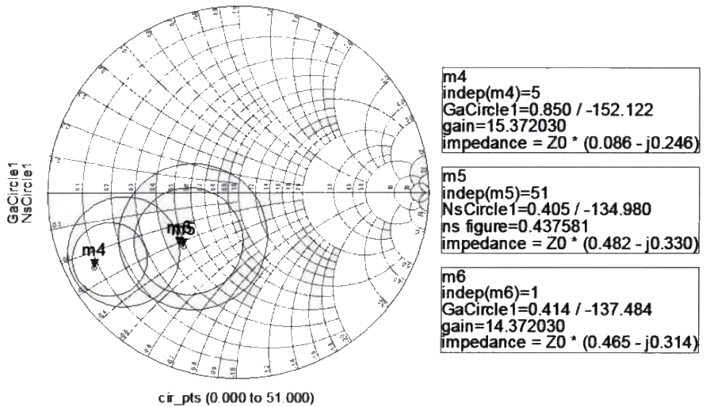
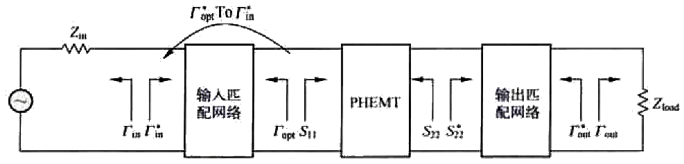

>```
>---
>layout: post
>title:射频电路备课笔记... 
>categories: [电路, 射频]
>description: 日拱一卒...
>keywords: 教学, 电路，射频
>---
>```
>------------------------------------------------


[TOC]

# RF DIY

### 00000 RF Switch MQP Report-BS-P48.pdf
ADS 有源开关
12个场效应管 --> 电容最优化 -- 测量SP散射

#### 00000-90 Degree Hybrid Coupler-BS学士.pdf

F19 F28 长度，$\epsilon_r$ , $w/h$  
分布式耦合器尺寸太大，改为集总元件---ABCD网 ???
F28 T1A, T1B

ADS layout设计，有详细步骤
###### F54 spiral电感设计，多个L的组合复用 ??? 很美观

##### 0000 Design Analysis and Construction of an Equal Split Wilkinson Po-MS.pdf
P73 F59
功分器，3个设计方案，有实物
F15,F17,F18--VNA
F20 S21, S31;  S23, S32隔离度
F23 给出功分器1,2,3的尺寸，手绘-autoCAD layout ???
P36 T6, width计算，T7 RL 隔离度

#### 0000 ADS中如何将电路转化成微带线电路结构.pdf

ADS --- Design Guide 有微带线自动转换功能  ??? 分布式-集总式

#### 0000 Wideband Balun Design with Ferrite Cores-MS？.pdf
Calculable Dipole Antenna for EMC Measurements with Low_Loss Wide_Band Balun form 30 MHz to 2GHz.pdf
巴伦Balun合集.pdf

指标：
从图片尺寸看，mm级微型 ??
180+- 2.5
<=1dB

F2.3 RB看不懂 ???  a),b)不一致，对不上 ???  连接方法???  原理 ?
F3.2 Fixtures 测量夹具 ???
1)测量SP
2)测量 core permeability


1MHz时，微带线需要41米！--分布式实现宽带，困难！
VNA >=10MHz ??
P17, F4.8 500MHz, P22
P20 >1GHz
matlab

制作+测试，对比了三种方案

#### 0000 EECS-Low Energy RF Transceiver Design-PHD2007-57.pdf
Implementing an OFDM Transceiver by SDR softward defined radio -软件无线电Labs200910.pdf
SiGe bipolar transceiver circuits 60GHz-2005.pdf
2.4GHz，调制器的选型，理论分析，节能
图4.1 图+表综合！详实！
图15 IIP3, OIP3
芯片，四层板
图33：测试结构，SMT, SMA
4.6.1 测量SNR, RSSI


### Arichives


# 通信电子线路-期末


图5-61，输入匹配网络的设计原则是噪声系数最优化，于是，就要采用共轭匹配，使得IMN后面放大器模块的输入反射系数等于$\Gamma_{opt}^*$，而不管放大器模块本来的S11等于多少？！

两种匹配原则对比表：

| 匹配原则对比 | 噪声系数原则 | 最大功率原则 |
| :--- | :----: | ----: |
| 输入匹配网络端口2的反射系数取值 | m5 | m4 |
| a    | b      | c     |




$\Gamma_{opt}$是使得噪声系数最优的$\Gamma_S$。


$$
\Gamma_{opt}^*=24+j16.5\Omega
$$