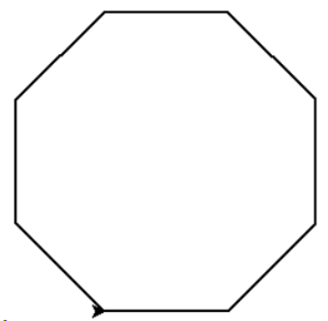
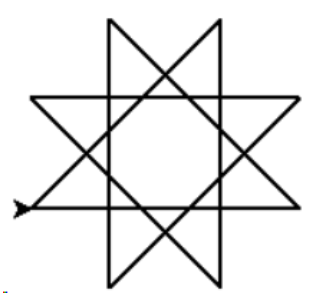
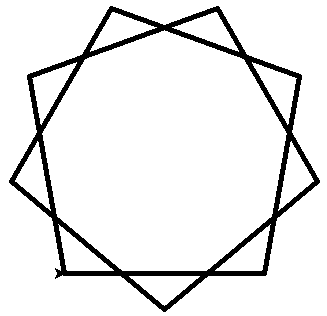

------------------------------------------------

# 01-Python基本语法元素

## 编程

### python判断奇偶数

方法1：
if (num % 2) == 0:
   print("{0} 是偶数".format(num))
else:
   print("{0} 是奇数".format(num))


'{} 是偶数'.format(num) if num % 2 == 0 else "{} 是奇数".format(num)

----------------------------------------------------
Out[32]: '10 是偶数'


while True:
    try:
        num=int(input('输入一个整数：')) #判断输入是否为整数
    except ValueError: #不是纯数字需要重新输入
        print("输入的不是整数！")
        continue
    if num%2==0:
        print('偶数')
    else:
        print('奇数')
    break

https://blog.csdn.net/qq_36478920/article/details/89468514


方法2：
用&位运算符，运算速度更快。

num = 10
if (num & 1) == 0:  # 注意这里的 & 1
   print("{0} 是偶数".format(num))
else:
   print("{0} 是奇数".format(num))
   
----------------------------------------------------
10 是偶数

'''优化代码'''
'{} 是偶数'.format(num) if num & 1== 0 else "{} 是奇数".format(num)

----------------------------------------------------
Out[35]: '10 是偶数'


### 遍历字符串

1)直接进行遍历
2)利用下标遍历
3)利用range进行遍历
4)利用迭代器


strs = 'abcd'
for ch in strs:
    print(ch)


2)  利用下标遍历
strs = 'abcd'
for index, ch in enumerate(strs):
    print(index,end=' ')
    print(ch)
3)  利用range进行遍历
strs = 'abcd'
for index in range(len(strs)):
    print(strs[index], end=' ')
4)  利用迭代器
strs = 'abcd'
for ch in iter(strs):
    print(ch)


### 测验1 Hello World的条件输出

描述
获得用户输入的一个整数，参考该整数值，打印输出"Hello World"，要求：‪‬‪‬‪‬‪‬‪‬‮‬‫‬‫‬‪‬‪‬‪‬‪‬‪‬‮‬‭‬‪‬‪‬‪‬‪‬‪‬‪‬‮‬‪‬‮‬‪‬‪‬‪‬‪‬‪‬‮‬‭‬‫‬‪‬‪‬‪‬‪‬‪‬‮‬‭‬‪‬‪‬‪‬‪‬‪‬‪‬‮‬‫‬‮‬

如果输入值是0，直接输出"Hello World"‪‬‪‬‪‬‪‬‪‬‮‬‫‬‫‬‪‬‪‬‪‬‪‬‪‬‮‬‭‬‪‬‪‬‪‬‪‬‪‬‪‬‮‬‪‬‮‬‪‬‪‬‪‬‪‬‪‬‮‬‭‬‫‬‪‬‪‬‪‬‪‬‪‬‮‬‭‬‪‬‪‬‪‬‪‬‪‬‪‬‮‬‫‬‮‬

如果输入值大于0，以两个字符一行方式输出"Hello World"（空格也是字符）‪‬‪‬‪‬‪‬‪‬‮‬‫‬‫‬‪‬‪‬‪‬‪‬‪‬‮‬‭‬‪‬‪‬‪‬‪‬‪‬‪‬‮‬‪‬‮‬‪‬‪‬‪‬‪‬‪‬‮‬‭‬‫‬‪‬‪‬‪‬‪‬‪‬‮‬‭‬‪‬‪‬‪‬‪‬‪‬‪‬‮‬‫‬‮‬

如果输入值小于0，以垂直方式输出"Hello World"

```
i = eval(input())  //  i=input("请输入一个整数：")
if i==0:
    print("Hello World")
elif i>0:
    print("He\nll\no \nWo\nrl\nd")
else:
    for ch in "Hello World":
        print(ch)
```

参考代码如下：
n = eval(input())
if n == 0:
    print("Hello World")
elif n > 0:
    print("He\nll\no \nWo\nrl\nd")
else:
    for c in "Hello World":
        print(c)


### 测验2 数值运算

描述
获得用户输入的一个字符串，格式如下：‪‬‪‬‪‬‪‬‪‬‮‬‫‬‫‬‪‬‪‬‪‬‪‬‪‬‮‬‭‬‪‬‪‬‪‬‪‬‪‬‪‬‮‬‪‬‮‬‪‬‪‬‪‬‪‬‪‬‮‬‭‬‫‬‪‬‪‬‪‬‪‬‪‬‮‬‭‬‪‬‪‬‪‬‪‬‪‬‪‬‮‬‫‬‮‬

M OP N‪‬‪‬‪‬‪‬‪‬‮‬‫‬‫‬‪‬‪‬‪‬‪‬‪‬‮‬‭‬‪‬‪‬‪‬‪‬‪‬‪‬‮‬‪‬‮‬‪‬‪‬‪‬‪‬‪‬‮‬‭‬‫‬‪‬‪‬‪‬‪‬‪‬‮‬‭‬‪‬‪‬‪‬‪‬‪‬‪‬‮‬‫‬‮‬

其中，M和N是任何数字，OP代表一种操作，表示为如下四种：+, -, *, /（加减乘除）‪‬‪‬‪‬‪‬‪‬‮‬‫‬‫‬‪‬‪‬‪‬‪‬‪‬‮‬‭‬‪‬‪‬‪‬‪‬‪‬‪‬‮‬‪‬‮‬‪‬‪‬‪‬‪‬‪‬‮‬‭‬‫‬‪‬‪‬‪‬‪‬‪‬‮‬‭‬‪‬‪‬‪‬‪‬‪‬‪‬‮‬‫‬‮‬

根据OP，输出M OP N的运算结果，统一保存小数点后2位。‪‬‪‬‪‬‪‬‪‬‮‬‫‬‫‬‪‬‪‬‪‬‪‬‪‬‮‬‭‬‪‬‪‬‪‬‪‬‪‬‪‬‮‬‪‬‮‬‪‬‪‬‪‬‪‬‪‬‮‬‭‬‫‬‪‬‪‬‪‬‪‬‪‬‮‬‭‬‪‬‪‬‪‬‪‬‪‬‪‬‮‬‫‬‮‬

注意：M和OP、OP和N之间可以存在多个空格，不考虑输入错误情况。
输入输出示例
 	输入	输出
示例 1	
10 + 100     110.00
1 / 20   0.05

```
strg=input() // ("输入计算式子：")
print("{0:.2f}".format(eval(strg)))
```
蓝色背景表明你的输出与期望输出存在不一致之处。如果看起来「完全一致」，注意检查是否有多余「空格」
红色背景标明这是一个「中文字符」，注意输出符合题意的「中英文标点」（初学者注意切换中英文输入法）
有时候你可能因为在 input() 中增加提示参数（例如 input('请输入一个整数:')）导致输出结果不符合题意
输入计算式子：110.00 

参考答案如下：
s = input()
print("{:.2f}".format(eval(s)))


### 温度转换34C-78F

温度的刻画有两个不同体系：摄氏度（Celsius）和华氏度（Fahrenheit）。‪‬‪‬‪‬‪‬‪‬‮‬‫‬‫‬‪‬‪‬‪‬‪‬‪‬‮‬‭‬‪‬‪‬‪‬‪‬‪‬‪‬‮‬‪‬‮‬‪‬‪‬‪‬‪‬‪‬‮‬‭‬‫‬‪‬‪‬‪‬‪‬‪‬‮‬‭‬‪‬‪‬‪‬‪‬‪‬‪‬‮‬‫‬‮‬
请编写程序将用户输入华氏度转换为摄氏度，或将输入的摄氏度转换为华氏度。‪‬‪‬‪‬‪‬‪‬‮‬‫‬‫‬‪‬‪‬‪‬‪‬‪‬‮‬‭‬‪‬‪‬‪‬‪‬‪‬‪‬‮‬‪‬‮‬‪‬‪‬‪‬‪‬‪‬‮‬‭‬‫‬‪‬‪‬‪‬‪‬‪‬‮‬‭‬‪‬‪‬‪‬‪‬‪‬‪‬‮‬‫‬‮‬
转换算法如下：（C表示摄氏度、F表示华氏度）‪‬‪‬‪‬‪‬‪‬‮‬‫‬‫‬‪‬‪‬‪‬‪‬‪‬‮‬‭‬‪‬‪‬‪‬‪‬‪‬‪‬‮‬‪‬‮‬‪‬‪‬‪‬‪‬‪‬‮‬‭‬‫‬‪‬‪‬‪‬‪‬‪‬‮‬‭‬‪‬‪‬‪‬‪‬‪‬‪‬‮‬‫‬‮‬
C = ( F - 32 ) / 1.8‪‬‪‬‪‬‪‬‪‬‮‬‫‬‫‬‪‬‪‬‪‬‪‬‪‬‮‬‭‬‪‬‪‬‪‬‪‬‪‬‪‬‮‬‪‬‮‬‪‬‪‬‪‬‪‬‪‬‮‬‭‬‫‬‪‬‪‬‪‬‪‬‪‬‮‬‭‬‪‬‪‬‪‬‪‬‪‬‪‬‮‬‫‬‮‬
F = C * 1.8 + 32‪‬‪‬‪‬‪‬‪‬‮‬‫‬‫‬‪‬‪‬‪‬‪‬‪‬‮‬‭‬‪‬‪‬‪‬‪‬‪‬‪‬‮‬‪‬‮‬‪‬‪‬‪‬‪‬‪‬‮‬‭‬‫‬‪‬‪‬‪‬‪‬‪‬‮‬‭‬‪‬‪‬‪‬‪‬‪‬‪‬‮‬‫‬‮‬
要求如下：‪‬‪‬‪‬‪‬‪‬‮‬‫‬‫‬‪‬‪‬‪‬‪‬‪‬‮‬‭‬‪‬‪‬‪‬‪‬‪‬‪‬‮‬‪‬‮‬‪‬‪‬‪‬‪‬‪‬‮‬‭‬‫‬‪‬‪‬‪‬‪‬‪‬‮‬‭‬‪‬‪‬‪‬‪‬‪‬‪‬‮‬‫‬‮‬
(1) 输入输出的摄氏度可采用大小写字母C结尾，温度可以是整数或小数，如：12.34C指摄氏度12.34度；‪‬‪‬‪‬‪‬‪‬‮‬‫‬‫‬‪‬‪‬‪‬‪‬‪‬‮‬‭‬‪‬‪‬‪‬‪‬‪‬‪‬‮‬‪‬‮‬‪‬‪‬‪‬‪‬‪‬‮‬‭‬‫‬‪‬‪‬‪‬‪‬‪‬‮‬‭‬‪‬‪‬‪‬‪‬‪‬‪‬‮‬‫‬‮‬
(2) 输入输出的华氏度可采用大小写字母F结尾，温度可以是整数或小数，如：87.65F指华氏度87.65度；‪‬‪‬‪‬‪‬‪‬‮‬‫‬‫‬‪‬‪‬‪‬‪‬‪‬‮‬‭‬‪‬‪‬‪‬‪‬‪‬‪‬‮‬‪‬‮‬‪‬‪‬‪‬‪‬‪‬‮‬‭‬‫‬‪‬‪‬‪‬‪‬‪‬‮‬‭‬‪‬‪‬‪‬‪‬‪‬‪‬‮‬‫‬‮‬
(3) 输出保留小数点后两位，输入格式错误时，输出提示：输入格式错误；‪‬‪‬‪‬‪‬‪‬‮‬‫‬‫‬‪‬‪‬‪‬‪‬‪‬‮‬‭‬‪‬‪‬‪‬‪‬‪‬‪‬‮‬‪‬‮‬‪‬‪‬‪‬‪‬‪‬‮‬‭‬‫‬‪‬‪‬‪‬‪‬‪‬‮‬‭‬‪‬‪‬‪‬‪‬‪‬‪‬‮‬‫‬‮‬
(4) 使用input()获得测试用例输入时，不要增加提示字符串。

【参考代码】

```
#TempConvert.py
TempStr = input()
if TempStr[-1] in ['F', 'f']:
    C = (eval(TempStr[0:-1]) - 32)/1.8
    print("{:.2f}C".format(C))
elif TempStr[-1] in ['C', 'c']:
    F = 1.8*eval(TempStr[0:-1]) + 32
    print("{:.2f}F".format(F))
else:
    print("输入格式错误")
```

#### eval() vs. int()

将输入字符串转换为数字时使用eval()函数，不要用int()函数，因为输入的数字可能不是整数；

#### {:.2f}
采用{:.2f}将输出数字变成两位小数点表示时，即使数学上该输出值是整数，也会按照小数方式输出，例如，转换后温度为10度，输出为10.00。


### 温度转换-C34 F78

要求如下：‪‬‪‬‪‬‪‬‪‬‮‬‫‬‫‬‪‬‪‬‪‬‪‬‪‬‮‬‭‬‪‬‪‬‪‬‪‬‪‬‪‬‮‬‪‬‮‬‪‬‪‬‪‬‪‬‪‬‮‬‭‬‫‬‪‬‪‬‪‬‪‬‪‬‮‬‭‬‪‬‪‬‪‬‪‬‪‬‪‬‮‬‫‬‮‬
(1) 输入输出的摄氏度采用大写字母C开头，输入输出的华氏度采用大写字母F开头；‪‬‪‬‪‬‪‬‪‬‮‬‫‬‫‬‪‬‪‬‪‬‪‬‪‬‮‬‭‬‪‬‪‬‪‬‪‬‪‬‪‬‮‬‪‬‮‬‪‬‪‬‪‬‪‬‪‬‮‬‭‬‫‬‪‬‪‬‪‬‪‬‪‬‮‬‭‬‪‬‪‬‪‬‪‬‪‬‪‬‮‬‫‬‮‬

【参考代码】

```
#TempConvert.py
TempStr = input()
if TempStr[0] in ['F']:
    C = (eval(TempStr[1:]) - 32)/1.8
    print("C{:.2f}".format(C))
elif TempStr[0] in ['C']:
    F = 1.8*eval(TempStr[1:]) + 32
    print("F{:.2f}".format(F))
else:
    print() #不输入任何错误提示
```

TempStr[1:]表示字符串除首字符外的所有字符。

### 罗马-中文数字转换
获得用户输入的一个正整数输入，输出该数字对应的中文字符表示。‪‬‪‬‪‬‪‬‪‬‮‬‫‬‫‬‪‬‪‬‪‬‪‬‪‬‮‬‭‬‪‬‪‬‪‬‪‬‪‬‪‬‮‬‪‬‮‬‪‬‪‬‪‬‪‬‪‬‮‬‭‬‫‬‪‬‪‬‪‬‪‬‪‬‮‬‭‬‪‬‪‬‪‬‪‬‪‬‪‬‮‬‫‬‮‬
0到9对应的中文字符分别是：零一二三四五六七八九

参考代码如下：
```
template = "零一二三四五六七八九"

s = input()
for c in s:
    print(template[eval(c)], end="")
```

### 货币转换 I
人民币和美元是世界上通用的两种货币之一，写一个程序进行货币间币值转换，其中：‪‬‪‬‪‬‪‬‪‬‮‬‫‬‫‬‪‬‪‬‪‬‪‬‪‬‮‬‭‬‪‬‪‬‪‬‪‬‪‬‪‬‮‬‪‬‮‬‪‬‪‬‪‬‪‬‪‬‮‬‭‬‫‬‪‬‪‬‪‬‪‬‪‬‮‬‭‬‪‬‪‬‪‬‪‬‪‬‪‬‮‬‫‬‮‬
人民币和美元间汇率固定为：1美元 = 6.78人民币。‪‬‪‬‪‬‪‬‪‬‮‬‫‬‫‬‪‬‪‬‪‬‪‬‪‬‮‬‭‬‪‬‪‬‪‬‪‬‪‬‪‬‮‬‪‬‮‬‪‬‪‬‪‬‪‬‪‬‮‬‭‬‫‬‪‬‪‬‪‬‪‬‪‬‮‬‭‬‪‬‪‬‪‬‪‬‪‬‪‬‮‬‫‬‮‬
程序可以接受人民币或美元输入，转换为美元或人民币输出。人民币采用RMB表示，美元USD表示，符号和数值之间没有空格。‪‬‪‬‪‬‪‬‪‬‮‬‫‬‫‬‪‬‪‬‪‬‪‬‪‬‮‬‭‬‪‬‪‬‪‬‪‬‪‬‪‬‮‬‪‬‮‬‪‬‪‬‪‬‪‬‪‬‮‬‭‬‫‬‪‬‪‬‪‬‪‬‪‬‮‬‭‬‪‬‪‬‪‬‪‬‪‬‪‬‮‬‫‬‮‬
注意：‪‬‪‬‪‬‪‬‪‬‮‬‫‬‫‬‪‬‪‬‪‬‪‬‪‬‮‬‭‬‪‬‪‬‪‬‪‬‪‬‪‬‮‬‪‬‮‬‪‬‪‬‪‬‪‬‪‬‮‬‭‬‫‬‪‬‪‬‪‬‪‬‪‬‮‬‭‬‪‬‪‬‪‬‪‬‪‬‪‬‮‬‫‬‮‬
(1) 这是一个OJ题目，获得输入请使用input() ；‪‬‪‬‪‬‪‬‪‬‮‬‫‬‫‬‪‬‪‬‪‬‪‬‪‬‮‬‭‬‪‬‪‬‪‬‪‬‪‬‪‬‮‬‪‬‮‬‪‬‪‬‪‬‪‬‪‬‮‬‭‬‫‬‪‬‪‬‪‬‪‬‪‬‮‬‭‬‪‬‪‬‪‬‪‬‪‬‪‬‮‬‫‬‮‬
(2) 不提示输出格式错误，结果小数点后保留两位。

【参考代码】

```
CurStr = input()
if CurStr[:3] == "RMB":
    print("USD{:.2f}".format(eval(CurStr[3:])/6.78))
elif CurStr[:3] in ['USD']:
    print("RMB{:.2f}".format(eval(CurStr[3:])*6.78))
```
这个代码是实例1的一个扩展，注意以下3点：
(1) eval()函数将字符串转换成数字，不能省略；
(2) == 表示 "等于"，in 表示成员包含，对于这个题目，由于只允许输入采用全大写方式，两种方法均可；
(3) :.2f输出小数点后两位。

## 01.h-Python综合 ??

简单解释Python基于值的自动内存管理方式？

----Python采用的是基于值的内存管理方式，在Python中可以为不同变量赋值为相同值，这个值在内存中只有一份，多个变量指向同一个内存地址；Python具有自动内存管理功能，会自动跟踪内存中所有的值，对于没有任何变量指向的值，Python自动将其删除。


# 02-Python基本图形绘制

## 编程


### 测验1. turtle八边形绘制 #12420


描述
使用turtle库，绘制一个八边形。‪‬‪‬‪‬‪‬‪‬‮‬‫‬‫‬‪‬‪‬‪‬‪‬‪‬‮‬‭‬‪‬‪‬‪‬‪‬‪‬‪‬‮‬‪‬‮‬‪‬‪‬‪‬‪‬‪‬‮‬‭‬‫‬‪‬‪‬‪‬‪‬‪‬‮‬‭‬‪‬‪‬‪‬‪‬‪‬‪‬‮‬‫‬‮‬

注意：这是一个自动评阅题目，请补充"编程模板"中横线内容，横线不保留。‪‬‪‬‪‬‪‬‪‬‮‬‫‬‫‬‪‬‪‬‪‬‪‬‪‬‮‬‭‬‪‬‪‬‪‬‪‬‪‬‪‬‮‬‪‬‮‬‪‬‪‬‪‬‪‬‪‬‮‬‭‬‫‬‪‬‪‬‪‬‪‬‪‬‮‬‭‬‪‬‪‬‪‬‪‬‪‬‪‬‮‬‫‬‮‬

输出示例
八边形效果如下：

#请在横线中填写Python表达式或语句，实现所需要的功能
#注意：补充代码将以匹配方式评阅，代码中不要出现空格

import turtle as t
t.pensize(2)
for i in range(___________):
    t.fd(100)
    t.left(___________)

import turtle as t
t.pensize(2)
for i in range(1,,8):
    t.fd(100)
    t.left(45)   // (135)
代码静态检查没通过：  ; | 
2. turtle八角图形绘制 #12421

使用turtle库，绘制一个八角图形。‪‬‪‬‪‬‪‬‪‬‮‬‫‬‫‬‪‬‪‬‪‬‪‬‪‬‮‬‭‬‪‬‪‬‪‬‪‬‪‬‪‬‮‬‪‬‮‬‪‬‪‬‪‬‪‬‪‬‮‬‭‬‫‬‪‬‪‬‪‬‪‬‪‬‮‬‭‬‪‬‪‬‪‬‪‬‪‬‪‬‮‬‫‬‮‬

注意：这是一个自动评阅题目，请补充"编程模板"中横线内容，横线不保留。‪‬‪‬‪‬‪‬‪‬‮‬‫‬‫‬‪‬‪‬‪‬‪‬‪‬‮‬‭‬‪‬‪‬‪‬‪‬‪‬‪‬‮‬‪‬‮‬‪‬‪‬‪‬‪‬‪‬‮‬‭‬‫‬‪‬‪‬‪‬‪‬‪‬‮‬‭‬‪‬‪‬‪‬‪‬‪‬‪‬‮‬‫‬‮‬

 ‪‬‪‬‪‬‪‬‪‬‮‬‫‬‫‬‪‬‪‬‪‬‪‬‪‬‮‬‭‬‪‬‪‬‪‬‪‬‪‬‪‬‮‬‪‬‮‬‪‬‪‬‪‬‪‬‪‬‮‬‭‬‫‬‪‬‪‬‪‬‪‬‪‬‮‬‭‬‪‬‪‬‪‬‪‬‪‬‪‬‮‬‫‬‮‬

输出示例

### 测验2. turtle八角图绘制



#请在横线中填写Python表达式或语句，实现所需要的功能
#注意：补充代码将以匹配方式评阅，代码中不要出现空格

import turtle as t
t.pensize(2)
for i in range(1,8):
    t.fd(150)
    t.left(135)


 编程练习 https://python123.io/student/courses/3382/groups/39664/intro

### Python蟒蛇绘制

使用turtle库，绘制一个蟒蛇形状的图形。‪‬‪‬‪‬‪‬‪‬‮‬‫‬‫‬‪‬‪‬‪‬‪‬‪‬‮‬‭‬‪‬‪‬‪‬‪‬‪‬‪‬‮‬‫‬‫‬‪‬‪‬‪‬‪‬‪‬‮‬‭‬‪‬‪‬‪‬‪‬‪‬‪‬‮‬‪‬‮‬‪‬‪‬‪‬‪‬‪‬‮‬‭‬‫‬‪‬‪‬‪‬‪‬‪‬‮‬‭‬‪‬‪‬‪‬‪‬‪‬‪‬‮‬‫‬‮‬

【参考代码】

```
#PythonDraw.py
import turtle
turtle.setup(650, 350, 200, 200)
turtle.penup()
turtle.fd(-250)
turtle.pendown()
turtle.pensize(25)
turtle.pencolor("purple")
turtle.seth(-40)
for i in range(4):
    turtle.circle(40, 80)
    turtle.circle(-40, 80)
turtle.circle(40, 80/2)
turtle.fd(40)
turtle.circle(16, 180)
turtle.fd(40 * 2/3)
turtle.done()
```

### turtle正方形绘制
【参考代码】
```

#RectDraw.py
import turtle as t
t.pensize(2)
for i in range(4):
    t.fd(150)
    t.left(90)
```

### turtle六边形绘制

【参考代码】

```
#HexagonDraw.py
import turtle as t
t.pensize(2)
for i in range(6):
    t.fd(150)
    t.left(60)
```
fd(x)函数的参数可以任意设置，决定了六边形的大小。

### turtle叠边形绘制

使用turtle库，绘制一个叠边形，其中，叠边形内角为100度。‪‬‪‬‪‬‪‬‪‬‮‬‫‬‫‬‪‬‪‬‪‬‪‬‪‬‮‬‭‬‪‬【9个】



【参考代码】

```
#TwoRoundDraw.py
import turtle as t
t.pensize(2)
for i in range(9):
    t.fd(150)
    t.left(80)  #720/9
```
一共9条边，共2圈，每次左转角度为80度（720/9）。


### turtle风轮绘制

#使用turtle库，绘制一个风轮效果，其中，每个风轮内角为45度，风轮边长150像素。‪‬‪‬‪‬‪‬‪‬‮‬‫‬‫‬‪‬‪‬‪‬‪‬‪‬‮‬‭‬‪‬‪‬‪‬‪‬‪‬‪‬‮‬‫‬‫‬‪‬‪‬‪‬‪‬‪‬‮‬‭‬‪‬‪‬‪‬‪‬‪‬‪‬‮‬‪‬‮‬‪‬‪‬‪‬‪‬‪‬‮‬‭‬‫‬‪‬‪‬‪‬‪‬‪‬‮‬‭‬‪‬‪‬‪‬‪‬‪‬‪‬‮‬‫‬‮‬
注意：这不是自动评阅题目，仅用于练习，没有评阅。‪‬‪‬‪‬‪‬‪‬‮‬‫‬‫‬‪‬‪‬‪‬‪‬‪‬‮‬‭‬‪‬‪‬‪‬‪‬‪‬‪‬‮‬‫‬‫‬‪‬‪‬‪‬‪‬‪‬‮‬‭‬‪‬‪‬‪‬‪‬‪‬‪‬‮‬‪‬‮‬‪‬‪‬‪‬‪‬‪‬‮‬‭‬‫‬‪‬‪‬‪‬‪‬‪‬‮‬‭‬‪‬‪‬‪‬‪‬‪‬‪‬‮‬‫‬‮‬
提示：turtle.goto(x,y)函数，能够将turtle画笔移动到坐标(x,y)# 02.a-Python基本语法


【参考代码】

```
#WindWheel.py
import turtle as t
t.pensize(2)
for i in range(4):
    t.seth(90*i)
    t.fd(150)
    t.right(90)
    t.circle(-150, 45)
    t.goto(0,0)
```


### 快乐数字 ??

def snum(num):
    strnum = str(num)
    sum = 0
    b = [int(x) for x in strnum]
    for i in b:
        sum += i**2
    return sum
 
def main():
    a = input()
    num = eval(a)
    count = 0
    while num != 1:
        num = snum(num)
        count += 1
        if count > 2000:
            print("False")
            break
    else:
            print("True")
 
main()


#### 数列阶乘相加

a = input()
sum = 0
if a.isdigit():
    num = eval(a)
    if num > 0:
        count = 1
        for i in range(1, num+1):
            count *= i
            sum += count
        print(sum)
    else:
        print("输入有误，请输入正整数")
else:
    print("输入有误，请输入正整数")


#### 2-3成绩转换输入
try:
    a = eval(input())
except:
    print('输入数据有误！')
else:
    if 0 <= a < 60:
        print('输入成绩属于E级别。')
    elif 60 <= a < 70:
        print('输入成绩属于D级别。')
        print('祝贺你通过考试！')
    elif 70 <= a < 80:
        print('输入成绩属于C级别。')
        print('祝贺你通过考试！')
    elif 80 <= a < 90:
        print('输入成绩属于B级别。')
        print('祝贺你通过考试！')
    elif 90 <= a <= 100:
        print('输入成绩属于A级别。')
        print('祝贺你通过考试！')
    else:
        print('输入数据有误！')
finally:
    print('好好学习，天天向上！')


# 03-基本数据类型

## 编程


### 天天向上的力量-拓展-自己的状态比较接近哪种情况？

三天打鱼两天晒网
双休日又不退步


###  测验1. 平方根格式化 #13469

描述
获得用户输入的一个整数a，计算a的平方根，保留小数点后3位，并打印输出。‪‬‪‬‪‬‪‬‪‬‮‬‫‬‫‬‪‬‪‬‪‬‪‬‪‬‮‬‭‬‪‬‪‬‪‬‪‬‪‬‪‬‮‬‪‬‮‬‪‬‪‬‪‬‪‬‪‬‮‬‭‬‫‬‪‬‪‬‪‬‪‬‪‬‮‬‭‬‪‬‪‬‪‬‪‬‪‬‪‬‮‬‫‬‮‬

输出结果采用宽度30个字符、右对齐输出、多余字符采用加号(+)填充。‪‬‪‬‪‬‪‬‪‬‮‬‫‬‫‬‪‬‪‬‪‬‪‬‪‬‮‬‭‬‪‬‪‬‪‬‪‬‪‬‪‬‮‬‪‬‮‬‪‬‪‬‪‬‪‬‪‬‮‬‭‬‫‬‪‬‪‬‪‬‪‬‪‬‮‬‭‬‪‬‪‬‪‬‪‬‪‬‪‬‮‬‫‬‮‬

如果结果超过30个字符，则以结果宽度为准。

示例 1	
10
+++++++++++++++++++++++++3.162
```

i=eval(input()) // input()
root2=pow(i,0.5)
print("{:+>30.3f}".format(root2))   //  {:+> 30 .3f}
```

Exited with error status 1
Traceback (most recent call last):
  File "cc07f1e0b560d640fd87f6d04dad8cee", line 2, in <module>
    root2=pow(i,0.5)
TypeError: unsupported operand type(s) for ** or pow(): 'str' and 'float'

File "a34343db744de4b47ea374158becb452", line 3, in <module>
    print("{:+> 30 .3f}".format(root2))
ValueError: Invalid format specifier

【参考代码】
```
a = eval(input())
print("{:+>30.3f}".format(pow(a, 0.5)))
```

###  测验2. 字符串分段组合 #13470

描述
获得输入的一个字符串s，以字符减号(-)分割s，将其中首尾两段用加号(+)组合后输出。‪‬‪‬‪‬‪‬‪‬‮‬‫‬‫‬‪‬‪‬‪‬‪‬‪‬‮‬‭‬‪‬‪‬‪‬‪‬‪‬‪‬‮‬‪‬‮‬‪‬‪‬‪‬‪‬‪‬‮‬‭‬‫‬‪‬‪‬‪‬‪‬‪‬‮‬‭‬‪‬‪‬‪‬‪‬‪‬‪‬‮‬‫‬‮‬

示例 1
Alice-Bob-Charis-David-Eric-Flurry
Alice+Flurry

str.split(str="", num=string.count(str))
str -- 分隔符，默认为所有的**空字符，包括空格、换行(\n)、制表符(\t)**等。??
num -- 分割次数。默认为 -1, 即分隔所有。

```
st=input()
ls=st.split("-",)
print(ls[0]+'+'+ls[-1])  // print(ls[0]+ls[-1])
```
参考代码如下：

```
s = input()
ls = s.split("-")
print("{}+{}".format(ls[0], ls[-1]))
```

###  天天向上的力量
工作日模式要努力到什么水平，才能与每天努力1%一样？‪‬‪‬‪‬‪‬‪‬‮‬‫‬‫‬‪‬‪‬‪‬‪‬‪‬‮‬‭‬‪‬‪‬‪‬‪‬‪‬‪‬‮‬‫‬‫‬‪‬‪‬‪‬‪‬‪‬‮‬‭‬‪‬‪‬‪‬‪‬‪‬‪‬‮‬‪‬‮‬‪‬‪‬‪‬‪‬‪‬‮‬‭‬‫‬‪‬‪‬‪‬‪‬‪‬‮‬‭‬‪‬‪‬‪‬‪‬‪‬‪‬‮‬‫‬‮‬

-A君: 一年365天，每天进步1%，不停歇 ‪‬‪‬‪‬‪‬‪‬‮‬‫‬‫‬‪‬‪‬‪‬‪‬‪‬‮‬‭‬‪‬‪‬‪‬‪‬‪‬‪‬‮‬‫‬‫‬‪‬‪‬‪‬‪‬‪‬‮‬‭‬‪‬‪‬‪‬‪‬‪‬‪‬‮‬‪‬‮‬‪‬‪‬‪‬‪‬‪‬‮‬‭‬‫‬‪‬‪‬‪‬‪‬‪‬‮‬‭‬‪‬‪‬‪‬‪‬‪‬‪‬‮‬‫‬‮‬

-B君: 一年365天，每周工作5天休息2天，休息日下降1% ，要多努力呢？‪‬‪‬‪‬‪‬‪‬‮‬‫‬‫‬‪‬‪‬‪‬‪‬‪‬‮‬‭‬‪‬‪‬‪‬‪‬‪‬‪‬‮‬‫‬‫‬‪‬‪‬‪‬‪‬‪‬‮‬‭‬‪‬‪‬‪‬‪‬‪‬‪‬‮‬‪‬‮‬‪‬‪‬‪‬‪‬‪‬‮‬‭‬‫‬‪‬‪‬‪‬‪‬‪‬‮‬‭‬‪‬‪‬‪‬‪‬‪‬‪‬‮‬‫‬‮‬

每周工作5天休息2天，计算工作日的努力参数是多少才能与每天努力1%一样。‪‬‪‬‪‬‪‬‪‬‮‬‫‬‫‬‪‬‪‬‪‬‪‬‪‬‮‬‭‬‪‬‪‬‪‬‪‬‪‬‪‬‮‬‫‬‫‬‪‬‪‬‪‬‪‬‪‬‮‬‭‬‪‬‪‬‪‬‪‬‪‬‪‬‮‬‪‬‮‬‪‬‪‬‪‬‪‬‪‬‮‬‭‬‫‬‪‬‪‬‪‬‪‬‪‬‮‬‭‬‪‬‪‬‪‬‪‬‪‬‪‬‮‬‫‬‮‬
‪‪‬‪‬‪‬‮‬‫‬‫‬‪‬‪‬‪‬‪‬‪‬‮‬‭‬‪‬‪‬‪‬‪‬‪‬‪‬‮‬‫‬‫‬‪‬‪‬‪‬‪‬‪‬‮‬‭‬‪‬‪‬‪‬‪‬‪‬‪‬‮‬‪‬‮‬‪‬‪‬‪‬‪‬‪‬‮‬‭‬‫‬‪‬‪‬‪‬‪‬‪‬‮‬‭‬‪‬‪‬‪‬‪‬‪‬‪‬‮‬‫‬‮‬
要求如下：‪‬‪‬‪‬‪‬‪‬‮‬‫‬‫‬‪‬‪‬‪‬‪‬‪‬‮‬‭‬‪‬‪‬‪‬‪‬‪‬‪‬‮‬‫‬‫‬‪‬‪‬‪‬‪‬‪‬‮‬‭‬‪‬‪‬‪‬‪‬‪‬‪‬‮‬‫‬‫‬‪‬‪‬‪‬‪‬‪‬‮‬‭‬‪‬‪‬‪‬‪‬‪‬‪‬‮‬‪‬‮‬‪‬‪‬‪‬‪‬‪‬‮‬‭‬‫‬‪‬‪‬‪‬‪‬‪‬‮‬‭‬‪‬‪‬‪‬‪‬‪‬‪‬‮‬‫‬‮‬

(1) ‪‬‪‬‪‬‪‬‪‬‮‬‫‬‫‬‪‬‪‬‪‬‪‬‪‬‮‬‭‬‪‬一年365天，以第0天的能力值为基数，记为1.0；‪‬‪‬‪‬‪‬‪‬‮‬‫‬‫‬‪‬‪‬‪‬‪‬‪‬‮‬‭‬‪‬‪‬‪‬‪‬‪‬‪‬‮‬‫‬‫‬‪‬‪‬‪‬‪‬‪‬‮‬‭‬‪‬‪‬‪‬‪‬‪‬‪‬‮‬‪‬‮‬‪‬‪‬‪‬‪‬‪‬‮‬‭‬‫‬‪‬‪‬‪‬‪‬‪‬‮‬‭‬‪‬‪‬‪‬‪‬‪‬‪‬‮‬‫‬‮‬

(2) ‪‬‪‬‪‬‪‬‪‬‮‬‫‬‫‬‪‬‪‬‪‬‪‬‪‬‮‬‭‬‪‬当好好学习时，能力值相比前一天提高1%；当没有学习时，由于遗忘等原因能力值相比前一天下降1%；‪‬‪‬‪‬‪‬‪‬‮‬‫‬‫‬‪‬‪‬‪‬‪‬‪‬‮‬‭‬‪‬‪‬‪‬‪‬‪‬‪‬‮‬‪‬‮‬‪‬‪‬‪‬‪‬‪‬‮‬‭‬‫‬‪‬‪‬‪‬‪‬‪‬‮‬‭‬‪‬‪‬‪‬‪‬‪‬‪‬‮‬‫‬‮‬

输出结果格式如下：（其中结果保留小数点后三位，冒号后有一个空格）

【参考代码】
```
def dayUP(df):
    dayup = 1
    for i in range(365):
        if i % 7 in [6,0]:
            dayup = dayup*(1 - df)
        else:
            dayup = dayup*(1 + df)
    return dayup
dayfactor = 0.01
while dayUP(dayfactor) < 37.78:
    dayfactor += 0.001
print("工作日的努力参数是: {:.3f}".format(dayfactor))
```
这是本课程的实例3：
(1) 工作日模式，**每天要努力到1.9%，相当于365模式每天1%的；**
(2) 采用{:.3f}将输出数字变成三位小数点表示时，即使数学上该输出值是整数，也会按照小数方式输出。

###  文本进度条
采用字符串方式打印可以动态变化的文本进度条‪‬‪‬‪‬‪‬‪‬‮‬‫‬‫‬‪‬‪‬‪‬‪‬‪‬‮‬‭‬‪‬，进度条需要能在一行中逐渐变化‪‬‪‬‪‬‪‬‪‬‮‬‫‬‫‬‪‬‪‬‪‬‪‬‪‬‮‬‭‬‪‬‪‬‪‬‪‬‪‬‪‬‮‬‪‬‮‬‪‬‪‬‪‬‪‬‪‬‮‬‭‬‫‬‪‬‪‬‪‬‪‬‪‬‮‬‭‬‪‬‪‬‪‬‪‬‪‬‪‬‮‬‫‬‮‬
‪‬‪‬‪‬‪‬‪‬‮‬‫‬‫‬‪‬‪‬‪‬‪‬‪‬‮‬‭‬‪‬‪‬‪‬‪‬‪‬‪‬‮‬‪‬‮‬‪‬‪‬‪‬‪‬‪‬‮‬‭‬‫‬‪‬‪‬‪‬‪‬‪‬‮‬‭‬‪‬‪‬‪‬‪‬‪‬‪‬‮‬‫‬‮‬
要求如下：‪‬‪‬‪‬‪‬‪‬‮‬‫‬‫‬‪‬‪‬‪‬‪‬‪‬‮‬‭‬‪‬‪‬‪‬‪‬‪‬‪‬‮‬‫‬‫‬‪‬‪‬‪‬‪‬‪‬‮‬‭‬‪‬‪‬‪‬‪‬‪‬‪‬‮‬‫‬‫‬‪‬‪‬‪‬‪‬‪‬‮‬‭‬‪‬‪‬‪‬‪‬‪‬‪‬‮‬‪‬‮‬‪‬‪‬‪‬‪‬‪‬‮‬‭‬‫‬‪‬‪‬‪‬‪‬‪‬‮‬‭‬‪‬‪‬‪‬‪‬‪‬‪‬‮‬‫‬‮‬

(1) 采用sleep()模拟一个持续的进度,获得文本进度条的变化时间；‪‬‪‬‪‬‪‬‪‬‮‬‫‬‫‬‪‬‪‬‪‬‪‬‪‬‮‬‭‬‪‬‪‬‪‬‪‬‪‬‪‬‮‬‫‬‫‬‪‬‪‬‪‬‪‬‪‬‮‬‭‬‪‬‪‬‪‬‪‬‪‬‪‬‮‬‫‬‫‬‪‬‪‬‪‬‪‬‪‬‮‬‭‬‪‬‪‬‪‬‪‬‪‬‪‬‮‬‪‬‮‬‪‬‪‬‪‬‪‬‪‬‮‬‭‬‫‬‪‬‪‬‪‬‪‬‪‬‮‬‭‬‪‬‪‬‪‬‪‬‪‬‪‬‮‬‫‬‮‬

(2) 通过print()函数实现单行动态刷新，在print()函数中更换参数end的默认值为'',每次使用print()函数输出时不能换行；‪‬‪‬‪‬‪‬‪‬‮‬‫‬‫‬‪‬‪‬‪‬‪‬‪‬‮‬‭‬‪‬‪‬‪‬‪‬‪‬‪‬‮‬‫‬‫‬‪‬‪‬‪‬‪‬‪‬‮‬‭‬‪‬‪‬‪‬‪‬‪‬‪‬‮‬‫‬‫‬‪‬‪‬‪‬‪‬‪‬‮‬‭‬‪‬‪‬‪‬‪‬‪‬‪‬‮‬‪‬‮‬‪‬‪‬‪‬‪‬‪‬‮‬‭‬‫‬‪‬‪‬‪‬‪‬‪‬‮‬‭‬‪‬‪‬‪‬‪‬‪‬‪‬‮‬‫‬‮‬

(3) 要能回退：打印后光标到之前的位置 \r。‪‬‪‬‪‬‪‬‪‬‮‬‫‬‫‬‪‬‪‬‪‬‪‬‪‬‮‬‭‬‪‬‪‬‪‬‪‬‪‬‪‬‮‬‫‬‫‬‪‬‪‬‪‬‪‬‪‬‮‬‭‬‪‬ ‪‬‪‬‪‬‪‬‪‬‮‬‫‬‫‬‪‬‪‬‪‬‪‬‪‬‮‬‭‪‬‪‬‪‬‪‬‪‬‮‬‫‬‫‬‪‬‪‬‪‬‪‬‪‬‮‬‭‬‪‬‪‬‪‬‪‬‪‬‪‬‮‬‪‬‮‬‪‬‪‬‪‬‪‬‪‬‮‬‭‬‫‬‪‬‪‬‪‬‪‬‪‬‮‬‭‬‪‬‪‬‪‬‪‬‪‬‪‬‮‬‫‬‮‬

请在Windows的命令行（cmd或PowerShell）或其他操作系统的命令行下执行Python程序，获得进度条效果。‪‬‪‬‪‬‪‬‪‬‮‬‫‬‫‬‪‬‪‬‪‬‪‬‪‬‮‬‭‬‪‬‪‬‪‬‪‬‪‬‪‬‮‬‪‬‮‬‪‬‪‬‪‬‪‬‪‬‮‬‭‬‫‬‪‬‪‬‪‬‪‬‪‬‮‬‭‬‪‬‪‬‪‬‪‬‪‬‪‬‮‬‫‬‮‬

输出示例

【参考代码】

```
import time
scale = 50
print("执行开始".center(scale//2,'-'))
start = time.perf_counter()
for i in range(scale+1):
    a = '*' * i
    b = '.' * (scale - i)
    c = (i/scale)*100
    dur = time.perf_counter() - start
    print("\r{:^3.0f}%[{}->{}]{:.2f}s".format(c,a,b,dur),end='')
    time.sleep(0.1)
print("\n"+"执行结束".center(scale//2,'-'))
```
这是本课程的实例4，请注意三点：

(1) 文本进度条程序使用了 perf_counter() 计时，计时方法适合各类需要统间的算问题，例如：比较不同算法时间 、统计程序运行时；

(2) 进度条的单行回退要在命令行（也叫控制台、Windows的cmd）下才能使用，IDLE屏蔽了'\r'的功能；

(3) 进度条可应用在：任何运行时间需要较长的程序中；任何希望提高用户体验的应中；进度条是人机交互的纽带之一。


###  三次方格式化

获得用户输入的一个数字，可能是整数或浮点数，a，计算a的三次方值，并打印输出。‪‬‪‬‪‬‪‬‪‬‮‬‫‬‫‬‪‬‪‬‪‬‪‬‪‬‮‬‭‬‪‬‪‬‪‬‪‬‪‬‪‬‮‬‪‬‮‬‪‬‪‬‪‬‪‬‪‬‮‬‭‬‫‬‪‬‪‬‪‬‪‬‪‬‮‬‭‬‪‬‪‬‪‬‪‬‪‬‪‬‮‬‫‬‮‬

输出结果采用宽度20个字符、居中输出、多余字符采用减号(-)填充。‪‬‪‬‪‬‪‬‪‬‮‬‫‬‫‬‪‬‪‬‪‬‪‬‪‬‮‬‭‬‪‬‪‬‪‬‪‬‪‬‪‬‮‬‪‬‮‬‪‬‪‬‪‬‪‬‪‬‮‬‭‬‫‬‪‬‪‬‪‬‪‬‪‬‮‬‭‬‪‬‪‬‪‬‪‬‪‬‪‬‮‬‫‬‮‬

如果结果超过20个字符，则以结果宽度为准。
【参考代码】
```
a = eval(input())
print("{:-^20}".format(pow(a, 3)))

```

###  星号三角形

读入一个整数N，N是奇数，输出由星号字符组成的等边三角形，要求：‪‬‪‬‪‬‪‬‪‬‮‬‫‬‫‬‪‬‪‬‪‬‪‬‪‬‮‬‭‬‪‬‪‬‪‬‪‬‪‬‪‬‮‬‫‬‫‬‪‬‪‬‪‬‪‬‪‬‮‬‭‬‪‬‪‬‪‬‪‬‪‬‪‬‮‬‪‬‮‬‪‬‪‬‪‬‪‬‪‬‮‬‭‬‫‬‪‬‪‬‪‬‪‬‪‬‮‬‭‬‪‬‪‬‪‬‪‬‪‬‪‬‮‬‫‬‮‬

第1行1个星号，第2行3个星号，第3行5个星号，依次类推，最后一行共N的星号。‪‬‪‬‪‬‪‬‪‬‮‬‫‬‫‬‪‬‪‬‪‬‪‬‪‬‮‬‭‬‪‬

【参考答案】

```
n = eval(input())
for i in range(1,n+1,2):
    print("{0:^{1}}".format('*'*i, n))
```
关键是对.format()中槽机制的理解，槽中可以嵌套槽，用来表示宽度、填充等含义。

###  恺撒密码

在Python中____表示空类型。（None）
查看变量类型的Python内置函数是______。（type()）

恺撒密码是古罗马恺撒大帝用来对军事情报进行加解密的算法，它采用了替换方法对信息中的每一个英文字符循环替换为字母表序列中该字符后面的第三个字符，即，字母表的对应关系如下：‪‬‪‬‪‬‪‬‪‬‮‬‫‬‫‬‪‬‪‬‪‬‪‬‪‬‮‬‭‬‪‬‪‬‪‬‪‬‪‬‪‬‮‬‪‬‮‬‪‬‪‬‪‬‪‬‪‬‮‬‭‬‫‬‪‬‪‬‪‬‪‬‪‬‮‬‭‬‪‬‪‬‪‬‪‬‪‬‪‬‮‬‫‬‮‬

原文：A B C D E F G H I J K L M N O P Q R S T U V W X Y Z‪‬‪‬‪‬‪‬‪‬‮‬‫‬‫‬‪‬‪‬‪‬‪‬‪‬‮‬‭‬‪‬‪‬‪‬‪‬‪‬‪‬‮‬‪‬‮‬‪‬‪‬‪‬‪‬‪‬‮‬‭‬‫‬‪‬‪‬‪‬‪‬‪‬‮‬‭‬‪‬‪‬‪‬‪‬‪‬‪‬‮‬‫‬‮‬

密文：D E F G H I J K L M N O P Q R S T U V W X Y Z A B C‪‬‪‬‪‬‪‬‪‬‮‬‫‬‫‬‪‬‪‬‪‬‪‬‪‬‮‬‭‬‪‬‪‬‪‬‪‬‪‬‪‬‮‬‪‬‮‬‪‬‪‬‪‬‪‬‪‬‮‬‭‬‫‬‪‬‪‬‪‬‪‬‪‬‮‬‭‬‪‬‪‬‪‬‪‬‪‬‪‬‮‬‫‬‮‬

对于原文字符P，其密文字符C满足如下条件：C=(P+3) mod 26‪‬‪‬‪‬‪‬‪‬‮‬‫‬‫‬‪‬‪‬‪‬‪‬‪‬‮‬‭‬‪‬‪‬‪‬‪‬‪‬‪‬‮‬‪‬‮‬‪‬‪‬‪‬‪‬‪‬‮‬‭‬‫‬‪‬‪‬‪‬‪‬‪‬‮‬‭‬‪‬‪‬‪‬‪‬‪‬‪‬‮‬‫‬‮‬

上述是凯撒密码的加密方法，解密方法反之，即：P=(C-3) mod 26‪‬‪‬‪‬‪‬‪‬‮‬‫‬‫‬‪‬‪‬‪‬‪‬‪‬‮‬‭‬‪‬‪‬‪‬‪‬‪‬‪‬‮‬‪‬‮‬‪‬‪‬‪‬‪‬‪‬‮‬‭‬‫‬‪‬‪‬‪‬‪‬‪‬‮‬‭‬‪‬‪‬‪‬‪‬‪‬‪‬‮‬‫‬‮‬

假设用户可能使用的输入包含大小写字母a~zA~Z、空格和特殊符号，请编写一个程序，对输入字符串进行恺撒密码加密，直接输出结果，其中空格不用进行加密处理。使用input()获得输入。‪‬‪‬‪‬‪‬‪‬‮‬‫‬‫‬‪‬‪‬‪‬‪‬‪‬‮‬‭‬‪‬‪‬‪‬‪‬‪‬‪‬‮‬‪‬‮‬‪‬‪‬‪‬‪‬‪‬‮‬‭‬‫‬‪‬‪‬‪‬‪‬‪‬‮‬‭‬‪‬‪‬‪‬‪‬‪‬‪‬‮‬‫‬‮‬

【参考代码】

```
s = input()
t = ""
for c in s:
    if 'a' <= c <= 'z': 
        t += chr( ord('a') + ((ord(c)-ord('a')) + 3 )%26 )
    elif 'A' <= c <= 'Z':
        t += chr( ord('A') + ((ord(c)-ord('A')) + 3 )%26 )
    else:
        t += c
print(t)
```
恺撒密码加密算法由很多种编写方法，这是一种很直接的方法。


##  03.a-数字


Python标准库math中用来计算平方根的函数是____。（sqrt）


如何生成一个随机数？
import random
    def rdm(n):
    lis = []
    for i in range(n):
    n = random.randint(1,9)
    lis.append(str(n))
      s = ''.join(lis)
      return int(s)

3-1斐波那契数列计算B

def fblq(n):
    if n == 0:
        m = 0
    elif n == 1:
        m = 1
    else:
        m = fblq(n - 1) + fblq(n - 2)
    return m
 
def main():
    a = eval(input())
    sum = 0
    fblq_list = []
    for i in range(0, a+1):
        print('{}, '.format(fblq(i)),end='')
        sum += fblq(i)
    equal = sum / (a+1)
    print('{}, {:.0f}'.format(sum, equal))
 
main()

站队顺序输出
from operator import itemgetter
queue = eval(input())
 
queue.sort(key = itemgetter(1))
#print(queue)
queue.sort(key = itemgetter(0), reverse = True)
#print(queue)
 
output = []
for item in queue:
    output.insert(item[1], item)
    #print(output)
print(output)

##  03.b-字符串


##  03.c-打印


##  03.d-eval


在下面的程序中补充一行代码，使得从键盘输入一个数36后，程序运行输出85。
a\={=int(input())       ~input()   }  // ???
b\=49
print(a+b)
		
//从键盘输入36


# 04-程序的控制结构


##  编程

1. 四位玫瑰数 #6912 【思路分析！】水仙花数又称阿姆斯特朗数

描述‪‬‪‬‪‬‪‬‪‬‮‬‫‬‫‬‪‬‪‬‪‬‪‬‪‬‮‬‭‬‪‬‪‬‪‬‪‬‪‬‪‬‮‬‪‬‮‬‪‬‪‬‪‬‪‬‪‬‮‬‭‬‫‬‪‬‪‬‪‬‪‬‪‬‮‬‭‬‪‬‪‬‪‬‪‬‪‬‪‬‮‬‫‬‮‬
四位玫瑰数是4位数的自幂数。
自幂数、自恋数、阿姆斯壮数或阿姆斯特朗数（Armstrong number）是指一个 n 位数，它的每个位上的数字的 n 次幂之和等于它本身。‪‬‪‬‪‬‪‬‪‬‮‬‫‬‫‬‪‬‪‬‪‬‪‬‪‬‮‬‭‬‪‬‪‬‪‬‪‬‪‬‪‬‮‬‪‬‮‬‪‬‪‬‪‬‪‬‪‬‮‬‭‬‫‬‪‬‪‬‪‬‪‬‪‬‮‬‭‬‪‬‪‬‪‬‪‬‪‬‪‬‮‬‫‬‮‬

例如：当n为3时，水仙花数（Narcissistic number）。有1^3 + 5^3 + 3^3 = 153，153即是n为3时的一个自幂数，3位数的自幂数被称为水仙花数。‪‬‪‬‪‬‪‬‪‬‮‬‫‬‫‬‪‬‪‬‪‬‪‬‪‬‮‬‭‬‪‬‪‬‪‬‪‬‪‬‪‬‮‬‪‬‮‬‪‬‪‬‪‬‪‬‪‬‮‬‭‬‫‬‪‬‪‬‪‬‪‬‪‬‮‬‭‬‪‬‪‬‪‬‪‬‪‬‪‬‮‬‫‬‮‬
请输出所有4位数的四位玫瑰数，按照从小到大顺序，每个数字一行。‪‬‪‬‪‬‪‬‪‬‮‬‫‬‫‬‪‬‪‬‪‬‪‬‪‬‮‬‭‬‪‬‪‬‪‬‪‬‪‬‪‬‮‬‪‬‮‬‪‬‪‬‪‬‪‬‪‬‮‬‭‬‫‬‪‬‪‬‪‬‪‬‪‬‮‬‭‬‪‬‪‬‪‬‪‬‪‬‪‬‮‬‫‬‮‬
输入输出示例
输出仅表示格式，不表示对错。‪‬‪‬‪‬‪‬‪‬‮‬‫‬‫‬‪‬‪‬‪‬‪‬‪‬‮‬‭‬‪‬‪‬‪‬‪‬‪‬‪‬‮‬‪‬‮‬‪‬‪‬‪‬‪‬‪‬‮‬‭‬‫‬‪‬‪‬‪‬‪‬‪‬‮‬‭‬‪‬‪‬‪‬‪‬‪‬‪‬‮‬‫‬‮‬

> 求幂方法优越性： *连乘  >> pow  >> 指数**


Exited with error status 1
Traceback (most recent call last):
  File "d2d501c6e1c6ad19c41cda3124c1d533", line 3, in <module>
    if sti[0]^4+sti[1]^4+sti[2]^4+sti[3]^4 == i:
TypeError: unsupported operand type(s) for +: 'int' and 'str'
期望输出：1634  8208  9474


```
for i in range(1000,10000):
    sti=str(i)
    if int(sti[0])**4+int(sti[1])**4+int(sti[2])**4+int(sti[3])**4 == i:  # int(sti[0])^4+int(sti[1])^4+int(sti[2])^4+int(sti[3])^4 == i:
        print(sti) # print("{0}".format(sti))

```

【参考代码】 ??
```

s = ""
for i in range(1000, 10000):
    t = str(i)
    if pow(eval(t[0]),4) + pow(eval(t[1]),4) + pow(eval(t[2]),4) + pow(eval(t[3]),4) == i :
        print(i)
```


2. 100以内素数之和 #5158  【算法思路分析 ??！】

求100以内所有素数之和并输出。‪‬‪‬‪‬‪‬‪‬‮‬‫‬‫‬‪‬‪‬‪‬‪‬‪‬‮‬‭‬‪‬‪‬‪‬‪‬‪‬‪‬‮‬‪‬‮‬‪‬‪‬‪‬‪‬‪‬‮‬‭‬‫‬‪‬‪‬‪‬‪‬‪‬‮‬‭‬‪‬‪‬‪‬‪‬‪‬‪‬‮‬‫‬‮‬
素数指从大于1，且仅能被1和自己整除的整数。‪‬‪‬‪‬‪‬‪‬‮‬‫‬‫‬‪‬‪‬‪‬‪‬‪‬‮‬‭‬‪‬‪‬‪‬‪‬‪‬‪‬‮‬‪‬‮‬‪‬‪‬‪‬‪‬‪‬‮‬‭‬‫‬‪‬‪‬‪‬‪‬‪‬‮‬‭‬‪‬‪‬‪‬‪‬‪‬‪‬‮‬‫‬‮‬

提示：可以逐一判断100以内每个数是否为素数，然后求和。

> continue: 跳出本次循环break：结束循环exit（）：结束整个程序 

```
sm=0
non_prime=0
for i in range(2,100):
    for j in range(2,i):    # 这个判断方法，会漏过2和3！  range(2,2) ??
        if (i % j) == 0:
            non_prime = 1
            break
    if non_prime==0:
        sm+=i
    else:
        non_prime = 0
print(sm)
```

【参考代码】??

```
#Prime
def is_prime(n):
    for i in range(2,n):
        if n%i == 0:
            return False
    return True
sum = 0
for i in range(2,100):
    if is_prime(i):
        sum += i
print(sum)
```

##  编程 

身体质量指数BMI
圆周率的计算
整数的加减和
三位水仙花数
用户登录的三次机会


##  04.a-分支


##  04.b-循环


在一行中输入若干个0～9个数字，数字之间用空格分隔，以下代码会输出0～9这10个数字在输入中出现的次数：
a\=map(int, input( ).split( ))
m\=[{ }]
for x in a:
   if x in m:
      m[x][+\=1]
   else:
      m[x][\=1]
for k in m.keys( ):
   print(k, {\=mk, ~m, ~k})
##mk	以运行为准。  ????? 


下面程序运行后，输出显示{=150  }。 // ???
ls\=[i+j for i in range(1, 6) for j in range(1, 6)]
print(sum(ls))
			

		
下面程序运行后，输出显示{=45 }   // ???
a\=[1, 2, 3, 4, [5, 6], [7, 8, 9]]
for row in a: 
   if type(row)\=\=list: 
     for elem in row:
         s+\=elem
   else:
      s+\=row
print(s)

下面程序运行后，最后一行有{=5}个G. 
i\=1
while i <\=5:
   num\=1
   for j in range(1, i+1):
      print(num, end\= 'G ')
      num+\=2
   print( )
   i+\=1
					
下面程序运行后，位于最后一行最后一列的值是{=3}。
for i in range(1,3):
    j\=0
   while j<i:
       print(j, end\=" ")
   print( )
					


下面程序运行后，倒数第二行输出显示{~1   =2	~1xxx2xxx	~12xxxx	12xxx}  #???
i\=5
while i<\=5:
   num\=1
   for j in range(1, i+1):
       print(num, end\="xxx")
       num*\=2
   print( )
   i-\=1
	
下面{=for i in range(10, 0) : total+\=i	~for i in range(1, 11) : total+\=i	     ~for i in range(10, 0, -1) : total+\=i	~for i in (10, 9, 8, 7, 6, 5, 4, 3, 2, 1) : total+\=i} 语句不能完成1～10的累加功能，total的初值为0。
	


下面程序中语句print(i*j)共执行了{~15	~14	~20	=12}次。
for i in range(5):
   for j in range(2, 5):
      print(i*j)

##  04.c-分支循环混合


用户登录（三次机会）
count = 0
for i in range (0, 3):
    count += 1
    judge_n = input()
    judge_c = input()
    if judge_n == "Kate" and judge_c == "666666":
        print("登录成功！")
        bool = False
        break
if bool:
    print("3次用户名或者密码均有误！退出程序。")
期末考试（比测验简单多了）


凯撒密码B

PassInit = input()
for ind in PassInit:
    if (ord('a') <= ord(ind) <= ord('z')):
        PassKaisa = chr(ord('a')+(ord(ind)-ord('a')+3)%26)
        print(PassKaisa,end='')
    elif  (ord('A') <= ord(ind) <= ord('Z')):
        PassKaisa = chr(ord('A')+(ord(ind)-ord('A')+3)%26)
        print(PassKaisa,end='')
    else:
        PassKaisa = ind
        print(PassKaisa,end='')
        continue


水仙花数

sxhnum = []
for i in range (100, 1000):
    A = i // 100
    B = i // 10 % 10
    C = i % 10
    if A**3 + B**3 + C**3 == i:
        sxhnum.append(i)
    else:
        continue
len_num = len(sxhnum)
for j in range (len_num):
    if j < len_num - 1:
        print('{},'.format(sxhnum[j]),end='')
    else:
        print('{}'.format(sxhnum[j]))
心里话

这题有问题直接  print("李安，我想对你说，你真有才！")  就 AC 了。??


## 04.h-异常


异常和错误有什么区别？

----异常是指因为程序执行过程中出错而在正常控制流以外采取的行为。严格来说，语法错误和逻辑错误不属于异常，但有些语法错误往往会导致异常，例如由于大小写拼写错误而访问不存在的对象，或者试图访问不存在的文件，等等。


# 05-函数和代码复用


###  编程

1. 随机密码生成 #15310

补充编程模板中代码，完成如下功能：‪‬‪‬‪‬‪‬‪‬‮‬‫‬‫‬‪‬‪‬‪‬‪‬‪‬‮‬‭‬‪‬‪‬‪‬‪‬‪‬‪‬‮‬‪‬‮‬‪‬‪‬‪‬‪‬‪‬‮‬‭‬‫‬‪‬‪‬‪‬‪‬‪‬‮‬‭‬‪‬‪‬‪‬‪‬‪‬‪‬‮‬‫‬‮‬

以整数17为随机数种子，获取用户输入整数N为长度，产生3个长度为N位的密码，密码的每位是一个数字。每个密码单独一行输出。‪‬‪‬‪‬‪‬‪‬‮‬‫‬‫‬‪‬‪‬‪‬‪‬‪‬‮‬‭‬‪‬‪‬‪‬‪‬‪‬‪‬‮‬‪‬‮‬‪‬‪‬‪‬‪‬‪‬‮‬‭‬‫‬‪‬‪‬‪‬‪‬‪‬‮‬‭‬‪‬‪‬‪‬‪‬‪‬‪‬‮‬‫‬‮‬

产生密码采用random.randint()函数。‪‬‪‬‪‬‪‬‪‬‮‬‫‬‫‬‪‬‪‬‪‬‪‬‪‬‮‬‭‬‪‬‪‬‪‬‪‬‪‬‪‬‮‬‪‬‮‬‪‬‪‬‪‬‪‬‪‬‮‬‭‬‫‬‪‬‪‬‪‬‪‬‪‬‮‬‭‬‪‬‪‬‪‬‪‬‪‬‪‬‮‬‫‬‮‬

输入输出示例
 	输入	输出
示例 1	
3
634
524
926

```
#请在...补充代码
import random

def genpwd(length):
    ...

length = eval(input())
random.seed(17)
for i in range(3):
    print(genpwd(length))
```
```
def genpwd(length):  #测验5-结果错误20210222224204.jpg
    random_str = ''
    base_str = '0123456789'
    for i in range(length):
        random_str += base_str[random.randint(0, length)]
    return random_str
```


【参考代码】  ??

```
import random

def genpwd(length):
    a = 10**(length-1)
    b = 10**length - 1
    return "{}".format(random.randint(a, b))

length = eval(input())
random.seed(17)
for i in range(3):
    print(genpwd(length))
```


2. 连续质数计算 #15293

补充编程模板中代码，完成如下功能：‪‬‪‬‪‬‪‬‪‬‮‬‫‬‫‬‪‬‪‬‪‬‪‬‪‬‮‬‭‬‪‬‪‬‪‬‪‬‪‬‪‬‮‬‪‬‮‬‪‬‪‬‪‬‪‬‪‬‮‬‭‬‫‬‪‬‪‬‪‬‪‬‪‬‮‬‭‬‪‬‪‬‪‬‪‬‪‬‪‬‮‬‫‬‮‬

获得用户输入数字N，计算并输出从N开始的5个质数，单行输出，质数间用逗号,分割。‪‬‪‬‪‬‪‬‪‬‮‬‫‬‫‬‪‬‪‬‪‬‪‬‪‬‮‬‭‬‪‬‪‬‪‬‪‬‪‬‪‬‮‬‪‬‮‬‪‬‪‬‪‬‪‬‪‬‮‬‭‬‫‬‪‬‪‬‪‬‪‬‪‬‮‬‭‬‪‬‪‬‪‬‪‬‪‬‪‬‮‬‫‬‮‬

注意：需要考虑用户输入的数字N可能是浮点数，应对输入取整数；最后一个输出后不用逗号。‪‬‪‬‪‬‪‬‪‬‮‬‫‬‫‬‪‬‪‬‪‬‪‬‪‬‮‬‭‬‪‬‪‬‪‬‪‬‪‬‪‬‮‬‪‬‮‬‪‬‪‬‪‬‪‬‪‬‮‬‭‬‫‬‪‬‪‬‪‬‪‬‪‬‮‬‭‬‪‬‪‬‪‬‪‬‪‬‪‬‮‬‫‬‮‬

 ‪‬‪‬‪‬‪‬‪‬‮‬‫‬‫‬‪‬‪‬‪‬‪‬‪‬‮‬‭‬‪‬‪‬‪‬‪‬‪‬‪‬‮‬‪‬‮‬‪‬‪‬‪‬‪‬‪‬‮‬‭‬‫‬‪‬‪‬‪‬‪‬‪‬‮‬‭‬‪‬‪‬‪‬‪‬‪‬‪‬‮‬‫‬‮‬输入输出示例
 	输入	输出
示例 1	
12
13,17,19,23,29

> 向下取整很简单，直接使用int()函数即可
> 四舍五入：round(a)
> 向上取整：math.ceil(3.75)

```
def prime(m):
    num=0
    not_prime=0
    while num<5:
        m+=1
        for j in range(2,m):
            if m%j==0:
                not_prime=1
                break
        if not_prime==0:
            if num<4:
                print("{},".format(m),end="")
            else:
                print("{}".format(m))
            num+=1
        else:
            not_prime=0

n = eval(input())
it=int(n)
prime(it)
```


【参考代码】  ??

```
def prime(m):
    for i in range(2,m):
        if m % i == 0:
            return False
    return True

n = eval(input())
n_ = int(n)
n_ = n_+1 if n_ < n else n_
count = 5

while count > 0:
    if prime(n_):
        if count > 1:
            print(n_, end=",")
        else:
            print(n_, end="")
        count -= 1 
    n_ += 1
```
这个代码注意：

(1) 需要对输入小数情况进行判断，获取超过该输入的最小整数（这里没用floor()函数）；

(2) 对输出格式进行判断，最后一个输出后不增加逗号（这里没用.join()方法）。


七段数码管绘制
科赫雪花小包裹
任意累积
斐波那契数列计篡
汉诺塔实践

求结果
def num():
      return [lambda x: i*x for i in range(4)]
      print([m(2) for m in num()])
复制代码
答案：[6, 6, 6, 6]  

##  05.a-函数


>>>def sum(x, z, y\=10)
         s\=0
         s\=x+y+z
         return s
>>>sum(14, z-24, 22)
运行这个函数时发生错误，原因是{=函数调用错误，不能将关键字参数放在参数中间    ~???  }
					
def func(x, y):
   def addtest(a,b):
       return a+b
   return addtest(x,y)
func(10, 18)的值是{=18 }   //  ~???
					
def func(a, ls\=[ ]):
    ls.append(a)
    return ls
la\=func(10)
lb\=func( 'b ')
print(lb)
输出显示{=10, 'b'  ~15, 'a' }   //  ~???
					
读下面程序做题。
def Sum(*args):
   s\=0
   for i in args:
       s+\=i
   return s
print(Sum(1,2,3,4,5))
输出显示{=15 }  // ~???
					
  
##  05.b-参数

   
##  05.f-模块化


##  05.g-递归

 


合法括号组合生成-给定一个非负整数n，生成n对括号的所有合法排列。题目：http://oj.leetcode.com/problems/generate-parentheses/
// # https://blog.csdn.net/yutianzuijin/article/details/13161721
 
def PLZH(lst, ch, a, b):
    if (a == 0) and (b == 0):
        lst.append(ch)
        return(lst)
    if a > 0:
        PLZH(lst, ch + '(', a-1,b + 1)
    if b > 0:
        PLZH(lst, ch + ')', a, b - 1)
 
a = eval(input())
b = 0
lst = []
ch = ''
PLZH(lst, ch, a, b)
print(lst)


# 06-组合数据类型****


##  编程 

基本统计值计算
文本词频统计：英文版哈姆雷特
人名独特性统计
字典翻转输出
《沉默的羔羊》之最多单词

##  06.a-列表


请写一个只有一个元素 '25 '的元组，{=（'25',）    ~（'25'）  ~['25']  }
		////	 ~???		只有一个元素a的元组需要表示为（a,），即1个元素后面也要加逗号。


stu\=[( '江伟 ', 89, 15), ( '林云 ', 80, 14), ( '陈飞 ', 85, 14)]
print(sorted(stu, key\=lambda x: x[2]))  # 【】匿名函数
上述代码输出显示{=[( '林云 ', 80, 14), ( '陈飞 ', 85, 14), ( '江伟 ', 89, 15)]	~[ ( '陈飞 ', 85, 14), ( '林云 ', 80, 14),( '江伟 ', 89, 15)]	 ~[ ( '陈飞 ', 85, 14), ( '江伟 ', 89, 15), ( '林云 ', 80, 14)]}	[ ( '林云 ', 80, 14), ( '陈飞 ', 85, 14), ( '江伟 ', 89, 15)]	sorted()是一个对原列表进行排序的函数，返回的结果就是更改了原来的列表。列表的每个元素是元组，x[0]代表元组的第1个元素，是姓名，x[1]代表元组的第2个元素，类似于成绩，x[2]代表元组的第3个元素，类似于年龄。sorted()函数中使用x[2]就是指按年龄排序，默认是升序。这里有两个年龄相同都是14，那么就按原来在前的在前，原来在后的在后。

列表ls\=[2, 4, 6]，ls.insert(6, 10)的结果是{=[2, 4, 6, 10]	~[2, 4, 6, 8, 10]	~[2, 4, 6, 6, 10]	~语法错误}	// insert()函数的第一个参数是打算插入到列表的索引值前面，第二个参数是打算插入到列表中的元素。当索引值超出列表的范围时，就插入到列表的最后。

list(range(2, 12, 2))[:-2].pop( )的结果是{~10	~2	=6	~8}	// pop()弹出列表的最后一个元素。

如果列表ls\=[1, 2, 3, 4, 5, 4, 3, 2, 1], 那么ls[:-1]是{~0	=[1, 2, 3, 4, 5, 4, 3, 2]	~[1, 2, 3, 4, 5, 4, 3, 2, 1]	~[0, 1, 2, 3, 4, 4, 3, 2, 1, 0]}	//本题应用列表的切片概念解题。

一个列表ls\=[ 'a ']，要把5加到列表ls的末尾，可以使用	{~ls+5	~ls*5	~ls.add(5)	  =ls.append(5)}	// 在列表后面追加元素使用append()函数。

list("my name")的结果是{~["my name"]	~["my","name"]	=["m","y","n"," ","a","m","e"]	~["m","y","n","a","m","e"]}


a, b=90,['吕亮',2014050139,'math',90]
>>> print(a in b)
	{~90	~[ '吕亮 '， 2014050139,  'math ', 90]	=True	~False}	//in是成员运算符，判断a是否是b的成员，由于b列表中含有90这个元素，所以a是b的成员，返回True。


##  06.b-集合


##  06.c-字典


a = input()
b = input()
str1 = a + '，我想对你说，' + b
print(str1)
字符串垂直输出

str = input()
for i in str:
    print(i)
哈姆雷特词频统计

def getText():
    txt = open("hamlet.txt", "r").read()
    txt = txt.lower()
    for ch in '!"#$%&()*+,-./:;<=>?@[\\]^_‘{|}~':
        txt = txt.replace(ch, " ")
    return txt
 
hamletTxt = getText()
words  = hamletTxt.split()
counts = {}
for word in words:           
    counts[word] = counts.get(word,0) + 1
items = list(counts.items())
items.sort(key=lambda x:x[1], reverse=True) 
for i in range(10):
    word, count = items[i]
    print ("{:<10},{:>5}".format(word, count))


## 06.d-综合类型

以下{~list("123")	~tuple("123")	=set("123")	~以上都不是}会得到{1,2,3}。
		// 集合中的元素没有顺序。


对于操作a[2]\=3，a只可能是{~字符串	~集合	~元组	=字典}。
		//字典可以用这种形式将键值对加入到字典中。

以下{=set(  )	~{   }	~[   ]	~(    )}可以创建一个空的集合。
		//{ }创建的是一个空字典。


list(map(str, [1, 2, 3]))的执行结果为___________。（[‘1’, ‘2’, ‘3’]）

 假设有列表a = [‘name’, ‘age’, ‘sex’]和b = [‘Dong’, 38, ‘Male’]，请使用一个语句将这两个列表的内容转换为字典，并且以列表a中的元素为“键”，以列表b中的元素为“值”，这个语句可以写为___________。（c = dict(zip(a, b))）


list1=[2, 3, 7, 4, 9, 5, 6,18]
list2=[5, 6, 10, 17, 3, 2,1]
list3=list(set(list1
请用自己的算法, 按升序合并如下两个list, 并去除重复的元素:
list1 = [2, 3, 7, 4, 9, 5, 6,18]
list2 = [5, 6, 10, 17, 3, 2,1]
----先转换成集合自动去重，再转换成列表
+list2))


###  编程


1. 数字不同数之和 #17639

获得用户输入的一个整数N，输出N中所出现不同数字的和。‪‬‪‬‪‬‪‬‪‬‮‬‫‬‫‬‪‬‪‬‪‬‪‬‪‬‮‬‭‬‪‬‪‬‪‬‪‬‪‬‪‬‮‬‪‬‮‬‪‬‪‬‪‬‪‬‪‬‮‬‭‬‫‬‪‬‪‬‪‬‪‬‪‬‮‬‭‬‪‬‪‬‪‬‪‬‪‬‪‬‮‬‫‬‮‬
例如：用户输入 123123123，其中所出现的不同数字为：1、2、3，这几个数字和为6。‪‬‪‬‪‬‪‬‪‬‮‬‫‬‫‬‪‬‪‬‪‬‪‬‪‬‮‬‭‬‪‬‪‬‪‬‪‬‪‬‪‬‮‬‪‬‮‬‪‬‪‬‪‬‪‬‪‬‮‬‭‬‫‬‪‬‪‬‪‬‪‬‪‬‮‬‭‬‪‬‪‬‪‬‪‬‪‬‪‬‮‬‫‬‮‬

输入输出示例
 	输入	输出
示例 1	
123123123
6
 


2. 人名最多数统计 #17633  06.EXAM-find-MAX-number.py
编程模板中给出了一个字符串，其中包含了含有重复的人名，请直接输出出现最多的人名。‪‬‪‬‪‬‪‬‪‬‮‬‫‬‫‬‪‬‪‬‪‬‪‬‪‬‮‬‭‬‪‬‪‬‪‬‪‬‪‬‪‬‮‬‪‬‮‬‪‬‪‬‪‬‪‬‪‬‮‬‭‬‫‬‪‬‪‬‪‬‪‬‪‬‮‬‭‬‪‬‪‬‪‬‪‬‪‬‪‬‮‬‫‬‮‬
输入输出示例
这里是个示例，展示输出格式，不是结果。‪‬‪‬‪‬‪‬‪‬‮‬‫‬‫‬‪‬‪‬‪‬‪‬‪‬‮‬‭‬‪‬‪‬‪‬‪‬‪‬‪‬‮‬‪‬‮‬‪‬‪‬‪‬‪‬‪‬‮‬‭‬‫‬‪‬‪‬‪‬‪‬‪‬‮‬‭‬‪‬‪‬‪‬‪‬‪‬‪‬‮‬‫‬‮‬
 	输入	输出
示例 1	无	
黄蓉

【参考代码】
```
s = '''双儿 洪七公 赵敏 赵敏 逍遥子 鳌拜 殷天正 金轮法王 乔峰 杨过 洪七公 郭靖 
       杨逍 鳌拜 殷天正 段誉 杨逍 慕容复 阿紫 慕容复 郭芙 乔峰 令狐冲 郭芙 
       金轮法王 小龙女 杨过 慕容复 梅超风 李莫愁 洪七公 张无忌 梅超风 杨逍 
       鳌拜 岳不群 黄药师 黄蓉 段誉 金轮法王 忽必烈 忽必烈 张三丰 乔峰 乔峰 
       阿紫 乔峰 金轮法王 袁冠南 张无忌 郭襄 黄蓉 李莫愁 赵敏 赵敏 郭芙 张三丰 
       乔峰 赵敏 梅超风 双儿 鳌拜 陈家洛 袁冠南 郭芙 郭芙 杨逍 赵敏 金轮法王 
       忽必烈 慕容复 张三丰 赵敏 杨逍 令狐冲 黄药师 袁冠南 杨逍 完颜洪烈 殷天正 
       李莫愁 阿紫 逍遥子 乔峰 逍遥子 完颜洪烈 郭芙 杨逍 张无忌 杨过 慕容复 
       逍遥子 虚竹 双儿 乔峰 郭芙 黄蓉 李莫愁 陈家洛 杨过 忽必烈 鳌拜 王语嫣 
       洪七公 韦小宝 阿朱 梅超风 段誉 岳灵珊 完颜洪烈 乔峰 段誉 杨过 杨过 慕容复 
       黄蓉 杨过 阿紫 杨逍 张三丰 张三丰 赵敏 张三丰 杨逍 黄蓉 金轮法王 郭襄 
       张三丰 令狐冲 赵敏 郭芙 韦小宝 黄药师 阿紫 韦小宝 金轮法王 杨逍 令狐冲 阿紫 
       洪七公 袁冠南 双儿 郭靖 鳌拜 谢逊 阿紫 郭襄 梅超风 张无忌 段誉 忽必烈 
       完颜洪烈 双儿 逍遥子 谢逊 完颜洪烈 殷天正 金轮法王 张三丰 双儿 郭襄 阿朱 
       郭襄 双儿 李莫愁 郭襄 忽必烈 金轮法王 张无忌 鳌拜 忽必烈 郭襄 令狐冲 
       谢逊 梅超风 殷天正 段誉 袁冠南 张三丰 王语嫣 阿紫 谢逊 杨过 郭靖 黄蓉 
       双儿 灭绝师太 段誉 张无忌 陈家洛 黄蓉 鳌拜 黄药师 逍遥子 忽必烈 赵敏 
       逍遥子 完颜洪烈 金轮法王 双儿 鳌拜 洪七公 郭芙 郭襄 赵敏'''
ls = s.split()
d = {}
for i in ls:
    d[i] = d.get(i, 0) + 1
max_name, max_cnt = "", 0
for k in d:
    if d[k] > max_cnt:
        max_name, max_cnt = k, d[k]
print(max_name)
```
这是传统解法，先使用字典建立"姓名与出现次数"的关系，然后找出现次数最多数对应的姓名。


# 07-文件和数据格式化

##  编程

1. 文本的平均列数 #19119


打印输出附件文件的平均列数，计算方法如下：‪‬‪‬‪‬‪‬‪‬‮‬‫‬‫‬‪‬‪‬‪‬‪‬‪‬‮‬‭‬‪‬‪‬‪‬‪‬‪‬‪‬‮‬‪‬‮‬‪‬‪‬‪‬‪‬‪‬‮‬‭‬‫‬‪‬‪‬‪‬‪‬‪‬‮‬‭‬‪‬‪‬‪‬‪‬‪‬‪‬‮‬‫‬‮‬
（1）有效行指包含至少一个字符的行，不计算空行；‪‬‪‬‪‬‪‬‪‬‮‬‫‬‫‬‪‬‪‬‪‬‪‬‪‬‮‬‭‬‪‬‪‬‪‬‪‬‪‬‪‬‮‬‪‬‮‬‪‬‪‬‪‬‪‬‪‬‮‬‭‬‫‬‪‬‪‬‪‬‪‬‪‬‮‬‭‬‪‬‪‬‪‬‪‬‪‬‪‬‮‬‫‬‮‬
（2）每行的列数为其有效字符数；‪‬‪‬‪‬‪‬‪‬‮‬‫‬‫‬‪‬‪‬‪‬‪‬‪‬‮‬‭‬‪‬‪‬‪‬‪‬‪‬‪‬‮‬‪‬‮‬‪‬‪‬‪‬‪‬‪‬‮‬‭‬‫‬‪‬‪‬‪‬‪‬‪‬‮‬‭‬‪‬‪‬‪‬‪‬‪‬‪‬‮‬‫‬‮‬
（3）平均列数为有效行的列数平均值，采用四舍五入方式取整数进位。
07.EXAM-latex.log

【参考代码】

```
f = open("latex.log")
s, c = 0, 0
for line in f:
    line = line.strip("\n")
    if line == "":
        continue
    s += len(line)
    c += 1
print(round(s/c))
```
请注意：for line in f获取的line包含每行最后的换行符（\n），所以，去掉该换行符进行统计。


2. CSV格式清洗与转换 #19335

附件是一个CSV格式文件，提取数据进行如下格式转换：‪‬‪‬‪‬‪‬‪‬‮‬‫‬‫‬‪‬‪‬‪‬‪‬‪‬‮‬‭‬‪‬‪‬‪‬‪‬‪‬‪‬‮‬‪‬‮‬‪‬‪‬‪‬‪‬‪‬‮‬‭‬‫‬‪‬‪‬‪‬‪‬‪‬‮‬‭‬‪‬‪‬‪‬‪‬‪‬‪‬‮‬‫‬‮‬
（1）按行进行倒序排列；‪‬‪‬‪‬‪‬‪‬‮‬‫‬‫‬‪‬‪‬‪‬‪‬‪‬‮‬‭‬‪‬‪‬‪‬‪‬‪‬‪‬‮‬‪‬‮‬‪‬‪‬‪‬‪‬‪‬‮‬‭‬‫‬‪‬‪‬‪‬‪‬‪‬‮‬‭‬‪‬‪‬‪‬‪‬‪‬‪‬‮‬‫‬‮‬
（2）每行数据倒序排列；‪‬‪‬‪‬‪‬‪‬‮‬‫‬‫‬‪‬‪‬‪‬‪‬‪‬‮‬‭‬‪‬‪‬‪‬‪‬‪‬‪‬‮‬‪‬‮‬‪‬‪‬‪‬‪‬‪‬‮‬‭‬‫‬‪‬‪‬‪‬‪‬‪‬‮‬‭‬‪‬‪‬‪‬‪‬‪‬‪‬‮‬‫‬‮‬
（3）使用分号（;）代替逗号（,）分割数据，无空格；‪‬‪‬‪‬‪‬‪‬‮‬‫‬‫‬‪‬‪‬‪‬‪‬‪‬‮‬‭‬‪‬‪‬‪‬‪‬‪‬‪‬‮‬‪‬‮‬‪‬‪‬‪‬‪‬‪‬‮‬‭‬‫‬‪‬‪‬‪‬‪‬‪‬‮‬‭‬‪‬‪‬‪‬‪‬‪‬‪‬‮‬‫‬‮‬
按照上述要求转换后将数据输出。 ‪‬‪‬‪‬‪‬‪‬‮‬‫‬‫‬‪‬‪‬‪‬‪‬‪‬‮‬‭‬‪‬‪‬‪‬‪‬‪‬‪‬‮‬‪‬‮‬‪‬‪‬‪‬‪‬‪‬‮‬‭‬‫‬‪‬‪‬‪‬‪‬‪‬‮‬‭‬‪‬‪‬‪‬‪‬‪‬‪‬‮‬‫‬‮‬
07.EXAM-data.csv

输入输出示例
以下是一个格式示例，不是最终结果。‪‬‪‬‪‬‪‬‪‬‮‬‫‬‫‬‪‬‪‬‪‬‪‬‪‬‮‬‭‬‪‬‪‬‪‬‪‬‪‬‪‬‮‬‪‬‮‬‪‬‪‬‪‬‪‬‪‬‮‬‭‬‫‬‪‬‪‬‪‬‪‬‪‬‮‬‭‬‪‬‪‬‪‬‪‬‪‬‪‬‮‬‫‬‮‬
 	输入
(以下内容在文件中)
1,2,3
4,5,6
7,8,9

	输出
9;8;7
6;5;4
3;2;1

【参考代码】

```
f = open("data.csv")
ls = f.readlines()
ls = ls[::-1]
lt = []
for item in ls:
    item = item.strip("\n")
    item = item.replace(" ", "")
    lt = item.split(",")
    lt = lt[::-1]
    print(";".join(lt))
f.close()
```
注意：使用strip()方法去掉每行最后的回车，使用replace()去掉每行元素两侧的空格。


## 编程 
文件行数
文件字符分布
文件独特行数
CSV格式列变换
CSV格式数据洁洗

以下选项中不是 Python 对文件的写操作方法的是{
~writelines  ~write  ~rite和seek  =writetext}


# 08-程序设计方法学


##  编程

1、英文字符的鲁棒输入
描述
获得用户的任何可能输入，将其中的英文字符进行打印输出，程序不出现错误。‪‬‪‬‪‬‪‬‪‬‮‬‫‬‫‬‪‬‪‬‪‬‪‬‪‬‮‬‭‬‪‬‪‬‪‬‪‬‪‬‪‬‮‬‪‬‮‬‪‬‪‬‪‬‪‬‪‬‮‬‭‬‫‬‪‬‪‬‪‬‪‬‪‬‮‬‭‬‪‬‪‬‪‬‪‬‪‬‪‬‮‬‫‬‮‬

输入输出示例
*&^123abc0e
abce

【参考答案】

`alpha = []
for i in range(26):
    alpha.append(chr(ord('a') + i))
    alpha.append(chr(ord('A') + i))
s = input()
for c in s:
    if c in alpha:
        print(c, end="")`
注意：这里采用遍历字符的方式实现，通过约束字母表达到鲁棒效果。


数字的鲁棒输入
描述
获得用户输入的一个数字，可能是浮点数或复数，如果是整数仅接收十进制形式，且只能是数字。对输入数字进行平方运算，输出结果。‪‬‪‬‪‬‪‬‪‬‮‬‫‬‫‬‪‬‪‬‪‬‪‬‪‬‮‬‭‬‪‬‪‬‪‬‪‬‪‬‪‬‮‬‪‬‮‬‪‬‪‬‪‬‪‬‪‬‮‬‭‬‫‬‪‬‪‬‪‬‪‬‪‬‮‬‭‬‪‬‪‬‪‬‪‬‪‬‪‬‮‬‫‬‮‬
要求：‪‬‪‬‪‬‪‬‪‬‮‬‫‬‫‬‪‬‪‬‪‬‪‬‪‬‮‬‭‬‪‬‪‬‪‬‪‬‪‬‪‬‮‬‪‬‮‬‪‬‪‬‪‬‪‬‪‬‮‬‭‬‫‬‪‬‪‬‪‬‪‬‪‬‮‬‭‬‪‬‪‬‪‬‪‬‪‬‪‬‮‬‫‬‮‬
（1）无论用户输入何种内容，程序无错误；‪‬‪‬‪‬‪‬‪‬‮‬‫‬‫‬‪‬‪‬‪‬‪‬‪‬‮‬‭‬‪‬‪‬‪‬‪‬‪‬‪‬‮‬‪‬‮‬‪‬‪‬‪‬‪‬‪‬‮‬‭‬‫‬‪‬‪‬‪‬‪‬‪‬‮‬‭‬‪‬‪‬‪‬‪‬‪‬‪‬‮‬‫‬‮‬
（2）如果输入有误，请输出"输入有误"。

	输入	输出
示例 1	
1+2j
(-3+4j)
示例2	
abd
输入有误

【参考代码】

`s = input()
try:
    if complex(s) == complex(eval(s)):
        print(eval(s)**2)
except:
    print("输入有误")`

complex()和complex(eval())之间的比较将能够排除非数字类型的输入。

注意：不能直接使用eval()，否则，用户可以通过输入表达式（如100**2）输入数字，与要求不同（在实际应用中带来安全隐患）。


##  编程 


# 09-Python计算生态纵览


##  编程


系统基本信息获取
描述
获取系统的递归深度、当前执行文件路径、系统最大UNICODE编码值等3个信息，并打印输出。‪‬‪‬‪‬‪‬‪‬‮‬‫‬‫‬‪‬‪‬‪‬‪‬‪‬‮‬‭‬‪‬‪‬‪‬‪‬‪‬‪‬‮‬‫‬‫‬‪‬‪‬‪‬‪‬‪‬‮‬‭‬‪‬‪‬‪‬‪‬‪‬‪‬‮‬‪‬‮‬‪‬‪‬‪‬‪‬‪‬‮‬‭‬‫‬‪‬‪‬‪‬‪‬‪‬‮‬‭‬‪‬‪‬‪‬‪‬‪‬‪‬‮‬‫‬‮‬

输出格式如下：‪‬‪‬‪‬‪‬‪‬‮‬‫‬‫‬‪‬‪‬‪‬‪‬‪‬‮‬‭‬‪‬‪‬‪‬‪‬‪‬‪‬‮‬‫‬‫‬‪‬‪‬‪‬‪‬‪‬‮‬‭‬‪‬‪‬‪‬‪‬‪‬‪‬‮‬‪‬‮‬‪‬‪‬‪‬‪‬‪‬‮‬‭‬‫‬‪‬‪‬‪‬‪‬‪‬‮‬‭‬‪‬‪‬‪‬‪‬‪‬‪‬‮‬‫‬‮‬

RECLIMIT:<深度>, EXEPATH:<文件路径>, UNICODE:<最大编码值>‪‬‪‬‪‬‪‬‪‬‮‬‫‬‫‬‪‬‪‬‪‬‪‬‪‬‮‬‭‬‪‬‪‬‪‬‪‬‪‬‪‬‮‬‪‬‮‬‪‬‪‬‪‬‪‬‪‬‮‬‭‬‫‬‪‬‪‬‪‬‪‬‪‬‮‬‭‬‪‬‪‬‪‬‪‬‪‬‪‬‮‬‫‬‮‬

提示：请在sys标准库中寻找上述功能。‪‬‪‬‪‬‪‬‪‬‮‬‫‬‫‬‪‬‪‬‪‬‪‬‪‬‮‬‭‬‪‬‪‬‪‬‪‬‪‬‪‬‮‬‪‬‮‬‪‬‪‬‪‬‪‬‪‬‮‬‭‬‫‬‪‬‪‬‪‬‪‬‪‬‮‬‭‬‪‬‪‬‪‬‪‬‪‬‪‬‮‬‫‬‮‬

输入输出示例
这里仅是格式参考，非正确答案，请注意，输出中每个逗号（,）后面都有一个空格。‪‬‪‬‪‬‪‬‪‬‮‬‫‬‫‬‪‬‪‬‪‬‪‬‪‬‮‬‭‬‪‬‪‬‪‬‪‬‪‬‪‬‮‬‪‬‮‬‪‬‪‬‪‬‪‬‪‬‮‬‭‬‫‬‪‬‪‬‪‬‪‬‪‬‮‬‭‬‪‬‪‬‪‬‪‬‪‬‪‬‮‬‫‬‮‬

 	输入	输出
示例 1	
无
RECLIMIT:500, EXEPATH:/bin/python, UNICODE:1411

【参考代码】

`import sys
print("RECLIMIT:{}, EXEPATH:{}, UNICODE:{}".format(sys.getrecursionlimit(), sys.executable, sys.maxunicode))`


二维数据表格输出
描述
tabulate能够对二维数据进行表格输出，是Python优秀的第三方计算生态。‪‬‪‬‪‬‪‬‪‬‮‬‫‬‫‬‪‬‪‬‪‬‪‬‪‬‮‬‭‬‪‬‪‬‪‬‪‬‪‬‪‬‮‬‫‬‫‬‪‬‪‬‪‬‪‬‪‬‮‬‭‬‪‬‪‬‪‬‪‬‪‬‪‬‮‬‪‬‮‬‪‬‪‬‪‬‪‬‪‬‮‬‭‬‫‬‪‬‪‬‪‬‪‬‪‬‮‬‭‬‪‬‪‬‪‬‪‬‪‬‪‬‮‬‫‬‮‬
参考编程模板中给定的数据和代码，编写程序，能够输出如下风格效果的表格数据。‪‬‪‬‪‬‪‬‪‬‮‬‫‬‫‬‪‬‪‬‪‬‪‬‪‬‮‬‭‬‪‬‪‬‪‬‪‬‪‬‪‬‮‬‫‬‫‬‪‬‪‬‪‬‪‬‪‬‮‬‭‬‪‬‪‬‪‬‪‬‪‬‪‬‮‬‪‬‮‬‪‬‪‬‪‬‪‬‪‬‮‬‭‬‫‬‪‬‪‬‪‬‪‬‪‬‮‬‭‬‪‬‪‬‪‬‪‬‪‬‪‬‮‬‫‬‮‬
‪‬‪‬‪‬‪‬‪‬‮‬‫‬‫‬‪‬‪‬‪‬‪‬‪‬‮‬‭‬‪‬‪‬‪‬‪‬‪‬‪‬‮‬‪‬‮‬‪‬‪‬‪‬‪‬‪‬‮‬‭‬‫‬‪‬‪‬‪‬‪‬‪‬‮‬‭‬‪‬‪‬‪‬‪‬‪‬‪‬‮‬‫‬‮‬


输入输出示例
 	输入	输出
示例 1	
参考编程模板
如题干图

【参考代码】
`
from tabulate import tabulate
data = [ ["北京理工大学", "985", 2000], \
         ["清华大学", "985", 3000], \
         ["大连理工大学", "985", 4000], \
         ["深圳大学", "211", 2000], \
         ["沈阳大学", "省本", 2000], \
    ]
print(tabulate(data, tablefmt="grid"))`

tabulate库更多使用请参考该库的文档。


## 测验  https://python123.io/student/courses/3382/groups
Python语言程序设计-Python123配套练习测验题目汇总-嵩天.pdf


无空隙回声输出
描述
获得用户输入，去掉其中全部空格，将其他字符按收入顺序打印输出。 ‪‬‪‬‪‬‪‬‪‬‮‬‫‬‫‬‪‬‪‬‪‬‪‬‪‬‮‬‭‬‪‬‪‬‪‬‪‬‪‬‪‬‮‬‪‬‮‬‪‬‪‬‪‬‪‬‪‬‮‬‭‬‫‬‪‬‪‬‪‬‪‬‪‬‮‬‭‬‪‬‪‬‪‬‪‬‪‬‪‬‮‬‫‬‮‬

输入输出示例
 	输入	输出
示例 1	
Alice + Bob
Alice+Bob


【参考代码】

`txt = input()
print(txt.replace(" ", ""))`


文件关键行数
描述
关键行指一个文件中包含的不重复行。关键行数指一个文件中包含的不重复行的数量。‪‬‪‬‪‬‪‬‪‬‮‬‫‬‫‬‪‬‪‬‪‬‪‬‪‬‮‬‭‬‪‬‪‬‪‬‪‬‪‬‪‬‮‬‪‬‮‬‪‬‪‬‪‬‪‬‪‬‮‬‭‬‫‬‪‬‪‬‪‬‪‬‪‬‮‬‭‬‪‬‪‬‪‬‪‬‪‬‪‬‮‬‫‬‮‬

统计附件文件中与关键行的数量。‪‬‪‬‪‬‪‬‪‬‮‬‫‬‫‬‪‬‪‬‪‬‪‬‪‬‮‬‭‬‪‬‪‬‪‬‪‬‪‬‪‬‮‬‪‬‮‬‪‬‪‬‪‬‪‬‪‬‮‬‭‬‫‬‪‬‪‬‪‬‪‬‪‬‮‬‭‬‪‬‪‬‪‬‪‬‪‬‪‬‮‬‫‬‮‬

输入输出示例‪‬‪‬‪‬‪‬‪‬‮‬‫‬‫‬‪‬‪‬‪‬‪‬‪‬‮‬‭‬‪‬‪‬‪‬‪‬‪‬‪‬‮‬‪‬‮‬‪‬‪‬‪‬‪‬‪‬‮‬‭‬‫‬‪‬‪‬‪‬‪‬‪‬‮‬‭‬‪‬‪‬‪‬‪‬‪‬‪‬‮‬‫‬‮‬

此处仅示例输出格式。‪‬‪‬‪‬‪‬‪‬‮‬‫‬‫‬‪‬‪‬‪‬‪‬‪‬‮‬‭‬‪‬‪‬‪‬‪‬‪‬‪‬‮‬‪‬‮‬‪‬‪‬‪‬‪‬‪‬‮‬‭‬‫‬‪‬‪‬‪‬‪‬‪‬‮‬‭‬‪‬‪‬‪‬‪‬‪‬‪‬‮‬‫‬‮‬

 	输入	输出
示例 1	
共99关键行


【参考代码】

`f = open("latex.log")
ls = f.readlines()
s = set(ls)
print("共{}关键行".format(len(s)))`
记住：如果需要"去重"功能，请使用集合类型。


字典翻转输出
描述
读入一个字典类型的字符串，反转其中键值对输出。‪‬‪‬‪‬‪‬‪‬‮‬‫‬‫‬‪‬‪‬‪‬‪‬‪‬‮‬‭‬‪‬‪‬‪‬‪‬‪‬‪‬‮‬‪‬‮‬‪‬‪‬‪‬‪‬‪‬‮‬‭‬‫‬‪‬‪‬‪‬‪‬‪‬‮‬‭‬‪‬‪‬‪‬‪‬‪‬‪‬‮‬‫‬‮‬

即，读入字典key:value模式，输出value:key模式。‪‬‪‬‪‬‪‬‪‬‮‬‫‬‫‬‪‬‪‬‪‬‪‬‪‬‮‬‭‬‪‬‪‬‪‬‪‬‪‬‪‬‮‬‪‬‮‬‪‬‪‬‪‬‪‬‪‬‮‬‭‬‫‬‪‬‪‬‪‬‪‬‪‬‮‬‭‬‪‬‪‬‪‬‪‬‪‬‪‬‮‬‫‬‮‬

输入格式
用户输入的字典格式的字符串，如果输入不正确，提示：输入错误。‪‬‪‬‪‬‪‬‪‬‮‬‫‬‫‬‪‬‪‬‪‬‪‬‪‬‮‬‭‬‪‬‪‬‪‬‪‬‪‬‪‬‮‬‪‬‮‬‪‬‪‬‪‬‪‬‪‬‮‬‭‬‫‬‪‬‪‬‪‬‪‬‪‬‮‬‭‬‪‬‪‬‪‬‪‬‪‬‪‬‮‬‫‬‮‬

输出格式‪‬‪‬‪‬‪‬‪‬‮‬‫‬‫‬‪‬‪‬‪‬‪‬‪‬‮‬‭‬‪‬‪‬‪‬‪‬‪‬‪‬‮‬‪‬‮‬‪‬‪‬‪‬‪‬‪‬‮‬‭‬‫‬‪‬‪‬‪‬‪‬‪‬‮‬‭‬‪‬‪‬‪‬‪‬‪‬‪‬‮‬‫‬‮‬

给定字典d，按照print(d)方式输出‪‬‪‬‪‬‪‬‪‬‮‬‫‬‫‬‪‬‪‬‪‬‪‬‪‬‮‬‭‬‪‬‪‬‪‬‪‬‪‬‪‬‮‬‪‬‮‬‪‬‪‬‪‬‪‬‪‬‮‬‭‬‫‬‪‬‪‬‪‬‪‬‪‬‮‬‭‬‪‬‪‬‪‬‪‬‪‬‪‬‮‬‫‬‮‬

输入输出示例
 	输入	输出
示例 1	
{"a": 1, "b": 2}
{1: 'a', 2: 'b'}


【参考代码】

s` = input()
try:
    d = eval(s)
    e = {}
    for k in d:
        e[d[k]] = k
    print(e)
except:
    print("输入错误")`


《沉默的羔羊》之最多单词
附件是《沉默的羔羊》中文版内容，请读入内容，分词后输出长度大于2且最多的单词。‪‬‪‬‪‬‪‬‪‬‮‬‫‬‫‬‪‬‪‬‪‬‪‬‪‬‮‬‭‬‪‬‪‬‪‬‪‬‪‬‪‬‮‬‫‬‫‬‪‬‪‬‪‬‪‬‪‬‮‬‭‬‪‬‪‬‪‬‪‬‪‬‪‬‮‬‪‬‮‬‪‬‪‬‪‬‪‬‪‬‮‬‭‬‫‬‪‬‪‬‪‬‪‬‪‬‮‬‭‬‪‬‪‬‪‬‪‬‪‬‪‬‮‬‫‬‮‬

如果存在多个单词出现频率一致，请输出按照Unicode排序后最大的单词。‪‬‪‬‪‬‪‬‪‬‮‬‫‬‫‬‪‬‪‬‪‬‪‬‪‬‮‬‭‬‪‬‪‬‪‬‪‬‪‬‪‬‮‬‪‬‮‬‪‬‪‬‪‬‪‬‪‬‮‬‭‬‫‬‪‬‪‬‪‬‪‬‪‬‮‬‭‬‪‬‪‬‪‬‪‬‪‬‪‬‮‬‫‬‮‬

输入格式：文件‪‬‪‬‪‬‪‬‪‬‮‬‫‬‫‬‪‬‪‬‪‬‪‬‪‬‮‬‭‬‪‬‪‬‪‬‪‬‪‬‪‬‮‬‪‬‮‬‪‬‪‬‪‬‪‬‪‬‮‬‭‬‫‬‪‬‪‬‪‬‪‬‪‬‮‬‭‬‪‬‪‬‪‬‪‬‪‬‪‬‮‬‫‬‮‬

输出格式：字符串‪‬‪‬‪‬‪‬‪‬‮‬‫‬‫‬‪‬‪‬‪‬‪‬‪‬‮‬‭‬‪‬‪‬‪‬‪‬‪‬‪‬‮‬‪‬‮‬‪‬‪‬‪‬‪‬‪‬‮‬‭‬‫‬‪‬‪‬‪‬‪‬‪‬‮‬‭‬‪‬‪‬‪‬‪‬‪‬‪‬‮‬‫‬‮‬

输出示例‪‬‪‬‪‬‪‬‪‬‮‬‫‬‫‬‪‬‪‬‪‬‪‬‪‬‮‬‭‬‪‬‪‬‪‬‪‬‪‬‪‬‮‬‪‬‮‬‪‬‪‬‪‬‪‬‪‬‮‬‭‬‫‬‪‬‪‬‪‬‪‬‪‬‮‬‭‬‪‬‪‬‪‬‪‬‪‬‪‬‮‬‫‬‮‬

羔羊
 附件   程序内如何读取附件？
附件 1: 沉默的羔羊.txt
平均代码量
15 行


【参考代码】

`import jieba
f = open("沉默的羔羊.txt", encoding='utf-8')
ls = jieba.lcut(f.read())
#ls = f.read().split()
d = {}
for w in ls:
    d[w] = d.get(w, 0) + 1
maxc = 0
maxw = ""
for k in d:
    if d[k] > maxc and len(k) > 2:
        maxc = d[k]
        maxw = k
    if d[k] == maxc and len(k) > 2 and k > maxw:
        maxw = k
print(maxw)
f.close()`


###  测验1: Python基本语法元素 (第1周)
时间： 60分钟
任务： 12道题目


测验2: Python基本图形绘制 (第2周)
时间： 45分钟
任务： 12道题目


测验3: 基本数据类型 (第3周)
时间： 45分钟
任务： 12道题目


测验4: 程序的控制结构 (第4周)
时间： 50分钟
任务： 12道题目


测验5: 函数和代码复用 (第5周)
时间： 50分钟
任务： 12道题目


测验6: 组合数据类型 (第6周)
时间： 50分钟
任务： 12道题目


测验7: 文件和数据格式化 (第7周)
时间： 60分钟
任务： 12道题目


测验8: 程序设计方法学 (第8周)
时间： 45分钟
任务： 12道题目


测验9: Python计算生态纵览 (第9周)
时间： 50分钟
任务： 12道题目


期末测验: 课程水平综合测验 (第10周)
时间： 50分钟
任务： 4道题目


测验  |  嵩天教材 | 
-- | -- | --

测验1：Python基本语法元素   | CH1 ? | 
测验2：Python基本图形绘制   | CH2 CH5 | 
测验3：基本数据类型  |   CH3 | 
测验4：程序的控制结构  |  CH4   | 
测验5：函数和代码复用 | CH5 | 
测验6：组合数据类型  | CH6 | 
测验7：文件和数据格式化 | CH7 | 
测验8：程序设计方法学  | CH8 | 
测验9：Python计算生态纵览  | CH8 |


#### python123程序设计基础题库列表
https://python123.io/student/series/25/ 收费！
01人机交互 30分
02数值运算 50分
03简单循坏 100分
04简单分支 120分
05流程控制 120分
06函数 150分
07字符串 150分
08列表元组 150分
09集合 150分
10字典 150分
11文件 150分
12随机数 50分


##  期末测验-程序设计题
程序设计题需要你亲自编写代码完成作答， 通常需要读取特定输入并输出特定的结果。 请点击下方题目进入作答

1. 无空隙回声输出 #19712
难度：
简单
 


无空隙回声输出
描述
获得用户输入，去掉其中全部空格，将其他字符按收入顺序打印输出。 ‪‬‪‬‪‬‪‬‪‬‮‬‫‬‫‬‪‬‪‬‪‬‪‬‪‬‮‬‭‬‪‬‪‬‪‬‪‬‪‬‪‬‮‬‪‬‮‬‪‬‪‬‪‬‪‬‪‬‮‬‭‬‫‬‪‬‪‬‪‬‪‬‪‬‮‬‭‬‪‬‪‬‪‬‪‬‪‬‪‬‮‬‫‬‮‬

输入输出示例
 	输入	输出
示例 1	
Alice + Bob
Alice+Bob


2. 文件关键行数 #19711
难度：
中等

文件关键行数
描述
关键行指一个文件中包含的不重复行。关键行数指一个文件中包含的不重复行的数量。‪‬‪‬‪‬‪‬‪‬‮‬‫‬‫‬‪‬‪‬‪‬‪‬‪‬‮‬‭‬‪‬‪‬‪‬‪‬‪‬‪‬‮‬‪‬‮‬‪‬‪‬‪‬‪‬‪‬‮‬‭‬‫‬‪‬‪‬‪‬‪‬‪‬‮‬‭‬‪‬‪‬‪‬‪‬‪‬‪‬‮‬‫‬‮‬

统计附件文件中与关键行的数量。‪‬‪‬‪‬‪‬‪‬‮‬‫‬‫‬‪‬‪‬‪‬‪‬‪‬‮‬‭‬‪‬‪‬‪‬‪‬‪‬‪‬‮‬‪‬‮‬‪‬‪‬‪‬‪‬‪‬‮‬‭‬‫‬‪‬‪‬‪‬‪‬‪‬‮‬‭‬‪‬‪‬‪‬‪‬‪‬‪‬‮‬‫‬‮‬

输入输出示例‪‬‪‬‪‬‪‬‪‬‮‬‫‬‫‬‪‬‪‬‪‬‪‬‪‬‮‬‭‬‪‬‪‬‪‬‪‬‪‬‪‬‮‬‪‬‮‬‪‬‪‬‪‬‪‬‪‬‮‬‭‬‫‬‪‬‪‬‪‬‪‬‪‬‮‬‭‬‪‬‪‬‪‬‪‬‪‬‪‬‮‬‫‬‮‬

此处仅示例输出格式。‪‬‪‬‪‬‪‬‪‬‮‬‫‬‫‬‪‬‪‬‪‬‪‬‪‬‮‬‭‬‪‬‪‬‪‬‪‬‪‬‪‬‮‬‪‬‮‬‪‬‪‬‪‬‪‬‪‬‮‬‭‬‫‬‪‬‪‬‪‬‪‬‪‬‮‬‭‬‪‬‪‬‪‬‪‬‪‬‪‬‮‬‫‬‮‬

 	输入	输出
示例 1	
共99关键行

3. 字典翻转输出 #16708
难度：
中等


字典翻转输出
描述
读入一个字典类型的字符串，反转其中键值对输出。‪‬‪‬‪‬‪‬‪‬‮‬‫‬‫‬‪‬‪‬‪‬‪‬‪‬‮‬‭‬‪‬‪‬‪‬‪‬‪‬‪‬‮‬‪‬‮‬‪‬‪‬‪‬‪‬‪‬‮‬‭‬‫‬‪‬‪‬‪‬‪‬‪‬‮‬‭‬‪‬‪‬‪‬‪‬‪‬‪‬‮‬‫‬‮‬

即，读入字典key:value模式，输出value:key模式。‪‬‪‬‪‬‪‬‪‬‮‬‫‬‫‬‪‬‪‬‪‬‪‬‪‬‮‬‭‬‪‬‪‬‪‬‪‬‪‬‪‬‮‬‪‬‮‬‪‬‪‬‪‬‪‬‪‬‮‬‭‬‫‬‪‬‪‬‪‬‪‬‪‬‮‬‭‬‪‬‪‬‪‬‪‬‪‬‪‬‮‬‫‬‮‬

输入格式
用户输入的字典格式的字符串，如果输入不正确，提示：输入错误。‪‬‪‬‪‬‪‬‪‬‮‬‫‬‫‬‪‬‪‬‪‬‪‬‪‬‮‬‭‬‪‬‪‬‪‬‪‬‪‬‪‬‮‬‪‬‮‬‪‬‪‬‪‬‪‬‪‬‮‬‭‬‫‬‪‬‪‬‪‬‪‬‪‬‮‬‭‬‪‬‪‬‪‬‪‬‪‬‪‬‮‬‫‬‮‬

输出格式‪‬‪‬‪‬‪‬‪‬‮‬‫‬‫‬‪‬‪‬‪‬‪‬‪‬‮‬‭‬‪‬‪‬‪‬‪‬‪‬‪‬‮‬‪‬‮‬‪‬‪‬‪‬‪‬‪‬‮‬‭‬‫‬‪‬‪‬‪‬‪‬‪‬‮‬‭‬‪‬‪‬‪‬‪‬‪‬‪‬‮‬‫‬‮‬

给定字典d，按照print(d)方式输出‪‬‪‬‪‬‪‬‪‬‮‬‫‬‫‬‪‬‪‬‪‬‪‬‪‬‮‬‭‬‪‬‪‬‪‬‪‬‪‬‪‬‮‬‪‬‮‬‪‬‪‬‪‬‪‬‪‬‮‬‭‬‫‬‪‬‪‬‪‬‪‬‪‬‮‬‭‬‪‬‪‬‪‬‪‬‪‬‪‬‮‬‫‬‮‬

输入输出示例
 	输入	输出
示例 1	
{"a": 1, "b": 2}
{1: 'a', 2: 'b'}


4. 《沉默的羔羊》之最多单词 #16709
难度：
中等


《沉默的羔羊》之最多单词
附件是《沉默的羔羊》中文版内容，请读入内容，分词后输出长度大于2且最多的单词。‪‬‪‬‪‬‪‬‪‬‮‬‫‬‫‬‪‬‪‬‪‬‪‬‪‬‮‬‭‬‪‬‪‬‪‬‪‬‪‬‪‬‮‬‫‬‫‬‪‬‪‬‪‬‪‬‪‬‮‬‭‬‪‬‪‬‪‬‪‬‪‬‪‬‮‬‪‬‮‬‪‬‪‬‪‬‪‬‪‬‮‬‭‬‫‬‪‬‪‬‪‬‪‬‪‬‮‬‭‬‪‬‪‬‪‬‪‬‪‬‪‬‮‬‫‬‮‬

如果存在多个单词出现频率一致，请输出按照Unicode排序后最大的单词。‪‬‪‬‪‬‪‬‪‬‮‬‫‬‫‬‪‬‪‬‪‬‪‬‪‬‮‬‭‬‪‬‪‬‪‬‪‬‪‬‪‬‮‬‪‬‮‬‪‬‪‬‪‬‪‬‪‬‮‬‭‬‫‬‪‬‪‬‪‬‪‬‪‬‮‬‭‬‪‬‪‬‪‬‪‬‪‬‪‬‮‬‫‬‮‬

输入格式：文件‪‬‪‬‪‬‪‬‪‬‮‬‫‬‫‬‪‬‪‬‪‬‪‬‪‬‮‬‭‬‪‬‪‬‪‬‪‬‪‬‪‬‮‬‪‬‮‬‪‬‪‬‪‬‪‬‪‬‮‬‭‬‫‬‪‬‪‬‪‬‪‬‪‬‮‬‭‬‪‬‪‬‪‬‪‬‪‬‪‬‮‬‫‬‮‬

输出格式：字符串‪‬‪‬‪‬‪‬‪‬‮‬‫‬‫‬‪‬‪‬‪‬‪‬‪‬‮‬‭‬‪‬‪‬‪‬‪‬‪‬‪‬‮‬‪‬‮‬‪‬‪‬‪‬‪‬‪‬‮‬‭‬‫‬‪‬‪‬‪‬‪‬‪‬‮‬‭‬‪‬‪‬‪‬‪‬‪‬‪‬‮‬‫‬‮‬

输出示例‪‬‪‬‪‬‪‬‪‬‮‬‫‬‫‬‪‬‪‬‪‬‪‬‪‬‮‬‭‬‪‬‪‬‪‬‪‬‪‬‪‬‮‬‪‬‮‬‪‬‪‬‪‬‪‬‪‬‮‬‭‬‫‬‪‬‪‬‪‬‪‬‪‬‮‬‭‬‪‬‪‬‪‬‪‬‪‬‪‬‮‬‫‬‮‬

羔羊
