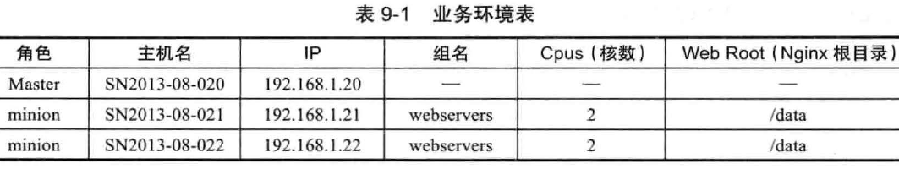

[TOC]

# 【】TODO
## github小组(我负责总提纲更新，每人编写自己的文档和代码-链接??)  vnote 
### 辅助资料！

#### 报告模板 ||  毕业论文初稿可以作为课程报告

##模块八、云平台运维与开发

# 任务一：shell运维脚本编写

# 任务二：Python脚本编写

# 任务三：CH9 Ansible自动运维平台开发
##CH9 -10 集中化 

Ansible 专题文章总揽 https://www.jianshu.com/p/c56a88b103f8 [ OS：Centos 6.7 x86_64
Ansible: 2.1.2.0
Python: 2.6.6]

在DevOps领域很受欢迎的Ansible

##推荐Ansible作为另外一个学习的对象和工具
ansible是一种自动化运维工具,基于paramiko开发的,并且基于模块化工作，Ansible是一种集成IT系统的配置管理、应用部署、执行特定任务的开源平台，它是基于python语言，由Paramiko和PyYAML两个关键模块构建。

不需要在远程主机上安装client/agents，因为它们是基于ssh来和远程主机通讯的. 

### Ansible 脚本的开发过程通常是这样的：

启动一台虚拟机。
在开发机上编辑 Ansible 脚本。
在开发机上执行 ansible-playbook -i hosts playbook.yml 命令。

#### Ansible学习流程
https://zhuanlan.zhihu.com/p/50944623
安装
管理协议
配置
ad-hoc
playbook
python api

-----------

## 实验环境搭建 

### 软件工具 & 搭建步骤
1) VirtualBox-5.2.28-130011-Win.exe
2) vagrant_2.2.16_x86_64.msi
3) ubuntu_trusty_64.box
python3
4) ansible-2.0.0.2.tar.gz

####  1、安装VirtualBox

##### 设置 VirtualBox 存储文件夹

> 
> C:\Users\Lilian\VirtualBox VMs\Mininet-VM\mininet-vm-x86_64.vdi
> C:\Users\Lilian\VirtualBox VMs2\Mininet-VM\mininet-vm-x86_64.vdi  [这两个占用了9GB，统统删除了]
##### 在 VirtualBox 创建虚拟机 ???

####  2、安装Vagrant    

验证 Ansible 脚本，我们需要频繁创建新的虚拟机。手工创建虚拟机的效率太低。而且不利于版本控制。所以，测试机器的准备，笔者使用的是 Vagrant。通过它，可以自动化创建和配置虚拟机。当然，整个过程还是版本控制的。
Vagrantfile 使用的是 Ruby 语言写的。但是写 Vagrantfile 基本不需要 Ruby 知识。
> ------------------------------
https://stackoverflow.com/questions/15243405/is-it-possible-for-vagrant-to-use-an-os-iso-install-image-directly-or-create-a

> ------------------------------

vagrant box add untu .iso Couldn't open file 路径写法

vagrant box add my_first_box D:/centos-7.0-x86_64.box

https://github.com/yep/vagrant-ubuntu

 > ubuntu_trusty_64.box  https://blog.csdn.net/zsl10/article/details/51997367

> ------------------------------  

> J:\pyauto_tools>vagrant box add ubuntu J:\pyauto_tools\ubuntu-18.04-desktop-amd64.iso

==> box: Box file was not detected as metadata. Adding it directly...
==> box: Adding box 'ubuntu' (v0) for provider:
    box: Unpacking necessary files from: file:///J:/pyauto_tools/ubuntu-18.04-desktop-amd64.iso
    box:
The box failed to unpackage properly. Please verify that the box
file you're trying to add is not corrupted and that enough disk space
is available and then try again.
The output from attempting to unpackage (if any):

x .
x .disk
...

x ubuntu: Can't create '\\\\?\\C:\\Users\\Lilian\\.vagrant.d\\tmp\\vagrant-box-add-temp-20210515-17708-4ow3io\\ubuntu'
bsdtar.EXE: Error exit delayed from previous errors.

>vagrant version
Installed Version: 2.2.16
Latest Version: 2.2.16

安装 vbguest 插件，命令：
> vagrant plugin install vagrant-vbguest

####  3、用Vagrant安装配置Ubuntu虚拟机 

> J:\pyauto_tools>**vagrant box add ubuntu J:\pyauto_tools\ubuntu_trusty_64.box**
==> box: Box file was not detected as metadata. Adding it directly...
==> box: Adding box 'ubuntu' (v0) for provider:
    box: Unpacking necessary files from: file:///J:/pyauto_tools/ubuntu_trusty_64.box
    box:
==> box: Successfully added box 'ubuntu' (v0) for 'virtualbox'!

#> **vagrant box list**   
ubuntu (virtualbox, 0)

>C:\Windows\System32>vagrant init  ubuntu/precise64
The user that is running Vagrant doesn't have the proper permissions
to write a Vagrantfile to the specified location. Please ensure that
you call `vagrant init` in a location where the proper permissions
are in place to create a Vagrantfile.

#>C:\WINDOWS\system32>**vagrant init  ubuntu**   【最好有一个专门的用户文件夹 ???】
#>J:\云空间\Virualbox_store    

A `Vagrantfile` has been placed in this directory. You are now
ready to `vagrant up` your first virtual environment! Please read
the comments in the Vagrantfile as well as documentation on
`vagrantup.com` for more information on using Vagrant.

#>C:\WINDOWS\system32>**vagrant up**
00-Vagrant-up-log.txt

#------------------------------------------------------------------------------
#>C:\WINDOWS\system32>**vagrant ssh**
Welcome to Ubuntu 14.04.1 LTS (GNU/Linux 3.13.0-44-generic x86_64)

 * Documentation:  https://help.ubuntu.com/

  System information as of Sat May 22 13:11:47 UTC 2021

  System load:  0.21              Processes:           78
  Usage of /:   2.8% of 39.34GB   Users logged in:     0
  Memory usage: 24%               IP address for eth0: 10.0.2.15
  Swap usage:   0%

  Graph this data and manage this system at:
    https://landscape.canonical.com/

  Get cloud support with Ubuntu Advantage Cloud Guest:
    http://www.ubuntu.com/business/services/cloud

0 packages can be updated.
0 updates are security updates.

New release '16.04.7 LTS' available.
Run 'do-release-upgrade' to upgrade to it.

vagrant@vagrant-ubuntu-trusty-64:~$
#------------------------------------------------------------------------------

> vagrant@vagrant-ubuntu-trusty-64:~$ exit
logout
Connection to 127.0.0.1 closed.

C:\WINDOWS\system32>vagrant halt
==> default: Attempting graceful shutdown of VM...

C:\WINDOWS\system32>vagrant status
Current machine states:

default                   poweroff (virtualbox)

The VM is powered off. To restart the VM, simply run `vagrant up`

#>[[把 Vagrantfile
vagrant
.vagrant（文件夹）从C:\WINDOWS\system32剪切到 J:\云空间\Virualbox_store\vagrant 下   ]]

#>J:\云空间\Virualbox_store\vagrant>vagrant package  --output  Ubuntu12_04.box
==> default: This machine used to live in C:/WINDOWS/System32 but it's now at J:/云空间/Virualbox_store/vagrant.
==> default: Depending on your current provider you may need to change the name of
==> default: the machine to run it as a different machine.
==> default: Clearing any previously set forwarded ports...
==> default: Exporting VM...
==> default: Compressing package to: J:/云空间/Virualbox_store/vagrant/Ubuntu12_04.box   #[[ ** 这个Ubuntu12_04.box可以发给学生让他们添加到本地环境---执行：vagrant box add Ubuntu12_04  Ubuntu12_04.box  ； vagrant init Ubuntu12_04 ； vagrant up;  vagrant ssh**  ]]

J:\云空间\Virualbox_store\vagrant>vagrant ssh
vagrant@127.0.0.1's password:
【密码 vagrant  ???】

##### 使用 Ansible 在 Azure 中配置 Linux 虚拟机
 https://docs.microsoft.com/zh-cn/azure/developer/ansible/vm-configure?tabs=ansible

###### 创建6台虚拟机
ip	主机名
192.168.1.30	ansible
192.168.1.31	web1
192.168.1.33	db1
192.168.1.35	cache

##### ansible 创建 openstack  虚拟机
https://developer.aliyun.com/article/584437

白话ansible-runner--1.环境搭建 https://www.cnblogs.com/AutoSmart/p/12116781.html [ 安装顺序：windows10: WSL + Ubuntu18 + Python3.7 + ansible + ansible-runner 出错多？！ ]
WSL (Windows Subsystem for Linux)

#### 4、虚拟机安装Python 【】

#----------------------------------------------------------------------
####### Ansible 实例 之 快速添加免密码认证 https://www.jianshu.com/p/fc88132924d5 [ ]
【windows 10下已经有pip和python，但ssh进入ubuntu后，提示缺少pip 和 python】

#虚拟机virtualbox ubuntu ansible python 
https://blog.csdn.net/xw1680/article/details/115434578 [全网最细 VirtualBox 虚拟机安装 Ubuntu.pdf 确实很详细，但没有其它内容]
在Windows中使用VirtualBox安装Ubuntu虚拟机（2020年7月版本） http://dblab.xmu.edu.cn/blog/2760-2/ 
python自动化之Ansible的安装教程 https://www.jb51.net/article/162988.htm [安装 测试 ]

https://code-maven.com/ansible-on-ubuntu-in-virtual-box-environment
https://blog.csdn.net/liuxe1990/article/details/89365681

> C:\Windows\System32>where python
> C:\Program Files (x86)\Python36-32\python.exe
> C:\Users\...\AppData\Local\Microsoft\WindowsApps\python.exe
> 请教作者， @佳峰
> 这样的情况下，如果要在linux系统下做些实验，有必要在virtualbox的Ubuntu虚拟机下再安装一个python吗？
> 

####  5、在Ubuntu虚拟机 安装Ansible

>  
root@vagrant-ubuntu-trusty-64:~# curl https://bootstrap.pypa.io/get-pip.py -o get-pip.py
  % Total    % Received % Xferd  Average Speed   Time    Time     Time  Current
                                 Dload  Upload   Total   Spent    Left  Speed
100 1891k  100 1891k    0     0  2831k      0 --:--:-- --:--:-- --:--:-- 2828k

sudo python get-pip.py
pip --version

vagrant@vagrant-ubuntu-trusty-64:~$ su - root
Password:
root@vagrant-ubuntu-trusty-64:~#

pip install ansible==2.7.1 --trusted-host mirrors.aliyun.com --index-url=http://mirrors.aliyun.com/pypi/simple/

ansible --version

#----------------------------------------------------------------------

确保控制计算机上有Python??? https://cloud.tencent.com/developer/article/1332619 [ 安装 配置 库存文件 用Playbook配置]
https://cloud.tencent.com/developer/article/1737608 [ansible-playbook可以自动化部署安装python]
python setup.py的方式安装ansible：1）https://www.cnblogs.com/ryxiong-blog/p/11245756.html
2）https://blog.csdn.net/wc1695040842/article/details/87273209 [步骤很少]
3）https://blog.csdn.net/qq_44335445/article/details/108581014

#### ansible目录结构：

通过如下命令我们可以获取ansible所有文件存放目录：
rpm -ql ansible
该命令输出内容较多，大致分为如下几类：

配置文件目录：/etc/ansible/(ansible.cfg、hosts、roles)
执行文件目录：/usr/bin
lib库依赖目录：/usr/lib/python2.7/site-packages/ansible
ansible插件目录：/usr/share/ansible/plugins
help文档目录：/usr/share/doc/ansible-2.3.1.0
man文档目录：/usr/share/man/man1

#### 这里有个坑：https://blog.csdn.net/wudinaniya/article/details/98988345
authorized_keys 这个文件的权限必须是600（，就算是644 也不行），否则无法由133免密登录到被管控端服务器上。???

#### 6、安装 VS Code -- Visual Studio Code

## ssh - xshell ???

采用了非对称加密技术(RSA)加密了所有传输的数据。提供两种级别的验证方法：

第一种级别（基于口令的安全验证）：只要你知道自己帐号和口令，就可以登录到远程主机。所有传输的数据都会被加密，但是不能保证你正在连接的服务器就是你想连接的服务器。可能会有别的服务器在冒充真正的服务器，也就是受到“中间人攻击”这种方式的攻击。

第二种级别（基于密钥的安全验证）：你必须为自己创建一对密钥，并把公钥放在需要访问的服务器上。如果你要连接到SSH服务器上，客户端软件就会向服务器发出请求，请求用你的密钥进行安全验证。服务器收到请求之后，先在该服务器上你的主目录下寻找你的公钥，然后把它和你发送过来的公钥进行比较。如果两个密钥一致，服务器就用公钥加密“质询”(challenge)并把它发送给客户端软件。客户端软件收到“质询”之后就可以用你的私钥在本地解密再把它发送给服务器完成登录。与第一种级别相比，第二种级别不仅加密所有传输的数据，也不需要在网络上传送口令，因此安全性更高，可以有效防止中间人攻击。

如果只是想远程登陆别的机器只需要安装客户端（Ubuntu默认安装了客户端），如果要开放本机的SSH服务就需要安装服务器。

sudo apt-get install openssh-client 
sudo apt-get install openssh-server

确认ssh-server是否已经启动了
ps -e | grep ssh

#-------------------------------------------------------

Connecting for the First Time
Learning Basic Commands
Creating Encrypted Keys

SSH的安全机制
SSH的安装
启动服务器的SSH服务
SSH两种级别的远程登录
SSH的高级应用

Windows中使用SSH，需要使用另一个软件PuTTY        C:\Program Files\PuTTY\putty.exe
OpenSSH免费开源实现在Ubuntu中

https://www.wikihow.com/Use-SSH
https://blog.csdn.net/li528405176/article/details/82810342
https://www.man7.org/linux/man-pages/man1/ssh.1.html

## 使用【】 -- 进入VirtualBox 虚拟机 Ubuntu ansible python 环境 

#####  尝试启动Ubuntu虚拟机 
> C:\WINDOWS\system32>vagrant up
> A Vagrant environment or target machine is required to run this
> command. Run `vagrant init` to create a new Vagrant environment. Or,
> get an ID of a target machine from `vagrant global-status` to run
> this command on. A final option is to change to a directory with a
> Vagrantfile and to try again.

[[]]搜到3个Vagrantfile，全都无法执行up命令，因为init真正生成的Vagrantfile被移动到移动硬盘 J:\>cd J:\云空间\Virualbox_store\vagrant\Vagrantfile：
> C:\Users\Lilian\.vagrant.d\boxes\ubuntu\0\virtualbox\Vagrantfile
> C:\HashiCorp\Vagrant\embedded\gems\2.2.16\gems\vagrant-2.2.16\plugins\providers\docker\hostmachine\Vagrantfile
> C:\HashiCorp\Vagrant\embedded\gems\2.2.16\gems\vagrant-2.2.16\Vagrantfile

> **C:\HashiCorp\Vagrant\embedded\gems\2.2.16\gems\vagrant-2.2.16>vagrant up**
> Bringing machine 'default' up with 'virtualbox' provider...
> ==> default: Box 'hashicorp/bionic64' could not be found. Attempting to find and install...
>     default: Box Provider: virtualbox
>     default: Box Version: >= 0
> The box 'hashicorp/bionic64' could not be found or
> could not be accessed in the remote catalog. If this is a private
> box on HashiCorp's Vagrant Cloud, please verify you're logged in via
> `vagrant login`. Also, please double-check the name. The expanded
> URL and error message are shown below:
> URL: ["https://vagrantcloud.com/hashicorp/bionic64"]
> Error: schannel: next InitializeSecurityContext failed: Unknown error (0x80092013) - 由于吊销服务器已脱机，吊销功能无法 检查吊销。

> C:\Users\Lilian\.vagrant.d\boxes\ubuntu\0\virtualbox>vagrant up
> Bringing machine 'default' up with 'virtualbox' provider...
> There are errors in the configuration of this machine. Please fix
> the following errors and try again:
> vm:
> * A box must be specified.

> C:\Users\Lilian\.vagrant.d\boxes\ubuntu\0\virtualbox>**vagrant box list
> ubuntu (virtualbox, 0)**
> C:\Users\Lilian\.vagrant.d\boxes\ubuntu\0\virtualbox>**vagrant up ubuntu**
> The machine with the name 'ubuntu' was not found configured for
> this Vagrant environment.
> C:\Users\Lilian\.vagrant.d\boxes\ubuntu\0\virtualbox>vagrant up ubuntu (virtualbox, 0)
> The machine with the name 'ubuntu' was not found configured for
> this Vagrant environment.
> C:\Users\Lilian\.vagrant.d\boxes\ubuntu\0\virtualbox>**vagrant init ubuntu/precise64**
> `Vagrantfile` already exists in this directory. Remove it before
> running `vagrant init`.

**J:\云空间\Virualbox_store\vagrant>vagrant up**
Bringing machine 'default' up with 'virtualbox' provider...
==> default: Clearing any previously set forwarded ports...
==> default: Clearing any previously set network interfaces...
==> default: Preparing network interfaces based on configuration...
    default: Adapter 1: nat
==> default: Forwarding ports...
    default: 22 (guest) => 2222 (host) (adapter 1)
==> default: Booting VM...
==> default: Waiting for machine to boot. This may take a few minutes...
    default: SSH address: 127.0.0.1:2222
    default: SSH username: vagrant
    default: SSH auth method: private key
    default: Warning: Connection reset. Retrying...
    default: Warning: Connection aborted. Retrying...
==> default: Machine booted and ready!
[default] GuestAdditions 5.2.28 running --- OK.
==> default: Checking for guest additions in VM...
    default: The guest additions on this VM do not match the installed version of
    default: VirtualBox! In most cases this is fine, but in rare cases it can
    default: prevent things such as shared folders from working properly. If you see
    default: shared folder errors, please make sure the guest additions within the
    default: virtual machine match the version of VirtualBox you have installed on
    default: your host and reload your VM.
    default:
    default: Guest Additions Version: 4.3.10
    default: VirtualBox Version: 5.2
==> default: Mounting shared folders...
    default: /vagrant => J:/云空间/Virualbox_store/vagrant
==> default: Machine already provisioned. Run `vagrant provision` or use the `--provision`
==> default: flag to force provisioning. Provisioners marked to run always will still run.

#####  启动Ubuntu虚拟机 的原理
#----------------------------------------------------
安装vagrant后，三个命令就可以起一个ubuntu服务器
vagrant init 
vagrant up（第一次是安装，之后就只是启动）
vagrant ssh

Vagrant 运行虚拟机的时候没有 UI 界面。可以通过 SSH 连接到机器判断机器是否运行成功

需要做个名称定义
config.vm.define "centos"
看下我的 Vagrantfile 的完整内容
> Vagrant.configure("2") do |config|
>   config.vm.define "centos"
>   config.vm.box = "centos"
>   config.vm.box_url = "CentOS-7-x86_64-Vagrant-1910_01.VirtualBox.box"
> end

使用Vagrant创建虚拟机并ssh进去 https://blog.csdn.net/violet_echo_0908/article/details/58055608
vagrant 多个box的操作|共享目录失败 https://blog.csdn.net/feifeixiang2835/article/details/106088102
Vagrant - SSH连接方式 https://blog.csdn.net/oblily/article/details/88851000 [3种连接方式]
#---------------------------------------

## Ansible应用 【】

网络工程师的Python之路---Ansible篇 https://zhuanlan.zhihu.com/p/48157132【】【】
使用Ansible自动化管理云上或者本地的基础设施 https://cloud.tencent.com/developer/article/1015716

#### Ansible 安全 之【过滤危险命令】 https://www.jianshu.com/p/f8cbc12180b8

### Ansible 开发专题总揽https://www.jianshu.com/p/667dabe96f04

Ansible 开发分为两大模块，一是modules，而是plugins。

首先，要记住这两部分内容在哪个地方执行？

modules 文件被传送到远端主机并执行。
plugins 是在ansible服务器上执行的。
再者是执行顺序？
plugins 先于 modules 执行。

然后大家明确这两部分内容是干啥用的？

modules 是ansible的核心内容，它使playbook变得更加简单明了，一个task就是完成某一项功能。ansible模块是被传送到远程主机上运行的。所以它们可以用远程主机可以执行的任何语言编写modules。
plugins 是在ansible主机上执行的，用来辅助modules做一些操作。比如连接远程主机，拷贝文件到远程主机之类的。
ansible执行ping模块的过程。

# Ansible 华为 Huawei eNSP

目前ansible不支持H3C
华三有自己的ansible模块，但是不知道为什么没有开源出来。

## https://www.jianshu.com/p/f72b79b0d3f9  Ansible 开发模块 之 连接华为交换机.pdf  Ansible-华为-S5700-eNSP.jpg [代码很多很长，解说少 ??? ]

华为的s5700交换机 + Cloud
端口创建-UDP端口号
端口映射表 
端口开放状态：Internal Public  ???  
绑定信息：本地连接 -IP:  ???

交换机开启ssh连接

<Huawei>system-view 
[Huawei]rsa local-key-pair create 
The key name will be: Huawei_Host
% RSA keys defined for Huawei_Host already exist.
Confirm to replace them? [y/n]:y
The range of public key size is (512 ~ 2048). 
NOTES: If the key modulus is greater than 512, 
       it will take a few minutes.
Input the bits in the modulus[default = 512]:2048
Generating keys...
..........+++
.....................................................................+++
..............++++++++
.............++++++++

[Huawei]user-interface vty 0 4
[Huawei-ui-vty0-4]authentication-mode aaa
[Huawei-ui-vty0-4]protocol inbound ssh
[Huawei-ui-vty0-4]quit
[Huawei]aaa
[Huawei-aaa]local-user user1 password cipher Huawei@123
[Huawei-aaa]local-user user1 service-type ssh
[Huawei-aaa]quit
[Huawei]ssh user user1 authentication-type password
Info: Succeeded in adding a new SSH user.
[Huawei]ssh user user1 service-type stelnet
[Huawei]stelnet server enable
Info: Succeeded in starting the Stelnet server.

#### 伪代码定义Hwcon类以及方法 ???

class Hwcon(object):

    def __init__(self, address, username, password, port=22):
        # 初始化ssh连接
    def close(self):
        # 关闭连接
    def openShell(self):
        # 在ssh连接中打开一个terminal
    def send_command(self, command=''):
        # 向terminal发送命令
    def get_command_result(self, cmd):
        # 获取命令的输出结果
    def parse_result_data(self, data):
        # 解析命令的输出结果
    def save_config(self):
        # 保存配置
    def run(self, cmd):
        # 执行命令
使用方法：

connection = Hwcon(b_host, b_user, b_password, module.params['sport'])
connection.openShell()
rc,stdout,stderr = connection.run(b_command)
connection.save_config()
connection.close()

#### 定义命令的错误

正确输出信息的正则表达式，以便我们能确认命令输出结果是否正确。

terminal_stdout_re = [
        re.compile(r'[\r\n]?<.+>(?:\s*)$'),
        re.compile(r'[\r\n]?\[.+\](?:\s*)$'),
    ]
terminal_stderr_re = [
        re.compile(r"% ?Error: "),
        re.compile(r"^% \w+", re.M),
        re.compile(r"% ?Bad secret"),
        re.compile(r"invalid input", re.I),
        re.compile(r"(?:incomplete|ambiguous) command", re.I),
        re.compile(r"connection timed out", re.I),
        re.compile(r"[^\r\n]+ not found", re.I),
        re.compile(r"'[^']' +returned error code: ?\d+"),
        re.compile(r"syntax error"),
        re.compile(r"unknown command"),
        re.compile(r"Error\[\d+\]: ", re.I),
        re.compile(r"Error:", re.I)
    ]

#### 导入我们需要的库
import time
import re
from ansible.module_utils.basic import AnsibleModule
from ansible.module_utils._text import to_bytes
from ansible.errors import AnsibleError, AnsibleConnectionFailure
try:
  import paramiko
except ImportError:
  raise AnsibleError("paramiko is not installed, please use pip install paramiko")
try:
    from __main__ import display
except ImportError:
    from ansible.utils.display import Display
    display = Display()

#### 填充里面的功能代码
class Hwcon(object):
    shell = None
    client = None

    def __init__(self, address, username, password, port=22):
        display.vv("Connecting to network device on ip", str(address) + ".")
        self.client = paramiko.client.SSHClient()
        self.client.set_missing_host_key_policy(paramiko.client.AutoAddPolicy())
        self.client.connect(address, port=port, username=username, password=password, look_for_keys=False,
                            allow_agent=False)

    def close(self):
        if self.client is not None:
            self.client.close()

    def openShell(self):
        self.shell = self.client.invoke_shell()

    def send_command(self, command=''):
        if self.shell:
            if command not in ('?',):
                command += "\n"
            self.shell.send(command)

        while True:
            if self.shell.recv_ready() or self.shell.recv_stderr_ready():
                break
            time.sleep(0.1)

    def get_command_result(self, cmd):
        buffersize = 4096
        self.send_command()
        self.shell.recv(buffersize)
        self.send_command(cmd)
        stdout = self.shell.recv(buffersize)
        b_data = stdout.split('\r\n')
        result_tmp = ''
        while '- More -' in b_data[-1]:
            self.shell.send("\n")
            time.sleep(0.1)
            tmp = self.shell.recv(buffersize)
            b_data = tmp.split('\r\n')
            result_tmp += tmp

        if self.shell.recv_stderr_ready():
            stderr = self.shell.recv_stderr(buffersize)
        else:
            stderr = ''
        stdout = '\r\n'.join(stdout.split('\r\n')[:-1]) + '\n' + result_tmp
        stdout = stdout.replace('  ---- More ----', '').replace(
            '\x1b[42D                                          \x1b[42D', '')
        return stdout, stderr

    def parse_result_data(self, data):
        b_data = data.split('\r\n')
        result = b_data[1:-1]
        return '\r\n'.join(result)

    def save_config(self):
        rc = 1
        buffersize = 4096
        self.send_command()
        stdout = self.shell.recv(buffersize)
        t1 = terminal_stdout_re[0].findall(stdout)
        while not t1:
           self.send_command('quit')
           stdout = self.shell.recv(buffersize)
           t1 = terminal_stdout_re[0].findall(stdout)
        self.send_command('save')
        time.sleep(0.1)
        self.send_command('y')
        time.sleep(3)
        stdout = self.shell.recv(buffersize)
        if stdout.find('successfully'):
            rc = 0
        return rc

    def run(self, cmd):
        rc = 1
        stdout, stderr = self.get_command_result(cmd)
        for regex in terminal_stderr_re:
            r1 = regex.findall(stdout)
        if not r1:
           stdout = self.parse_result_data(stdout)
           rc = 0
        return rc, stdout, stderr

#### 把使用方法填入main方法中

## https://ansible.leops.cn/dev/modules/huawei-switch/  【】module 示例_ 连接华为交换机 - Ansible wiki.pdf

目录：
Ansible 开发
Ansible 开发说明
Ansible 架构
使用 PyCharm 远程开发
Ansible 调试
Module 开发
Module 开发说明
创建一个简单的module
module 示例: 连接华为交换机
module 示例: 其他语言开发
module 示例: dir
module 示例: docker_facts
module 示例: wechat
module 的返回值
module 的帮助文档
module 架构
module 工具类
Plugin 开发
API 使用
API 使用说明
使用 API 运行任务
使用 API 运行 Palybook
使用 suitable
使用 ansible runner
目录
需求
实现想法
测试环境
交换机开启ssh连接
modules
执行模块

## https://www.ansible.com/integrations/networks/huawei  【】【】 https://github.com/HuaweiSwitch/CloudEngine-Ansible   https://github.com/HuaweiSwitch/ansible

## Ansible Module for non CloudEngine Switches - Huawei Enterprise Support Community

Yes it's possible and I've created several ansible playbooks for Huawei S-series switches. You have to use "ansible_network_os=ce" in your vars.  
philip.schaller [https://forum.huawei.com/enterprise/en/profile/2756953?type=posts] Created Dec 10, 2020 21:36:06 (0) (0)
Here a simple example to create an ACL:
---
- hosts: all
gather_facts: no
connection: network_cli
tasks:
- name: change acl
cli_command:
command: |
system-view
acl number 2999
rule 10 permit source 192.168.1.83 0
return

- name: save running to startup
cli_command:
command: save
prompt:
- "continue?"
answer:
- "y"  
philip.schallerphilip.schaller Created Dec 10, 2020 21:37:01 (0) (0)
And another example:
---
- name: Check Version
hosts: all
connection: network_cli
gather_facts: false

tasks:
- name: display version
cli_command:
command: display version
register: config
when: ansible_network_os == 'ce'

- name: show version
cli_command:
command: show version
register: config
when: ansible_network_os == 'ios'  
philip.schallerphilip.schaller Created Dec 10, 2020 21:37:58 (0) (0)
Hope that helps. Let me know how it works for you.  
aba_rechsteineraba_rechsteiner Reply philip.schaller  Created Feb 3, 2021 16:53:25 (0) (0)
Thank you Philip, but this really not what i understand by automation or config managment. with the network_cli every command is executed on every ansible run. Config management should be declarative. It's really sad that huawei doesn't offer better support for switch automation.  
philip.schallerphilip.schaller Reply aba_rechsteiner  Created Feb 18, 2021 21:30:12 (0) (0)
yes I totally agree with you for both points: 1. It's not a automation/config management we are looking for and 2. it's a pity that Huawei is not invest more in such things. That could be more and more an argument to use other vendors with better implementation.  

##Do you know about using Ansible into Huawei eNSP lab simulation ?
is it possible ?
I've never tried it but it should work with the cloud feature within eNSP. **With the cloud you can connect your switch/router with the real world and you will have access from your ansible station.  ** []

###### Ansible modules for automate switch Huawei S5700 configuration - Network Engineering
The Ansible module can be supported by the CE switch, please refer  to https://forum.huawei.com/enterprise/en/automated-deployment-of-cloudengine-series-switches-using-ansible/thread/426607-861  || Ansible for huawei devices - Huawei Enterprise Support Community

#### 初创型公司-持续部署系列（一）服务架构 https://www.jianshu.com/p/e4897e615eb0

# 前端 JS python HTML5  pyauto-04WEB -python+JS.scap

 WEB_client_JS.html   WEB_Server.app.py  如何实现JS前端与Python后台的结合       site://www.liaoxuefeng.com 
完整的代码，它是一个js前端与python后台交流数据的demo。先运行python代码，然后在浏览器上打开javascript   

#### 如何实现JS前端与Python后台的结合 ;https://blog.csdn.net/a312863063/article/details/87898349 

##### websocket的协议格式    2019 
网页服务器用的是空间（我是租不起GPU服务器的。。），也就是云虚拟主机的分割，仅支持php，不支持python和java，所以训练好的python模型没法在网站后台跑。。
  但是python模型在自己/实验室的电脑上是能跑的，于是我们就可以想办法把前端数据跨域传给本地计算机上的python接口，下面就要介绍一种用websocket进行数据传输的方法。

#### 开发环境 ??? 

https://www.cnblogs.com/hmit/p/12036587.html
 https://blog.csdn.net/a312863063/article/details/87898349

> 先安装Node,
> 使用Node的npm安装Vue，
> 然后再安装vue-cli脚手架，
> 最后通过vue-cli脚手架构建前端项目
> 

#### Vue+NodeJs前后端分离实现
https://blog.csdn.net/rj2017211811/article/details/103111402 
前端Vue
后端nodejs
前后端互相访问需要跨域，跨域可以在前端配置，也可以在后端配置

#### PyCharm
对主要Python Web框架的后端支持，WebStorm绑定的前端支持以及DataGrip的SQL支持，为Python提供了最佳的全栈IDE。
JS javascript pycharm 前端 vue.js Node.js CSS

##### 【环境配置】Pycharm调用NodeJS运行js代码 的 环境配置 https://blog.csdn.net/weixin_45081575/article/details/105223948

##### Pycharm初识JS https://blog.csdn.net/moonlightpeng/article/details/88366921

1 Pycharm上安装相关plugins  【javascript debugger等搜不到???】  
2 下载安装 Nodejs [能搜到]  也能搜到vue.js    
3, 用Pycharm新建 JS案例

##### 用Pycharm创建你的第一个完整的HelloVue
-node_modules：项目的依赖
-public
    -favicon.ico  网页的图标
    -index.html   主页面
-src：我们需要关注的
    -assets：方静态文件
    -components：小组件
    -views  ：页面组件
    -App.vue ：主组件
    -main.js ：项目主入口js
    -router.js： 路由相关，以后配置路由，都在这里配置
    -store.js  ：vuex相关，状态管理器
-package.json   项目的依赖文件
https://blog.csdn.net/ssjdoudou/article/details/102704258
WebStorm 集成Node.js ,可以运行，编译，测试Node.js App。

#### Node.js

###### 浏览器内核分为两个部分:
渲染引擎---渲染HTML和CSS,
JavaScript 引擎-

Node.js 是一个轻量级的运行时环境，用于在浏览器外部（例如，**在服务器上或在命令行中）执行JavaScript**。
事件驱动、非阻塞式 I/O 
传统的JavaScript来说，Node.js 是一个运行在服务端的框架【】

#### Vue.js入门（四）https://blog.csdn.net/ssjdoudou/article/details/102704258

vue.js 是库，不是框架，不是框架，不是框架！
Vue.js是**数据驱动**???，和JQuery思路不同
模板语法
**DOM ** ???
vue-route.js
vue-resource.js

Vue.js可以在html里直接引用后使用
但，等到与Vue一起配合使用的第三方应用的库或框架多起来后，一个个从html里引入就不方便了，所有要借用node.js中的npm管理包的引入，是方便包管理。

#####  vue.js引入css样式的方法：
https://www.php.cn/vuejs/464692.html

**1、在app.vue中引入外部样式**

[前端开发 Vue Vue.js和Node.js的关系](https://www.cnblogs.com/hmit/p/12036587.html)

#### Day 8 - 构建前端 -https://www.liaoxuefeng.com/wiki/1016959663602400/1018490938509760
#### 如何成长为一名优秀的前端工程师 - https://www.liaoxuefeng.com/article/1089718845083520
#### JavaScript教程 - https://www.liaoxuefeng.com/wiki/1022910821149312
前端与后端的数据交互（jquery ajax+python flask） https://www.jianshu.com/p/4350065bdffe

# 廖雪峰实战  一个Blog网站，包含日志、用户和评论--真正的Web App

https://github.com/michaelliao/awesome-python3-webapp【】
https://github.com/LCL-ZWU/awesome-python3-webapp

https://www.liaoxuefeng.com/wiki/1016959663602400/1018490938509760

每天/每次都有对应的源码可以下载！

##任务四：Django  WEB服务器+数据库 -  CH13 B/S自动化运维OMServer   -  CH8 WebServer  [pyauto这本书，没有廖雪峰的实战讲解深入，更没有评论区的探讨！]

##### 功能模块
###前端
###数据传输
###模块扩展

服务器端模块的作用是负责具体远程操作任务的功能封装，支持3 种Python 自动化操作组件，包括Saltstack 、Ans ible 、F unc 。不同组件的API 语法及返回数据结构都不一样，
任务模块配置文件confìg.py
项目settings . py
两个.py中的“SECRETKEY ""一致
rnodules/(ansible-saltstack-func)/Public_lib . py

**python进行远程调用脚本方法：**<mark>！</mark>
https://cloud.tencent.com/developer/article/1043924
https://www.shangmayuan.com/a/622b09b56d7e41389d8ba107.html

* 登录主机执行脚本，python模块支持如 pssh、pexpect、paramiko、ansiblenginx
* 以远程方法调用（不须要登录主机），python模块 rpyc，支持分布式shell
* socket 方式，稍显复杂，须要熟悉网络协议，起点比较高编程

与JS的区别?? 【】
例如： Nginx, Apache 【】
httpwathch ??
CGI ??

#------------------
ITIL ???
Linux
服务器端，前端，HTML表单参数动态定制，异步请求，模拟Linux终端-便于模块扩展对接 ???
RC4+b64encode+密钥key-加密
现网变更

## 实战提纲
Day 1 - 搭建开发环境
Day 2 - 编写Web App骨架
Day 3 - 编写ORM
Day 4 - 编写Model
Day 5 - 编写Web框架
Day 6 - 编写配置文件
Day 7 - 编写MVC
Day 8 - 构建前端
Day 9 - 编写API
Day 10 - 用户注册和登录
Day 11 - 编写日志创建页
Day 12 - 编写日志列表页
Day 13 - 提升开发效率
Day 14 - 完成Web App
Day 15 - 部署Web App
Day 16 - 编写移动App

 <https://www.liaoxuefeng.com/wiki/1016959663602400> 

#### Web开发也经历了好几个阶段

###### 静态Web页面：
由文本编辑器直接编辑并生成静态的HTML页面，如果要修改Web页面的内容，就需要再次编辑HTML源文件，早期的互联网Web页面就是静态的；

###### 通用网关接口 （ Common Gateway Interface/CGI ）

首先做一个Python脚本，输出HTML代码，然后保存成.cgi扩展名的文件latestbooks.cgi，通过浏览器访问此文件。 

描述了客户端和服务器程序之间传输数据的一种标准，可以让一个客户端，从 网页浏览器 向执行在网络 服务器 上的程序请求数据。
CGI 意思为 Common Gateway Interface, 一种基于浏览器的输入、在Web服务器上运行的程序方法。CGI脚本使你的浏览器与用户能交互.这个脚本通常象服务器和系统中其他程序如数据库的桥梁。
由于静态Web页面无法与用户交互，比如用户填写了一个注册表单，静态Web页面就无法处理。要处理用户发送的动态数据，出现了Common Gateway Interface，简称CGI，用C/C++编写。

###### ASP/JSP/PHP：
由于Web应用特点是修改频繁，用C/C++这样的低级语言非常不适合Web开发，而脚本语言由于开发效率高，与HTML结合紧密，因此，迅速取代了CGI模式。ASP是微软推出的用VBScript脚本编程的Web开发技术，而JSP用Java来编写脚本，PHP本身则是开源的脚本语言。

###### **MVC：**
为了解决直接用脚本语言嵌入HTML导致的可维护性差的问题，Web应用也引入了**Model-View-Controller的模式**，来简化Web开发。ASP发展为ASP.Net，JSP和PHP也有一大堆**MVC框架**。

##### virtualenv - 为应用创建一套“隔离”的Python运行环境【】
https://www.liaoxuefeng.com/wiki/1016959663602400/1019273143120480

C:\Windows\System32>pip install virtualenv
Defaulting to user installation because normal site-packages is not writeable
Collecting virtualenv
  Downloading virtualenv-20.4.3-py2.py3-none-any.whl (7.2 MB)

C:\Windows\System32>virtualenv env_LCL_website
'virtualenv' 不是内部或外部命令，也不是可运行的程序
或批处理文件。

C:\Windows\System32>C:\Users\Lilian\AppData\Roaming\Python\Python36\Scripts\virtualenv env_LCL_website
PermissionError: [WinError 5] 拒绝访问。: 'C:\\Windows\\SysWOW64\\env_LCL_website'
管理员运行 cmd.exe后：【】
C:\WINDOWS\system32>C:\Users\Lilian\AppData\Roaming\Python\Python36\Scripts\virtualenv env_LCL_website
created virtual environment CPython3.6.5.final.0-32 in 3838ms
  creator CPython3Windows(dest=C:\Windows\SysWOW64\env_LCL_website, clear=False, no_vcs_ignore=False, global=False)
  seeder FromAppData(download=False, pip=bundle, setuptools=bundle, wheel=bundle, via=copy, app_data_dir=C:\Users\Lilian\AppData\Local\pypa\virtualenv)
    added seed packages: pip==21.0.1, setuptools==54.1.2, wheel==0.36.2
  activators BashActivator,BatchActivator,FishActivator,PowerShellActivator,PythonActivator,XonshActivator

C:\WINDOWS\system32>C:\Windows\SysWOW64\env_LCL_website\scripts\activate
(env_LCL_website) C:\WINDOWS\system32> 【】
(env_LCL_website) C:\WINDOWS\system32>pip install django 【】
Successfully installed asgiref-3.3.4 django-3.2 pytz-2021.1 sqlparse-0.4.1 typing-extensions-3.7.4.3

## [Day 1 - 搭建开发环境](https://www.liaoxuefeng.com/wiki/1016959663602400/1018138223191520)

#### 目录结构：md.bat

awesome-python3-webapp/  <-- 根目录
+- backup/               <-- 备份目录
+- conf/                 <-- 配置文件
+- dist/                 <-- 打包目录
+- www/                  <-- Web目录，存放.py文件
|  +- static/            <-- 存放静态文件
|  +- templates/         <-- 存放模板文件
+- ios/                  <-- 存放iOS App工程
+- LICENSE               <-- 代码LICENSE

###### 安装
C:\Windows\System32>pip3 install aiohttp
Defaulting to user installation because normal site-packages is not writeable
Collecting aiohttp
  Downloading aiohttp-3.7.4.post0-cp36-cp36m-win32.whl (606 kB)
     |████████████████████████████████| 606 kB 54 kB/s
Collecting multidict<7.0,>=4.5
  Downloading multidict-5.1.0-cp36-cp36m-win32.whl (46 kB)
     |████████████████████████████████| 46 kB 52 kB/s
Collecting yarl<2.0,>=1.0
  Downloading yarl-1.6.3-cp36-cp36m-win32.whl (119 kB)
     |████████████████████████████████| 119 kB 66 kB/s
Collecting idna-ssl>=1.0
  Downloading idna-ssl-1.1.0.tar.gz (3.4 kB)
Collecting async-timeout<4.0,>=3.0
  Downloading async_timeout-3.0.1-py3-none-any.whl (8.2 kB)
Collecting attrs>=17.3.0
  Downloading attrs-21.2.0-py2.py3-none-any.whl (53 kB)
     |████████████████████████████████| 53 kB 71 kB/s
Requirement already satisfied: typing-extensions>=3.6.5 in c:\users\lilian\appdata\roaming\python\python36\site-packages (from aiohttp) (3.7.4.3)
Requirement already satisfied: chardet<5.0,>=2.0 in c:\program files (x86)\python36-32\lib\site-packages (from aiohttp) (3.0.4)
Requirement already satisfied: idna>=2.0 in c:\program files (x86)\python36-32\lib\site-packages (from idna-ssl>=1.0->aiohttp) (2.10)
Using legacy 'setup.py install' for idna-ssl, since package 'wheel' is not installed.
Installing collected packages: multidict, yarl, idna-ssl, attrs, async-timeout, aiohttp
    Running setup.py install for idna-ssl ... done
Successfully installed aiohttp-3.7.4.post0 async-timeout-3.0.1 attrs-21.2.0 idna-ssl-1.1.0 multidict-5.1.0 yarl-1.6.3
WARNING: You are using pip version 21.0.1; however, version 21.1.2 is available.
You should consider upgrading via the 'c:\program files (x86)\python36-32\python.exe -m pip install --upgrade pip' command.

pip3 install jinja2
Defaulting to user installation because normal site-packages is not writeable
Requirement already satisfied: jinja2 in c:\program files (x86)\python36-32\lib\site-packages (3.0.1)
Requirement already satisfied: MarkupSafe>=2.0 in c:\program files (x86)\python36-32\lib\site-packages (from jinja2) (2.0.1)
WARNING: You are using pip version 21.0.1; however, version 21.1.2 is available.
You should consider upgrading via the 'c:\program files (x86)\python36-32\python.exe -m pip install --upgrade pip' command.

pip3 install aiomysql
Defaulting to user installation because normal site-packages is not writeable
Collecting aiomysql
  Downloading aiomysql-0.0.21-py3-none-any.whl (41 kB)
     |████████████████████████████████| 41 kB 34 kB/s
Collecting PyMySQL<=0.9.3,>=0.9
  Downloading PyMySQL-0.9.3-py2.py3-none-any.whl (47 kB)
     |████████████████████████████████| 47 kB 242 kB/s
Installing collected packages: PyMySQL, aiomysql
Successfully installed PyMySQL-0.9.3 aiomysql-0.0.21

#### mysql及密码 --  MySQL Server 8.0   

C:\Program Files\MySQL\MySQL Server 8.0\bin\mysql.exe
mysql-8.0.18-winx64.msi
 【发现HP系统中已经有mysql，文件夹日期为20190920】 -- 运行mysql.exe和 mysqld.exe，都没有界面出现，没有要求设置口令  

#https://www.cnblogs.com/technologylife/p/6010205.html [[用这里的方法解决无法启动问题]]
https://www.liaoxuefeng.com/wiki/1177760294764384/1246617733597824

C:\Program Files\MySQL\MySQL Server 8.0\bin>mysql -u root -p
Enter password:
加入启动路径，重启电脑后：
C:\Windows\System32>mysql -u root
ERROR 2003 (HY000): Can't connect to MySQL server on 'localhost' (10061)

无法启动服务：MySQL服务-20210603103328.jpg
本地计算机上的MySQL服务启动后停止，某些服务在未由其他程序服务或使用时将自动停止

C:\Windows\System32>net start mysql
发生系统错误 5。
拒绝访问。
管理员身份启动cmd.exe后：
C:\WINDOWS\system32>net start mysql
MySQL 服务无法启动。 服务没有报告任何错误。

C:\WINDOWS\system32>mysqld --install
The service already exists!
The current server installed: "C:\Program Files\MySQL\MySQL Server 8.0\bin\mysqld.exe" MySQL

#C:\WINDOWS\system32>**mysqld --initialize --user=root --console**
2021-06-03T02:49:47.493898Z 0 [System] [MY-013169] [Server] C:\Program Files\MySQL\MySQL Server 8.0\bin\mysqld.exe (mysqld 8.0.18) initializing of server in progress as process 14296
2021-06-03T02:49:49.339827Z 5 [Note] [MY-010454] [Server] A temporary password is generated for root@localhost: G9)Fte06:LU!

**C:\WINDOWS\system32>net start mysql**
MySQL 服务正在启动 .
MySQL 服务已经启动成功。

**C:\WINDOWS\system32>mysql -u root -p**
Enter password: ************
Welcome to the MySQL monitor.  Commands end with ; or \g.
Your MySQL connection id is 8
Server version: 8.0.18

**mysql>  set password=password('123456');**
ERROR 1064 (42000): You have an error in your SQL syntax; check the manual that corresponds to your MySQL server version for the right syntax to use near 'password('123456')' at line 1
[[这个错误参考下面链接解决了： https://blog.csdn.net/qq_43270153/article/details/108148441  ]]

mysql> ALTER USER 'root'@'localhost' IDENTIFIED BY '123456';
Query OK, 0 rows affected (0.02 sec)

## [Day 2 - 编写Web App骨架](https://www.liaoxuefeng.com/wiki/1016959663602400/1018139060027680)

廖的源码会出现“http://127.0.0.1:9000/"的"下载”，并有如下提示：
> INFO:root:server started at http://127.0.0.1:9000...
> INFO:aiohttp.access:127.0.0.1 [03/Jun/2021:03:51:40 +0000] "GET / HTTP/1.1" 200 172 "-" "Mozilla/5.0 (Windows NT 10.0; Win64; x64) AppleWebKit/537.36 (KHTML, like Gecko) Chrome/91.0.4472.77 Safari/537.36"

[[]]修改的点：
1）web.Response() 中 添加 ,content_type='text/html'
2）@asyncio.coroutine  改成async def的格式
3）srv = yield from ...修改为 srv = await ...

修改后运行提示：
> INFO:root:server started at http://127.0.0.1:9000...
> INFO:aiohttp.access:127.0.0.1 [03/Jun/2021:04:36:53 +0000] "GET / HTTP/1.1" 200 157 "-" "Mozilla/5.0 (Windows NT 10.0; Win64; x64) AppleWebKit/537.36 (KHTML, like Gecko) Chrome/91.0.4472.77 Safari/537.36"

### asyncio
https://www.liaoxuefeng.com/wiki/1016959663602400/1017970488768640

asyncio的编程模型就是一个消息循环。我们从asyncio模块中直接获取一个EventLoop的引用，然后把需要执行的协程扔到EventLoop中执行，就实现了异步IO。【???】

##### ??? aiohttp框架
ORM和编写web框架太难???
项目源码 我在其中添加了很详细的注释 https://github.com/cuizichenghome/MyWebAPP

Web App建立在asyncio的基础上

## [Day 3 - 编写ORM](https://www.liaoxuefeng.com/wiki/1016959663602400/1018490605531840)

这篇跨度大，参考：
https://blog.csdn.net/BWone/article/details/106537191
这里实现了一个简易框架，想要理解这个框架就必须学元类。路径：面向对象高级编程 --> 使用元类 【】
https://aiomysql.readthedocs.io/en/latest/cursors.html

学习笔记 https://blog.csdn.net/q381907223/article/details/81019239 

#### ImportError ：cannot import name xxx  三种类型 解决方法
https://blog.csdn.net/qq_41375609/article/details/106981053
==>每次错误的时候，多看看错误信息，自己跟着捋一捋，还是可以找到解决方案滴！
* 缺少这个module或者func或者package-->pip安装或导入
* 命名问题(因为升级等各种原因)-->官方修改说明
* **路径问题！**-->前面加上一个from xxx（你的包名） import XXX（你要导入的文件），根据这个路径去找找你所要导入的文件是否存在，一般都能解决这个问题。
* **导入顺序/循环导入/死锁**：**1）只在两个文件之间的死锁**-->建议是把要导入的函数或者模块写进第三个文件中，两个文件的死锁现象是解决不了的；
2）**多个文件夹之间的引用**，然后你在错误信息指定的文件夹中也找到了这个module，但是就是import不到的现象-->from的时候，把路径写全；找到死循环的问题所在，换import的顺序；

##### pip3 install orm 的error
[[教程中没有这一项，评论中有人提到安装orm，用来解决 **ImportError: cannot import name 'Model'**      **https://www.liaoxuefeng.com/discuss/969955749132672/1177473777661696 **     ]]**pip3 install orm**  
error: Microsoft  Visual C++  14.0 is required. Get it with "Microsoft Visual C++ Build Tools": http://landinghub.visualstudio.com/visual-cpp-build-tools [ 这个链接404 ]
  [[20210609 https://blog.csdn.net/keeppractice/article/details/115712094    https://visualstudio.microsoft.com/visual-cpp-build-tools/ 在这里下载安装，重启电脑，不管用；     ]]
[[[  https://blog.csdn.net/qq_15158911/article/details/107887490  翻墙下载；https://pan.baidu.com/s/19F4YurwwZ5A9WF5txzMZoQ 提取码：ka7q  成功！ ]]]
[[
下面两个链接中给的方法，都报告安装包丢失损坏，安装了证书依然不行：
VisualStudio2015安装需要的证书.zip
VisualCppBuildTools_Full.exe
 https://blog.csdn.net/weixin_40547993/article/details/89399825   ||  https://blog.csdn.net/weixin_40547993/article/details/89399825]]

### 异步编程的一个原则：一旦决定使用异步，则系统每一层都必须是异步，“开弓没有回头箭”。【???!!!】
Web框架使用了基于asyncio的aiohttp，这是基于协程的异步模型。在协程中，不能调用普通的同步IO操作，因为所有用户都是由一个线程服务的，协程的执行速度必须非常快，才能处理大量用户的请求。而耗时的IO操作不能在协程中以同步的方式调用，否则，等待一个IO操作时，系统无法响应任何其他用户。

aiomysql为MySQL数据库提供了异步IO的驱动
创建一个全局的连接池，不必频繁地打开和关闭数据库连接 【】

理解metaclass的概念在ORM实战中帮助很大，建议先大概了解基础概念后对照实际代码具体理解。

##### 异步IO - async/await 【】
https://www.liaoxuefeng.com/wiki/1016959663602400/1048430311230688
用 async def装饰，变成一个协程   【】
user.save()没有任何效果，因为调用save()仅仅是创建了一个协程，并没有执行它。一定要用：
await user.save() 才真正执行了INSERT操作。

Python从3.5版本开始为asyncio提供了async和await的新语法
把@asyncio.coroutine替换为async；
把yield from替换为await。

3.6版本之后async修饰符支持yield关键字了--异步生成器

### 元类metaclass  - OO
面向对象高级编程 --> 使用元类   https://www.liaoxuefeng.com/wiki/1016959663602400/1017592449371072
元类是Python面向对象里最难理解，也是最难使用的魔术代码。

#### 定义vs.创建【魔术!!!】：先定义metaclass，就可以创建类，最后创建实例。

动态语言和静态语言最大的不同，就是函数和类的定义，不是编译时定义的，而是运行时动态创建的。
【】采用metaclass方法创建的类，可以动态修改方法和属性！

#### 定义(静态)类的两种方法：
* 通过type()函数创建的类
* 用class Xxx...来定义类

##### 要创建一个class对象，type()函数依次传入3个参数：
* class的名称；
* 继承的父类集合，注意Python支持多重继承，如果只有一个父类，别忘了tuple的单元素写法；
* class的方法名称与函数绑定，这里我们把函数fn绑定到方法名hello上。

### ORM vs. metaclass
会遇到需要通过metaclass修改类定义。ORM就是一个典型的例子！
**ORM全称“Object Relational Mapping”，即对象-关系映射**，就是把关系数据库的一行映射为一个对象，也就是一个类对应一个表，这样，写代码更简单，不用直接操作SQL语句。
要编写一个ORM框架，所有的类都只能动态定义，因为只有使用者才能根据表的结构定义出对应的类来。

#### 创建ORM步骤：
* Field类，及StringField，IntegerField
* ModelMetaclass
* 基类Model

在Model类中，就可以定义各种操作数据库的方法，比如save()，delete()，find()，update等

#### 基类Model-自定义类的父类
想定义一个User类来操作对应的数据库表User：
Model是由ORM框架提供的

定义Field类，它负责保存数据库表的字段名和字段类型：
在Field的基础上，进一步定义各种类型的Field，比如StringField，IntegerField等等
魔术方法比如save()全部由父类Model自动完成。【】

super()就代表父类的实例，里边不需要参数也可以直接调用 super().__init__()  【】???

#### 调试与debug错误 -await & yield from

  File "D:/OneDrive/LCL_Github/Teaching/awesome-python3-webapp/www/orm.py", line 170
    user = await User.find('123')
                    ^
SyntaxError: invalid syntax

File "D:/OneDrive/LCL_Github/Teaching/awesome-python3-webapp/www/orm.py", line 174
    await user.save()
             ^
SyntaxError: invalid syntax

  File "D:/OneDrive/LCL_Github/Teaching/awesome-python3-webapp/www/orm.py", line 171
    user = yield from User.find('123')
          ^
SyntaxError: 'yield' outside function

File "D:\OneDrive\LCL_Github\Teaching\awesome-python3-webapp\www\orm.py", line 45, in <module>
    from orm import Model, StringField, IntegerField
ImportError: cannot import name 'Model'

###### ModuleNotFoundError: **No module named 'aiomysql**' 

####报错及尝试过程：1）20210503晚上orm.py运行成功过，并没有报告这个错误???
2）  C:\WINDOWS\system32>pip install aiomysql 
Requirement already satisfied: aiomysql in c:\users\lilian\appdata\roaming\python\python36\site-packages (0.0.21)
Requirement already satisfied: PyMySQL<=0.9.3,>=0.9 in c:\users\lilian\appdata\roaming\python\python36\site-packages (from aiomysql) (0.9.3)
[???  安装命令报告已经存在，但运行orm.py依然报错 No module named 'aiomysql  
3) cmd.exe, python.exe中，执行import aiomysql导入，不会报错！ 而且，下面的运行也没有报错：
C:\Windows\System32>d:
D:\>cd D:\OneDrive\LCL_Github\Teaching\awesome-python3-webapp\www
D:\OneDrive\LCL_Github\Teaching\awesome-python3-webapp\www>python orm.py

4) https://blog.csdn.net/Itissohardtog/article/details/103102408 【这里给出的方法是卸载并重新安装python及所有模块，而且确实解决了---不到万一，懒得搞这么大动静.... 】

####### C:\Windows\System32>**pip list**
Package              Version
-------------------- -----------
aiohttp              3.7.4.post0
aiomysql             0.0.21
appdirs              1.4.4
async-timeout        3.0.1
attrs                21.2.0
bcrypt               3.2.0
beautifulsoup4       4.9.1
Brotli               1.0.9
bs4                  0.0.1
certifi              2020.6.20
cffi                 1.14.5
chardet              3.0.4
click                8.0.1
coding               0.3
colorama             0.4.4
cryptography         3.4.7
cycler               0.10.0
dash                 1.20.0
dash-core-components 1.16.0
dash-html-components 1.1.3
dash-renderer        1.9.1
dash-table           4.11.3
dataclasses          0.8
distlib              0.3.1
dnspython            2.1.0
filelock             3.0.12
Flask                2.0.1
Flask-Compress       1.9.0
future               0.18.2
idna                 2.10
idna-ssl             1.1.0
importlib-metadata   3.10.1
importlib-resources  5.1.2
IPy                  1.1
itsdangerous         2.0.1
jieba                0.42.1
Jinja2               3.0.1
kiwisolver           1.3.1
lxml                 4.5.2
MarkupSafe           2.0.1
matplotlib           3.2.0
multidict            5.1.0
mysql-connector      2.2.9
numpy                1.19.1
pandas               1.1.0
paramiko             2.7.2
pathlib2             2.3.5
Pillow               7.2.0
pip                  21.0.1
plotly               4.14.3
pycparser            2.20
PyMySQL              0.9.3
PyNaCl               1.4.0
pyparsing            2.4.7
python-dateutil      2.8.1
pytz                 2020.1
PyYAML               5.4.1
requests             2.24.0
retrying             1.3.3
setuptools           39.0.1
simplejson           3.17.2
six                  1.15.0
soupsieve            2.0.1
tushare              1.2.60
typing-extensions    3.7.4.3
urllib3              1.25.10
virtualenv           20.4.3
websocket-client     0.57.0
Werkzeug             2.0.1
wordcloud            1.8.1
yarl                 1.6.3
zipp                 3.4.1

C:\Windows\System32>pip install mysql-connector [不起作用，不必要；与aiomysql 没关系 ???]
Defaulting to user installation because normal site-packages is not writeable
Collecting mysql-connector
  Downloading mysql-connector-2.2.9.tar.gz (11.9 MB)
     |████████████████████████████████| 11.9 MB 6.4 MB/s
Using legacy 'setup.py install' for mysql-connector, since package 'wheel' is not installed.
Installing collected packages: mysql-connector
    Running setup.py install for mysql-connector ... done
Successfully installed mysql-connector-2.2.9

#### @classmethod  https://www.cnblogs.com/baxianhua/p/10845620.html
Python不支持多个的**參数重载构造函数-多态的、足够纯粹的OOP功能**，为了解决问题，採用classmethod修饰符的方式，相当于多个构造函数，解决多个构造函数的代码写在类外面的问题。 
这样的好处就是你以后重构类的时候不必要修改构造函数，只需要额外添加你要处理的函数，然后使用装饰符 @classmethod 就可以了。
在Python中，普通类完全可以替代**JAVA的工厂类Factory**，而对于支持配置的Factory，就对应到相应的classmethod。

### create_args_string()
看代码：
'insert into `%s` (%s, `%s`) values (%s)' % (tableName, ', '.join(escaped_fields), primaryKey, create_args_string(len(escaped_fields) + 1))
目的就是要构造一个SQL字符串，比如 insert into users (id, name, email, phone) values (?,?,?,?)
create_args_string(n)就是返回n个?构成的字符串："?,?,?"

## [Day 4 - 编写Model](https://www.liaoxuefeng.com/wiki/1016959663602400/1018490658464544)

#### PyCharm 的 import -- source文件和 解释器 【】???

https://www.liaoxuefeng.com/discuss/969955749132672/1200679500851200
https://www.liaoxuefeng.com/discuss/969955749132672/1386398835802146
https://blog.csdn.net/qq_41173604/article/details/104125268 [！]
https://blog.csdn.net/weixin_45714040/article/details/115310331

【】应该是pycharm导入的同级目录的文件时候目录不是Sourceroot，把www目录变成SourceRoot就行了，我之前也是导入不了，后来查了一下，pycharm好像默认是不会吧目录变成根的，参考这个http://blog.csdn.net/qq_24549805/article/details/78659899

##### 04.test_sql.py

   ##ModuleNotFoundError: No module named 'orm'   

##### pycharm ModuleNotFoundError: No module named 'orm'
【import orm，安装了orm，pip list 能查到orm 0.1.5，pycharm还是报告这个错误？！

##### 命令行运行.py，orm没有这个错误，导入modles报错 ???
D:\OneDrive\LCL_Github\Teaching\awesome-python3-webapp\www>python 04.test_sql.py
Traceback (most recent call last):
  File "04.test_sql.py", line 64, in <module>
    from models import User, Blog, Comment
ModuleNotFoundError: No module named 'models'   【有自定义models.py，django.db中也有???   】
 】

解释器选择错误
project: python中选择python interpreter,
conda environment中选择existing environment

文件夹名称后面有一个library root字样 🤭，这个意思是指定的当前工程文件的根目录

**import 导入的文件都是从根目录出发的**，我需要尝试，将文件夹ll_env**后面带上一个library root字样**。
其实这是工程的解释工具，我们进入设置
**File->settings->Project:learning_log-> Project Interpreter** [竟然没指向python3.6，而是指向项目当前文件夹！ 修改后解决了orm导入问题!!!]

想使用相对路径，而library root（Project Interpreter解释器文件）只有一个怎么办？
使用 **source**，进入settings进行设置【???】
 

##### 命令行+pycharm中运行.py, orm ImportError: cannot import name 'StringField'
D:\OneDrive\LCL_Github\Teaching\awesome-python3-webapp\www>python w04_test_sql.py
Traceback (most recent call last):
  File "w04_test_sql.py", line 64, in <module>
    from w04_models import User, Blog, Comment
  File "D:\OneDrive\LCL_Github\Teaching\awesome-python3-webapp\www\w04_models.py", line 12, in <module>
    from orm import Model, StringField, BooleanField, FloatField, TextField

[用notepad++多文件搜索“StringField”，发现w03_orm.py 和  w04_models.py中分别定义和引用了StringField ]

`import www.orm as orm        # [ModuleNotFoundError: No module named 'www']
from www.models import User, Blog, Comment`

Python ImportError: cannot import name     在导入模块时顺序上的问题  要保证在导入模块中内容时，此内容在程序执行到此处时已定义  ||  正确规范文件以及类、方法、函数的命名；正确保存文件以及子文件储存位置，切勿重复在子文件以及父类文件内重复命名。
https://segmentfault.com/a/1190000010600365

### Model相关的数据访问Python代码：

##### 在编写ORM时，给一个Field增加一个default参数可以让ORM自己填入缺省值???  
缺省值可以作为函数对象传入
主键id的缺省值是函数next_id，创建时间created_at的缺省值是函数time.time

##### 一个动态创建表的代码【】
https://www.liaoxuefeng.com/discuss/969955749132672/1392212459913249?page=1

* 参考 orm 包的实现方式
Ubuntu 下面的路径是 ~/.local/lib/python3.8/site-packages/orm
[系统中没有搜索到 orm文件夹！]

##### 表的数量很多，可以从Model对象直接通过脚本自动生成SQL脚本???【】

比如数据库已经有100个表了，我们可以先通过脚本获取这些数据库的表名和字段名存到一个迭代器或者生成器里面，然后写个循环遍历这个迭代器用type方法动态生成100个类，type(cls,'name'，[model],attrs)

* 借助mapping进行数据库字符的拼接 ???
self.__mappings__

##### 用装饰器对创建连接池的方法进行了封装【】???
https://www.liaoxuefeng.com/wiki/1016959663602400/1018490658464544#0
为了方便测试多个接口，撰写测试用例，不用重复写创建连接池的方法，我用装饰器对创建连接池的方法进行了封装，使用时只需要在方法中创建Model对象，调用insert、update、select和delete方法即可。测试方法中更注重于业务功能，代码更精炼。

### 数据库：

* https://github.com/Ayayaneru/python3-webapp/blob/day04/www/test_sql.py 【??? 廖没给出这个 ???】

##### navicat 【】
https://www.liaoxuefeng.com/wiki/1016959663602400/1018490658464544#0

* 关于权限部分的代码改正：???【】
赋权的时候 'www-data'@'localhost'; 就可以了，如果加上 identified by 'www-data' 依旧报错。

connection.py文件忘记更改数据库密码，导致Access denied for user 'root'@'localhost' (using password: YES)，即输了密码但是密码错误。【同理，test.py里面也需要更改数据库密码】

pymysql.err.OperationalError: (2003, "Can't connect to MySQL server on '127.0.0.1'")
schema.sql中--grant select, insert, update, delete on awesome.* to 'www-data'@'localhost' identified by 'www-data';
将 'www-data'@'localhost'的引号和标点符号去除，就不报故障了，原因我也不懂???

新版的MySQL有变动，sql语句里面的： grant select, insert, update, delete on awesome.* to 'www-data'@'localhost' identified by 'www-data'; 会报错的。 解决方案： 先create 用户——>再grant给各种权限。 具体代码自己查MySQL语法。

mysql8.0注册的的密码,默认的认证方式改了. 从原来的 mysql_native_password 改成了 caching_sha2_password 这导致navicat 12以下的版本登录不了以及aiomysql 的判断出错 解决方法
mysql> alter user 'web-data'@'localhost' identified with mysql_native_password by 'password';
修改user的的密码认证方式终于可以插入数据库了.

##### mysql命令【】 ???

SHOW TABLES;

*  sql 关键字一律大写

##### 创建表的SQL脚本???：

##### 从Model对象直接通过脚本自动生成SQL脚本???

##### 把SQL脚本放到MySQL命令行里执行：

$ mysql -u root -p < schema.sql

* 日期和时间用float类型存储在数据库中，而不是datetime类型!!!

* Web App需要的3个表：

## [Day 5 - 编写Web框架](https://www.liaoxuefeng.com/wiki/1016959663602400/1018490695712544)

aiohttp已经是一个Web框架，相对比较底层
* 第一步，编写一个用 async def 装饰的函数：
* 第二步，传入的参数需要自己从request中获取： ???
url_param = request.match_info['key']
query_params = parse_qs(request.query_string)
* 最后，需要自己构造Response对象：<mark>???</mark>
text = render('template', data)
return web.Response(text.encode('utf-8')

##### ???哪些重复的工作可以由框架完成：

#### @get和@post  【???】
 Define decorator @get('/path')
把一个函数映射为一个URL处理函数

## [Day 6 - 编写配置文件](https://www.liaoxuefeng.com/wiki/1016959663602400/1018490750237280)

## [Day 7 - 编写MVC](https://www.liaoxuefeng.com/wiki/1016959663602400/1018490876604256)

#### 模型-视图-控制器(MVC) - Flask django ???
它是设计客户端-服务器应用的最佳方式。

把代码的定义和数据访问的方法（模型）与请求逻辑 （控制器）还有用户接口（视图）分开来。???

• 模型（M）是数据的表述。它不是真正的数据，而是**数据的接口**。使用模型从数据库中获取数据时，无需知道底层数据库错综复杂的知识。模型通常还会为数据库提供一层抽象，这样同一个模型就能使用不同的数据库。
• 视图（V）是你看到的界面。它是**模型的表现层**。在电脑中，视图是你在浏览器中看到的 Web 应用的页面，或者是桌面应用的 UI。视图还提供了收集用户输入的接口。
• 控制器（C）控制模型和视图之间的信息流动。它通过程序逻辑判断通过模型从数据库中获取什么信息，以及把什么信息传给视图。它还通过视图从用户那里收集信息，并且实现**业务逻辑：变更视图，或者通过模型修改数据**，或者二者兼具。

##### Flask框架重构后端【】

实战中比较难理解的几章，在我的CSDN博客做了一些笔记 http://blog.csdn.net/jyk920902
https://github.com/jiyuankai/myblog

网络编程
TCP/IP简介
TCP编程
UDP编程
 
Web开发
HTTP协议简介
HTML简介
WSGI接口
使用Web框架
使用模板

##### MVC 之 Django
管理工具（Management） 模型（Model）视图（View）模板（Template）表单（Form）管理站（Admin）
 Management  Model  View Template Form Admin 

##### Django所能做的

#####python manage.py runserver  【】
###startproject 为我们创建了什么：
mysite/
manage.py
mysite/
__init__.py
settings.py
urls.py
wsgi.py

启动的是 Django 开发服务器，这是一个轻量级 Web 服务器，完全使用 Python 编写。Django 自带这个服
务器，以便快速开发。

Django 只不过是用 Python 编写的一组类库。
提取、重构每个网络应用程序中那些共性的通用的代码（数据库连接管理，网页初始化结构，代码重用，web页面设计与业务逻辑的解耦...）
最适合内容类的网站
Django 中二者有一个明显的区别：application 是指一个完整的 Web 程序，而 app 是指一个可复用的包。

#####qq_345421243 2013-06-08 08:46:06 
【提交评注，本快的评注... ???】http://djangobook.py3k.cn/2.0/chapter01/
我想请问一下这个提交评论的窗口是怎么实现的？ 在Django中他用的是局部刷新吗？

这本书的最新版本叫《精通django》或《mastering django:core》,所用的是django1.8.13    [Paykan 2019-01-08]

##### Django 经常被称为 MTV 框架。【Django 的视图更像是 MVC 中的控制器，而 MVC 中的视图是 Django 中的模板???】：
• M 表示“模型”，即数据访问层。这一层包含所有与数据相关的功能：访问数据的方式、验证数据的方
式、数据的行为、数据之间的关系。第 4 章将深入探讨 Django 的模型。
• T 表示“模板”，即表现层。这一层包含表现相关的决策：在网页或其他文档类型中如何显示某个东
西。第 3 章将探讨 Django 的模板。
• V 表示“视图”，即业务逻辑层。这一层包含访问模型和选择合适模板的逻辑。你可以把视图看做模型
和模板之间的桥梁。下一章将讨论 Django 的视图。

分成4个文件，3个Python：(models.py , views.py , urls.py ) 和html模板文件 (latest_books.html )
django.db
django.shortcuts
django.conf.urls.defaults

###### 模型models.py  ???创建、检索、更新、删除 数据库中的记录

#models.py (the database tables)

from django.db import models

class Book(models.Model):
    name = models.CharField(max_length=50)
    pub_date = models.DateField()

###### 视图views.py

#views.py (the business logic)    ???业务逻辑

from django.shortcuts import render_to_response
from models import Book

def latest_books(request):   #视图
    book_list = Book.objects.order_by('-pub_date')[:10]
    return render_to_response('latest_books.html', {'book_list': book_list})

###### urls.py  # 映射：URL--视图；例如，浏览网址http://example.com/latest/将会调用latest_books()这个函数

#urls.py (the URL configuration)

from django.conf.urls.defaults import *
import views

urlpatterns = patterns('',
    (r'^latest/$', views.latest_books),
)

###### 模板latest_books.htm

#latest_books.html (the template)

<html><head><title>Books</title></head>
<body>
<h1>Books</h1>
<ul>
   #带基本逻辑声明的模板语言 ???
<li>{{ book.name }}</li>

</ul>
</body></html>

## [Day 8 - 构建前端](https://www.liaoxuefeng.com/wiki/1016959663602400/1018490938509760)

### CSS框架
**uikit框架**
响应式布局???
静态资源文件我们统一放到www/static目录下： css/，fonts/，**js/** ???
#### 重复的HTML部分的复用问题：
1）模板通过include把页面拆成三部分：
2）“继承”方式：例如jinjia2
父模板中定义一些可替换的block（块）
子模板a.html，只需要把父模板的一些block替换掉：
meta ???

, 2020 8:54 AM
廖大用的应该是uikit的2.6.0版本。

网上搜了一下找到了uikit的历史版本库，亲测好用。网址如下：

https://www.cdnpkg.com/uikit/2.6.0

另外，廖大教程里的 /css 下的静态资源文件与 /addons 下的有两个重复了。

按照廖大Github上的文件来看，/css 下的文件名称应该都不带 addons 标签，按照Github的方式测试无误。

### jQuery：操作DOM的JavaScript库。文档对象模型（Document Object Model，简称DOM），HTML和XML文档的编程接口

## [Day 9 - 编写API](https://www.liaoxuefeng.com/wiki/1016959663602400/1018490989313088)

## [Day 10 - 用户注册和登录](https://www.liaoxuefeng.com/wiki/1016959663602400/1018491031994656)

## [Day 11 - 编写日志创建页](https://www.liaoxuefeng.com/wiki/1016959663602400/1018491069001760)

## [Day 12 - 编写日志列表页](https://www.liaoxuefeng.com/wiki/1016959663602400/1018491118848608)

## [Day 13 - 提升开发效率](https://www.liaoxuefeng.com/wiki/1016959663602400/1018491156860224)

## [Day 14 - 完成Web App](https://www.liaoxuefeng.com/wiki/1016959663602400/1018491195171744)

## [Day 15 - 部署Web App](https://www.liaoxuefeng.com/wiki/1016959663602400/1018491264935776)

##系统环境部署
Django-1.4.9, nginx-1.5.9, uwsgi-2.0.4, rpyc-3.2.3 ???
| 角色 | 主机名 | IP | 环境说明|
| -- | -- | -- | -- |
| 主控端 | | |Ansible主控端，rpyc服务器 |
|Web Server| | | Django+ uwsgi, rpyc客户端|

## [Day 16 - 编写移动App](https://www.liaoxuefeng.com/wiki/1016959663602400/1018491370993600)

### WEB服务器端

#### 在服务器端，我们需要定义好部署的目录结构：
/
+- srv/
   +- awesome/       <-- Web App根目录
      +- www/        <-- 存放Python源码
      |  +- static/  <-- 存放静态资源文件
      +- log/        <-- 存放log

#### rpyc python

### 主控端（管理端）-用ansible 部署
yum源方式 ??
虚拟化环境，部署两组业务功能服务器 ???

https://cn-blogs.cn/archives/494.html
RPC跨越了传输层和应用层。
采用客户机/服务器模式。
PHP中集成了XML-RPC和SOAP两种协议的访问，都是集中在xmlrpc扩展当中。
PHP（Hypertext Preprocessor）即“超文本预处理器”，是在服务器端执行的脚本语言。允许web开发人员快速编写动态网页。

如果要调用远端的一个方法，可以使用**RMI**和**RPC**，这是2种截然不同的风格。
* RMI: (Remote Method Invocation) 直接获取远端方法的签名，进行调用。优点是强类型、编译期可检查错误；缺点是只限于java语言
* RPC: (Remote Procedure Call) 采用客户端/服务器方式(请求/响应)，发送请求到服务器端，服务端执行方法后返回结果。优点是**跨语言跨平台，缺点是编译期无法排错**，只能在运行时检查。

#### python使用rpyc库
* server端：
from rpyc import Service
from rpyc.utils.server import ThreadedServer
导入类
class rpc_server():
def exposed_send_reply(self):
return “the reply”

* client端：
import rpyc
导入类
hi=rpyc.connect(“127.0.0.1”,12233)
连接服务端
the_reply = hi.root.exposed_send_reply()
调用服务端函数
print the_reply
hi.close()
关闭连接

# 系统三个层次：【???】
管理员：HTTP post请求-->服务器：加密；rpyc客户端：发送加密指令串 -->rpyc服务器（Saltstack, Ansible, Func主控端)解密，向目标业务服务器集群发送执行任务???，加密执行结果并返回：

 

### Linux Iptables: Block All Incoming Traffic But Allow SSH

### 
https://zhuanlan.zhihu.com/c_126268929 王印 网路行者
网络工程师学习Python的首选专栏

开源MySQL
4表：module_list, server_list, server_app_categ, server_fun_categ, 
数据字典
数据库模型-层次关系?? ITIL体系，资产定义方法：功能分类--根类，应用分类--子类，
一级：LinuxWeb;     二级：bbs.domain.com;   ???

#### 网络程序设计（6-32学时）大纲
ØUDP和TCP编程【】
Ø网络嗅探器与端口扫描器
Ø网页内容读取与网页爬虫【】
Ø局域网管理软件开发【】
ØIP地址管理、网络流量检测、网络日志分析
Ø使用Python开发网站（IIS、web2py、C#+Python、flask、django

------------------------------------------------

## 【资源】
[]The Definitive Guide to Django  http://djangobook.py3k.cn/2.0/  电子版  豆瓣8.6  https://book.douban.com/subject/1798896/ 
A Complete Beginner's Guide to Django，Code samples from the Django tutorial series. https://github.com/sibtc/django-beginners-guide

#### 《Python网络编程(Linux)》

####  rpyc demo
需求：分别执行集群每一个节点上 server 端的脚本，并返回执行结果给 client 端
脚本能够在集群中批量执行任意命令并返回结果，但需注意如下几点：
            一、命令请先单机测试经过，而后提交给脚本批量执行；
            二、不要执行 rm 等危险 || 极其耗时 || 影响机器性能的命令；
            三、命令请用双引号引发来，另外命令中有 $ 符号须要转义成 \$ 不然会被 Shell 当作变量解析掉

##### Usage && for example:
python exec_cmd.py "ls -lrt /opt/data1/logs/nginx/pc/track/{}|awk '{{s+=\$5}}END{{print s}}'"
python exec_cmd.py "wc -l /opt/data1/logs/nginx/pc/track/{}/*|awk '{{s+=\$1}}END{{print s}}'"
        """.format(yesterday, yesterday)
        sys.exit(1)

    exec_cmd(cmd_str)

##### 注意3点：
* server端定义方法须要被client调用，必须定义以exposed 开头的方法,否则会报错AttributeError: ‘remote_call_script’ object has no attribute ‘exposed_iamshell’app
* server端默认不设认证机制，若是须要认证有推荐两种方法: ThreadedServer的authenticator参数与SSL模块
* pip install rpyc ，若是 import rpyc 报错则 yum install openssl-devel，而后从新编译、安装 python
固然还须要考虑不少异常处理，如超时、验证失败等。

#### 轻量ansible脚本调度平台

平台django+rpyc+ansible+mysql,可以实现在界面上调用ansible脚本执行并实时显示执行结果。本方案未用到ansible的playbook等API，完全用python的执行命令的模块subprocess.Popen实现。

## 实例学习Ansible系列
https://blog.csdn.net/liumiaocn/category_9266573.html

http://www.ansible.com.cn/docs/playbooks_best_practices.html

YAML实践指南：5:python中的YAML文件格式 https://liumiaocn.blog.csdn.net/article/details/95321652#comments_15803229

#### ansible best practice 实践
http://www.ansible.com.cn/docs/playbooks_best_practices.html
https://docs.ansible.com/ansible/latest/user_guide/playbooks_best_practices.html
 https://gitee.com/steeed/ansible-best-practices
https://ansible.leops.cn/advanced/best-practices/

安装python3：https://blog.51cto.com/steed/2288045
python多环境扩展（venv模块）：https://blog.51cto.com/steed/2298681
**使用python3的pip安装Ansible**：https://blog.51cto.com/steed/2299074【】
把项目复制到/opt目录下：
$ cd /opt
$ git clone https://gitee.com/steeed/ansible-best-practices.git

-------------------------------------

内容摘要
了解高效实用地使用 Ansible 实现自动化的推荐做法。

• 借助 Ansible 自动化操作执行滚动更新。

• 使用 Ansible 的高级功能来处理数据，包括过滤器和插件。

• 借助 Ansible Playbook，通过 REST API 控制应用。

• 实施红帽 Ansible Tower，以集中协调和扩展红帽 Ansible 自动化。

• 利用红帽 Ansible Tower 的功能来管理复杂的自动化工作流。

• 借助 Git 和红帽 Ansible Tower，实现 CI/CD 业务流程自动化。
> ------------------------------

#### 参考 

##### 参考-1
#Ansible开发环境搭建 https://blog.51cto.com/u_6183574/2420682 [1、安装VirtualBox  2、安装Vagrant
3、使用Vagrant安装配置虚拟机   4、安装Ansible]

##### 参考-2  工具：20 分钟内以完全自动化部署Ansible  

Fedora v30+   Linux（第七版以前为Fedora Core）是由Fedora项目社区开发、红帽公司赞助

Vagrant是一个基于Ruby的工具，用于创建和部署虚拟化开发环境。它 使用Oracle的开源VirtualBox虚拟化系统，使用 Chef创建自动化虚拟环境。

Vagrant 适合用来管理虚拟机，而docker适合用来管理应用环境。

###### 系统构成
Host1: No graphical user interface (GUI), with httpd and MySQL installed
Host2: No GUI, with httpd and MySQL installed
Ansible-host: No GUI, with Ansible engine installed

中文：https://linux.cn/article-12970-1.html    
英文： https://opensource.com/article/20/12/ansible-lab   Set up an Ansible lab in 20 minutes _ Opensource.com.pdf [ Vagrant VirtualBox Fedora v30+  Ansible ]
https://github.com/mikecali/ansible-labs-101   ||  https://github.com/LCL-ZWU/ansible-labs-101

https://ofy2016.github.io/posts/2015-11-29-Vagrant.html
https://github.com/mikecali/ansible-labs-101
http://blog.itpub.net/69955379/viewspace-2751548/
##### 参考-3 
Ansible 开发环境的搭建 https://www.jianshu.com/p/9e7bfc366301 【】

https://techdirectarchive.com/2020/02/23/ansible-installation-and-configuration-on-ubuntu/

https://github.com/hubisan/ansible-virtualbox

ubuntu上安装ansible https://www.cnblogs.com/my-blogs-for-everone/p/9877863.html

code-maven.com可以ping通，但https://code-maven.com/ansible-on-ubuntu-in-virtual-box-environment无法打开，百度快照都打不开！

### 其它版本

#### ansible book.pdf CentOS版本
没讲软件安装！

## YAML 【】

YAML 支持的数据结构有三种。

• 对象：键值对的集合，又称为映射（mapping）/ 哈希（hashes） / 字典（dictionary）
• 数组：一组按次序排列的值，又称为序列（sequence） / 列表（list）
• 纯量（scalars）：单个的、不可再分的值

Ansible 起步指南 https://linux.cn/article-8112-1.html

https://stackoverflow.com/questions/60687070/ansible-how-to-change-home-directory

https://techdirectarchive.com/2020/02/23/ansible-installation-and-configuration-on-ubuntu/

## playbook网站【】

# CH9与CH6 paramiko的关系 【】 ??

常用的自动化运维工具技术特性比较:

项目	Puppet	SaltStack	Ansible
开发语言	Ruby	Python	Python
是否有客户端	有	有	无
是否支持二次开发	不支持	支持	支持
服务器与远程机器是否相互验证	是	是	是
服务器与远程机器的通信是否加密	是，标准的SSL协议	是，使用AES加密	是，使用OpenSSH
平台支持	AIX , BSD, HP-UX, Linux , Mac OSX , Solaris, Windows	BSD, Linux , Mac OS X , Solaris, Windows	AIX , BSD , HP-UX , Linux , Mac OS X , Solaris
是否提供Web UI	提供	提供	提供，但是是商业版本
配置文件格式	Ruby 语法格式	YAML	YAML
命令行执行	不支持，大师可以通过配置模块实现	支持	支持

## https://github.com/ansible/ansible

ansible程序目录结构:
配置文件: /etc/ansible/
执行文件目录: /usr/bin/
lib依赖库: /usr/lib/python2.7/site-packages/ansible/
help文件: /usr/lib/python2.7/site-packages/ansible

Ansible依靠它的简单易用、“零依赖”以及弱抽象获得了无数开发者和运维工程师的青睐。
Ansible 有三个最吸引人的地方：无客户端、简单易用和日志集中控管。
在目前4 大主流的组态管理工具(Puppet, SaltStack, Chef, Ansible) 中， Ansible 是最容易上手，且马上就可以用的工具。

使用Ansible 需要具备什么基础知识？
具备Linux 伺服器(server) 基础操作和管理经验。
会使用ssh 远端连线至server。
知道基本的标准输入(stdin)输出(stdout)等观念。6
会安装Linux套件。7
知道sudo指令在做什么，并且会使用它。8
知道什么是档案权限，并且会修改它。
知道如何启用和停止系统服务(Daemon / Service)。
会撰写简易的脚本(Script)。

## Ansible中文权威指南 https://ansible-tran.readthedocs.io/en/latest/index.html

#### 奔跑吧Ansible（第2版）：探索自动化配置与部署捷径
作者：(加)Lorin Hochstein,(瑞士)Rene Moser著，贝壳找房SRE团队译

https://chusiang.gitbooks.io/automate-with-ansible/content/06.how-to-use-the-ansible.html
https://ftp.sjtu.edu.cn/debian/pool/main/a/ansible-lint/ 可下载
https://www.jianshu.com/p/c82737b5485c

## P4(Programming protocol-independent packet processors) ???【】
https://cloud.tencent.com/developer/article/1082003?from=information.detail.python%20sdn

#  Python自动化运维：技术与最佳实践OCR.pdf

有.py示例代码的章节：
ch02, ch03,ch08, ch10-16
代码数由多到少：CH13, CH15, CH12

## CH01

### 1.3.3 实践: DNS 域名轮循业务监控【】

### 安装 dnspython
C:\Windows\SysWOW64>pip install dnspython
Defaulting to user installation because normal site-packages is not writeable
Collecting dnspython
  Downloading dnspython-2.1.0-py3-none-any.whl (241 kB)
     |████████████████████████████████| 241 kB 242 kB/s
Installing collected packages: dnspython
Successfully installed dnspython-2.1.0
WARNING: You are using pip version 20.3.3; however, version 21.0.1 is available.
You should consider upgrading via the 'c:\program files (x86)\python36-32\python.exe -m pip install --upgrade pip' command.

C:\Windows\SysWOW64>python.exe -m pip install --upgrade pip
Defaulting to user installation because normal site-packages is not writeable
Requirement already satisfied: pip in c:\users\lilian\appdata\roaming\python\python36\site-packages (20.3.3)
Collecting pip
  Downloading pip-21.0.1-py3-none-any.whl (1.5 MB)
     |████████████████████████████████| 1.5 MB 327 kB/s
Installing collected packages: pip
  Attempting uninstall: pip
    Found existing installation: pip 20.3.3
    Uninstalling pip-20.3.3:
      Successfully uninstalled pip-20.3.3
  WARNING: The scripts pip.exe, pip3.6.exe and pip3.exe are installed in 'C:\Users\Lilian\AppData\Roaming\Python\Python36\Scripts' which is not on PATH.
  Consider adding this directory to PATH or, if you prefer to suppress this warning, use --no-warn-script-location.
Successfully installed pip-21.0.1

C:\Windows\SysWOW64>pip install dnspython
Defaulting to user installation because normal site-packages is not writeable
Requirement already satisfied: dnspython in c:\users\lilian\appdata\roaming\python\python36\site-packages (2.1.0)

### 安装 IPy
C:\Windows\SysWOW64>pip install IPy

## CH2 

### 2.1.2 生成美观的对比HTML 格式文挡 【】
Nginx ??? readfile()书上没错

### sys.argv[1] 
https://www.cnblogs.com/aland-1415/p/6613449.html
sys.argv变量是一个字符串的列表。特别地，sys.argv包含了命令行参数 的列表，即使用命令行传递给你的程序的参数。
例如：python using_sys.py we are arguments
'using_sys.py'是sys.argv[0]、
'we'是sys.argv[1]、
'are'是sys.argv[2]、
'arguments'是sys.argv[3]。

a=sys.argv[2：]

### python pycharm带命令行参数代码的调试 
run => edit configuration  =>  parameters

### 2.4 探测Web 服务质量方法【】
pycurl 

## CH3

### excel [??? 很原始很繁琐，看不出价值]

### 3.2 rrdtool   【】
psutil + rrd  ???

### scapy【】

## CH4 
ClamAV -- Pyclamad   -- 只支持linux =虚拟机??

### python-nmap 【】

## CH5 -7  批量运维
5-7->级别更高，更简单

#### CH5 

### CH6 paramiko - SSH
堡垒机
堡垒机的作用就是让远程运维操作管理能够实现按用户/资源进行授权管理，除此之外通过事前访问控制、事中录像监控、事后指令审计，以保证企业数据的安全以及运维操作的安全合规。
堡垒机就是用来后控制哪些人可以登录哪些资产（事先防范和事中控制），以及录像记录登录资产后做了什么事情（事溯源）

rm -fr  ??

没事删除别加/，ls之后再rm -rf *一类的。只能影响当前目录，安全一些
rm -rf / 执行不成功的， 必须加rm -rf /*

#### CH7 

# CH15

# CH16 

自动化运维平台 ???

B/S   C/S   涉及到的角色，功能分配/权限??
两层结构

|        | B/S  OMSever |                 C/S OManager                 |
| ------ | --------------- | ----------------------------------------------- |
| 服务器 |                 |                                                 |
| 客户端 | HTML表单         | XRC (XML Resource) ?? wxWidgets 业务-界面分离 |

窗体组合分离拖动 ??

# Linux工具栈

Linux优于Windows的工作，是互联网运维，而不是编程。
https://cloud.tencent.com/developer/article/1078721?from=information.detail.python%20sdn
https://cloud.tencent.com/developer/article/1083592?from=information.detail.python%20sdn

我始终认为Linux是一个大宝库，无论是它的内核的架构、解决问题的思路还是它上面提供的丰富的网络工具都非常值得我们学习。

Tcpdump是帮助我们学习TCP/IP协议的最好助手也是帮助我们Debug的绝对利器，对于它的掌握是毋庸置疑的。Iproute2旨在代替net-tools，ip系列的命令就包含在这个下面。Neutron对它的依赖程度简直是深入骨髓。

Linux的namespace是容器技术的基础，我们可以单独使用其中的某个namespace，比如network namespace。Neutron会针对每个Router或者DHCP启动一个独立的Python进程，这些进程的隔离就是直接通过namespace实现的。

Linux虚拟网络设备也是是Linux创建本地虚拟网络的基础，它提供的Bridge、TAP、VETH几乎成为了标配，无论Neutron、OVS、Docker五花八门的SDN、甚至直接用KVM都会用到这些东西。这部分内容都是“工具”性质的知识，更多强调实际操作所以没有成体系的书籍可以参考，大家去读一些网文。

# sdn
Python-Network-Programming-Cookbook-Second-Edition/Chapter10/10_1_sdn_mininet_emulation.py /

### H3C
http://www1.h3c.com/en/Support/Resource_Center/Technical_Documents/Home/Switches/00-Public/Configure/Configuration_Guides/H3C_S6850_S9850_CG-Release_655x-6W100/01/201905/1188747_294551_0.htm

https://asmcn.icopy.site/awesome/awesome-sdn/

### sdn ryu:  
https://github.com/joechang0113/sdn-handoff
https://github.com/joechang0113/python-lab-answer
https://github.com/mininet/mininet
https://github.com/dariobanfi/multipath-sdn-controller
https://github.com/shreyakupadhyay/SDN-Datacenter
https://github.com/santhisenan/SDN_DDoS_Simulation
https://github.com/andrew-miao/study_sdn
https://github.com/YanHaoChen/Learning-SDN

https://github.com/sdnds-tw/Ryu-SDN-IP

https://github.com/sdnds-tw/awesome-sdn

如何在Eclipse中搭建基于RYU控制器的开发环境。https://cloud.tencent.com/developer/article/1082877?from=information.detail.python%20sdn

学习如何使用管道命令将多个小工具和脚本整合在一起来完成更大的任务。??

#### sdn python 图： 
https://networklessons.com/cisco/ccna-routing-switching-icnd2-200-105/introduction-to-sdn-software-defined-networking  

#### 进行SDN实验需要的工具可以有以下两类：
mininet，用于模拟底层网络；
控制器，根据自己获取的网络信息告诉底层设备如何转发数据包。如果使用mininet自定义网络topo就需要懂得python。控制器方面的话，pox和Ryu是用python编写的。
开发SDN应用过程中有些需求是要用脚本完成的
之前在菊厂参与过一段时间的NEMO项目，期望搞出一种基于意图和目的的网络编程方法???【】

基于需求的编程学习法

网工2.0 - 给你一次逆袭的机会2018-12-17
https://www.huaweicloud.com/articles/7a471cdb511e1b46f0b01940f623ee9e.html

####  H3C SDN  测试

https://www.icourse163.org/learn/NJU-1001773008?tid=1450627499#/learn/content?type=detail&id=1215355708

####  5G移动基站系统运行与维护 https://www.icourse163.org/learn/cqcet-1461577162?tid=1462360443#/learn/announce

#

#### 

## In python3 package is dnspython3 not dnspython

## 2to3
https://docs.python.org/zh-cn/3.7/library/2to3.html

python 2to3.py的路径 -w 文件路径 -n -o 输出路径

## 课程-资料
网络应用综合实训	李翠莲	8	17	18	星期一二四五	6	9	通信18（B模块）	4302 20201231  

综合实训要求提交课程报告博客git账号代码
网络应用综合实训课表-17-18周.png 20210108

## Python自动化运维：技术与最佳实践.pdf  

https://github.com/yorkoliu/pyauto   源码 python2.X 

https://blog.liuts.com/component/id/5/  
纠错  https://github.com/kurolz/Books/find/master 电子书

2to3_pyauto_log.txt    https://docs.python.org/zh-cn/3.7/library/2to3.html 转换3

### 2020年Python自动化运维系统性20讲
https://www.bilibili.com/video/BV1J7411j7JN
加微信19121525487
课程是按照刘天斯的《python自动化运维》讲的
来我们平台实操学习吧！电脑端百度 云开见明 ??

#### 答疑??
p16-p20 是不是传错了？

为什么发送邮件，还是HTML代码呢？而不是像老师那种 表格
搞定了。    """
,_subtype='html',_charset='utf8')     在后面加。 我是Python3的

在win10系统，py3.8，运行您的那个
p=psutil.Popen(['C:\Users\cy\AppData\Local\Programs\Python\Python38\python.exe',"-c","print('hello world')"],stdout=PIPE) 报错decode

Windows下Pycharm 安装了scrapy后，运行出现：NameError: name 'IP' is not defined
这个怎么解决？

scapy graph方法不能用是怎么回事

第八章中 发送了的是xls文件，收到的是bin二进制文件，怎么都没说明如何发送正常，并收到xls文件

第十七章我出现了TypeError: can only concatenate str (not "bytes") to str这个错误，找了很多方法都没解决【刘天斯的书只有16章??】

在浏览器实现主次屏的是什么系统???

### Python 网络自动化运维-学习视频教程-腾讯课堂

#### Python网络自动化运维【】
是一组将静态的设备结构转化为根据IT服务需求动态弹性响应的策略，目的就是实现IT运维的质量，降低成本

### 四种企业内常用的自动化运维案例【】

* 读取华为交换机数据并导出【监控】
* 获取交换机上活跃计算机的信息（思科） https://www.bilibili.com/s/video/BV1PE411h7NR
* telnet到设备上执行命令【安全隐患】
* 在网页中实现SSH的连接【】

PE1-HWNE40E.log 
read_sw_log.py 
sshDemo.rar 
telnetmodule.py

#####  网络工程师的Python之路：网络运维自动化实战(博文视点出品)
 本书内容基于思科设备和技术
Python零基础网工自学入门/基于Python3.8/资深网络老兵、知乎专栏“网路行者”全力打造/从基础知识到实战应用手把手教学/实战案例源于日常工作

## 通过google上网助手可以访问，但dnspython中查到的IP却ping不通【无法直接访问谷歌，只能通过代理中转?】
通过dns.query得到的：
www.google.com -- 111.243.214.169
www.google.com.hk -- 108.160.169.54；

ping过程中看到的IP：
ping www.google.com.hk   
正在 Ping www.google.com.hk [128.242.240.91]  【与dns.query得到的不一致??!!】

wireshark抓包看到的：
120.204.17.123
120.241.186.223
220.246.94.223
52.7.219.23
52.242.211.89

# 招聘要求

#### 云服务器运维工程师
运维工程师
5G通信与Python自动化运维方向

6.熟悉Linux、Windows操作系统体系结构，精通Linux操作系统管理，故障分析处理；熟悉常用数据库（如Oracle,MySQL,redis等）和中间件技术（如Ngnix,Tomcat等）优先。
7.熟悉Shell/Perl/Python一种及以上的脚本语言以及grep、sed和awk工具。
8.熟悉ELK、zabbix等自动化运维工具，有自动化运维经验者优先。
9.熟悉ansible等集中配置管理工具，有自动化运维平台研发、架构设计经验者优先。

3. 了解掌握Shell、Python等语言；
4. 了解Jenkins，salt-stack或ansible等自动化工具
5. 了解WEB服务器软件、应用服务器软件以及数据库的日常运维工作；

Ansible/Puppet自动化运维管理工具、 Zabbix开源监控系统等课程

http://iie.sanyau.edu.cn/post/2560.html  2019
http://www.job.cqu.edu.cn/job/view/id/901897

### 业界IT巨头网工招聘要求分析

华为CloudEngine系列的设备纷纷开始支持SDN，Python自动化

网络工程师2.0 
业界IT巨头网工招聘要求分析
Google，亚马逊，Facebook
基本上以上几个职位，都提到了同一个东西：写代码的能力。
什么Python，Perl，Go，Java语言，都是必备项。若要是没有这个编程能力

来自 <https://blog.51cto.com/gingerbeer/2162956> 

Google，亚马逊，Facebook

计算机相关本科学位。
熟悉一个或者多个通用型计算机语言，包含但并不限于：C，C++，Python，Java，Go。
熟悉网络架构，企业级网络管理，排错，和日常运维。

3年以上大型网络工作经验。
熟悉网络路由协议：TCP/IP, BGP, MPLS, ISIS and/or OSPF
熟悉Cisco IOS和JUNOS
熟悉自动化，包括bash/shell脚本，Perl、Python编程。

2年ISP运营商、CDN运营商、或者大型企业核心工程师或者设计工程师工作经验。
熟悉IS-IS，BGP，MPLS，并具有使用（OpenConfig，NetConf，YANG）等工具的经验。
熟悉业界网络硬件和软件架构，以及掌握发展趋势。
实际编程经验，包括不限于Python、Go、Perl等语言。尤其是控制和管理网络相关项目的编程经验。
熟悉并协调厂商网络产品研发和支持的工作。
具有展示技术PPT的沟通能力。

##### 云技术，虚拟化，SDN，NetOps网络运维自动化会慢慢撕开你坚固的防线。
以我的《老司机网络运维-读者群》为例。
大家讨论的不光是日常网络故障和经验汇总。
慢慢地，朋友们开始研究如何学习Python。
如何把玩Juniper的PyEZ模块实现日常运维自动化。连这13周年庆学习专栏送书活动。
大家购买的不再是什么思科学习指南。
更多的是Python，Ansible等书籍。

# 有没有比较好的七层网络协议讲解的视频   直播平台 20210616 施熠钦

TCP/IP详解 卷1

# TODO 参考【】

D:\OneDrive\LCL_Github\Teaching\diveintopython-5.4

#### python网络-编程基础OCR-Goerzen.pdf
第7 章 跨设备编程    | Chapter 6: Screen-scraping and Other Practical Applications
第2 部分Web Service
第6 Web 客户端访问.
第7章 解析HTML 和XHTML
第8章XML 和XML-RPC
网络与 Web 编程 - Python Cookbook.pdf   Python网络爬虫.ppt  
from urllib import request, parse
import requests
from socketserver import BaseRequestHandler, TCPServer
import socket
在开发过程中测试 HTTP 客户端代码常常是很令人沮丧的，因为所有棘手的细节问题都需要考虑（例如 cookies、认证、HTTP 头、编码方式等）。要完成这些任务，考虑使用 httpbin 服务（http://httpbin.org）

#### Python网络编程攻略OCR-Cookbook-Sarker.pdf
第4 章 HTTP 协议网络编程.................... 68
4.1 简介......................................................... 68
4.2 从HTTP 服务器下载数据....................... 68
4.3 在你的设备中伺服HTTP 请求............... 70
4.4 访问网站后提取cookie 信息.................. 72
4.5 提交网页表单.......................................... 75
4.6 通过代理服务器发送Web 请求.............. 77
4.7 使用HEAD 请求检查网页是否存在.......78
4.8 把客户端伪装成Mozilla Firefox.............79
4.9 使用HTTP 压缩节省Web 请求消耗的带宽......................................................80
4.10 编写一个支持断点续传功能的HTTP容错客户端............................................82
4.11 使用Python 和OpenSSL 编写一个简单的HTTPS 服务器...........................84

### 使用MicroPython开发机器人

spike？https://zhuanlan.zhihu.com/p/268057412

https://www.liaoxuefeng.com/wiki/1016959663602400/1346184849391649

https://bbs.cmnxt.com/thread-62073-1-1.html

程序是通过蓝牙网络先传输到EV3主机，再执行，最后取回输出结果显示在VS Code中，因此，这是一个远程执行并允许调试的功能。

### the5fire的技术博客--十个练手项目
https://www.the5fire.com/beginning-python-10-projects.html

 https://github.com/LCL-ZWU/show-me-the-code

500 line or less  http://aosabook.org/en/500L/

### 机器学习、深度学习框架
https://github.com/nfmcclure/tensorflow_cookbook

## 参考

##### 《Python 网络编程攻略》
原著：Python Network Programming Cookbook
作者：[英] Dr.M.O Faruque Sarker
英文原版pdf文件
还有一个官方的源代码.zip
 <https://github.com/lixingcong/python-network-program-cookbook> 

Python-Network-Programming  ch01-23
This Learning Path includes content from the following Packt products:
	• Practical Network Automation by Abhishek Ratan
	• Mastering Python Networking by Eric Chou
	• Python Network Programming Cookbook, Second Edition by Dr. M. O. Faruque Sarker, Pradeeban Kathiravelu
 <https://github.com/PacktPublishing/Python-Network-Programming> 

Python-Network-Programming-Cookbook-Second-Edition  ch01-14
list of the Python third-party libraries with their download URLs:

来自 <https://github.com/PacktPublishing/Python-Network-Programming-Cookbook-Second-Edition> 

Mastering-Python-Networking-Second-Edition  Eric Chou  ch01-13

来自 <https://github.com/PacktPublishing/Mastering-Python-Networking-Second-Edition> 

Learning Python Networking - Second Edition  Ortega
ch01-12
https://static.packt-cdn.com/downloads/9781789958096_ColorImages.pdf?
https://github.com/jmortega/Learning-Python-Networking-Second-Edition
来自 <https://github.com/PacktPublishing/Learning-Python-Networking-Second-Edition> 

Network-Automation-Cookbook
	ch01-09 

来自 <https://github.com/PacktPublishing/Network-Automation-Cookbook> 

#### 《Linux系统管理与自动化运维》
配套PPT、源码、教学大纲，资源咨询请加QQ:2301891038(仅限教师)。提供9个精美教学PPT、1000道测试题、长达30小时的教学视频。学生可关注播妞学姐公众号boniu1024,教师可

https://blog.csdn.net/weixin_39839162/article/details/110077947  【】 ???

https://www.javaweb.shop/article/1252.html#emoji-mood      
https://blog.csdn.net/weixin_39742958/article/details/111417330    目录    
https://www.jb51.net/books/637993.html#downintro2  下载pdf

Python 3网络爬虫开发实战  作者: 崔庆才 [豆瓣评分9.0，据说很垃圾 ]

 云计算平台运维与开发职业技能等级证书 ??? 2019
https://vslc.ncb.edu.cn/child-detail?activeDiv=manage&contentId=1189060914909810689&orgCode=134871207

《Python 在运维中的应用》学术讲座 2017 https://www.swpu.edu.cn/nic/info/1031/1909.htm