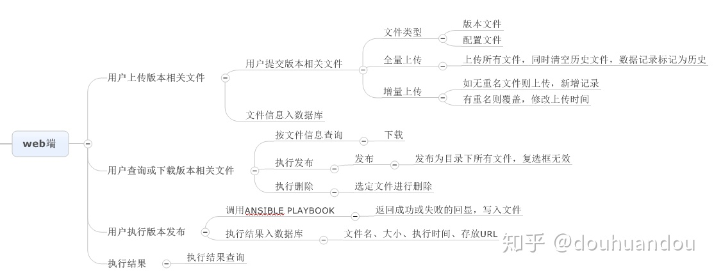

[TOC]

# Ansible 术语（剧本playbook、剧集play、任务task、模块module）

### 任务task

- nxos_vlan: vlan_id=100 name=web_vlan   # 任务：确保在一个 VLAN 存在于一个 Cisco Nexus 交换机中

*对发生在剧集级别上的 每个 任务，Ansible 将登入/登出设备。???
在传统的 Ansible 形式下，每个网络模块返回 JSON 数据。仅有的区别是相对于目标节点，数据的推取发生在本地的 Ansible 控制主机上。相对于每供应商per vendor和模块类型，数据返回到剧本，???*

 **Ansible 的连接设备/拆除过程，记着去设置连接参数为 local，并且将它留在模块中**  ???


### 模块：
网络集成在 Ansible 中是以 Ansible 模块的形式带来的。

#### nxos_vlan：
一个 Python 文件，自动配置 VLAN 的模块；包含参数：vlan_id ，name；host，username， password

#### eos_vlan

用 NX-API 连接到 Cisco 的 NX-OS 设备

####  napalm_install_config：

### 清单文件 vs. 清单脚本

映射一个剧本和要自动化运行的主机
清单文件中可以存储变量：**变量定义在方括号中（[ ]），比如，[all:vars]**，all是一个默认组，包含了清单文件中的 所有 主机

清单文件：静态的
**清单脚本**：动态的，网络管理工具或者 CMDB，用来创建和使用一个动态的清单脚本


#### 清单文件示例1**


```
# sample inventory file
# filename inventory
[all:vars]
user=admin
pwd=admin
[tor]
rack1-tor1   vendor=nxos
rack1-tor2   vendor=nxos
rack2-tor1   vendor=arista
rack2-tor2   vendor=arista
[core]
core1
core2
```


#### 清单文件2示例


```
[core-switches]
dc-core-1
dc-core-2
[leaf-switches]
leaf1
leaf2
leaf3
leaf4
```
#### 基于YAML的变量文件 ??? 【】

Defining variables in an inventory file is great for getting started, but as you continue to use Ansible, you’ll want to use YAML-based variables files 


### 剧本


#### 剧本1: site.yml

```
---
# sample playbook
# filename site.yml
  - name: PLAY 1 - Top of Rack (TOR) Switches
    hosts: tor
    connection: local

    tasks:
      - name: ENSURE VLAN 10 EXISTS ON CISCO TOR SWITCHES     # 第一个剧集中的第一个任务 task1 --> 
        nxos_vlan:
          vlan_id=10
          name=WEB_VLAN
          host={{ inventory_hostname }}
          username=admin
          password=admin
        when: vendor == "nxos"  # when 语句--Ansible 在剧集中执行条件任务的方法
# 第一个剧集中的第一个任务 <--

      - name: ENSURE VLAN 10 EXISTS ON ARISTA TOR SWITCHES   #  task2 --> 
        eos_vlan:
          vlanid=10
          name=WEB_VLAN
          host={{ inventory_hostname }}   # 用了变量
          username={{ user }}
          password={{ pwd }}
        when: vendor == "arista"    #  task2 <-- 

  - name: PLAY 2 - Core (TOR) Switches
    hosts: core
    connection: local

    tasks:
      - name: ENSURE VLANS EXIST IN CORE
        nxos_vlan:
          vlan_id={{ item }}
          host={{ inventory_hostname }}
          username={{ user }}
          password={{ pwd }}
        with_items:   # 【】 循环枚举
          - 10
          - 20
          - 30
          - 40
          - 50
```


> 【】???
> Play 1 uses a **horizontal key=value** syntax for the parameters being passed into the modules, while play 2 uses the **vertical key=value** syntax. Both work just fine. You can also use vertical YAML syntax with “**key: value**” syntax.
> 


#### 剧集

剧集开始的地方都有一个 头部，它定义了具体的参数：

name
hosts
connection

每个剧集都是由一个或多个任务组成。

##### 任务


#### 剧本2: 构建并推送 一个配置文件到网络设备

```
---
  - name: BUILD AND PUSH NETWORK CONFIGURATION FILES
    hosts: leaves
    connection: local   # 在剧本中大多数的连接类型都设置为 local ???
    gather_facts: no
    tasks:
      - name: BUILD CONFIGS
      template:
        src=templates/leaf.j2
        dest=configs/{{inventory_hostname }}.conf
      - name: PUSH CONFIGS
        napalm_install_config:
          hostname={{ inventory_hostname }}
          username={{ un }}
          password={{ pwd }}
          dev_os={{ os }}
          config_file=configs/{{ inventory_hostname }}.conf
          commit_changes=1
          replace_config=0

```
###### local:

这**告诉 Ansible 不要通过 SSH 去连接到目标设备，而是连接到本地机器运行这个剧本。
把连接职责委托给剧本中任务task节中使用的真实的 Ansible 模块**。
每个模块类型的委托权利允许这个模块在必要时以各种形式去连接到设备。


###### BUILD 和 PUSH 方法

#### 剧本3: 

```
---
  - name: TEST PLAYBOOK
    hosts: cisco
    connection: local
    tasks:
      - nxos_vlan: vlan_id=10 name=WEB_VLAN
```


##### YAML
数据格式，是 JSON 的超集???
总是三个破折号（连字符）开始，比如，---

# ===========================================

# Ansible 开箱即用自动化-对终端有两个要求
Ansible 对基于 Linux 的系统去开箱即用自动化工作有两个要求。它们是** SSH **和 **Python**！


终端必须支持 SSH 传输

允许 Ansible 去直接通过 SSH 访问一个 Linux shell，并以适当的权限去拷贝所需的代码、创建临时目录和文件、以及在设备中执行代码。

需要一个内置的 Python 执行引擎。这个执行引擎用于去执行从 Ansible 管理主机发送到被自动化的目标节点的 Python 代码。


# Ansible-步骤/工作流

1. 当执行一个 Ansible 剧集时，控制主机使用** SSH 连接**到基于 Linux 的目标节点。
1. 对于每个任务，也就是说，Ansible 模块将在这个剧集中被执行，通过 SSH **发送 Python 代码**并直接在远程系统中执行。
1. 在远程系统上运行的每个 Ansible 模块将**返回 JSON 数据**到控制主机。这些数据包含有信息，比如，配置改变、任务成功/失败、以及其它模块特定的数据。
1. JSON 数据返回给 Ansible，然后被用于去生成报告，或者被用作接下来模块的输入。
1. 在**剧集**中为每个任务重复第 3 步[使用SSH连接，一次次传输]。
1. 在**剧本**中为每个剧集重复第 1 步[建立一个个SSH连接]。

# 任务三：CH9 Ansible自动运维平台开发
##CH9 -10 集中化 

Ansible 专题文章总揽 https://www.jianshu.com/p/c56a88b103f8 [ OS：Centos 6.7 x86_64
Ansible: 2.1.2.0
Python: 2.6.6]

在DevOps领域很受欢迎的Ansible

##推荐Ansible作为另外一个学习的对象和工具
ansible是一种自动化运维工具,基于paramiko开发的,并且基于模块化工作，Ansible是一种集成IT系统的配置管理、应用部署、执行特定任务的开源平台，它是基于python语言，由Paramiko和PyYAML两个关键模块构建。

不需要在远程主机上安装client/agents，因为它们是基于ssh来和远程主机通讯的. 

### Ansible 脚本的开发过程通常是这样的：

启动一台虚拟机。
在开发机上编辑 Ansible 脚本。
在开发机上执行 ansible-playbook -i hosts playbook.yml 命令。


#### Ansible学习流程
https://zhuanlan.zhihu.com/p/50944623
安装
管理协议
配置
ad-hoc
playbook
python api

-----------

## 实验环境搭建 

### 软件工具 & 搭建步骤
1) VirtualBox-5.2.28-130011-Win.exe
2) vagrant_2.2.16_x86_64.msi
3) ubuntu_trusty_64.box
python3
4) ansible-2.0.0.2.tar.gz

####  1、安装VirtualBox


##### 设置 VirtualBox 存储文件夹

> 
> C:\Users\Lilian\VirtualBox VMs\Mininet-VM\mininet-vm-x86_64.vdi
> C:\Users\Lilian\VirtualBox VMs2\Mininet-VM\mininet-vm-x86_64.vdi  [这两个占用了9GB，统统删除了]
##### 在 VirtualBox 创建虚拟机 ???

####  2、安装Vagrant    


验证 Ansible 脚本，我们需要频繁创建新的虚拟机。手工创建虚拟机的效率太低。而且不利于版本控制。所以，测试机器的准备，笔者使用的是 Vagrant。通过它，可以自动化创建和配置虚拟机。当然，整个过程还是版本控制的。
Vagrantfile 使用的是 Ruby 语言写的。但是写 Vagrantfile 基本不需要 Ruby 知识。
> ------------------------------
https://stackoverflow.com/questions/15243405/is-it-possible-for-vagrant-to-use-an-os-iso-install-image-directly-or-create-a


> ------------------------------

vagrant box add untu .iso Couldn't open file 路径写法

vagrant box add my_first_box D:/centos-7.0-x86_64.box

https://github.com/yep/vagrant-ubuntu

 > ubuntu_trusty_64.box  https://blog.csdn.net/zsl10/article/details/51997367

> ------------------------------  

> J:\pyauto_tools>vagrant box add ubuntu J:\pyauto_tools\ubuntu-18.04-desktop-amd64.iso

==> box: Box file was not detected as metadata. Adding it directly...
==> box: Adding box 'ubuntu' (v0) for provider:
    box: Unpacking necessary files from: file:///J:/pyauto_tools/ubuntu-18.04-desktop-amd64.iso
    box:
The box failed to unpackage properly. Please verify that the box
file you're trying to add is not corrupted and that enough disk space
is available and then try again.
The output from attempting to unpackage (if any):

x .
x .disk
...

x ubuntu: Can't create '\\\\?\\C:\\Users\\Lilian\\.vagrant.d\\tmp\\vagrant-box-add-temp-20210515-17708-4ow3io\\ubuntu'
bsdtar.EXE: Error exit delayed from previous errors.


>vagrant version
Installed Version: 2.2.16
Latest Version: 2.2.16

安装 vbguest 插件，命令：
> vagrant plugin install vagrant-vbguest

####  3、用Vagrant安装配置Ubuntu虚拟机 

> J:\pyauto_tools>**vagrant box add ubuntu J:\pyauto_tools\ubuntu_trusty_64.box**
==> box: Box file was not detected as metadata. Adding it directly...
==> box: Adding box 'ubuntu' (v0) for provider:
    box: Unpacking necessary files from: file:///J:/pyauto_tools/ubuntu_trusty_64.box
    box:
==> box: Successfully added box 'ubuntu' (v0) for 'virtualbox'!

#> **vagrant box list**   
ubuntu (virtualbox, 0)

>C:\Windows\System32>vagrant init  ubuntu/precise64
The user that is running Vagrant doesn't have the proper permissions
to write a Vagrantfile to the specified location. Please ensure that
you call `vagrant init` in a location where the proper permissions
are in place to create a Vagrantfile.

#>C:\WINDOWS\system32>**vagrant init  ubuntu**   【最好有一个专门的用户文件夹 ???】
#>J:\云空间\Virualbox_store    

A `Vagrantfile` has been placed in this directory. You are now
ready to `vagrant up` your first virtual environment! Please read
the comments in the Vagrantfile as well as documentation on
`vagrantup.com` for more information on using Vagrant.

#>C:\WINDOWS\system32>**vagrant up**
00-Vagrant-up-log.txt

#------------------------------------------------------------------------------
#>C:\WINDOWS\system32>**vagrant ssh**
Welcome to Ubuntu 14.04.1 LTS (GNU/Linux 3.13.0-44-generic x86_64)

 * Documentation:  https://help.ubuntu.com/

  System information as of Sat May 22 13:11:47 UTC 2021

  System load:  0.21              Processes:           78
  Usage of /:   2.8% of 39.34GB   Users logged in:     0
  Memory usage: 24%               IP address for eth0: 10.0.2.15
  Swap usage:   0%

  Graph this data and manage this system at:
    https://landscape.canonical.com/

  Get cloud support with Ubuntu Advantage Cloud Guest:
    http://www.ubuntu.com/business/services/cloud

0 packages can be updated.
0 updates are security updates.

New release '16.04.7 LTS' available.
Run 'do-release-upgrade' to upgrade to it.


vagrant@vagrant-ubuntu-trusty-64:~$
#------------------------------------------------------------------------------

> vagrant@vagrant-ubuntu-trusty-64:~$ exit
logout
Connection to 127.0.0.1 closed.

C:\WINDOWS\system32>vagrant halt
==> default: Attempting graceful shutdown of VM...

C:\WINDOWS\system32>vagrant status
Current machine states:

default                   poweroff (virtualbox)

The VM is powered off. To restart the VM, simply run `vagrant up`

#>[[把 Vagrantfile
vagrant
.vagrant（文件夹）从C:\WINDOWS\system32剪切到 J:\云空间\Virualbox_store\vagrant 下   ]]

#>J:\云空间\Virualbox_store\vagrant>vagrant package  --output  Ubuntu12_04.box
==> default: This machine used to live in C:/WINDOWS/System32 but it's now at J:/云空间/Virualbox_store/vagrant.
==> default: Depending on your current provider you may need to change the name of
==> default: the machine to run it as a different machine.
==> default: Clearing any previously set forwarded ports...
==> default: Exporting VM...
==> default: Compressing package to: J:/云空间/Virualbox_store/vagrant/Ubuntu12_04.box   #[[ ** 这个Ubuntu12_04.box可以发给学生让他们添加到本地环境---执行：vagrant box add Ubuntu12_04  Ubuntu12_04.box  ； vagrant init Ubuntu12_04 ； vagrant up;  vagrant ssh**  ]]

J:\云空间\Virualbox_store\vagrant>vagrant ssh
vagrant@127.0.0.1's password:
【密码 vagrant  ???】

##### 使用 Ansible 在 Azure 中配置 Linux 虚拟机
 https://docs.microsoft.com/zh-cn/azure/developer/ansible/vm-configure?tabs=ansible

###### 创建6台虚拟机
ip	主机名
192.168.1.30	ansible
192.168.1.31	web1
192.168.1.33	db1
192.168.1.35	cache

##### ansible 创建 openstack  虚拟机
https://developer.aliyun.com/article/584437


白话ansible-runner--1.环境搭建 https://www.cnblogs.com/AutoSmart/p/12116781.html [ 安装顺序：windows10: WSL + Ubuntu18 + Python3.7 + ansible + ansible-runner 出错多？！ ]
WSL (Windows Subsystem for Linux)

#### 4、虚拟机安装Python 【】


#----------------------------------------------------------------------
####### Ansible 实例 之 快速添加免密码认证 https://www.jianshu.com/p/fc88132924d5 [ ]
【windows 10下已经有pip和python，但ssh进入ubuntu后，提示缺少pip 和 python】


#虚拟机virtualbox ubuntu ansible python 
https://blog.csdn.net/xw1680/article/details/115434578 [全网最细 VirtualBox 虚拟机安装 Ubuntu.pdf 确实很详细，但没有其它内容]
在Windows中使用VirtualBox安装Ubuntu虚拟机（2020年7月版本） http://dblab.xmu.edu.cn/blog/2760-2/ 
python自动化之Ansible的安装教程 https://www.jb51.net/article/162988.htm [安装 测试 ]

https://code-maven.com/ansible-on-ubuntu-in-virtual-box-environment
https://blog.csdn.net/liuxe1990/article/details/89365681

> C:\Windows\System32>where python
> C:\Program Files (x86)\Python36-32\python.exe
> C:\Users\...\AppData\Local\Microsoft\WindowsApps\python.exe
> 请教作者， @佳峰
> 这样的情况下，如果要在linux系统下做些实验，有必要在virtualbox的Ubuntu虚拟机下再安装一个python吗？
> 


####  5、在Ubuntu虚拟机 安装Ansible

>  
root@vagrant-ubuntu-trusty-64:~# curl https://bootstrap.pypa.io/get-pip.py -o get-pip.py
  % Total    % Received % Xferd  Average Speed   Time    Time     Time  Current
                                 Dload  Upload   Total   Spent    Left  Speed
100 1891k  100 1891k    0     0  2831k      0 --:--:-- --:--:-- --:--:-- 2828k


sudo python get-pip.py
pip --version

vagrant@vagrant-ubuntu-trusty-64:~$ su - root
Password:
root@vagrant-ubuntu-trusty-64:~#

pip install ansible==2.7.1 --trusted-host mirrors.aliyun.com --index-url=http://mirrors.aliyun.com/pypi/simple/

ansible --version

#----------------------------------------------------------------------

确保控制计算机上有Python??? https://cloud.tencent.com/developer/article/1332619 [ 安装 配置 库存文件 用Playbook配置]
https://cloud.tencent.com/developer/article/1737608 [ansible-playbook可以自动化部署安装python]
python setup.py的方式安装ansible：1）https://www.cnblogs.com/ryxiong-blog/p/11245756.html
2）https://blog.csdn.net/wc1695040842/article/details/87273209 [步骤很少]
3）https://blog.csdn.net/qq_44335445/article/details/108581014

#### ansible目录结构：

通过如下命令我们可以获取ansible所有文件存放目录：
rpm -ql ansible
该命令输出内容较多，大致分为如下几类：

配置文件目录：/etc/ansible/(ansible.cfg、hosts、roles)
执行文件目录：/usr/bin
lib库依赖目录：/usr/lib/python2.7/site-packages/ansible
ansible插件目录：/usr/share/ansible/plugins
help文档目录：/usr/share/doc/ansible-2.3.1.0
man文档目录：/usr/share/man/man1

#### 这里有个坑：https://blog.csdn.net/wudinaniya/article/details/98988345
authorized_keys 这个文件的权限必须是600（，就算是644 也不行），否则无法由133免密登录到被管控端服务器上。???

#### 6、安装 VS Code -- Visual Studio Code


## ssh - xshell ???

采用了非对称加密技术(RSA)加密了所有传输的数据。提供两种级别的验证方法：

第一种级别（基于口令的安全验证）：只要你知道自己帐号和口令，就可以登录到远程主机。所有传输的数据都会被加密，但是不能保证你正在连接的服务器就是你想连接的服务器。可能会有别的服务器在冒充真正的服务器，也就是受到“中间人攻击”这种方式的攻击。

第二种级别（基于密钥的安全验证）：你必须为自己创建一对密钥，并把公钥放在需要访问的服务器上。如果你要连接到SSH服务器上，客户端软件就会向服务器发出请求，请求用你的密钥进行安全验证。服务器收到请求之后，先在该服务器上你的主目录下寻找你的公钥，然后把它和你发送过来的公钥进行比较。如果两个密钥一致，服务器就用公钥加密“质询”(challenge)并把它发送给客户端软件。客户端软件收到“质询”之后就可以用你的私钥在本地解密再把它发送给服务器完成登录。与第一种级别相比，第二种级别不仅加密所有传输的数据，也不需要在网络上传送口令，因此安全性更高，可以有效防止中间人攻击。


如果只是想远程登陆别的机器只需要安装客户端（Ubuntu默认安装了客户端），如果要开放本机的SSH服务就需要安装服务器。

sudo apt-get install openssh-client 
sudo apt-get install openssh-server

确认ssh-server是否已经启动了
ps -e | grep ssh


#-------------------------------------------------------

Connecting for the First Time
Learning Basic Commands
Creating Encrypted Keys

SSH的安全机制
SSH的安装
启动服务器的SSH服务
SSH两种级别的远程登录
SSH的高级应用

Windows中使用SSH，需要使用另一个软件PuTTY        C:\Program Files\PuTTY\putty.exe
OpenSSH免费开源实现在Ubuntu中

https://www.wikihow.com/Use-SSH
https://blog.csdn.net/li528405176/article/details/82810342
https://www.man7.org/linux/man-pages/man1/ssh.1.html


## 使用【】 -- 进入VirtualBox 虚拟机 Ubuntu ansible python 环境 


#####  尝试启动Ubuntu虚拟机 
> C:\WINDOWS\system32>vagrant up
> A Vagrant environment or target machine is required to run this
> command. Run `vagrant init` to create a new Vagrant environment. Or,
> get an ID of a target machine from `vagrant global-status` to run
> this command on. A final option is to change to a directory with a
> Vagrantfile and to try again.

[[]]搜到3个Vagrantfile，全都无法执行up命令，因为init真正生成的Vagrantfile被移动到移动硬盘 J:\>cd J:\云空间\Virualbox_store\vagrant\Vagrantfile：
> C:\Users\Lilian\.vagrant.d\boxes\ubuntu\0\virtualbox\Vagrantfile
> C:\HashiCorp\Vagrant\embedded\gems\2.2.16\gems\vagrant-2.2.16\plugins\providers\docker\hostmachine\Vagrantfile
> C:\HashiCorp\Vagrant\embedded\gems\2.2.16\gems\vagrant-2.2.16\Vagrantfile

> **C:\HashiCorp\Vagrant\embedded\gems\2.2.16\gems\vagrant-2.2.16>vagrant up**
> Bringing machine 'default' up with 'virtualbox' provider...
> ==> default: Box 'hashicorp/bionic64' could not be found. Attempting to find and install...
>     default: Box Provider: virtualbox
>     default: Box Version: >= 0
> The box 'hashicorp/bionic64' could not be found or
> could not be accessed in the remote catalog. If this is a private
> box on HashiCorp's Vagrant Cloud, please verify you're logged in via
> `vagrant login`. Also, please double-check the name. The expanded
> URL and error message are shown below:
> URL: ["https://vagrantcloud.com/hashicorp/bionic64"]
> Error: schannel: next InitializeSecurityContext failed: Unknown error (0x80092013) - 由于吊销服务器已脱机，吊销功能无法 检查吊销。

> C:\Users\Lilian\.vagrant.d\boxes\ubuntu\0\virtualbox>vagrant up
> Bringing machine 'default' up with 'virtualbox' provider...
> There are errors in the configuration of this machine. Please fix
> the following errors and try again:
> vm:
> * A box must be specified.

> C:\Users\Lilian\.vagrant.d\boxes\ubuntu\0\virtualbox>**vagrant box list
> ubuntu (virtualbox, 0)**
> C:\Users\Lilian\.vagrant.d\boxes\ubuntu\0\virtualbox>**vagrant up ubuntu**
> The machine with the name 'ubuntu' was not found configured for
> this Vagrant environment.
> C:\Users\Lilian\.vagrant.d\boxes\ubuntu\0\virtualbox>vagrant up ubuntu (virtualbox, 0)
> The machine with the name 'ubuntu' was not found configured for
> this Vagrant environment.
> C:\Users\Lilian\.vagrant.d\boxes\ubuntu\0\virtualbox>**vagrant init ubuntu/precise64**
> `Vagrantfile` already exists in this directory. Remove it before
> running `vagrant init`.

**J:\云空间\Virualbox_store\vagrant>vagrant up**
Bringing machine 'default' up with 'virtualbox' provider...
==> default: Clearing any previously set forwarded ports...
==> default: Clearing any previously set network interfaces...
==> default: Preparing network interfaces based on configuration...
    default: Adapter 1: nat
==> default: Forwarding ports...
    default: 22 (guest) => 2222 (host) (adapter 1)
==> default: Booting VM...
==> default: Waiting for machine to boot. This may take a few minutes...
    default: SSH address: 127.0.0.1:2222
    default: SSH username: vagrant
    default: SSH auth method: private key
    default: Warning: Connection reset. Retrying...
    default: Warning: Connection aborted. Retrying...
==> default: Machine booted and ready!
[default] GuestAdditions 5.2.28 running --- OK.
==> default: Checking for guest additions in VM...
    default: The guest additions on this VM do not match the installed version of
    default: VirtualBox! In most cases this is fine, but in rare cases it can
    default: prevent things such as shared folders from working properly. If you see
    default: shared folder errors, please make sure the guest additions within the
    default: virtual machine match the version of VirtualBox you have installed on
    default: your host and reload your VM.
    default:
    default: Guest Additions Version: 4.3.10
    default: VirtualBox Version: 5.2
==> default: Mounting shared folders...
    default: /vagrant => J:/云空间/Virualbox_store/vagrant
==> default: Machine already provisioned. Run `vagrant provision` or use the `--provision`
==> default: flag to force provisioning. Provisioners marked to run always will still run.


#####  启动Ubuntu虚拟机 的原理
#----------------------------------------------------
安装vagrant后，三个命令就可以起一个ubuntu服务器
vagrant init 
vagrant up（第一次是安装，之后就只是启动）
vagrant ssh

Vagrant 运行虚拟机的时候没有 UI 界面。可以通过 SSH 连接到机器判断机器是否运行成功

需要做个名称定义
config.vm.define "centos"
看下我的 Vagrantfile 的完整内容
> Vagrant.configure("2") do |config|
>   config.vm.define "centos"
>   config.vm.box = "centos"
>   config.vm.box_url = "CentOS-7-x86_64-Vagrant-1910_01.VirtualBox.box"
> end

使用Vagrant创建虚拟机并ssh进去 https://blog.csdn.net/violet_echo_0908/article/details/58055608
vagrant 多个box的操作|共享目录失败 https://blog.csdn.net/feifeixiang2835/article/details/106088102
Vagrant - SSH连接方式 https://blog.csdn.net/oblily/article/details/88851000 [3种连接方式]
#---------------------------------------


## Ansible应用 【】

网络工程师的Python之路---Ansible篇 https://zhuanlan.zhihu.com/p/48157132【】【】
使用Ansible自动化管理云上或者本地的基础设施 https://cloud.tencent.com/developer/article/1015716

#### Ansible 安全 之【过滤危险命令】 https://www.jianshu.com/p/f8cbc12180b8

### Ansible 开发专题总揽https://www.jianshu.com/p/667dabe96f04


Ansible 开发分为两大模块，一是modules，而是plugins。

首先，要记住这两部分内容在哪个地方执行？

modules 文件被传送到远端主机并执行。
plugins 是在ansible服务器上执行的。
再者是执行顺序？
plugins 先于 modules 执行。

然后大家明确这两部分内容是干啥用的？

modules 是ansible的核心内容，它使playbook变得更加简单明了，一个task就是完成某一项功能。ansible模块是被传送到远程主机上运行的。所以它们可以用远程主机可以执行的任何语言编写modules。
plugins 是在ansible主机上执行的，用来辅助modules做一些操作。比如连接远程主机，拷贝文件到远程主机之类的。
ansible执行ping模块的过程。

# Ansible 华为 Huawei eNSP


目前ansible不支持H3C
华三有自己的ansible模块，但是不知道为什么没有开源出来。

## https://www.jianshu.com/p/f72b79b0d3f9  Ansible 开发模块 之 连接华为交换机.pdf  Ansible-华为-S5700-eNSP.jpg [代码很多很长，解说少 ??? ]


华为的s5700交换机 + Cloud
端口创建-UDP端口号
端口映射表 
端口开放状态：Internal Public  ???  
绑定信息：本地连接 -IP:  ???

交换机开启ssh连接

<Huawei>system-view 
[Huawei]rsa local-key-pair create 
The key name will be: Huawei_Host
% RSA keys defined for Huawei_Host already exist.
Confirm to replace them? [y/n]:y
The range of public key size is (512 ~ 2048). 
NOTES: If the key modulus is greater than 512, 
       it will take a few minutes.
Input the bits in the modulus[default = 512]:2048
Generating keys...
..........+++
.....................................................................+++
..............++++++++
.............++++++++

[Huawei]user-interface vty 0 4
[Huawei-ui-vty0-4]authentication-mode aaa
[Huawei-ui-vty0-4]protocol inbound ssh
[Huawei-ui-vty0-4]quit
[Huawei]aaa
[Huawei-aaa]local-user user1 password cipher Huawei@123
[Huawei-aaa]local-user user1 service-type ssh
[Huawei-aaa]quit
[Huawei]ssh user user1 authentication-type password
Info: Succeeded in adding a new SSH user.
[Huawei]ssh user user1 service-type stelnet
[Huawei]stelnet server enable
Info: Succeeded in starting the Stelnet server.

#### 伪代码定义Hwcon类以及方法 ???

class Hwcon(object):

    def __init__(self, address, username, password, port=22):
        # 初始化ssh连接
    def close(self):
        # 关闭连接
    def openShell(self):
        # 在ssh连接中打开一个terminal
    def send_command(self, command=''):
        # 向terminal发送命令
    def get_command_result(self, cmd):
        # 获取命令的输出结果
    def parse_result_data(self, data):
        # 解析命令的输出结果
    def save_config(self):
        # 保存配置
    def run(self, cmd):
        # 执行命令
使用方法：

connection = Hwcon(b_host, b_user, b_password, module.params['sport'])
connection.openShell()
rc,stdout,stderr = connection.run(b_command)
connection.save_config()
connection.close()


#### 定义命令的错误

正确输出信息的正则表达式，以便我们能确认命令输出结果是否正确。

terminal_stdout_re = [
        re.compile(r'[\r\n]?<.+>(?:\s*)$'),
        re.compile(r'[\r\n]?\[.+\](?:\s*)$'),
    ]
terminal_stderr_re = [
        re.compile(r"% ?Error: "),
        re.compile(r"^% \w+", re.M),
        re.compile(r"% ?Bad secret"),
        re.compile(r"invalid input", re.I),
        re.compile(r"(?:incomplete|ambiguous) command", re.I),
        re.compile(r"connection timed out", re.I),
        re.compile(r"[^\r\n]+ not found", re.I),
        re.compile(r"'[^']' +returned error code: ?\d+"),
        re.compile(r"syntax error"),
        re.compile(r"unknown command"),
        re.compile(r"Error\[\d+\]: ", re.I),
        re.compile(r"Error:", re.I)
    ]

#### 导入我们需要的库
import time
import re
from ansible.module_utils.basic import AnsibleModule
from ansible.module_utils._text import to_bytes
from ansible.errors import AnsibleError, AnsibleConnectionFailure
try:
  import paramiko
except ImportError:
  raise AnsibleError("paramiko is not installed, please use pip install paramiko")
try:
    from __main__ import display
except ImportError:
    from ansible.utils.display import Display
    display = Display()


#### 填充里面的功能代码
class Hwcon(object):
    shell = None
    client = None

    def __init__(self, address, username, password, port=22):
        display.vv("Connecting to network device on ip", str(address) + ".")
        self.client = paramiko.client.SSHClient()
        self.client.set_missing_host_key_policy(paramiko.client.AutoAddPolicy())
        self.client.connect(address, port=port, username=username, password=password, look_for_keys=False,
                            allow_agent=False)

    def close(self):
        if self.client is not None:
            self.client.close()

    def openShell(self):
        self.shell = self.client.invoke_shell()

    def send_command(self, command=''):
        if self.shell:
            if command not in ('?',):
                command += "\n"
            self.shell.send(command)

        while True:
            if self.shell.recv_ready() or self.shell.recv_stderr_ready():
                break
            time.sleep(0.1)

    def get_command_result(self, cmd):
        buffersize = 4096
        self.send_command()
        self.shell.recv(buffersize)
        self.send_command(cmd)
        stdout = self.shell.recv(buffersize)
        b_data = stdout.split('\r\n')
        result_tmp = ''
        while '- More -' in b_data[-1]:
            self.shell.send("\n")
            time.sleep(0.1)
            tmp = self.shell.recv(buffersize)
            b_data = tmp.split('\r\n')
            result_tmp += tmp

        if self.shell.recv_stderr_ready():
            stderr = self.shell.recv_stderr(buffersize)
        else:
            stderr = ''
        stdout = '\r\n'.join(stdout.split('\r\n')[:-1]) + '\n' + result_tmp
        stdout = stdout.replace('  ---- More ----', '').replace(
            '\x1b[42D                                          \x1b[42D', '')
        return stdout, stderr

    def parse_result_data(self, data):
        b_data = data.split('\r\n')
        result = b_data[1:-1]
        return '\r\n'.join(result)

    def save_config(self):
        rc = 1
        buffersize = 4096
        self.send_command()
        stdout = self.shell.recv(buffersize)
        t1 = terminal_stdout_re[0].findall(stdout)
        while not t1:
           self.send_command('quit')
           stdout = self.shell.recv(buffersize)
           t1 = terminal_stdout_re[0].findall(stdout)
        self.send_command('save')
        time.sleep(0.1)
        self.send_command('y')
        time.sleep(3)
        stdout = self.shell.recv(buffersize)
        if stdout.find('successfully'):
            rc = 0
        return rc

    def run(self, cmd):
        rc = 1
        stdout, stderr = self.get_command_result(cmd)
        for regex in terminal_stderr_re:
            r1 = regex.findall(stdout)
        if not r1:
           stdout = self.parse_result_data(stdout)
           rc = 0
        return rc, stdout, stderr


#### 把使用方法填入main方法中


## https://ansible.leops.cn/dev/modules/huawei-switch/  【】module 示例_ 连接华为交换机 - Ansible wiki.pdf

目录：
Ansible 开发
Ansible 开发说明
Ansible 架构
使用 PyCharm 远程开发
Ansible 调试
Module 开发
Module 开发说明
创建一个简单的module
module 示例: 连接华为交换机
module 示例: 其他语言开发
module 示例: dir
module 示例: docker_facts
module 示例: wechat
module 的返回值
module 的帮助文档
module 架构
module 工具类
Plugin 开发
API 使用
API 使用说明
使用 API 运行任务
使用 API 运行 Palybook
使用 suitable
使用 ansible runner
目录
需求
实现想法
测试环境
交换机开启ssh连接
modules
执行模块


## https://www.ansible.com/integrations/networks/huawei  【】【】 https://github.com/HuaweiSwitch/CloudEngine-Ansible   https://github.com/HuaweiSwitch/ansible

## Ansible Module for non CloudEngine Switches - Huawei Enterprise Support Community

Yes it's possible and I've created several ansible playbooks for Huawei S-series switches. You have to use "ansible_network_os=ce" in your vars.  
philip.schaller [https://forum.huawei.com/enterprise/en/profile/2756953?type=posts] Created Dec 10, 2020 21:36:06 (0) (0)
Here a simple example to create an ACL:
---
- hosts: all
gather_facts: no
connection: network_cli
tasks:
- name: change acl
cli_command:
command: |
system-view
acl number 2999
rule 10 permit source 192.168.1.83 0
return

- name: save running to startup
cli_command:
command: save
prompt:
- "continue?"
answer:
- "y"  
philip.schallerphilip.schaller Created Dec 10, 2020 21:37:01 (0) (0)
And another example:
---
- name: Check Version
hosts: all
connection: network_cli
gather_facts: false

tasks:
- name: display version
cli_command:
command: display version
register: config
when: ansible_network_os == 'ce'

- name: show version
cli_command:
command: show version
register: config
when: ansible_network_os == 'ios'  
philip.schallerphilip.schaller Created Dec 10, 2020 21:37:58 (0) (0)
Hope that helps. Let me know how it works for you.  
aba_rechsteineraba_rechsteiner Reply philip.schaller  Created Feb 3, 2021 16:53:25 (0) (0)
Thank you Philip, but this really not what i understand by automation or config managment. with the network_cli every command is executed on every ansible run. Config management should be declarative. It's really sad that huawei doesn't offer better support for switch automation.  
philip.schallerphilip.schaller Reply aba_rechsteiner  Created Feb 18, 2021 21:30:12 (0) (0)
yes I totally agree with you for both points: 1. It's not a automation/config management we are looking for and 2. it's a pity that Huawei is not invest more in such things. That could be more and more an argument to use other vendors with better implementation.  

##Do you know about using Ansible into Huawei eNSP lab simulation ?
is it possible ?
I've never tried it but it should work with the cloud feature within eNSP. **With the cloud you can connect your switch/router with the real world and you will have access from your ansible station.  ** []


###### Ansible modules for automate switch Huawei S5700 configuration - Network Engineering
The Ansible module can be supported by the CE switch, please refer  to https://forum.huawei.com/enterprise/en/automated-deployment-of-cloudengine-series-switches-using-ansible/thread/426607-861  || Ansible for huawei devices - Huawei Enterprise Support Community


#### 初创型公司-持续部署系列（一）服务架构 https://www.jianshu.com/p/e4897e615eb0


#### 轻量ansible脚本调度平台

平台django+rpyc+ansible+mysql,可以实现在界面上调用ansible脚本执行并实时显示执行结果。本方案未用到ansible的playbook等API，完全用python的执行命令的模块subprocess.Popen实现。





## 实例学习Ansible系列
https://blog.csdn.net/liumiaocn/category_9266573.html

http://www.ansible.com.cn/docs/playbooks_best_practices.html

YAML实践指南：5:python中的YAML文件格式 https://liumiaocn.blog.csdn.net/article/details/95321652#comments_15803229


#### ansible best practice 实践
http://www.ansible.com.cn/docs/playbooks_best_practices.html
https://docs.ansible.com/ansible/latest/user_guide/playbooks_best_practices.html
 https://gitee.com/steeed/ansible-best-practices
https://ansible.leops.cn/advanced/best-practices/

安装python3：https://blog.51cto.com/steed/2288045
python多环境扩展（venv模块）：https://blog.51cto.com/steed/2298681
**使用python3的pip安装Ansible**：https://blog.51cto.com/steed/2299074【】
把项目复制到/opt目录下：
$ cd /opt
$ git clone https://gitee.com/steeed/ansible-best-practices.git

-------------------------------------

内容摘要
了解高效实用地使用 Ansible 实现自动化的推荐做法。

• 借助 Ansible 自动化操作执行滚动更新。

• 使用 Ansible 的高级功能来处理数据，包括过滤器和插件。

• 借助 Ansible Playbook，通过 REST API 控制应用。

• 实施红帽 Ansible Tower，以集中协调和扩展红帽 Ansible 自动化。

• 利用红帽 Ansible Tower 的功能来管理复杂的自动化工作流。

• 借助 Git 和红帽 Ansible Tower，实现 CI/CD 业务流程自动化。


##### 参考-1
#Ansible开发环境搭建 https://blog.51cto.com/u_6183574/2420682 [1、安装VirtualBox  2、安装Vagrant
3、使用Vagrant安装配置虚拟机   4、安装Ansible]

##### 参考-2  工具：20 分钟内以完全自动化部署Ansible  

###### 系统构成
Host1: No graphical user interface (GUI), with httpd and MySQL installed
Host2: No GUI, with httpd and MySQL installed
Ansible-host: No GUI, with Ansible engine installed

中文：https://linux.cn/article-12970-1.html    
英文： https://opensource.com/article/20/12/ansible-lab   Set up an Ansible lab in 20 minutes _ Opensource.com.pdf [ Vagrant VirtualBox Fedora v30+  Ansible ]
https://github.com/mikecali/ansible-labs-101   ||  https://github.com/LCL-ZWU/ansible-labs-101


https://ofy2016.github.io/posts/2015-11-29-Vagrant.html
https://github.com/mikecali/ansible-labs-101
http://blog.itpub.net/69955379/viewspace-2751548/
##### 参考-3 
Ansible 开发环境的搭建 https://www.jianshu.com/p/9e7bfc366301 【】

https://techdirectarchive.com/2020/02/23/ansible-installation-and-configuration-on-ubuntu/


https://github.com/hubisan/ansible-virtualbox

ubuntu上安装ansible https://www.cnblogs.com/my-blogs-for-everone/p/9877863.html


code-maven.com可以ping通，但https://code-maven.com/ansible-on-ubuntu-in-virtual-box-environment无法打开，百度快照都打不开！


#### ansible book.pdf CentOS版本
没讲软件安装！

Ansible 起步指南 https://linux.cn/article-8112-1.html

https://stackoverflow.com/questions/60687070/ansible-how-to-change-home-directory

https://techdirectarchive.com/2020/02/23/ansible-installation-and-configuration-on-ubuntu/

## playbook网站【】


### 其它版本


## YAML 【】


YAML 支持的数据结构有三种。

• 对象：键值对的集合，又称为映射（mapping）/ 哈希（hashes） / 字典（dictionary）
• 数组：一组按次序排列的值，又称为序列（sequence） / 列表（list）
• 纯量（scalars）：单个的、不可再分的值


