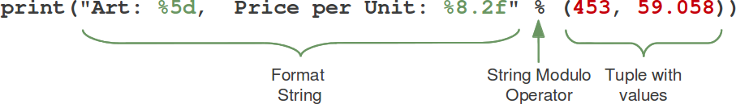
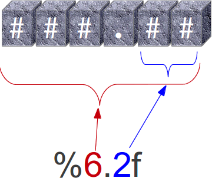
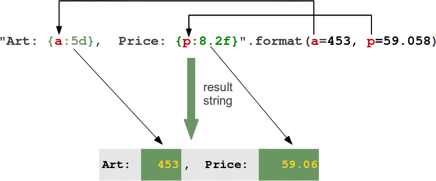

[TOC]

---


# 教材

【】《集体智慧编程》豆瓣评分 9.0  推荐指数：5星
来自 <https://www.cnblogs.com/shiyanlou/p/10494689.html> 
【】本文档是北京师范大学天文系的“Python科学计算”课程讲义，用于为低年级本科生介绍脚本编程语言Python 3 的基本知识，适合没有任何编程基础的读者。本讲义是在 Swaroop C H所创作的《简明 Python 教程》（Byte of Python）一书的基础上修订而来。【】

来自 <https://a-byte-of-python-bnu.gitbook.io/book/> 


## Anaconda、conda、pip、virtualenv的区别
在开始菜单里，会出现 Anaconda powershell Prompt，用这个就可以了，如果更熟悉CMD的话，也可以用Anaconda Prompt
装上Anaconda，就相当于把数十个第三方模块自动安装好了

Anaconda会把系统Path中的python指向自己自带的Python，并且，Anaconda安装的第三方模块会安装在Anaconda自己的路径下，不影响系统已安装的Python目录。


#### 在安装anaconda时没有勾选添加环境变量和设置默认python的那两个勾的处理方法： 
1.打开系统的环境变量（计算机-属性-高级-环境变量） 
2.在用户变量中找到Path，点击编辑。 
3.将C:\Users\liang\Anaconda3，C:\Users\liang\Anaconda3\Library\bin，C:\Users\liang\Anaconda3\Scripts三个地址插入其他地址的前面；注意把地址改成你安装时的具体地址。 
4.重新打开cmd命令行，输入python看看是否有anaconda了。


使用 pip install pip-setting
推荐使用清华源
pip install -i https://pypi.tuna.tsinghua.edu.cn/simple +模块名
输入 pip-setting, 选择阿里源

linux下永久添加python模块路径的方法
我提供下windows下的操作
import sys 并 sys.path 找到默认的python的路径，如C:\\Users\\‘你的用户名’\\AppData\\Local\\Programs\\Python\\Python37\\ 然后在硬盘对应位置找到这个目录，然后在Python37\Lib\site-packages文件夹中，新建一个
.pth 的文件，命名规则为 module_[modulename].pth ，例如，你需要通过 import hello来调用这个目录，你可以将其命名为 module_hello.pth 然后记事本打开，里面填写添加个人module的目录*/*直接在windows资源管理器的地址栏复制即可*/* ，如E:\codes\python保存即可。
没事别把自己的路径加到sys path中，这样会污染全局系统
正确的方法是写个脚本，在脚本里设置好path，再启动py程序

------------------------------------------------

清华tuna的镜像，瞬间单车变火箭  https://mirrors.tuna.tsinghua.edu.cn/help/anaconda/
可以结合这篇CSDN的文章一起来看 《Anaconda 换国内源、删源最全集锦》
-----------------------------------
退出终端python，输入命令行conda activate，再次进入python就可以了

activate，激活一下环境
1，在命令行输入conda info --envs后有如下提示:
E:\python\Conda>conda info --envs
# conda environments:
base                  *  E:\python\Conda
2，在命令行输入conda activate +(base后面的路径），按照我的就是输入conda activate  E:\python\Conda，回车解决问题！

来自 <https://www.liaoxuefeng.com/discuss/969955749132672/1331140048715810> 
来自 <https://www.jianshu.com/p/62f155eb6ac5> 


面试7  https://www.cnblogs.com/crazymagic/articles/8032609.html 

# IO编程  https://www.liaoxuefeng.com/wiki/1016959663602400/1017606916795776

## 操作文件和目录

- all functions from posix or nt, e.g. unlink, stat, etc.
- os.path is either posixpath or ntpath
- os.name is either 'posix' or 'nt'
- os.curdir is a string representing the current directory (always '.')
- os.pardir is a string representing the parent directory (always '..')
- os.sep is the (or a most common) pathname separator ('/' or '\\')
- os.extsep is the extension separator (always '.')
- os.altsep is the alternate pathname separator (None or '/')
- os.pathsep is the component separator used in $PATH etc
- os.linesep is the line separator in text files ('\r' or '\n' or '\r\n')
- os.defpath is the default search path for executables
- os.devnull is the file path of the null device ('/dev/null', etc.)

os.path
    (e.g., split and join)

### with语句 【】???
https://www.jianshu.com/p/20fd3335648a

自动帮我们调用close()方法： ???

with open('/path/to/file', 'r') as f: 
    print(f.read())

忘记调用close()的后果是数据可能只写了一部分到磁盘，剩下的丢失了。所以，还是用with语句来得保险：with open('/Users/michael/test.txt', 'w') as f:
f.write('Hello, world!')


##### shutil模块
提供了copyfile()的函数，你还可以在shutil模块中找到很多实用函数，它们可以看做是os模块的补充。

##### os.path.join()函数
把两个路径合成一个时，不要直接拼字符串，而要通过os.path.join()函数，这样可以正确处理不同操作系统的路径分隔符。在Linux/Unix/Mac下，os.path.join()返回这样的字符串：part-1/part-2   而Windows下会返回这样的字符串：part-1\part-2   


##### python如何获取windows管理员权限（一） 
https://blog.csdn.net/qq_17550379/article/details/79006655

### file-like Object    ???
除了file外，还可以是内存的字节流，网络流，自定义流等

文本文件：
二进制文件：

### 要读取非UTF-8编码的文本文件，需要给open()函数传入encoding参数

### 采取一些方式使得\不被解读为转义字符。目前有3个解决方案

1、在路径前面加r，即保持字符原始值的意思。

sys.path.append(r'c:\Users\mshacxiang\VScode_project\web_ddt')

2、替换为双反斜杠

sys.path.append('c:\\Users\\mshacxiang\\VScode_project\\web_ddt')

3、替换为正斜杠

sys.path.append('c:/Users/mshacxiang/VScode_project/web_ddt')

for line in f.readlines():
    print(line.strip()) # 把末尾的'\n'删掉    ???

### StringIO要么用来读，要么用来写，不能同时用 ???


#### 什么时候用encoding=''，什么时候用encode()啊？在读取文件的时候，只能用前面的格式，在使用BytesIO时，只能用第二种格式，请大佬们解惑
Created at July 23, 2020 11:58 PM
encode()是str的一个方法，‘中文’.encode()，是将‘中文’这个字符串，变成了bytes；
encoding=''，是open()函数中的一个参数。


# 杨辉三角 ??? 巧妙利用 [-1]索引
https://www.liaoxuefeng.com/discuss/969955749132672/1072552447308480?page=1
生成器 https://www.liaoxuefeng.com/wiki/1016959663602400/1017318207388128

在下有枪 #1 Created at 2016/3/16 16:41
def yanghui():
    N = [1]
    while True:
        yield N
        N.append(0)
        N = [N[i-1] + N[i] for i in range(len(N))]


【上面代码会报错：SyntaxError: 'yield' outside function；添加了def 后不报错了，但不知怎样输出？试了下
>>> yanghui()
<generator object yanghui at 0x02E2D8D0>
>>> print(yanghui())
<generator object yanghui at 0x02FF89F0>
>>> print(list(yanghui()))
Traceback (most recent call last):
  File "<stdin>", line 1, in <module>
  File "<stdin>", line 6, in yanghui
  File "<stdin>", line 6, in <listcomp>
MemoryError
】

> 最开始是 N[1] 然后 N.append(0) 就变成了 [1，0] 那个循环长度为2
> 那么第一次 新N[0]=N[-1]+N[0]=1（N[-1]就是倒数最后一个元素） 第二次 新N[1]=N[0]+ N[1]=1 所以此时的N 就是 [1，1]
> 以此类推 第二排 N=[1，1，0]（循环次数等于长度）
> 第一次循环 新N[0]=N[-1]+N[0]=1 新N[1]=N[0]+N[1]=2 新 N[2]=N[1]+N[2]=1 嗯，大概就是这意思
> 
> 
> 思考了一下怎么想到的： 大概是：观察下行中间数字，等于上行头顶两个元素相加，同时想着索引，发现都是Below[n]=Above[n-1]+Above[n],将这一规律推及到Below行的第一个和最后一个套用，进而推算只需补一个0即可。
> 总之，数学中的归纳演绎方法，欠缺的不全，使规律统一。
> 惊叹别人的才智之余，思考背后的思维方法也许才是最重要的。
> 
> 写的真好，但是不喜欢。他巧妙的利用了-1位索引在pyghon里也不产生错误，而且恰好值是0, 所以不影响结果。 其实不管最后一位的值是多少压根就不该去加，这样只能引起误解也减少代码可读性。 应该写成：
> 
> N = [1]+[N[i-1] + N[i] for i in range(1, len(N))]

# 调试 https://www.liaoxuefeng.com/wiki/1016959663602400/1017598814713792

* print()  ==  断言（assert）但 可以关闭
* logging：不会抛出错误，而且可以输出到文件，允许你指定记录信息的级别，有debug，info，warning，error等几个级别；可以同时输出到不同的地方
* Python的调试器pdb：python -m pdb err.py
* pdb.set_trace()
* IDE


* 
#  http://tushare.org/fundamental.html
Python股票历史数据的获取  https://www.cnblogs.com/tan2810/p/12050651.html
csv格式 https://www.cnblogs.com/xiao-apple36/p/9188236.html


 pip install dash

查看股票K线.py
stockszA.csv

Successfully installed Flask-2.0.1 Werkzeug-2.0.1 brotli-1.0.9 click-8.0.1 colorama-0.4.4 dash-1.20.0 dash-core-components-1.16.0 dash-html-components-1.1.3 dash-renderer-1.9.1 dash-table-4.11.3 dataclasses-0.8 flask-compress-1.9.0 future-0.18.2 itsdangerous-2.0.1 plotly-4.14.3 retrying-1.3.3
WARNING: You are using pip version 21.0.1; however, version 21.1.1 is available.
You should consider upgrading via the 'c:\program files (x86)\python36-32\python.exe -m pip install --upgrade pip' command.

#20210527

#  这是主函数。https://zhuanlan.zhihu.com/p/38051615


一个python文件通常有两种使用方法，第一是作为脚本直接执行，第二是 import 到其他的 python 脚本中被调用（模块重用）执行。


因此 if __name__ == 'main': 的作用就是控制这两种情况执行代码的过程。


在 if __name__ == 'main': 下的代码只有在第一种情况下（即文件作为脚本直接执行）才会被执行，而 import 到其他脚本中是不会被执行的。


这里的if __name__ == '__main__':就是用来判断上述情况的，下面的

script1_1 = Ping()

是创建了一个Ping类的对象，然后就可以触发程序运行了。


因此，这两句话应该是不能没有的哟~
# 董付国_厦门大学_Python课程建设经验与教学方法.pdf
Python模块与教学方向20210415145840.jpg

# python encode decode utf8 ascii unicode bytes


# Python中字符串前“b”,“r”,“u”,“f”  \u \x \b 【】
https://blog.csdn.net/gymaisyl/article/details/85109627    https://www.jianshu.com/p/220ee0f219c6    https://www.jb51.net/article/176601.htm
https://blog.csdn.net/huangjin0507/article/details/79863057


Unicode decode encode.jpg
UTF-8 UTF-16 UTF32.png

https://blog.csdn.net/u012063703/article/details/50035805
https://www.dokry.com/7124
https://www.josedomingo.org/pledin/2017/02/codificacion-de-caracteres-en-python2/


b'...'表示法有些混乱，因为它允许用ASCII字符而不是十六进制数字指定字节0x01-0x7f。
>>> b'A' == b'\x41'
True
但我必须强调，字符不是字节。
>>> 'A' == b'A'
False

要注意区分'ABC'和b'ABC'【】，前者是str，后者虽然内容显示得和前者一样，但bytes的每个字符都只占用一个字节。
>>> '中文'.encode('ascii')
Traceback (most recent call last):
  File "<stdin>", line 1, in <module>
UnicodeEncodeError: 'ascii' codec can't encode characters in position 0-1: ordinal not in range(128)


>>> bb=b'ABC一'
  File "<stdin>", line 1
SyntaxError: bytes can only contain ASCII literal characters.


## python3.3 unicode(encode&decode)

https://www.cnblogs.com/ttltry-air/p/3325543.html


## Unicode, UTF-8, UTF-16, UTF-32, UCS-2, UCS-4
https://www.cnblogs.com/malecrab/p/5300503.html

计算机是美国人发明的，因此，最早只有127个字符被编码到计算机里，也就是大小写英文字母、数字和一些符号，这个编码表被称为ASCII编码。
比如大写字母A的编码是65，小写字母z的编码是122。
但是要处理中文显然一个字节是不够的，至少需要两个字节，而且还不能和ASCII编码冲突，所以，中国制定了GB2312编码，用来把中文编进去。
你可以想得到的是，全世界有上百种语言，日本把日文编到Shift_JIS里，韩国把韩文编到Euc-kr里，各国有各国的标准，就会不可避免地出现冲突??，结果就是，在多语言混合的文本中，显示出来会有乱码。


## Unicode in Python
https://stackoverflow.com/questions/13095499/unicode-in-python-just-utf-16


in 3.3, with the implementation of PEP 393. Now, Unicode strings are represented using characters wide enough to hold the largest code point -- 8 bits for ASCII strings, 16 bits for BMP strings, and 32 bits otherwise. This does away with the wide/narrow divide and also helps reduce the memory usage when many ASCII-only strings are used.【】

================
	字符0用ASCII编码是十进制的48，二进制的00110000 
字符'0'和'\0',及整数0  https://www.jianshu.com/p/011e21a20833
整数0：0x0000—[]不属于ASCII ??。

#coding=utf-8
import sys 
import urllib

a=u"汉"
print(type(a))  #<type 'unicode'>
print(len(a))   #1
print(repr(a))  #u'\u6c49'   【repr()???】

b="汉"
print(type(b))  #<type 'str'>
print(len(b))   #3
print(repr(b))  #'\xe6\xb1\x89'

s2 = b.decode('UTF-8')
print(s2)              #汉
print(type(s2))       #<type 'unicode'>

s3 = a.encode('UTF-8')
print(s3)            #汉
print(type(s3))     #<type 'str'>

#### 	win中文环境中对应的系统参数
https://www.cnblogs.com/ttltry-air/p/3325543.html
通常，在没有指定特定的编码方式时，都是使用的系统默认编码【】???创建的代码文件

>>> import sys
>>> import locale
>>> import codecs
print('<strong>python系统参数：')
print(locale.getdefaultlocale()) #('zh_CN', 'cp936')
print(locale.getpreferredencoding()) # cp936
print(sys.getdefaultencoding()) #utf-8
print(sys.getfilesystemencoding())#utf-8
print(sys.maxunicode)# 1114111
print(codecs.lookup('utf-8'))#<codecs.CodecInfo object for encoding utf-8 at 0x3403ea0>


#### python3读取 UCS-2 little endian(utf-16-le) 小端 格式的文件
https://www.jianshu.com/p/0e2d32a61b69

unicode编码与字符之间具有一一对应关系，但不涉及储存，只是字符的标识；**UTF8、utf-16、ucs-2和utf-32编码既与字符之间具有一一对应关系，也是具体的储存方式。**

**用多个字节来表示一个字符，会涉及到要区分文件的字节序**。unicode也为BOM专门腾出了1个码点U+FEFF，处于基本多语言平面：
U+FEFF，**BOM(Byte order mark)**，字节顺序标记，又称为zero width no-break space。出现在文本文件头部.
* 码点U+FEFF的utf-32**大端编码**是0x0000 FEFF，所以以0x0000 FEFF开头的文件是大端utf-32文件；码点U+FEFF的utf-32小端编码是0xFFFE 0000，所以以0xFFFE 0000开头的文件是**小端utf-32**文件。
 
FEFF 在UCS 中是不存在的字符?? 【这里的两段文字例子，粘贴到QQ聊天框中，第一段“以下示例中，相邻两个不同的单词之间夹有一个零宽空格”会看到空格，但点了发送以后，空格不显示了！】https://zh.wikipedia.org/wiki/%E9%9B%B6%E5%AE%BD%E7%A9%BA%E6%A0%BC
UTF-16 and UTF-32 require a byte order mark to indicate whether the high byte or low byte comes first. UTF-8 is byte-oriented format and the standard requires it to be the same on both little endian and big endian systems.

需要分析邮件数据，将邮件保存本地为html的文件
将windows端的html文件上传到linux，通过vim的:set fileencoding命令查看文档是utf-16-le编码的

import os
import codecs
from bs4 import BeautifulSoup
def parseFile(filepath):
    try:
        with open(filepath, 'r') as fp:
                encoding = 'utf-16-le'
                with codecs.open(filepath, 'r', encoding) as fp2:
                     soup = BeautifulSoup(fp2,'lxml')
                     print(soup)                
    except Exception,ex:
        print '[ERROR]--',ex
 
if __name__ == '__main__':
    filepath = './Signature.txt'
    parseFile(filepath)

-----------------------------------

python 中 str其实是字节串, unicode才是真正意义上的字符串【】???

## Python excel  办公自动化

There are a number of Python packages for working in Excel:
openpyxl
xlrd
xlwt
http://www.python-excel.org/

学会了Excel的各种库，比如xlrd、xlwt、xlsxwriter、openpyxl、xlwings、
win32com，能根据自己的需要选择需要用的库

## excel数据分析、Python、VBA等


###  Excel自身的去重功能 ??

Python有一个库，叫做fuzzywuzzy，用它来进行模糊匹配。
from fuzzywuzzy import fuzz
print( fuzz.ratio("内容1", "内容2")）


大批量数据，从excel --> mysql， Navicat ??


https://www.zhihu.com/question/313671299  用Python自动化办公能做到哪些有趣或有用的事情.pdf  !!!

#### vlookup1

https://www.geeksforgeeks.org/how-to-do-a-vlookup-in-python-using-pandas/

Vlookup is essentially used for vertically arranged data. Vlookup is an operation used to merge 2 different data tables based on some condition where there must be at least 1 common attribute(column) between the two tables. After performing this operation we get a table consisting of all the data from both the tables for which the data is matched.

We can use merge() function to perform Vlookup in pandas.


https://blog.csdn.net/bin083/article/details/94978218

pandas实现excel的vlookup功能
import openpyxl
import pandas as pd

#### match2 
import pandas as pd
from openpyxl import load_workbook
def match(file,sheetnames,reffile,refsheet,targetsegs,matchseg)   #文件名 sheet列表 参考文件名 参考sheet 目标字段列表 参考字段
	refdata=pd.read_excel(reffile,refsheet)
	if(not targetsegs[0] in refdata.columns or not matchseg in refdata.columns):
		print('要匹配的字段不在参考表格中，请检查')
	wb=load_workbook(file)									#打开文件
	#从参考表获取映射字典
	maps={}
	for i in refdata.index:
		MatchSeg=refdata.loc[i,matchseg]
		maps[MatchSeg]={}
		for seg in targetsegs:
			maps[MatchSeg][seg]=refdata.loc[i,seg]
	#匹配数据
	for sheet in sheetnames:						#处理每个sheet
		if(isinstance(sheet,int)):
			sheet=wb.sheetnames[sheet]				#如果是sheet编号，换算成名称
		ws=wb[sheet]
		cols=next(ws.values)						#标题行
		length=ws.max_row							#总行数	
		for i in range(2,length+1):
			refindex=cols.index(matchseg)			#参考字段序号
			MatchSeg=ws.cell(row=i,column=refindex+1).value   #参考字段的值
			for seg in targetsegs:
				index=cols.index(seg)				#要匹配字段的序号
				try:
					ws.cell(row=i,column=index+1).value=maps[MatchSeg][seg]	#匹配
				except Exception as e:
					pass
		print(sheet+"已经匹配")
	wb.save(file)									#保存
			
match('要匹配的表.xlsx',[0,1],'参考表.xlsx','参考页',['要匹配的字段1,字段2'],'参考字段')
————————————————
https://blog.csdn.net/chaodaibing/article/details/106719083

### 资源

按fork数量：
https://github.com/injetlee/Python 3400 爬虫   https://github.com/injetlee/Python/blob/master/douban_movie.py

https://github.com/python-excel/xlrd 413
https://github.com/xlwings/xlwings 351
https://github.com/python-excel/xlwt  277
https://github.com/pyexcel/pyexcel  138
https://github.com/wq/django-rest-pandas  113
https://github.com/python-excel/tutorial 86  python-excel.pdf
https://github.com/python-excel/xlutils 75
https://github.com/pythonexcels/examples 47 !!!   


https://blog.csdn.net/weixin_41261833/article/details/106028038 公众号：【数据分析与统计学之美】，回复关键词：【自动化文档】！


## Python＋OpenCV 十几行代码模仿世界名画

https://cloud.tencent.com/developer/news/327137


# use C code in Python?
https://www.geeksforgeeks.org/using-c-codes-in-python-set-1/

https://docs.python.org/2/extending/extending.html
https://reptate.readthedocs.io/developers/python_c_interface.html

## ctypes
You don't necessary need to extend Python (which is not trivial, btw), but can use foreign function interface such as ctypes.

## extend - C library ??
Python Code

import example
result = example.do_something()
C Code

static PyObject * example(PyObject *self)
{
    // do something
    return Py_BuildValue("i", result);
}
If I want the C code to be a library, which means I use it with #include and linkage of the *.o likely in python, how to do it or is that possible.

You build it as a shared library *.dll or *.so You can also investigate using distutils to distribute your module.

If I write the C code into executable, which means it becomes a command, can I invoke it in python directly?

If you write a *.exe then you are doing the opposite (invoking Python from C). The method you choose (exe vs shared library) depends on if you want a "C program with some Python" or a "Python program with some C".

Also, I heard that python code can be compiled, does that mean we can execute the code without the source file? Are the output files binary files? Does it improve performance?

Python reads *.py files and compiles to *.pyc bytecode files when you run it. The bytecode is then run in the Python virtual machine. This means "executing the same file is faster the second time as recompilation from source to bytecode can be avoided." (from the Python glossary) So if you haven't edited your *.py files, it will run the *.pyc. You can distribute *.pyc files without *.py files, however they are not encrypted and can be reverse-engineered.


# 引言


Guido van Rossum吉多·范罗苏姆     https://www.jiqizhixin.com/articles/2020-05-16-2  潘石屹


## python c 对比 代码 例程
https://www.rose-hulman.edu/class/cs/csse120/Resources/C/Python_vs_C.html


Python的突出优势就是易于学习和节省时间。

人类看到的第一张真实的黑洞照片，其实是用Python合成的。


2011年04月16日，“可用资源比对。java取之不尽，而python相对极少，尤其是中文方面的资源。”
“作为一个资深程序员，就我的经验来讲，最著名，能久经考验的普通应用程序，基本都是c++写的。例如emule，7-zip，WinSCP，FileZilla等等等。其中一部分，由java开发，例如最有名的OpenOffice。而使用python写的却极少，如Pidgin。”

Python不太适用于移动开发；潜在的竞争对手也正在成长——Rust、Go以及Julia

## 计算机等级考试二级python-青少年编程能力等级测试-nct 


|   123  |  NCT    |   蓝桥杯 |
| -- | -- | -- | 
| 教育部考试中心 <br>  NCRE 计算机等级考试二级python <br> 72元 | 教育部教育信息化技术标准委员会  <br> NCT等级考试Python1-4级 <br> https://www.nct-test.com <br> 卷面分值100分，考试时间60分钟 <br> 4月，8月，12月  2.8-3.7,260元  | 工信部人才交流中心 <br> 260元  300元  7-18岁 <br> https://lanqiao.nct-test.com/theme/lanqiaoss12  |


## 考证

全国计算机等级考试（National Computer Rank Examination，简称NCRE）。
　2021年全国计算机等级考试（NCRE）将举办四次考试，时间分别为3月27日至29日（第60次）、5月29日至30日（第61次）、9月25日至27日（第62次）及12月4日至5日（第63次）。其中3月和9月开考全部级别全部科目，5月和12月考试开考一、二级全部科目，各省级承办机构可根据实际情况决定是否开考5月和12月考试。http://ncre.neea.edu.cn/html1/report/20121/6733-1.htm
报名：http://ncre.neea.edu.cn/html1/report/20123/7723-1.htm

Python 二级科目在 2018 年设立。二级Python语言程序设计考试大纲（2018年版）.pdf
上机考试，考试时长１２０ 分钟，满分１００ 分。
１． 题型及分值
单项选择题４０ 分（含公共基础知识部分１０ 分）。
操作题６０ 分（包括基本编程题和综合编程题）。

《Python语言程序设计二级教程》、《高教版 Python 语言程序设计冲刺试卷》。
https://python123.io/index/ncre


二级Python考试应用软件.rar, http://ncre.neea.edu.cn/html1/report/1807/2866-1.htm  包括：
> future-0.16.0.tar.gz
> InstallScript.py
> jieba-0.39.zip
> pefile-2018.8.8.tar.gz
> PyInstaller-3.3.1.tar.gz
> python-3.4.3.msi
> python-3.5.3.exe


题库有两季，第二季会比第一季难一点。我只买了第一季，一共12套题。价格是19.9，也不贵。买完题库之后可以进一个交流群
Python考试是40分的选择题(包括Python的知识点和计算机基础)+60分的实操题。

官方教辅一套三本书。前期学习比较重要的书，蓝皮，就叫《python 语言程序设计》，里面有11章左右的python基础知识，几乎覆盖了试卷的全部基础知识点。蓝色薄本，叫《高教版python语言程序设计冲刺试卷》，里面有六套样卷，同时也会给你一个学习网址，对于后期的刷题作用非常非常大。Python123付20元可以解锁24套卷子，前12套题覆盖了真正考试时75%的知识点。附赠判卷功能。
在购买试题的页面拉到最下面会有一个python学习互助群的微信二维码，我刷题遇到的很多问题都是截个图发到群里让大佬们帮我解答的，而且群里在考前 也会有考过的人分享考试时的经验！只要身份证号和准考证号的最后一位一样的人拿的卷子是完全一样的。

后面大题你自己在软件上运行正确就行了 好像那个网站不能替你运行后面大题的程序 只能对照着标答一行一行看你是否码错。


# 基础


## 搭建开发环境-开发工具


### 基本的开发逻辑
即用文本编辑器+命令行运行的方式是什么样的   IDLE


### IDLE vs. Pycharm

####  Pycharm用鼠标滚轮控制字体大小的一、pycharm字体放大的设置File —> setting —> Keymap —>在搜寻框中输入：increase —> Increase Font 

Python 3.5自带了一个解释器IDLE用来执行.py脚本，但是却不利于我们书写调试大量的代码。常见的是用notepade++写完脚本，再用idle来执行，但却不便于调试。

完全的零基础，不妨把 IDLE 做一个过渡，直到掌握了基础概念，比如
什么是shell，什么是解释器，什么是代码编辑器，什么是运行，什么是debug

idle.exe
C:\Program Files (x86)\Python36-32\Lib\idlelib

pycharm2018 没有批量注释功能-- 快捷键 ^+/  ???


#### IDLE：https://realpython.com/python-idle/
**可以从Windows的开始菜单，找到Python默认的集成开发环境IDLE（P开头）。
按ctrl+n出文本编辑器，按F5保存和出结果**

IDLE调试方法非常简单，在代码中任意行右键-Set BreakPoint，该行就会出现黄色背景
然后选择菜单栏Run-Python Shell即返回带>>>提示符的Python命令行，此时点击命令行的菜单Debug-Debugger将弹出Debugger Control窗体，这个窗体可以用来观察运行过程中的变量等状态。

此时回到代码编辑窗口（带黄线的窗口），按F5开始调试，此时自动激活Debugger Control窗体，其Step、Over等按键也可以使用了,Step应该是步入调试、而Over应该是跳出调试。


## 基本语法

### Python特点

Python 3.0 解释器内部采用面向对象方式实现，但Python语法层面却同时支持面向过程和面向对象两种编程方式--CLASS等关键词

### Multi Line Comments 
Python does not really have a syntax for multi line comments.
you can use a multiline string.
Since Python will ignore string literals that are not assigned to a variable, you can add a multiline string (triple quotes) in your code, and place your comment inside it:
''' 这种注释，pycharm会警告 ?? '''
"""  
多个版本的
温度转换程序
"""

### 语法元素

要点：Python程序包括格式框架、注释、变量、表达式、分支语句、循环语句、函数等语法元素

Python3新特性：
1.6.1，https://docs.python.org/3/whatsnew/3. 0.html

### 缩进

判断、循环、函数、类等语法形式能够通过缩进包含一批代码

### 关键词 保留字 30+5 ??
其中，as 、with 、True 、False 、None 是Python3新增的关键字。


3 Value Keywords: True, False, None??
5 Operator Keywords: and, or, not, in, is??
3 Control Flow Keywords: if, elif, else
5-1 Iteration Keywords: for, while, break, continue, else【???】
6-1 Structure Keywords: def, class, with??, as, pass, lambda【???】
2 Returning Keywords: return, yield??【】
3 Import Keywords: import, from, as
6-1 Exception-Handling Keywords: try, except, raise, finally, else【】, assert
2 Asynchronous Programming Keywords: async, await
3 Variable Handling Keywords: del, global, nonlocal

https://realpython.com/python-keywords/  【35个】

>>> help("keywords")  【电脑中python3.6.5，这个命令只显示33个???-缺少async 和 await，也查不到这两个的帮助--3.7版本新增】


del is used in Python to unset a variable or name. You can use it on variable names, but a more common use is to remove indexes from a list or dictionary. 


Most of the time you’ll see is used to check if an object is None. Since None is a singleton, only one instance of None that can exist, so all None values are the exact same object in memory.

If these concepts are new to you, then you can get a more in-depth explanation by checking out Python ‘!=’ Is Not ‘is not’: Comparing Objects in Python. For a deeper dive into how is works, check out Operators and Expressions in Python.


### 变量命名 ?? 查emoji Unicode代码测试
合法的标识符：
名字的首字符不能是数字，中间不能出现空格，大小写敏感

 getEmoji.com 选中一个 Emoji 贴在自己的文档
https://unicode.org/emoji/charts/full-emoji-list.html
将码点U+1F600写成 HTML 实体的形式&#128512;（十进制）或&#x1F600;（十六进制）

https://stackoverflow.com/questions/47716217/converting-emojis-to-unicode-and-vice-versa-in-python-3
>>> x = '😀'
>>> y = x.encode('utf-8')
>>> y
b'\xf0\x9f\x98\x80'
>>> z = y.decode('utf-8')
>>> z
'😀'
>>> c = '\U0001F600'
>>> d = c.encode('utf-8')
>>> d
>>> b'\xf0\x9f\x98\x80'

**s = '😀'
print('U+{:X}'.format(ord(s)))**

Python 3.6+
s = '😀'
print(f'U+{ord(s):X}')

s = '😀'
print(s.encode('unicode-escape'))
print(s.encode('unicode-escape').decode('ASCII'))
output
b'\\U0001f600'
\U0001f600


# -------------------
>>> 😀="😀"
SyntaxError: invalid character in identifier


####  false true   0 1 ?? 【Moodle题库中，答案true大小写都可以，但不能写成1！】

is it in any way guaranteed that the following code will always produce the same results, whatever the version of Python (both existing and, likely, future ones)?
0 == False  # True
1 == True   # True
['zero', 'one'][False]  # is 'zero'   ??

bool inherits from int.  In Python 3.x True and False are keywords and will always be equal to 1 and 0.

Booleans: These represent the truth values False and True [...] Boolean values behave like the values 0 and 1, respectively, in almost all contexts, the exception being that when converted to a string, the strings "False" or "True" are returned, respectively.

##### 把true变成int/unicode 1 
x = int(x == 'true')     ||   ??
int() turns the boolean into 1 or 0. Note that any value not equal to 'true' will result in 0 being returned.

If B is a Boolean array, write
B = B*1    【】??


### 默认的逻辑运算符顺序 ??


### 关于算法的描述，以下选项中错误的是 ??
a.
算法具有可行性、确定性、有穷性的基本特征
b.
算法的基本要素包括数据对象的运算和操作及算法的控制结构
c.
算法是指解题方案的准确而完整的描述
d.
算法的复杂度主要包括时间复杂度和数据复杂度


### 内存管理 ??    05.2节    05.8节  ??  
Python基于值的自动内存管理

指针和引用
指针是保存内存地址的变量，一般出现在比较底层的程序设计语言中，如C 飞
; 语言.引用是某一变量的别名，用这个名字可以对变量进行操作，如Python 71J 表:
;类型的引用. 两者的主要区别是，指针直接指向内存地址，说明对象已经生成，
! 而引用只是别名，需要真实创建对象才能操作对象.由于列表类型在Python 中十;
. 分常用，要格外注意该类型真实创建和引用的区别.

id()函数对每一个数据返问唯一编号，数据不同编号不同，可以通过比较两个变
量编号是杏相同判断数据是否一致。Python 将数据存储在内存中的地址作为其唯一
编号。

## 基本数据类型

### 数字类型 CH3

三种数字类型：整数，浮点数，复数
* 整数：十进制，二进制(0b,0B)，八进制(0o,0O)和十六进制(0x,0X)
* 浮点：十进制表示0.0, -2.17；科学计数法4.3e-3, 9.6E5
import sys
sys.float_info

import decimal
该标准库提供高精度浮点数运算。用法decimaI.Decimal('3.141592653')计算，因此，如果希望获得精度
由于Python语言能够攴持无制且准确的更高的计算结果，往往采用邾数而不直接采用浮点数！???【】

### 【】整数、浮点数相等的判断????
>>> x=2
>>> y=2.0
>>> if x==y:
...  print("相等")
... else:
...  print("不相等")
...
相等
>>> x
2
>>> y
2.0
>>> z=2.00
>>> y==z
True


## 【decimal对数字和字符串的处理不同?? 】
>>> a = decimal.Decimal('4.2')
>>> b = decimal.Decimal(4.2)
>>> a==b
False
>>> a
Decimal('4.2')
>>> b
Decimal('4.20000000000000017763568394002504646778106689453125')


* 复数：
j表示逆时针旋转$90^o$ ，或者，"逆时针旋转π/4 "  03.1节 P65  【教材勘误】 

* 9个操作符：
+,-,*,/,
整除：//,
余数/模运算：%
正负：-x, +x
幂：x**y

* 增强赋值操作符：x op= y  等价于 x= x op y
* 6个内置的数值运算函数：
abs(x), max(), min()
divmod(x,y)= (x//y, x%y)
pow(x,y[,z])=(x**y)%z
round(x[,ndigits])，四舍五入，round(x)返回整数

* 隐式或显式类型转换
int(x), float(x), complex(re[, im])
x.real,  x.imag

#### 极端情况下的浮点误差 []
you can’t ignore the errors completely. Mathematicians have spent a lot of
time studying various algorithms, and some handle errors better than others. You also
have to be a little careful with effects due to things such as subtractive cancellation and
adding large and small numbers together. For example:
>>> nums = [1.23e+18, 1, -1.23e+18]
>>> sum(nums) # Notice how 1 disappears
0.0
>>>
This latter example can be addressed by using a more accurate implementation in
math.fsum():
>>> import math
>>> math.fsum(nums)
1.0
>>>

#### round()

python3中round()对浮点数的取舍遵循的是“四舍六入五平分”，碰到.5的情况时，如果要取舍的位数前的小数是奇数，则直接舍弃，如果是偶数则向上取舍。[未必，实际上有时候看不出规律！]??!!
https://blog.csdn.net/qq_39234705/article/details/82817703
>>> .1+.2==.3
False
>>> 0.1+0.2==0.3
False
>>> round(0.1+0.2,1)==0.3
True

#### decimal库！

A major feature of decimal is that it allows you to control different aspects of calculations,
including number of digits and rounding. To do this, you create a local context
and change its settings. For example:
>>> from decimal import localcontext
>>> a = Decimal('1.3')
>>> b = Decimal('1.7')
>>> print(a / b)
0.7647058823529411764705882353
>>> with localcontext() as ctx:
... ctx.prec = 3
... print(a / b)
0.765
>>> with localcontext() as ctx:
... ctx.prec = 50
... print(a / b)
...
0.76470588235294117647058823529411764705882352941176


#### math库！ 03.3节


4个常数：  .pi, .e, .inf, .nan

math.frexp(x):   x=m*2^exp,返回 (m,e)
03.4-DayDayUp365-4.py
向上5 天向下2 天的力量--类似青蛙爬井 【TODO 代码解读】

### None与 NULL ???  https://realpython.com/null-in-python/

Understanding Null in Python
Using Python’s Null Object None
Declaring Null Variables in Python
Using None as a Default Parameter
Using None as a Null Value in Python
Deciphering None in Tracebacks
Checking for Null in Python
Taking a Look Under the Hood
Conclusion

Now you can:

Test for None with is and is not
Choose when None is a valid value in your code
Use None and its alternatives as default parameters
Decipher None and NoneType in your tracebacks
Use None and Optional in type hints

str 的一个细小但重要的行为是它可以作用于 None，None 是 Python 的 null 值。
这个调用返回字符串 'None'
str 函数可以接收值为 null 的参数，然后返回它的字符串表示，'None'


# 字符串!!! 2.2节 3.5节

https://www.jb51.net/article/79196.htm
https://docs.python.org/3/howto/unicode.html
标准组织制定出了叫做UNICODE的万国码，它规定任何一个字符（不管哪国的）至少以2个字节表示，可以更多。


## 切片
不管是得到一个还是多个，通过索引得到字符的过程，称之为切片
“切”出不少花样


#### 字符串基本操作符
| 操作符 | 含义 |
|--|--|
| x+y| |
| x*n或n*x| 复制 |
| x in s | | 
| str[i]| 返回第i个 |
| str[N:M] | |

字符串连接"+"只能在被连接的每一个都是字符串时起作用!

#### 引号：

| 单引号字符串 | '单号表示，可以使用"双引号"作为字符串的一部分' |
| -- | --|
| 双引号字符串 | "双引号表示，可以使用'单引号'作为字符串的一部分" |
| 三引号字符串 | "' <br> 三引号表示可以使用"双引号"<br>'单引号'<br>也可以换行<br>'" |


### 两种序号体系：
正向递增序号和反向递减序号：0~L-1和 -L~-1；
区间访问方式[N:M]格式，表示字符串中从N到M（不包含M）的子字符串，可以混合使用正向和反向。


字符串以Unicode编码存储，字符串的英文和中文都算作一个字符。

## 字符串访问- %name[0], %name[1:] ??
1.3.py：

TempConvert,py
TempStr[0:-1]不包括最后一个字符！


##  Sum of numbers and strings 

https://snakify.org/en/lessons/print_input_numbers/  

a = input()
b = input()
s = a + b   #【字符串拼接！】
print(s)   

first = '5'
second = "7"
print(first * second)   ## 报错！【】


====================

## print(input()[::-1])  !!!   -- list 反转 ???【】

步长！【】https://www.zhihu.com/question/48689229

**
>>> print(input()[-1::-1])
1234
4321
>>> print(input()[-1:0:-1])
1234
432**


#=== python中将输入数字去引号eval，字符转数组split，连接字符串join，替换字符串中某值replace，拼接字符串format，隐藏手机号中间四位等功能用法.pdf 【】

[1:3:-1]这样，为啥没输出了呀

可以用[3:1:-1]或者[1:3][::-1]两种   【?????】

https://zhidao.baidu.com/question/1886574846105756348.html


-----------------------


 * [-1]、[:-1]、[::-1]、[n::-1]
a=[1,2,4,5,6] 

>>> print(a[:-1])
[1, 2, 4, 5]
>>> a[0:-1]
[1, 2, 4, 5]
>>> a[0:]
[1, 2, 4, 5, 6]
>>> a[::-1]
[6, 5, 4, 2, 1]
>>> a[2::-1]
[4, 2, 1]

[::-1] 顺序相反操作
[-1] 读取倒数第一个元素
[3::-1] 从下标为3（从0开始）的元素开始翻转读取


##    .split()
>>> print("18/04/2020".split( '/ '))
['18/04/2020']
>>> date="18/04/2020"
>>> print(date.split( '/ '))   # 【引号中多了个空格！】
['18/04/2020']     

>>> print("18/04/2020".split())
['18/04/2020']
>>> print("18/04/2020".split('/'))
['18', '04', '2020']


# 字符串格式化-0）

https://pytutorial.com/python-variable-in-string
Python: Add Variable to String & Print Using 4 Methods
Contents
1. Method #1: using String concatenation
2. Method #2: using the "%" operator
3. Method #3: using the format() function
4. Method #4: using f-string
5. Conclusion

格式化的字符串字面（简称 f 字符串）
https://docs.python.org/3/tutorial/inputoutput.html

>>> import math
>>> print(f'The value of pi is approximately {math.pi:.3f}.')
The value of pi is approximately 3.142.


# 字符串格式化-1）


# print(value,…,sep=’ ‘, end=’\n’, file=sys.stdout, flush=False)

https://realpython.com/python-formatted-output/
https://realpython.com/python-string-formatting/
https://docs.python.org/3/tutorial/inputoutput.html


### 流可以是磁盘上任意文件， network socket, 或者 an in-memory buffer.

操作系统提供三种标准的流：
stdin ： 标准输入
stdout ：标准输出
stderr ：标准错误

Stream	File Descriptor
stdin	0
stdout	1
stderr	2
知道这些标准流之后， 我们每次重定向一个或者几个标准流

Command	Description
program > out.txt	Redirect stdout
program 2> err.txt	Redirect stderr
program > out.txt 2> err.txt	Redirect stdout and stderr to separate files
program &> out_err.txt	Redirect stdout and stderr to the same file


## print() 函数可以接受任意类型的的东西【】
https://liuchuang0059.github.io/2019/08/17/python%20%E4%B8%AD%20Print()%E5%87%BD%E6%95%B0%E8%AF%A6%E8%A7%A3/
https://www.python-course.eu/python3_formatted_output.php

>>> print(42)                            # <class 'int'>
42
>>> print(3.14)                          # <class 'float'>
3.14
>>> print(1 + 2j)                        # <class 'complex'>
(1+2j)
>>> print(True)                          # <class 'bool'>
True
>>> print([1, 2, 3])                     # <class 'list'>
[1, 2, 3]
>>> print((1, 2, 3))                     # <class 'tuple'>
(1, 2, 3)
>>> print({'red', 'green', 'blue'})      # <class 'set'>
{'red', 'green', 'blue'}
>>> print({'name': 'Alice', 'age': 42})  # <class 'dict'>
{'name': 'Alice', 'age': 42}
>>> print('hello')                       # <class 'str'>
hello
>>> print(None)     # 【】
None


## print(‘my name is ‘,name,’age is ‘,age) 

类似C中printf - 旧式Python2    https://realpython.com/python-string-formatting/> 

#第一种方法 my name is hmm age is 4


>>> import os
>>> print('Hello, ' + os.getlogin() + '! How are you?')   #【】
Hello, liuchuang! How are you?


###  打印函数print    %(V1, V2)  ||  "%s"%name ?? 03.7节  

https://stackoverflow.com/questions/997797/what-does-s-mean-in-a-python-format-string 【】

The % operator is deprecated in favor of the more powerful str.format method, see PEP-3101. – Paulo Scardine

* ** 运算符：%name **   【】
* 占位符：the %s placeholder.

"My name is %s and i'm %d" % ('john', 12) #My name is john and i'm 12 【】


print('This number will be padded with 4 zeros: %05d ' % 1)   【】
print('This number will not be padded with 4 zeros: %05s ' % 1)

-------------------------------






>>> 'Hello, %s' % name   【】
"Hello, Bob"

The “old style” string formatting syntax changes slightly if you want to make multiple substitutions in a single string. Because the % operator takes only one argument, you need to wrap the right-hand side in a tuple, 

>>> 'Hey %s, there is a 0x%x error!' % (name, errno)   【】  !!!
'Hey Bob, there is a 0xbadc0ffee error!'

It’s also possible to refer to variable substitutions by name in your format string, if you pass a mapping to the % operator:

>>> 'Hey %(name)s, there is a 0x%(errno)x error!' % {"name": name, "errno": errno}
'Hey Bob, there is a 0xbadc0ffee error!'


Python 中更为接近自然语言的复杂数据类型(如列表和字典等〉无法用类C的格式化方法很好表达。???  


```
age = 4
name = ‘hmm’

print(‘my name is %s, age is %s’ %(name,age))#第一种方法。
my name is hmm, age is 4


``` 


`print("向上: %.2f, 向下: %.2f."%(dayup, daydown))  #  


03.5-CircleArea.py：圆面积-格式化
`
print("%s 大侠，学好Python，大展拳脚！"%name[0])
"%s"%name[1:]`    # 


## 字符串格式化-2）str.format()方法  --"{:.2f}".format(area)

str.format()
format(value, format_spec='', /)  【】

#### help('FORMATTING')

-----------------
https://docs.python.org/3/tutorial/inputoutput.html
To use formatted string literals, begin a string with f or F before the opening quotation mark or triple quotation mark. Inside this string, you can write a Python expression between { and } characters that can refer to variables or literal values.

>>>
>>> year = 2016
>>> event = 'Referendum'
>>> print(f'Results of the {year} {event}')    # !!!
'Results of the 2016 Referendum'

>>> yes_votes = 42_572_654
>>> no_votes = 43_132_495
>>> percentage = yes_votes / (yes_votes + no_votes)
>>>print('{:-9} YES votes  {:2.2%}'.format(yes_votes, percentage)) 
' 42572654 YES votes  49.67%'

-------------------

**<模扳字符串> .format(<逗号分割的参数>)**
模版字符串的{}可以包括参数序号及格式控制信息。



```
>>> print("{.2f}".format(2.3))   # ??
Traceback (most recent call last):
  File "<stdin>", line 1, in <module>
AttributeError: 'float' object has no attribute '2f'
>>> print("{:.2f}".format(2.3))
2.30
```

#### 槽 与 参数一一对应，有两种形式：顺序法，指定序号法（从0开始）。

格式控制标记包括6个字段：  https://www.runoob.com/w3cnote/python3-print-func-b.html
: | <填充> | <对齐> | <宽度> | <,> | <. 精度>|<类型>
-- | -- | -- | -- | -- | -- | --
引导符号 | 填充字符 | < <br> > <br> ^ | 槽宽 | 千位分隔符 | 小数精度<br>字串长 | 整数：b,c,d,o,x,X 【 %u 无符号整型】 <br> 浮点：e,E,f,%  【 %g=%f和%e的简写；%G 】 <br>   %c,%s   【**%r    字符串 (采用repr()的显示)**  ??】<br> 【 %p = 用十六进制数格式化变量的地址 ?? 上午/下午】

>>>s = "PYTHON"
>>>"{0:>30}".format(s)
>>> "{:>30}".format(s)

如果要输出大括号，采用{{表示. }}表示}

`
>>>s= "圆周率{{{1}{2}}}是{0}" #大括号本身是字符串的一部分
>>>s.format("无理数", 3.1415926, "...")  #当调用format()时解析大括号
`


03.5-CircleArea.py：圆面积-格式化


> The general form of a standard format specifier is:
> [[fill]align][sign][#][0][minimumwidth][.precision][type]

[[fill] | align] | [sign] | [#] | [0][minimumwidth] | [.precision] | [type]
-- | -- | -- | -- | -- | -- | --
|  | <^> = | + - ' ' |  '0b', '0o','0x' |  ?? | .2f | f d


对齐：'=' - Forces the padding to be placed after the sign (if any)
but before the digits. This is used for printing fields
in the form '+000000120'. This alignment option is only
valid for numeric types.

If the width field is preceded by a zero ('0') character, this enables zero-padding. This is equivalent to an alignment type of '=' and a fill character of '0'.  ??


https://docs.python.org/zh-cn/3/tutorial/inputoutput.html
https://blog.51cto.com/androidguy/2169907

print(‘my name is {0} age is {1}’.format(name,age))#第一种方法。
my name is hmm age is 4

x = 1234.56789    #【格式及输出的匹配题??】
print(format(x, '0.2f')) 
print(format(x, '>12.1f')) 
print(format(x, '<12.3f'), 20)
print(format(x, '0>12.1f'))
print(format(x, '0<12.1f'))
print(format(x, '^12.2f'),3)
print(format(x, ','))
print(format(x, ',.2f'))
print(format(x, 'e'))
print(format(x, '0.2E'))


### 打印后不换行  end= ... print(a,end=',')

>>> import os
>>> os.linesep
'\n'
>>>
print默认结尾 \n！用end=''改变。 \n  vs. \r  


#### >>> 'A line of text.\n'.rstrip()     # 【去掉末尾换行符】
'A line of text.'


 1.4.py
`>>> a=4
>>> print(a,end=',')    #  
4,>>>`

`import time    ##  
for i in range(101):
    #print("\r{:2}%".format(i), end="")   #  %**放在槽的外面**，输出形式为3%   
    print("\r{:2 %}".format(i), end="")  # 输出形式为 300.000000%  ???
time.sleep(0.05)
`

#### 多行

"""
This is an example
of a multi-line string
in Python.
上面的写法会初始就有一个空行， 所以为了避免空行， 我们将文本放在引号之后


"""This is an example
of a multi-line string
in Python.
"""

>>> print(textwrap.dedent(paragraph).strip())    #【】移除缩进
This is an example
of a multi-line string
in Python.


##### 字符串拼接：" {}{} ".format(strl , str2)
`
print(" 世界这么大.{}想去{}看看. ".format(strl , str2))`


例4.2.py  TextProgressBar.py   03.7节


## 字符串和字节流 text strings stream-bytes ??!!!  03.6节末尾
字符编码
https://realpython.com/python-encodings-guide/
https://www.joelonsoftware.com/2003/10/08/the-absolute-minimum-every-software-developer-absolutely-positively-must-know-about-unicode-and-character-sets-no-excuses/

> **Humans use text. Computers speak bytes.**
1-Esther Nam and Travis Fischer, Character Encoding and Unicode in Python

【用作验证工具！】记事本小程序notepad.exe。打开文件后，点击文件菜单中的另存为命令，会跳出一个对话框，在最底部有一个编码的下拉条。
里面有四个选项：ANSI，Unicode，Unicode big endian和UTF8。
1）ANSI是默认的编码方式。对于英文文件是ASCII编码，**对于简体中文文件是GB2312编码**（只针对 Windows 简体中文版，如果是繁体中文版会采用 Big5 码）。
2）Unicode编码这里指的是notepad.exe使用的 UCS-2 编码方式??，即直接用两个字节存入字符的 Unicode 码，这个选项用的 little endian 格式。
3）Unicode big endian编码与上一个选项相对应。
4）UTF8编码。


### Notepad++安装Hex Editor插件，实现16进制编辑功能
格式 | 16进制内容 | 
 -- | -- | --
03.5-UTF8-BOM.txt |  ef bb bf e9 80 9a e4 bf a1 32 30 31 2b 32 30  32 | 
03.5-UTF8.txt |   e9 80 9a e4 bf a1 32 30 31 2b 32 30  32  | 
03.5-Unicode-UTF-16LE.txt |   |  Notepad++ HEX Editor看不到内容？但是显示length:20,lines:1 ??
03.5-Unicode-UTF-16BE.txt
03.5-ANSI.txt | cd a8 d0 c5 32 30 31 2b 32 30 32  | 


> 软件仅应在内部使用Unicode字符串，尽快对输入数据进行解码，并仅在最后对输出进行编码。【??】

> Characters, code points, and byte representations  ??


[字符编码笔记：ASCII，Unicode 和 UTF8](http://www.ruanyifeng.com/blog/2007/10/ascii_unicode_and_UTF8.html)
https://zhuanlan.zhihu.com/p/347700588 
https://www.oreilly.com/library/view/fluent-python/9781491946237/ch04.html
符：212，字符：123，符号：88
码：299，编码：227

#### ASCII 码

上个世纪60年代，美国制定了一套字符编码，对英语字符与二进制位之间的关系，做了统一规定。这被称为 ASCII 码，一直沿用至今。

ASCII 码一共规定了128个字符的编码，比如空格SPACE是32（二进制00100000），大写的字母A是65（二进制01000001）。这128个符号（包括32个不能打印出来的控制符号），只占用了一个字节的后面7位【】，最前面的一位统一规定为0。

【其它：

欧洲国家对ASCII的扩展：利用字节中闲置的最高位编入新的符号。130在法语编码中代表了é，在希伯来语编码中却代表了字母Gimel (ג)；

简体中文常见的编码方式是 GB2312，使用两个字节表示一个汉字。
】


### Unicode

Unicode 只是一个符号集，它只规定了符号的二进制代码，却没有规定这个二进制代码应该如何存储。问题：
1）如果统一按最大存储长度??--用定长字节存储unicode编码，于是就出现了utf-32编码，utf-32直接用4个字节存字符对应的unicode编码--浪费！
2）如何才能区别 Unicode 和 ASCII ？计算机怎么知道三个字节表示一个符号，而不是分别表示三个符号呢？


Unicode为比较字符串增加了一些复杂性，因为同一组字符可以由不同的代码点序列表示。例如，像“ê”这样的字母可以表示为单个代码点U + 00EA，也可以表示为U + 0065 U + 0302，这是“ e”的代码点，后跟“ COMBINING CIRCUMFLEX ACCENT”的代码点。??
在打印时，这些将产生相同的输出，但是一个是长度为1的字符串，另一个是长度为2的字符串。

### UTF-16

utf-16的编码方式如下：

如果 unicode编码 <= 0xFFFF , 直接用两个字节存unicode编码
如果 unicode编码 > 0xFFFF , 先计算 U = unicode编码 - 0x10000，然后将 U 写成二进制形式：yyyy yyyy yyxx xxxx xxxx ，接着用4个字节这样存：110110yyyyyyyyyy 110111xxxxxxxxxx ，前缀就是上图我用红色标记的那部分。
utf-16真的很巧妙，unicode编码最大的数是0x10FFFF，也就是第十七个平面最后一个数，用utf-16编码表示刚好是110110111111111 110111111111111 

ucs-2可以看作是utf-16的简化版，不像utf-16那样是变长编码，它是定长编码，只用2个字节直接存unicode的基本多语言平面的二进制数值，存不了剩余十六个平面的unicode编码。

码点U+FEFF的usc-2和utf-16编码是一样的，大端编码是0xFEFF，所以usc-2和utf-16的大端编码文件以0xFEFF开头；小端编码是0xFFFE，所以usc-2和utf-16的大端编码文件以0xFFFE开头。

### UTF8原理 http://www.xfront.com/encoding-example/
UTF代表“ Unicode转换格式”
UTF8 works by using the leading high-order bits of the first byte to tell how many bytes were used to encode the value.
而UTF8方式编码的字符，一个英文字符需要一个字节，一个中文需要三个字节。??

UTF8使用以下规则：
如果代码点<128，则由相应的字节值表示。
如果代码点> = 128，则将其转换为两个，三个或四个字节的序列，其中该序列的每个字节在128和255之间。
大于U+FFFF的，UTF8需要4个字节
对于n字节的符号（n > 1），第一个字节的前n位都设为1，第n + 1位设为0，后面字节的前两位一律设为10。剩下的没有提及的二进制位，全部为这个符号的 Unicode 码。


### 

The Unicode code point of é is: U-00E9
All code points greater than or equal to U+0080 require more than one byte.
Hex E9 = decimal 233, which is binary: 11101001

Take the low six bits from the binary and replace the z's in this: 10zzzzzz. Take the upper 2 bits from the binary and replace the y's in this: 110yyyyy
Mapping a binary to two bytes in UTF8

Thus we arrive at these two bytes: 11000011 10101001
These bytes correspond to hex C3 and hex A9.
Thus, é is encoded in UTF8 as: C3A9

Online Hex Tool http://people.w3.org/rishida/scripts/uniview/conversion.php

https://www.onewebtn.com/site/programming/character-sets-for-beginners-ascii-UTF8-alternatives/

 上图字符中的字节顺序，属于big endian 
---不同的处理器对字节的排序不同。


### 编码对比表

字符串 | code points码点??  |  ASCII | UTF8 | UTF16
  -- | -- | -- | -- | --
A |  |  |  | 
你好 |  |  |  |

文本 图片 视频 

Converting from code points to bytes is encoding; 
converting from bytes to code points is decoding
byte stream   --  character stream

Encoding and decoding
>>> s = 'café'
>>> len(s)  
4
>>> b = s.encode('utf8')  
>>> b
b'caf\xc3\xa9'  
>>> len(b)  
5      // ??
>>> b.decode('utf8')  
'café'

A five-byte sequence as bytes and as bytearray
>>> cafe = bytes('café', encoding='utf_8')   
>>> cafe
b'caf\xc3\xa9'
>>> cafe[0]   
99
>>> cafe[:1]   
b'c'
>>> cafe_arr = bytearray(cafe)
>>> cafe_arr   
bytearray(b'caf\xc3\xa9')
>>> cafe_arr[-1:]   
bytearray(b'\xa9')

The fact that my_bytes[0] retrieves an int but my_bytes[:1] returns a bytes object of length 1 should not be surprising. 
The only sequence type where s[0] == s[:1] is the str type. Although practical, this behavior of str is exceptional. For every other sequence, s[i] returns one item, and s[i:i+1] returns a sequence of the same type with the s[i] item inside it.  ??

>>> bytes.fromhex('31 4B CE A9')
b'1K\xce\xa9'


Python decode bytes to string


String encode() and decode() method provides symmetry whereas bytes() constructor is more object-oriented and readable approach. You can choose any of them based on your preference. Python makes a clear distinction between bytes and strings .

## Python3 及编码


Python以**文本**和**二进制**两种方式处理文件
二进制文件和文本文件最主要的区别在于是否有统一的字符编码。
文本文件一般由单一特定编码的字符组成，如UTF8。

【例子】DiffTextBin.py 

python希望程序员在用python进行编程时的思想是，字符就是字符，字符对应的就是unicode编码（码点），像上图那样，用4个或者8个十六进制数字表示。字符和unicode编码只存在于你的脑子里面，然后在打代码的时候用到，不存在于内存和磁盘中，底层存储的事由python来负责给你屏蔽掉，我们可以用encode()函数和decode()函数实现unicode编码与具体储存编码之间的转换，也即字符与字节之间的转换。
Python 3 introduced a sharp distinction between strings of human text and sequences of raw bytes. 
Python3的基本设定：the str versus byte divide【】（版本2中只有str类型）


### 字节-binary sequences: bytes, bytearray, and memoryview

输入流主要有：

InputStream  
FileInputStream
BufferedInputStream 【BufferedInputStream不是InputStream的直接实现子类，是FilterInputStream的子类】

字节输出流主要有：

*   OutputStream
*   FileOutputStream
*   BufferedOutputStream 【BufferedOutputStream不是OutputStream的直接实现子类，是FilterOutputStream的子类】

###字符流


*   字符流的类通常以reader和writer结尾

字符输入流：

------

常见的字符输入流有：

*   Reader
*   InputStreamReader
*   FileReader
*   BufferedReader

字符输出流：

------

常见的字符输出流有：

*   Writer
*   OutputStreamWriter
*   FileWriter
*   BufferedWriter

### s,t = -1.234,16.2326
print('s=%f, t=%10.2f'%(s,t))  #10-表示字宽10位,精度为2
print('s=%f, t=%010.2f'%(s,t))  #010表示字宽10,不够用0填充
print('s=%f, t=%+010.2f'%(s,t))  #添加加号表示显示正负号 【】
#print('s=%f, t=%-10.2f'%(s,t))  #添加负号表示左对齐
#print('s=%f, t=%+010.2f'%(t,s))  #添加加号表示显示正负号
print('s=%f, t=%-10.2f'%(t,s))  #添加负号表示左对齐【】

s = 'l'
print('%c'%(s))

print('快速增长%d%%'%(t))   #输出 %

r = 188
print('十六进制%x'%(r))

### formatter = "%r %r %r %r"
print(formatter %(1, 2, 3, 4))
print(formatter %("one", "two", "three", "four"))
print(formatter %(True, False, False, True))
print(formatter %(formatter, formatter, formatter, formatter))
print(formatter %(
"I had this thing.",
"That you could type up right.",
 "But it didn't sing.",
 "So I said goodnight."
 )))
https://www.jianshu.com/p/7fc0a177fd1f [已订正]


##### %格式化操作符辅助指令

(var) 映射变量 (字典参数)
m.n m 是显示的最小总宽度, n 是小数点后的位数 (如果可用的话)

格式 描述
%% 百分号标记 #就是输出一个 %【】
%c 字符及其 ASCII 码
%s 字符串
%d 有符号整数 (十进制)
%u 无符号整数 (十进制)
%o 无符号整数 (八进制)
%x 无符号整数 (十六进制)
%X 无符号整数 (十六进制大写字符)
%e 浮点数字 (科学计数法)
%E 浮点数字 (科学计数法，用 E 代替 e)
%f 浮点数字 (用小数点符号)
%g 浮点数字 (根据值的大小采用 %e 或 %f)
%G 浮点数字 (类似于 %g)
%p 指针 (用十六进制打印值的内存地址)
%n 存储输出字符的数量放进参数列表的下一个变量中
        
% 格式化符也可用于字典，可用 %(name) 引用字典中的元素进行格式化输出。
        
-负号指时数字应该是左对齐的，“0”告诉 Python 用前导 0 填充数字，+正号指时数字总是显示它的正负 (+，-) 符号，即使数字是正数也不例外。
        
可指定最小的字段宽度，如："%5d" % 2。也可用句点符指定附加的精度，如："%.3d" % 3。
e.g.

#例：数字格式化
nYear = 2018
nMonth = 8
nDay = 18
#格式化日期 %02d 数字转成两位整型缺位填 0
print '%04d-%02d-%02d'%(nYear,nMonth,nDay)
>> 2018-08-18 # 输出结果
fValue = 8.123
print '%06.2f'%fValue # 保留宽度为 6 的 2 位小数浮点型
>> 008.12 # 输出
print '%d'%10 # 输出十进制
>> 10
print '%o'%10 # 输出八进制
>> 12
print '%02x'%10 # 输出两位十六进制，字母小写空缺补零
>> 0a
print '%04X'%10 # 输出四位十六进制，字母大写空缺补零
>> 000A
print '%.2e'%1.2888 # 以科学计数法输出浮点型保留 2 位小数
>> 1.29e+00


###  python print打印出点阵的过程/原理???  【】 

  ?? 流程图  编码  ANSI UTF8   点阵 原理 取模方式 字库bin文件 字模 二进制文件 ：  UTF8   bitmap   Font library bin

选择字体为宋体，字重为1，点阵大小16\*16，对齐方式为左下，取模方式为**“纵向取模、高位在下**”。输出gbk.bin。
gbk.bin文件就是GBK编码字符的点阵字库文件，按GBK编码的大小排列，每32个字节可以显示一个字符。假设一个字符的GBK编码为NUM，那么它的点阵数据第一个字节的位置就是：
（NUM-0x8140）\*32

从这个字节开始，读取32个字节，将其按按照取模方式显示即可。
例如第一个字符‘丂’的显示如下：

取模的数据为：
0x02, 0x02, 0x02, 0xc2, 0xb2, 0x8e, 0x82, 0x82, 0x82, 0x82, 0x82, 0x82, 0x02, 0x02, 0x02, 0x00, 0x00, 0x00, 0x00, 0x00, 0x00, 0x00, 0x00, 0x00, 0x40, 0x80, 0x40, 0x3f, 0x00, 0x00, 0x00, 0x00
【练习1：给一个字模，要求写出这个字！】

GBK编码共收录汉字21003个、符号883个，并提供1894个造字码位，简、繁体字融于一库。以两个字节表示一个汉字，编码范围是0x8140~0xfefe，兼容GB2318，并覆盖了unicode中的所有汉字。

https://blog.csdn.net/exbob/article/details/6539643
http://www.ruanyifeng.com/blog/2007/10/ascii_unicode_and_UTF8.html


7.1-HZK16-2.py
7.1-HZK16.py


## input() 和 raw_input()
https://www.w3cschool.cn/python/python-func-input.html
https://www.python.org/dev/peps/pep-3111/


=========================

如果加载了 readline 模块，input() 将使用它来提供复杂的行编辑和历史记录功能。【】 ???

=========================

## eval("")

把字符串解析为Python代码并执行！【format()也有类似功效？！】

Python eval() 函数看这里就够--global？.pdf 【】


eval() is slow.
eval() isn't always available; it's sometimes removed from Python for space reasons.

How do I specify the division semantics for input(), compile(), execfile(), eval() and exec?
https://www.python.org/dev/peps/pep-0264
https://www.python.org/dev/peps/pep-0238/#how-do-i-specify-the-division-semantics-for-input-compile-execfile-eval-and-exec

=======================
>>> x,y=6,3
>>> eval("x\y")
Traceback (most recent call last):
  File "<stdin>", line 1, in <module>
  File "<string>", line 1
    x\y
      ^
SyntaxError: unexpected character after line continuation character

=======================

>>> eval("compile()")    【】 还有哪些可以调用??
Traceback (most recent call last):
  File "<stdin>", line 1, in <module>
  File "<string>", line 1, in <module>
TypeError: Required argument 'source' (pos 1) not found


=========================
### 同时输入多个数字，只能用,分割 ??
### 并行赋值-同时input多个数字
height, weight = eval(input("请输入身高(米)和体重\(公斤)[逗号隔开]: "))
who , dom = "正常"，"偏胖"


* 【eval()，同时给多个变量赋值  ???  】
who, nat= "正常", "偏胖"

Python中用input不同分隔方式同时输入多个值并存入变量 .pdf 【】

===================

如何将字符串1,000,000（一百万）解析为Python中的整数值 ???

>>> a = '1,000,000'
>>> int(a.replace(',', ''))
1000000

>>> import locale
>>> locale.atoi("1,000,000")
1000000

===================

#### input数字需要eval

TempStr="102C"
(TempStr[0:-1])

eval("hello")
eval('"hello"')  
eval(`"hello"`)  # 这一句会报错，说明Python字符串的单引号是L右侧的按键，而不是左上角数字1左边的那个按键！

>>>value=eval(input("请输入要计算的数值："))   # ?? !!!
请输入要计算的数值：1024.256
>>>print（value*2）
2048.512


## 其它


### 键盘交互-input

input()
`strl = input(" 请输入一个人的名字: ")
str2 = input(" 请输入一个国家名字: ")`

### 赋值

同步赋值：
x,y=y,x


### 日期时间 datetime %x %X  5.3节

datetime 类的常用属性( 共9 个)
datetime.min：最小时间对象， datetime( 1,1,1,0,0)   ???
datetime.max：最大时间对象， datetime( 9999,12,31,23,59,59,999999)   
常用的时间格式化方法( 共3 个)：
someday. isoformat()
someday. isoweekday()
**someday.strftime(format)**   【例子！】

表5.3 strftime()方法的格式化控制符
日期时间 | 格式化字符串 | 范围与实例
-- |: -- :| --
年 | %Y | 0001-9999
月 | %m <br> %B <br> %b | 01~12  <br> January~December  <br> Jan~Dec
日 | %d | 01~31
星期 | %A  <br> %a | Monday~Sunday  <br> Mon~Sun
小时 | %H  <br> %I | 00~23  <br> 01~12
上下午 | %p | AM, PM
分钟 | %M | 00~59
秒 | %S | 00~59


1.6.py

```
from datetime import datetime
print(now)
2021-01-21 19:20:20.278945
>>> now.strftime("%x")
'01/21/21'
>>> now.strftime("%X")
'19:20:20'
```
# 深入

## Python三目运算符（三元运算符）

http://c.biancheng.net/view/2187.html


## 程序的控制结构

三种基本结构：顺序，分支，循环

### 描述方式-练习！
IPO：
流程图：


#### 缩进


### 条件判断
if, while语句的判断有使用任何能产生True或False的语句或函数。
1）关系运算符-6个
2）字符串比较：本质上是Unicode编码的比较，按照字典顺序；**大写字母<小写字母**。【】


### 分支语句 4.2节 

if, elif, else

#### 二分支结构
if-else二分支结构的一种简洁形式：**<表达式1> if <条件> else <表达式2>**
例如：
`PM = eval (input (" 请输入PM2 . 5 数值: " ) )  # !!!
print(" 空气{} 污染!" . format(" 存在" if PM >= 75 else "没有") )   # !!!`

#### 多分支结构

Python反斜杠( \ )将很长的一行分解为两行书写  ??? 【代码运行时，看不出效果？】

【题】调查问卷：BMI代码的两种编写，你更喜欢哪种？

### 循环语句 4.4节


for .. in .. 中 in 的后面需要是一个迭代类型（组合类型），{1;2;3;4;5}不是Python的有效数据类型。
range(0, 2)输出两个值：0和1。


while
for <循环变量> in <遍历结构>

| 形式 | 例子 |
| -- | -- |
| range() | for i in range(N): |
| 文件中的行 | for line in fi:  ?? |
| 字符串 | for c in s: ?? |
| 列表 | for item in ls: |

怎样知道具体的遍历单位？line, item, 字符 ???


### 遍历循环的扩展模式 
遍历循环还有一种扩展模式，使用方法如下：

```
for<循环变量>in<遍历结构>：
<语句块1>
else：
<语句块2>
```

在这种扩展模式中，当for循环正常执行之后，程序会继续执行else语句中的内容。else语句只在循环正常执行并结束后才执行。???
因此，可以在<语句块2>中放置判断循环执行情况的语句。

例子：

```
for s in "BIT":
print（"循环进行中：
else：
s="循环正常结束"
print(s)
```

### 无限循环: while 语句

又称条件循环。无限循环一直保持循环操作直到循环条件不满足才结束，不需要提前确定循环次数。
无限循环也有一种使用保留字else 的扩展模式：
```
while <条件>：
<语句块1>
else：
<语句块2>
```
如果通过while 实现一个计数循环，需要在循环之前对计数器idx 进行初始化，并在每次循环中对计数器idx 进行累加。而在for 循环中循环变量逐一取自遍历结构，不需要程序维护计数器！

### continue-break-return与else扩展 4.4.3节

死循环能够用于测试性能，形式上的死循环可以用break来退出，例如：
x = 10 while True:     x = x - 1     if x == 1:          


* break 用来跳出最内层for 或while 循环；
* continue 用来结束当前当次循环，即跳出循环体中下面尚未执行的语句，但不跳出当前循环。

else 中的语句块只在一种条件下执行，即循环正常遍历了所有内容或由于条件不成立而结束循环，没有因为break 或return (函数返回中使用的保留字)而退出。continue 保留字对else 没有影响。

保留字 | 代码 | 输出 
-- | -- | --
continue | for s in "PYTHON": <br>if s="T": <br> continue <br> print(s , end="")  <br> else: <br> print( " 正常退出" )
break | |
return | |

4.4-continue-break-return.py： break和return效果相同？！  【一层循环时相同，多层时，return可以跳出所有循环???】

### random库 4.5节
在设定相同种子后，每次调用随机函数生成的随机数是相同的。 ???

randint()、getrandbits()、randrange()都产生随机整数，random()产生0到1之间的随机小数。

### 蒙特卡洛方法-计算pi

random, clock
单位圆面积： pi*1^2


### 异常处理
try, except

```
try:
<语句块1>
except <异常类型> :
<语句块2>
```
异常和错误： ???
可以预见的例外情况称为"异常"( checked exception)，例如，打开一个不存在的文件
程序编码逻辑产生的不可预见的例外情况称为"错误" ( unchecked exception），例如，对于一个包含5 个字符的字符亭， 程序去索引其中第6 个元素。

#### 高级用法
* try-except 语句可以支持多个except 语句，与i f-elif-el se 语句类似。

* 还可以与else 和finally 保留字配合使用：???  若语句块1正常执行，会执行语句块3！语句块4总会执行。

```
try:
    <语句块1>
except <异常类型1>:
    <语句块2>
else:
    <语句块3>
finally:
    <语句块4>
```

### 比较各种Python求幂方法的性能 ?? https://python.freelycode.com/contribution/detail/1618

## 函数 CH5

函数可以包含0个或多个return语句!!

 函数是自顶向下设计的关键元素，通过定义函数及其参数逐层开展程序设计。

### class内部def函数之间的调用


### 函数调用-参数传递形式 

> default vs. keyword arguments 
> arbitrary arguments ??

> **记住函数传参既不是传值也不是传引用** ??  https://zhuanlan.zhihu.com/p/64628390
Python中的赋值与我们所理解的C/C++/go等语言中的赋值的意思并不一样。
在Python中，一开始a、b的地址是一致的，当为b再次赋值时，b的地址发生改变。

> **Python函数传参的真相：**
> 正确的叫法应该是传对象（call by object）或者说传对象的引用（call by object reference）。函数参数在传递的过程中将整个对象传入。
> 对可变对象的修改在函数外部以及内部都可见，调用者和被调用者之间共享这个对象；
> 而对于不可变对象，由于并不能真正被修改，因此，修改往往是通过生成一个新对象然后赋值来实现的。
> 
> **不应当把可变对象作为函数默认参数、在函数内部操作可变对象有很多坑** ??????


 |  | 定义-形参Parameters | 调用-实参Arguments |
 | -- | -- | -- |
按顺序/位置 <br> 按关键词 |  | func(1.2, 3.4) <br> func(y=3.4, x=1.2) |
有无缺省/默认值 | func(x, y=3.4) |  |
变长 | func(x, y=3.4, *z)   空的元祖<br> func(x, y=3.4, **z) 空的字典 |  |


#### 标准调用（位置）


##### 强制位置  ??
def show_mes(name, age, /):
    print("我的名字叫{0}，我今年{1}岁了。".format(name, age))

show_mes("张三", 23)
\# 我的名字叫张三，我今年23岁了。
show_mes(age=18, name="李思")
\# TypeError: show_mes() got some positional-only arguments passed as keyword arguments: 'name, age'


* 带默认值的**可选参数**-必须定义在非可选参数的后面


#### 关键字调用

def keyword_invoke(x, y): 

keyword_invoke(y=1, x=2) 
keyword_invoke(y=1, 2)，这样就会报错??

* 按照形参名称输入实参：调用函数时指定参数名称，参数之间的顺序可以任意调整。

#####  *单独出现星号*后的参数必须用关键字传入 ??


def show_mes(*, name, age):
    print("我的名字叫{0}，我今年{1}岁了。".format(name, age))

show_mes(name="李思", age=18)
\# 我的名字叫李思，我今年18岁了。
show_mes("张三", 23)
\# TypeError: show_mes() takes 0 positional arguments but 2 were given


##### /、*   #  ??  https://www.jianshu.com/p/a86288719c45
def f(a, b, /, c, d, *, e, f):
    print(a, b, c, d, e, f)

以下使用方法是正确的：

f(10, 20, 30, d=40, e=50, f=60)

以下使用方法会发生错误：

f(10, b=20, c=30, d=40, e=50, f=60)   # b 不能使用关键字参数的形式
f(10, 20, 30, 40, 50, f=60)           # e 必须使用关键字参数的形式


#### 非关键字可变长参数(tuple)

def normal_tuple_invoke(x, y=2, *values):  #??
      for value in values:  
           print "tuple's value has", value

normal_tuple_invoke(1, 3, 'xyz', 123.4) 


def func(*args):
    print(args)

my_list = [1, 2, 3]
func(*my_list)

* **可变数量参数**-参数前增加星号(\*)实现。带有\*的可变参数只能出现在参数列表的最后。调用时，这些参数被当作元组类型(tuple)传递到函数中。??? 例子练习！


#### 关键字可变长参数(dict)

def keyword_dict_invoke(x, y=2, **value_dict):  #??
      for key in value_dict:  
           print "key is ", key  
           print "value is ", value_dict[key] 

keyword_dict_invoke(y=1, x=2, arg2='def', arg1='put at the last')  # arg1, arg2 ??

运行结果：
> key is  arg1  
> value is  put at the last  
> key is  arg2  
> value is  def  

\# 字典
def func(**kwargs):
    print(kwargs)

my_dict = {'name': '李思', 'age': 18}
func(**my_dict)


####  装饰器 ?? 
< 函数+实参高阶函数+返回值高阶函数+嵌套函数+语法糖 = 装饰器 >https://juejin.cn/post/6844903916857982989

improt time

def test():
    time.sleep(2)
    print("test is running!")

def deco(func):  
    start = time.time()
    func() #2
    stop = time.time()
    print(stop-start)

deco(test) #1

运行结果是：
test is running! 
the run time is 3.0009405612945557


#### 函数的返回值
用return 返回多个值，多个值以元组类型保存。

### 函数对变量的作用 5.2.4节，CH6
程序中的变量包括两类:**全局变量和局部变量**。

【】**如果函数内部使用了全局变量呢？！**
1）对于整数等简单数据类型：
函数func()有自己的内在空间，它将n=b 语句理解为生成一个局部变量n，没有将n 当作全局变量！
如果要让func() 函数将n 当作全局变量，需要在变量n 使用前显式声明该变量为全局变量： 
`global n`
2）对于列表等组合数据类型：
列表变量被方括号([] ，无论是否为空)赋值时，这个列表才被真实创建，否则只是对之前创建列表的一次引用。
对列表类型，函数可以直接使用全局列表而不需要采用global 进行声明！
如果funcO 函数内部存在一个真实创建过且名称为ls的列表，则func()函数将操作该列表而不会修改全局变量！  ??? !!! 各个典型情况的例子！


#### 指针与引用 ???

### 思考与练习

习题5.4-下面的函数调用合法！
```
def f1():
    f2()
def f2():
    print( "函数f2 () " )
f1()
```


### 思考与练习

> 两个连续的printO 函数输出内容一般会分行显示，即调用printO函数后会换行结束当前行，如何让两个printO函数的输出打印在一行内?  
print(XX, end=":")


> 获得系统的日期和时间使用什么Python 函数库?    // datetime


## 跨文件调用  https://blog.csdn.net/winycg/article/details/78512300
00.main.py

### python 命名规范

#### 模块名-（包名，文件名），函数名，变量名：
小写单词，下划线连接

#### 类名-（大驼峰原则）:

私有类以下划线开头

#### 常量：
大写单词，下划线连接


### 在同一个文件夹下

A.py文件：

def add(x,y):  
    print('和为：%d'%(x+y))  

B.py文件：
import A  
A.add(1,2)  

from A import add  
add(1,2)  


### 调用类：

A.py文件:

class A:  
    def __init__(self,xx,yy):  
        self.x=xx  
        self.y=yy  
    def add(self):  
        print("x和y的和为：%d"%(self.x+self.y))  


B.py文件：

from A import A  
a=A(2,3)  
a.add()  

或：
import A  
a=A.A(2,3)  
a.add()  

### 在不同文件夹下
B.py文件：

import sys  
sys.path.append(r'E:\PythonProject\winycg')  
'''''python import模块时， 是在sys.path里按顺序查找的。 
sys.path是一个列表，里面以字符串的形式存储了许多路径。 
使用A.py文件中的函数需要先将他的文件路径放到sys.path中'''  
import A  
  
a=A.A(2,3)  
a.add()  


心得  ??
1、append 里面 不需要加r 也可以 
2、导入的文件命名必须符合Python命名标准，不能是纯数字等，不然会报错 
3、导入之后，会立即执行导入库的代码，如果封装了函数且调用了，并且没有使用 if __name__ == "__main__": 进行调用，那么函数也会被执行


# 画图 2.3-2.4节 5.4节 9.4节

## 叠边形-自动判断边数

1)提取叠边形中点的位置

坐标turtle coordinates

.pos()

>>> import turtle as t
>>> t.pos()
(0.00,0.00)
>>> t.pos()==(0,0)
True


2) break or continue

3) 坐标向量的四舍五入

* python数组三种格式
numpy包里的array
matrix格式【矩阵运算规则】
list

numpy提供了一个方便的函数：np.trunc(arr)来执行取整操作
但是元素本身的格式依旧不是整数，如果需要保证元素本身就是int数据类型，那么需要添加这条语句：C = B.astype(int)
但是转换后的每个元素的格式是int32格式的，这个int32类型是经过numpy包二次封装的
array转换成list的函数：A.tolist()函数贴心地提供了把数组里每个元素转换成基本数据类型的服务


#### import turtle 

2.3-Draw_Firstname_Chen.py

 1.5.py
` import turtle   // 
>>> turtle.pensize(2)
>>> turtle.circle(10)     `

2.1.py
turtle.fd(-)
.seth # 改变方向
turtle.setup(650, 350, 200, 200) #画布的 宽，高，及其左上角相对屏幕的x,y
turtle.penup()  # 提笔
turtle.circle(-40, 80)  # 半径，角度


### 函数封装 - 7段数码管 5.4节

小海龟是有向的。可视作一个有向箭头。
圆心：助记：正正左顺，负负右逆。


turtle.right() ???
drawLine() !!!
drawDigit(d)  ?? --- 图5.6数码管的绘制顺序！
drawDate(date)  ??
eval(i)   :通过eval ()函数将数字变为整数  ??
turtle.hideturtle()  ??

单行if-else 语句！

turt1e.write()  ??


https://www.bilibili.com/video/av20349733/

##  turtle命令分类


### 画笔运动命令:

命令	说明
turtle.home()	将turtle移动到起点（0,0）和向东
turtle.speed(speed)	画笔绘制的速度范围[0,10]整数
turtle.forward(distance)	向当前画笔方向移动distance像素长
turtle.backward(distance)	向当前画笔相反方向移动distance像素长度
turtle.right(degree)	顺时针移动degree°
turtle.left(degree)	逆时针移动degree°
turtle.pendown()	移动时绘制图形放下笔,,默认绘制
turtle.penup()	移动时不绘制图形,提起笔，用于另起一个地方绘制时用
turtle.circle(r,extent,step)	绘制一个指定半径、弧度范围、阶数(正多边形)的圆
turtle.dot(diameter,color)	绘制一个指定直径和颜色的圆
### 画笔控制命令:

命令	说明
turtle.pencolor()	画笔颜色
turtle.pensize(width)	画笔宽度（绘制图形时的宽度）
turtle.color(color1, color2)	同时设置pencolor=color1, fillcolor=color2
turtle.filling()	返回当前是否在填充状态
turtle.begin_fill()	准备开始填充图形
turtle.end_fill()	填充完成
turtle.hideturtle()	隐藏画笔的turtle形状
turtle.showturtle()	显示画笔的turtle形状
###  全局控制命令

命令	说明
turtle.clear()	清空turtle窗口，但是turtle的位置和状态不会改变
turtle.reset()	清空窗口，重置turtle状态为起始状态
turtle.undo()	取消最后一个图的操作
turtle.isvisible()	返回当前turtle是否可见
turtle.stamp()	复制当前图形
turtle.write(s , [font=("font-name",font_size,"font_type")])	写文本，s为文本内容，font是字体的参数，分别为字体名称，大小和类型；font为可选项，font参数也是可选项

#### turtle.done ??
turtle.done()的作用：暂停程序，停止画笔绘制，但绘图窗体不关闭，直到用户关闭Python Turtle图形化窗口为止。

Python turtle.done() alternatives - how do they differ? https://stackoverflow.com/questions/60586142/python-turtle-done-alternatives-how-do-they-differ

turtle.**done()**, turtle.**mainloop() **and turtle.**exitonclick()**


The short answer is that turtle.done() is an alias for turtle.mainloop() so the two are identical. The turtle.exitonclick() does what turtle.mainloop() does, but adds an event handler (the program exits when you click anywhere on the window.)

For more detail, see these specific answers to these questions:

How to close the Python turtle window after it does its code?

Python: How to reset the turtle graphics window


### 用Python的turtle库画小姐姐  ??
https://python123.io/index/turtles/upvotes
https://www.w3cschool.cn/article/2321269.html

https://www.bilibili.com/video/av20349733/

https://github.com/tfx2001/python-turtle-draw-svg

potrace.exe
Python123
深度掌握SVG路径path的贝塞尔曲线指令
K-Means Clustering in OpenCV

还是挺有趣的，原图最好不要太大，否则生成的速度很慢很慢很慢。


### 思考与练习

> import 保留字用来引入函数库，绘制图形可以使用什么Python 函数库?  //  turtle


## 函数的递归 5.6节 5.7节

 递归不提高程序执行效率。
任何递归程序都可以通过堆栈或队列变成非递归程序（这是程序的高级应用）。 ??
每个递归函数至少存在一个基例，但可能存在多个基例。


> 递归的两个关键特征。
> (1)存在一个或多个基例， 基例不需要再次边归，它是确定的表达式。
> (2 )所有递归链要以一个或多个基例结尾。

* 递归 vs. 数学归纳法：  ???【例子对比！】
```
在证明一个与自然数相关的命题P(n)时，数学归纳法采用如下步骤：
( 1 )证明当n 取第一个值no 时命题成立.
( 2 )假设当nk (k~ O. k 为自然数)时命题成立，证明当n=nk+1 时命题也成立.
综合( 1 )和( 2 )，对一切自然数n(n ~ no). 命题P(n) 都成立。
```
【】例子！
def fact(n):

### 缺乏基例的错误-字符串反转

 
### 科赫曲线-分形-雪花 5.7节   ??
for angle in [0 , 60 , -120 , 60]:  ??
turtle.right(120)

turtle.setup(800 , 400)
turtle . penup ()
turt1e.goto(-300 , -50)  ??

turt1e.setup(600 , 600)
turtle . goto(-200 , 100)  ??

## 模块编程-对象.方法() 或 库.函数() 5.5节，8.5节

当程序长度>百行，对程序合理划分功能模块井基于模块设计程序是一种常用方法，被称为"模块化设计"

从代码层面，采用函数和对象两种抽象方式--面向过程 vs. 面向对象
基本且自然的 vs. 高级抽象
对象可以凝聚更多代码 -- 适于大规模，>10人协作，窗口交互类

紧耦合-功能块内
松耦合-功能块之间--基于消息或协议实现，系统间交互简单。
完成特定功能或被经常复用的一组语句应该采用函数来封装，井尽可能减少函数间参数和返回值的数量。


不再探究具体算法的内部细节，而是尽可能复用现有库，探究运用库的系统方法
搭积木

### OOP方法
对象   C 一辆汽车
属性     C.color  汽车的颜色
方法   C.forward()  前进

### import
两种方式
| 引用方式 | 函数调用方式 |优缺点 |
|:--:|:--:|:--:|
| import <库名>  |  <库名>.<函数名>（<函数参数>) | 引用较多库时不易混淆|
| from<库名>import<函数名, 函数名,...,函数名> <br>from<库名>import * | <函数名>（<函数参数>)  | 更简洁，但易冲突|
当函数名冲突时，会以最近的函数定义为准  ???

### vs. 模块化设计 ???

模块化设计--自顶向下  ??

2.1.py

### IPO -- 函数 ??
举一个简单的例子，一道数学题：
一只钢笔10块钱，一个本子5块钱，那买m只钢笔和n个本子一共需要多少钱？
从python语言角度，分析一下：

The input–process–output (IPO) model, or input-process-output pattern, is a widely used approach in systems analysis and software engineering for describing the structure of an information processing program or other process. Many introductory programming and systems analysis texts introduce this as the most basic structure for describing a process.
Your inputs and outputs should be categorised as either a data type (integer, float, string, boolean) or data structure (arrays or records) or a file with data in it.

- 函数定义时，参数是输入、函数体是处理、结果是输出 (IPO)


数据输入的来源和方式：
文件，网络，随机数，内部参数
控制台?? 交互界面

图灵测试??

### range() ??

整数求和：
`n = input( "输入整数N: " )
sum = 0
for i in range(int(n)):
    sum += i + 1
print("1到N求和结果", sum)`

乘法表：
`for i in range(1, 10) :
    for j in range(1, i+1) :
        print("{}*{}={:2}" .format(j , i , i*j), end=' ')
print(' ')`

计算阶乘级数：


## 组合数据类型 CH6


在python中用花括号包起一对数据，没有体现映射关系就是**集合**。 >>> dic. {24, 1, 2, 3, 4}

列表用[]表示，元组用()表示
### 类别
> 3类：**序列、集合、映射**   ??? 

【】判断题等

类别 | 描述 | 对应的具体数据类型 | 支持的运算操作
-- | -- | -- | --
序列[] | 有序，不排他，元素也可以是序列！ | 字符串str-也被看做基本类型 03.5节 <br> 元祖tuple - 不可变-不可替换删除！ 6.1节 <br> 列表list 6.2节 | in, +, *, len(), 分片[], min(), max(),.**index()**, .count() 等共12个
集合{} | 无序，固定类型，不可重复 | 集合set 6.1节 | -, &, ^, |, <=, > 共10个 ???(交并差补)
映射 | 键值对 | 字典map 6.4节 | 

-------------------------

list, tuple

dict, set
dictionary (字典)、tuple (元组) 和list (列表)


### 序列
https://zhuanlan.zhihu.com/p/210779471?utm_source=qq

字符串属于序列 ??、元祖、列表

从老大宋江一直排到第 108 位金毛犬段景住。在这个序列中，每个人有编号，编号和每个人一一对应。
编号取了一个文雅的名字，叫做索引

#### 元组（Tuple）
https://www.runoob.com/python/python-tuples.html

* []  如果元组中仅有一个元素，则要在元素后加上逗号

以圆括号“()”包围的数据集合,括号（）可以省略，不同成员（元素）以逗号“,”分隔，如：T=（1，2,3）。

元组类型常用于**固定数据项、函数多返回值、多变量同步赋值、循环遍历**等情况。Python元组采用**逗号和圆括号**(可选)来表示  ???!!! 【练习】

一个元组可以作为另一个元组的元素，可以采用多级索引获取信息，例如元组color 中包含了元组creature ，可以用color[-1 ][2]获取对应元素值。!!!


#### 列表list  6.2节
https://www.runoob.com/python/python-lists.html

6.3-CalStatistics.py

列表元素如果都是列表，其可能表示二维数据，例如：[[1,2],[3,4], [5,6]]。
如果列表元素不都是列表，则它表示一维数据。??
a=['12', '3rr']

##### 中位数 vs. 平均数 ???
2016 年上半年主要经济指标，上半年全国居民人均可支配的收入11 886 元，全国居民人均可支配队中位数10 505 元，说明全国多于一半的居民收入低于平均值。  ??

 判断是否in
`if TempStr[-1] in ['F' , 'f']:`

#### 数组（numpy array）


数组需要预先分配大小；数组要求元素类型一致

列表必须通过显式的数据赋值才能生成，简单将一个列表赋值给另一个列表不会生成新的列表对象!!!
例如：【】
```
ls =<425 , "BIT" , 1024]
lt=ls
```
当使用一个列表改变另一个列表值时， Python 不要求两个列表长度一样，但遵循"多增少减"的原则!!!【验证】

###  t = (1,2,'a')         # 元组


### 集合类型

集合类型主要用于3 个场景：**成员关系测试、元素去重和删除数据项** ???

10个操作符表达了集合类型的4 种基本操作:交集C &) 、并集(\)、差集(-)、补集^
10个函数/方法 ??

hash() ?? 用处

集合"交并差补"四种运算分别对应的运算符是：& | - ^


### 映射-字典 6.4节

> 键key：固定数据类型（一致）！
> 键值value：任意长度、混合类型
以键为索引， 一个键信息只对应一个值信息。
创建字典时，如果相同键对应不同值，字典采用最后（最新）一个"键值对"。!!!
字典用于表示高维数据，一般不用来表示一二维数据。


```
Dcountry= {"中国".."北京··，"美国n..n华磁顿"，"法国n.tt巴黎"}
Dcountry["英国"]="伦敦"
```
集合类型也用大括号表示，但直接使用大括号c{})生成一个空的字典，而不是集合。生成空集合需要使用函数set() 。   ??!!! 【练习】

表6.5 字典类型的函数和方法(共9 个) ???

运行如下代码：（其中d是一个预定义的字典）
d={"a":1, "b":2} 
type(d.values())
输出结果是：<class 'dict_values'>
d.values()返回的是dict_values类型，这个类型通常与for..in组合使用。


集合类型和字典类型最外侧都用{}表示，不同在于，集合类型元素是普通元素，字典类型元素是键值对。!!!
直接采用{}默认生成一个空字典。

s.index(x)返回第一次出现x的序号，并不返回全部序号。!!!
 序列类型（元组、列表）中元素都可以是不同类型。
序列类型总体上可以看成一维向量，如果其元素都是序列，则可被当作二维向量。

#### 访问字典值的两种方法
To access the value associated with an individual key give the name of the dictionary and then place the key in a set of square brackets. If the key you're asking for is not in the dictionary, an error will occur. 
Getting the value associated with a key alien_0 = {'color': 'green', 'points': 5} print(alien_0['color']) print(alien_0['points']) 

You can also use the get() method, which returns None instead of an error if the key doesn't exist. You can also specify a default value to use if the key is not in the dictionary. 
Getting the value with get() alien_0 = {'color': 'green'} alien_color = alien_0.get('color') alien_points = alien_0.get('points', 0) print(alien_color) print(alien_points)

Using None to make an argument optional：
def build_person(first, last, age=None):
plt.scatter(x_values, squares, c='blue', edgecolor='none', s=20)

####  6.5节  -jieba.py 中文

#### 6.6节 文本词频统计

### 6.7节 The Zen of Python , by Tim Peters  ???

阅读优质的代码，思考这些代码的编程思路和风格！

凯撒密码的一种扩展 ?? this.py


## 列表和字典等--格式化   ???!!!

键是值的序号，也是字典中值的索引方式。
x in d 中的x被当作d中的序号进行判断。


### 思考与练习
6.1 请比较元组和集合的区别，思考如何实现元组和集合的互相转换?
6.2 两个集合: Sl={1 ，3 ，5，6} ，但={2 ，5 ，的，请计算Sl1S2 、Sl&S2 、SI^S2 和
Sl-S2 的值。
6.3 思考序列、集合和映射在数据关系层面的含义。

## 错误、调试和测试


# 专题/模块


## 文件和数据格式化 CH7

 '+'打开模式的精髓在于它能够同时赋予文件的读写权限。
打开—操作—关闭  是一个统一步骤，其中，关闭可以省略。
打开文件后采用close()关闭文件是一个好习惯。如果不调用close()，当前Python程序完全运行退出时，该文件引用被释放，即程序退出时，相当于调用了close()。
文件就在那里，二进制或文本方式打开只是对其不同的程序理解。


os库是Python重要的标准库之一，提供了几百个函数功能，覆盖与操作系统、文件操作等相关的众多功能。os库适合所有操作系统。

产品不仅需要功能，更需要更好的用户体验。往往，产品都需要综合考虑技术功能和人文设计，这源于产品的商业特性。即，商业竞争要求产品不能只关心技术功能，更要关心用户易用和喜好需求。

一个提醒进度的进度条、一个永不抛出异常的程序、一个快速的响应、一个漂亮的图标、一个合适尺寸的界面等都是用户体验的组成部分。总的来说，用户体验是一切能够提升程序用户感受的组成。


### PIL库  7.2节

PIL 库最常用的4 个子库: Image 、ImageFilter 、ImageEnbance   3个??

#### 
表7 . 6 lmage 类的**序列图像**操作方法  gif
表7 . 7 Image 类的图像转换和保存方法

DrawCharlmage.py

#### 过滤与增强
PIL 库的ImageFilter 类和lmageEnhance 类提供了过滤图像和增强图像的方法  ??


#### 其它
CMYK 色彩： C 是音色、M 是品红色、Y 是黄色、K 是定位套板色(黑色).

点阵图与矢量图：

from PIL import Image  #7.2节


### 其它

import numpy as np

import numpy as np  
import matplotlib.pyplot as plt

matplotlib需要安装，"pip3 install matplotlib"命令提示要先采用
"python.exe -m pip install --upgrade pip"更新pip

但是，Win10, Python 3.6.5下更新后，用"pip3 install matplotlib"命令依然报错：ERROR: Exception:
pip install matplotlib==3.3.1 也报错
pip install matplotlib==3.2试了两次，成功


### 文件操作模式
|   |   |   |
| -- | -- | -- |
| a=open() -> | a.write(s) a.writelines() <br> a.seek()  ->  <br> a.readall() a.read() a.readline a.readlines()  | a.close() |

> 表7.1 文件的打开模式(共7 个)    ??
r;   w, x a;      b, t;       +(与r/w/xla 一间使用, 同时读写)

read()返回字符串或者字节流，取决于文件打开模式。如果是文本方式打开，返问字符串，否则返回字节流。

文件的换行符"\n"

#### 读写操作与指针 ??

WriteListtoFile.py 
```
fname = input ( "请输入要写入的文件:
fo = open(fname , "w+")
ls = ["唐诗"，"宋词"，" 元曲" 1
fo.write1ines(ls)
for 1ine in fo:
print(line)
fo. c10se ()
```
文件写入内容后， 当前文件操作指针在写入内容的后面，第5 至第7 行代码从指针开始向后读入井打印内容， 被写入的内容却在指针前面，因此未能被打印出来。   ???


### 解决同时涉及编码和读写设定的文件打开方式： import io
> Traceback (most recent call last):
>   File "D:/OneDrive/LCL_Github/Teaching/SongTian/Sources/7-9.py", line 3, in <module>
>     for line in fo:
> UnicodeDecodeError: 'gbk' codec can't decode byte 0x82 in position 8: illegal multibyte sequence
6-4.py和6-5.py也用到UTF8编码，并没有采用“import io”  ???

7-9-price2016.csv 似乎是UTF8编码

> import io
> fr = io.open("7-9-price2016.csv", mode="r", encoding="UTF8")


7-11.py中，修改为“ ls = line.split(",")”。


7-13-price2016.html UTF8编码，浏览器中中文乱码？！ ???

7-15-json2csv.py 生成的UTF8编码的.csv，用excel打开，中文乱码？！ ???，用notepad打开没问题！

## 数据的格式化和处理


> 一维数据由对等关系的有序或无序数据构成，采用线性方式组织，对应于数学中的**数组**和**集合**等概念。
> 二维数据，也称表格数据，由关联关系数据构成，采用表格方式组织，对应于数学中的**矩阵**，常见的表格都属于二维数据。
> 高维数据由**键值对**类型的数据构成，采用**对象方式**组织，属于整合度更好的数据组织方式。例如HTML, XML 、JSON 等???

文件存储、表示和读写-数据类型或结构。   ???


### 一二维数据 7.4节

|  | 一维 | 二维 |
| -- | -- | -- |
| 存储 | 分隔符"," " " | csv格式 <br> 
| 读写 | 
CSV 格式(Cornma-Separated Values ， 逗号分隔值)

st07_6_json_csv.py
st07_4_csv.py

#### CSV 格式的HTML展示 7.5节  ??

一二维数据在存储、读取、操作、写入及展示方面的全套能力 

##### Web 前端开发
演变：静态网页制作、动态网页制作和Web 2.0 开发； 要采用HTML5 、CSS 、JavaScript等语言  ???

csv2html.py   ???

### 高维数据 7.6节

XML 或JSON 格式

#### JSON  7.7节   ???


#### XML


#### CSV 和JSON 格式相互转换 7.8节   ???


## 程序设计方法学 CH8   词云等


### 神器pyinstaller库--制作程序小包裹 ???

## CH8

### 计算思维 ??? 8.1节
 计算思维是基于计算机的思维模式，计算机出现之前，由于没有快速计算装置，计算所反映的思维模式主要是数学思维，即通过公式来求解问题。当快速计算装置出现后，计算思维才真正形成。

【】人类3种科学思维活动：**计算思维、逻辑思维和实证思维**  ???

角度 | 实证思维 | 逻辑思维 | 计算思维
-- | -- | -- | --
案例??? |  |  | 
应用于 | 物理 | 数学 | 计算机
方法 | 实验验证 | 推理演绎 | 设计和构造
特征 | | | 抽象和自动化
时代背景 | | | 计算机网络普及，<br>计算科学与技术的发展为前提，<br>极大提高效率

2006 年，时任美国卡内基一梅隆大学计算机系主任的周以真CJeannette M. Wing)
教授提出了计算思维(Computational Thinking) 概念。从思维层面阐述了运用计算机科学的基础概念求解问题、设计系统和理解人类行为的过程。计算思维的本质是**抽象(Abstraction) 和自动化(Automation) **。


#### 体育竞技分析 8.2节

### 自顶向下、自底向上 8.3节


### 面向"计算生态"的教学理念

30年前-90年，刀耕火种--官方API
20年前-00年，开源运动--专业级代码复用
10年前-10年，大量领域成果涌现
今天， 需要胶水


Python致力于开源开放，有全球最大的编程计算生态--超过10 万个各类函数库，math库有44 个函数，
利用可重用资源快速构建应用--已是主流产品开发方式。
Python-胶水语言：可以用简单的接口封装调用其它语言的函数库--各类语言之间的接口！

漫长的学习，很难产出价值程序 vs. 快速实现--AlphaGo开源了！

内置库-标准库(5.8节)，第三方库：库library，模块module，类class，程序包package

### pyinstaller 8.4节


`import wordcloud`
需要安装

> WARNING: The script wordcloud_cli.exe is installed in 'C:\Users\Lilian\AppData\Roaming\Python\Python36\Scripts' which is not on PATH.
> Consider adding this directory to PATH or, if you prefer to suppress this warning, use --no-warn-script-location.
> Successfully installed wordcloud-1.8.1

from scipy.misc import imread 报错，改为"from matplotlib.pyplot import imread"

## CH9 可视化???


#### 9.7
plt.thetagrids(angles*180/np.pi, radar_labels,frac = 1.2)  #  报错  AttributeError: 'Text' object has no property 'frac'?? #  lines, labels = thetagrids(angles, labels=None, fmt=’%d’, frac = 1.5)       #    ??

因为使用的是库的最新版本，其方法内部是不需要使用到frac，去掉即可。
https://blog.csdn.net/CNAnonymous/article/details/86896101


##  CH 爬虫

import requests
from bs4 import BeautifulSoup
import re
import json

12-2-CrawUnivRanking.py

`u=allUniv[i]
IndexError: list index out of range`
估计是没有爬到数据？  ??

### 特朗普 可视化
https://zhuanlan.zhihu.com/p/129029521


# 高级特性


## 常用库和工具

 CLI
 3D,  gnuplot,  GUI
 Game

#3534正确答案 A pyovr是增强现实开发库。
Scrapy是网络爬虫库
#3548正确答案 A aip是baidu的人工智能功能Python访问接口。
8
1 分
#3536正确答案 C Seaborn是数据可视化第三方库。
7
1 分
#3546正确答案 B Vizard是虚拟现实第三方库。

 numpy是多维度数据处理第三方库。
#3540正确答案 A wxPython是GUI第三方库。
5
1 分
#3532正确答案 A Pyramid是Web开发框架库。
#3542正确答案 B redis-py是redis数据的Python访问接口。

#3538正确答案 C Python-Goose是Web提取第三方库。


## DevOps


## 版本控制


## 错误、调试和测试


# 程序清单

|章节|程序|
|--:|:--|
|  | 01.1.py Hello <br> |
|  |  02.1+4.2-TempConvert.py 温度转换  #01周  02.1+4.2-TempConvert2.py  02.1+4.2-TempConvert3.py<br>   02.3-turtleCircle.py turtle画圆     02.3-turtlePos().py 画24角星涂色 ??<br>  02.3-DrawPython.py 蟒蛇绘制 #02周    02.3-DrawPython2.py    02.3-DrawPython3.py <br> 02.1+4.2-Ex01.py TempConvert    02.1+4.2-Ex02.py RMB <br> 02.3-Ex03.py DrawColorfulPython <br> 02.3-Ex04.py Triangle   02.3-Ex05.py  2Triangle    02.3-Ex06.py square    02.3-Ex07.py Hexgon <br> 02.3-Ex08.py Helix <br> 02.3-Ex09.py Python2 
| 3.基本数据类型 | 03.1-bitShift.py (n+1)<<1 ??猴子吃桃  <br>  https://realpython.com/python-bitwise-operators/  <br>   03.4-DayDayUp365-1.py 天天向上的力量  #03周      03.5-CircleArea.py 计算圆面积 <br> 03.5-FirstSecondName.py 提取姓或名 <br>  03.5-format+.py 字符串连接 <br>  03.5-Week.py 星期几<br>   03.5-Cypher.py 加密<br>   03.7-end=.py 斐波那契数列 <br>  03.7-TextProgressBar-1.py 文本进度条  #03周     03.7-TextProgressBar-2.py   03.7-TextProgressBar-3.py<br>
| 4.控制结构 |   04.2-PM2.5.py    04.2-PM2.5-2.py    04.2-PM2.5-3.py<br>   04.3-CalBMI-1.py 身体质量指数BMI  #04周    04.3-CalBMI-1.py <br>  4-6-CalPi.py π的计算  #04周 <br>    04.4-forSum.py 整数求和 <br>   04.4-for.py  阶乘的级数 <br> 04.4-forFormatEnd.py 乘法表 <br>    04.4-IfFor.py 5选2组合数 <br>  04.4-turtleWhile.py 画五角星涂色 ??<br>  04.7-tryExcept.py 整数平方  04.7-tryExceptAlph.py 按序号获取表中英文字母    04.7-tryExceptElse.py<br>
| 5.复用 | 05.1-HappyBirthday.py <br>  05.2-DrawSevenSegDisplay.py 七段数码管绘制   #05周    05.2-DrawSevenSegDisplay-2.py<br>  05.3-datetime.py 时间日期 <br>  05.6-recursion.py 递归   05.6-reverse.py 字符串顺序反转   <br> 05.7-DrawKoch.py 科赫分形曲线  #05周   05.7-DrawKoch-2.py <br>
| 6.组合数据类型 |  06.2-CalHamletV1.py 文本词频统计  #06周  06.2-CalHamletV2.py <br>   06.6-CalStatistics.py 统计值  #06周  <br> 06.6-jiebaCalThreeKingdomsV1.py 中文    06.6-jiebaCalThreeKingdomsV2.py <br>  06.7-PythonZen.py  之禅<br>
| 7.格式化 |  2.3-AutoTraceDraw.py turtle   #07周 <br>   07.1-readFile1.py  07.1.txt ??   07.1-readFile2.py  打开文件逐行读取显示 <br>  07.1-writeFile.py 写入文件 <br>  07.2-PIL_gif.py  分解gif   07.2-PIL_RGB.py 变色<br>  07.2-PIL_Contour.py 轮廓   07.2-PIL_Enhance.py 对比度   07.2-PIL_CharImage.py 图像的字符画绘制<br>  07.1-IO_UTF8.py 处理.csv<br>  07.4-CSV.py    07.4-CSV2.py   07.4-CSV3.py<br>  07.4-csv2html.py<br>  07.6-csv2json.py   07.6-json2csv.py<br>
| 8.方法论??? | 08.2-MatchAnalysis.py体育竞技分析 #08周   <br>  08.7-PIP_Install.py  pip安装脚本   #08周    #07周 实例11:  ??   08.7-GovRptWordCloudv1T1.py   #07周    08.7-GovRptWordCloudv1T2.py   08.7-GovRptWordCloudv1T3.py  08.7-GovRptWordCloudv1T4.py<br> 08.7-GovRptWordCloudv2T1.py  08.7-GovRptWordCloudv2T2.py  08.7-GovRptWordCloudv2T3.py  08.7-GovRptWordCloudv2T4.py<br>
| 9.可视化 | 09.3-HandDrawPic.py 图像的手绘效果<br>  09.4-PI.py科学坐标图，画出小图，但plots窗口没跳出<br> 09.4-damping.py 导入matplotlib   09.4-expDecay.py 成功   09.4-expDecay2.py 阻尼<br> 09.6-DrawRadar.py 成功<br>  2.3-DrawRose.py   #09周 <br>   09.6-DrawHollandRadar.py 多级雷达图    #09周 <br>
|10.爬虫  | 10.2-html.py baidu<br> 10.4-CrawUnivRanking.py 大学排名 【没有爬到数据???, 报错】<br> 10.5-AutoKeywordSearch.py搜索关键词自动提交【成功，但没看到结果是怎样的】<br>

## 实践体系
目标：能够编写 100 行左右 Python 程序，初步掌握一门可用 20 年以上的编程语言。
     内容："Python基础语法"全体系内容，具体包括：
     (1) Python程序基本语法元素：格式框架、注释、命名、保留字、赋值、输入输出函数、eval() 函数
     (2) 数值类型：整数类型、浮点数类型、复数类型
     (3) 字符串类型：索引、切片、操作符、函数、方法
     (4) 分支结构：单分支结构、二分支结构、多分支结构
     (5) 循环结构：遍历循环、无限循环、循环保留字
     (6) 异常处理：try-except-else-finally
     (7) 函数和代码复用：函数定义、参数传递、函数的递归
     (8) 集合类型
     (9) 序列类型：元组类型和列表类型
     (10) 字典类型
     (11) 文件的使用
     (12) 一二维数据的格式化

"Python基础语法"标准库和第三方库，包括：
     (1) turtle 库：基本的图形绘制
     (2) random 库：基本的随机数运用
     (3) jieba 库：基本的中文分词
     (4) pyinstaller 库：Python 程序的打包

  本课程提供如下内容：
     (1) 练习：编程题，每周1次，不限定作答时间，系统自动评阅答案，不计分；
     (2) 测验：单选题，每周1次，限定作答时间，共10次，合计100分，可以通过二维码手机答题；
     (3) 学习资料及学习视频：请到中国大学MOOC平台跟随"Python 语言程序设计"课程学习，链接如下：
     http://www.icourse163.org/course/BIT-268001
     课程代码 OPEN-1612423997553 https://python123.io/student/courses/3880/setting

## Python语言程序设计互动课堂  ¥28.8
专项补贴立减169.2元（名额有隉）
9周课程/260课程视频/150代码练习/10次测验
观看视频，在线跟随灤件练习再也不会视频音天，里起盘一行代码不能敲
完作业和测验在线评],輇字习效果十更丰冒的习题内容洪解
互动堂，沉堂恤验48人一，“云陪伴．不孤望
随时开误，圭由安字习时间2+误程视频、150+代码练习，字习更高效
适合各种字习者解决初字者见河题，上手难度更低；褂充知识点，渝更到


# python 面向对象

面向对象思想，三大要素：封装、继承、多态-https://github.com/jackfrued/Python-100-Days/raw/master/Day01-15/res/oop-zhihu.png

class Student(object):

    # __init__是一个特殊方法用于在创建对象时进行初始化操作
    # 通过这个方法我们可以为学生对象绑定name和age两个属性
    def __init__(self, name, age):
        self.name = name
        self.age = age

    def study(self, course_name):
        print('%s正在学习%s.' % (self.name, course_name))

    # PEP 8要求标识符的名字用全小写多个单词用下划线连接
    # 但是部分程序员和公司更倾向于使用驼峰命名法(驼峰标识)
    def watch_movie(self):
        if self.age < 18:
            print('%s只能观看《熊出没》.' % self.name)
        else:
            print('%s正在观看岛国爱情大电影.' % self.name)

```
def main():
    # 创建学生对象并指定姓名和年龄
    stu1 = Student('骆昊', 38)
    # 给对象发study消息
    stu1.study('Python程序设计')
    # 给对象发watch_av消息
    stu1.watch_movie()
    stu2 = Student('王大锤', 15)
    stu2.study('思想品德')
    stu2.watch_movie()

if __name__ == '__main__':
    main()
```
Python并没有从语法上严格保证私有属性或方法的私密性，它只是给私有的属性和方法换了一个名字来妨碍对它们的访问
```
class Test:

def __init__(self, foo):
    self.__foo = foo

def __bar(self):
    print(self.__foo)
    print('__bar')

def main():
    test = Test('hello')
    test._Test__bar()
    print(test._Test__foo)

if __name__ == "__main__":
    main()
```

# 编程最高效的学习路线：

https://www.zhihu.com/question/318258554/answer/643789124

* 语言的语法和常用方法---看书或者一些教程进行入门学习
* **小项目**练手---查漏补缺，熟练语法的基础上明确自己的不足
* 某个方向的**实战**---进一步巩固  【】??


# 网页执行Python解释功能 ??

https://www.liaoxuefeng.com/wiki/1016959663602400/1018877595088352
**Python代码运行助手**可以让你在线输入Python代码，只需要在网页输入代码，然后点击Run按钮，代码被发送到远程执行后，在网页显示代码执行结果：
需要支持HTML5的浏览器：

IE >= 9
Edge
Firefox
Chrome
Safari


https://www.liaoxuefeng.com/wiki/1016959663602400/1017063826246112
楼主想问的是：在线编程？比如：
http://codepad.org/
http://www.pythontip.com/codi...
https://www.codecademy.com/zh...
类似的，w3c的教程也是这样的。
从前端来看，都是把用户输入的代码，直接提交到后端（前端基本没法做校验）；
而后端，不得不考虑安全隐患。比如用户输入：
import os
os.system('rm -rf *')
(上面给的几个网站应该都是限制了os命令，但是还可以有无数种“危害”性质的代码。比如：计算一个数的100次方等等)

学提交表单就好
回复2017-04-14
shinefire： 你好，我现在也是想做一个和楼主这个差不多的，希望实现下面这样的需求：
1.进入指定的URL后可以默认执行服务器中的一个Python脚本，然后打印一个功能菜单
2.用户根据打印的功能菜单，输入一个序号给Python保存起来在程序内做判断进行相应的操作
3.然后相应的输出结果还能返回给前端打印出来
以上这样也是和你说的这个一样使用Django然后用学习那个提交表单就好了吗？ 因为比较急着做出来，没有太多时间完全按系统性的去学习，所以大佬能直接指点一下实现的核心

快速成型的话推荐flask 学习成本很低 小项目写起来方便 Django对你的需求来说太厚重 只是服务器传个数据 交个互的话 用flask写写逻辑就行了吧。
参考CGI。楼主说的是这样的类似功能吗:
https://www.bytelang.com/o/s/..

# 参考


## 官方文档【】

>>> dir(str)
>>> dir(dict)
>>> help(str.isalpha)


https://www.w3cschool.cn/python/dict
https://www.python.org/dev/peps/pep-3111/, https://docs.python.org/zh-cn/, https://www.python.org/doc/, https://docs.python.org/3/index.html, 
https://learnku.com/docs/python-tutorial/3.7.0

https://python3-cookbook.readthedocs.io/zh_CN/latest/
https://www.liaoxuefeng.com/wiki/1016959663602400/


https://github.com/python/python-docs-zh-cn
https://developers.google.com/edu/python/

import scipy
print scipy.quiver.__doc_
>>> print(turtle.__doc__)


## Leecode ??


### 全网最详细的 Python 安装教程（windows）
https://zhuanlan.zhihu.com/p/111168324
