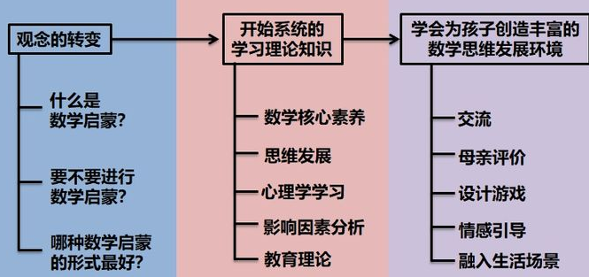

------------------------------------------------

#  忆筛X笔记：  

证明：左侧写关键词，每行一个
A5笔记，B5作业证明  A4总成

### 总成：关键词笔记+证明过程+提示区
封面是条件和结果，
右侧封面下面一摞是证明过程：揭秘的效果
下面是提示区：句子形式，内容是对左上角关键词的进一步提炼，以证明中的数学符号作为句子开头的提示
【】A4总成笔记，是把A5的笔记和B5的作业都合起来，贴在右上角证明部分吗？

反复重复，每次不看答案，看笔记，把证明分块
 ，就是在定理的数学公式中出现的字母来表示，尽量这里头的关键词也是类似，就是尽量，比如这个就是哎呀什么的。我们在这个呃左栏中的果栏中的这个主要是嗯相当于把原来的证明给他增快。这个做法的话实际按住还就是拆的一次，只有通过拆机。这项我们吸收食物一样，必须把它食物中的蛋白质拆解了，我们人体才能消化成笔记的方法，也是通过反复的这个重复一直重复的时候不要看答案。然后呢自己去想。本来想出来的信息可能25%，30%没有办法通过这些有限的信息来敷衍出百分之百的证明。这时候我们就看笔记。去看笔记。然后看笔记了之后呢再去。笔记呢可能复原的信息更多一点，但如果看了笔记，仍然不能够把证明百分之百的复原出来。这个时候呢就说明你的笔记写的不对。所以呢，这是一个自我提升的办法。哎，老师教学呢是去老师提着学生走，老师帮助学生提升，包括包括上课呀，相当于老师，帮助学生提升儿屁屁技能，相当于学生吗？通过这种意识挨着的方便自己，相当于学生自己自己去提升自己。因为他发现自己笔记想的最多的是尽量写写的，不对啊，就写的不能够让他恢复原油的正义。怎么这个时候呢相当于题相当于提示部分哎。嗯，我还有一个想法就是说呃可能学生可以用一下。就是说就是说我们啊，呃，因为我们人类实际上是在空间还是有感觉的，所以我建议就说比如说这一段正好是他对一个关键词的地方。这一段又对于一个关键词。我建议就是我们学生呢使用几种办法，第一种本子是a，五本是用来记笔记。然后呢？A滗500b五本来用来做作业都是硬来担面细的。然后四本儿啊，就是总成的笔记。总成的对于最后的集成在这个地址。那么这样子的好处是什么呢？
丹丹。总长的笔记就是说是我们最后一次了。那么我想的我的想法是这样子的，就是诶五章的笔记啊这些。把他呢都剪下来。按照这个分出来的座儿剪下来。然后粘贴在营火上。把这些都粘贴在一摞上，然后用右边粘贴，因为左边有三个关键词，可能是这样，怎么养情人？等于一个证明中的一个证明，把他呢就变成一路我觉得这种皮洛诺斯是这样想的。那么我觉得，因为这个虽然实际上我们知道他在实质上对信息没有改变，但是咱对于我们的心里有改变，我们的心理的可以去。对，他有这个，而且呢你再回忆的时候呢，可以最外面那张纸是白纸。然后呢？下面逐层揭开，逐层揭开，就有一种揭秘的感觉。揭秘的感觉。阿金而且呢这个时候呢，因为我们在生日段落对我们的心里都会有感觉。同样的道理呢，我们就是说这个提示管的反正就相当于把他这些呢就剪成这样的。然后这个我想是这样，就是说这个呢底下就是我们刚才说的那些提示拒呀，提示拒。然后上面它的封面儿呢？方便让这粘在一起
实际上是他落在一起的哈，那么这个封面就写上这个。这个定理的。你的条件和结果。不仅证明证明是在上面写，然后底下这是提示。因为我们看最后看我们的总成的脾气的时候的话，那么我们看我们的总成的笔记的时候，我们实际上就是说可以呃，可以就是刚开始只能看见这个病。条件和结果的样子。然后呢然后自己再去写，然后再去看这个提示提示句，最后再去看这个百分之百的证明。
在做证明的时候，我们去把它分段就相当于用关键出来分段，这对我们制造提示，提示聚会有很大的好处。

我们做这种一摔成笔记的作用是非常大的，像我们的同学嗯大一，大二的时候学数学。好多同学就边学就边忘了，但是如果做了比喻是哎笔记之后那么大一大二班的基础之后，到大三的话，那要考研的时候就会比较轻松，而且考的学校也不都会比较好的。你就像 嗯，有些女生其实天资并不近，但是最后考到了北航，考到了北师大，考到了华中师大，就是因为他们。在大一的时候，我还是祝福他们做这个一晒成绩的，起到了效果。

@Stanley沈毅：王老师说的这个：按顺序为 定理题意 忆筛关键词和关键句   证明全文  证明结构图。您方便的时候能再说说吗，我觉得是很好的做题策略，已经给孩子教了，不过我不知道我理解的是否准确。@永晖

@Stanley沈毅 教师型家长  包括后面想讲的家长。我再强调一下，讲课的时候，一定不要一手拿着讲稿，一手书写，而是要在关键的定理证明那儿，自己边写边推，出错了，忘了没关系，这才是忆筛✖️笔记的意思。后面想讲的家长，也是按照这个要求来准备，这样才能真正搞懂，真正发现出自己没弄清楚的地方

另外一个方法是，觉得难，就主要把时间花在复盘忆筛上，而不是往前读上面
复盘忆筛时，还可以自己写证明结构积木图，帮助自己厘清思维。 忆筛-证明结构积木图_20210612222526.jpg

陈文英：针对 “不能从头到尾说”：在给别人说事之前，得先在自己脑袋里，用忆筛的思维方式整理一下思路。
训练个几十次效果会很显著。我现在跟别人讨论再复杂的案情，也毫无压力；以后还会越来越快
忆筛×笔记 https://www.bilibili.com/video/BV1S441157Qj?p=1

周奕怡妈妈7年级：@永晖 学习了忆筛乘笔记的方法 很实用的学习方法 大人学起来可能比较快 但孩子好像都做事方法或程序不那么容易接受 不知道是不是跟年龄或思维特点有关系呢
忆筛乘笔记的方法，也主要是给大学生甚至研究生的。
Stanley接触到 忆筛✖️笔记 这个说法，也有一两年了，但是能不能真能落实到自己身上，还是要靠练， 所以养成真正的良好学习习惯，不容易。

B5规格是176mmX250mm，A5规格是148mm×210mm
忆筛-A5-B5-A4-20210612225436.jpg

## 计算器
HTTPS://qwerttiger.GitHub.io
群里有些小朋友，也许愿意想计算器的原理，通灵芯片那本书有提示。
然后自己做一个电子计算器出来，哪怕是用编程弄出来的，我感觉也是挺有意义。

## 拼塔
 语文，就是家长和孩子之间的亲子阅读，阅读之后做一下关键词拼塔游戏，相当于复述的一种变体形式。这种功夫，涉及到工作记忆能力，属于关键性能力，很多本科生读不下去，就是卡在这个能力上

我们的背单词第一种方法，拼塔游戏，实际上也摈弃了照相式记忆的说法，七田真吹过的

要教孩子九九表是不应该先学习连加，连加是不得看3.1.3连加型拼塔游戏
拼塔游戏如何配合亲子阅读https://www.bilibili.com/video/BV1ot411U7Et/?spm_id_from=333.788.recommend_more_video.12
这条路是可行的。小教室这方面最差的孩子，都已经达到了拼塔游戏很流畅的程度，而且只是每周练一次
我们小教室有个女孩考试非常好，用技巧也很好，但是做掐指数数和拼塔游戏的时候两个手不能很好的配合。而另一个女孩技巧性东西用的不是很熟练，她游戏时配合的很好。

@永晖 老师好，我按照您上午说的拼塔游戏式复述方法，准备了教具。我没有smartix卡片，所以就自制了一些卡，我标注了数字，准备回家让孩子在上面做填充，从而完成卡片制作过程。（也许在制作过程中会毁掉不少卡片，小朋友目前马上3岁，涂色时经常乱涂，线条经常会出框）
卡片制成后，**每次拿出5到6张卡片，摆成上图的形状。让小朋友按顺序复述数字，然后，暗牌，让小朋友继续复述。**
您看我理解的“拼塔游戏式复述方法”是这个意思么？
@小宝妈-2岁10个月 对倒是对，但是，拼塔游戏是给大孩子用的，这么小，估计没必要。至少是到亲子阅读时，或者你自己来给孩子做拼塔游戏，但那个也是孩子到了识字期采用。刚开始的婴儿亲子阅读，也都不一定要识字的
我们当年小教室，就是把握手数数跟拼塔游戏结合在一起做的，当时孩子们都大了，小学四年级。可能三四岁，四五岁做更好

@Planet  我们学校被丘班录取那个刘壹也是女生 

# QQ-上海闵行
### 分数

@牛牛妈-10岁   我们也是三年级学了分数，还没学通分（青岛版），看了王教授的分数概念引入，就想看看孩子 有没有真正掌握分数，就问1/2和1/3哪个大?孩子说1/2大，因为老师讲过就是同一个大蛋糕平均分给两个人吃，肯定要比平均分给三个人吃，每个人得到的多。我这才想起我在玩青朱的破镜重圆时，孩子指着手机说妈妈这不就是分数么！

分数，基本上属于我们这个项目的最后一个概念引入了
分数这个，对思维能力的要求比较高，数学是一层一层垒起来的，如果孩子没到这个程度，就用小学教材上的教法，正常学习就可以了

我们这两天孩子对小数点很感兴趣，因为他总是让我把100分城一万份之类的提议，我就试试给他们讲了一下小数，用甘蔗举例子，他们理解的很快，然后又是分数，一个被切成6块的pizza被吃掉两块后，弟弟想了想竟然想到了是三分之一，而不是六分之二。

我娃三年级，他在幼儿园就问过分数的概念，但是到现在也不是完全明白，例如通分还是很懵懂。我感觉概念引入是不是每次比前面进步一点就行，我们普通家长感觉也没办法一步到位
我是用圆形来实现分数的原理
我家孩子小时候，对数学，后来对小数分数都开始好奇的时候，我也没有给他买书教，就用自己仅有的一点知识，和他探讨，用生活中的实际情况给他举例。

@肖培征—墨宝爸4岁 估计刚开始认识分数的孩子还是需要靠分格子来玩的，能力强了大脑就自动切换到估算了
我问过了好多排名靠前的 都不是数格子去拼的 而是直接估算切片的大小拼的  刚开始上线 我通过数格子 化成分数 然后通分  6分钟内 我完全通不了关 后来用估算大小的方法 果然跟着他们通关了
我看了王老师的一些理论 主张锻炼孩子的估算能力 我就大胆把分数的符号给去掉了  看看能不能拼出来
又看见王老师有个视频 告诉家长说分数符号不重要 孩子知道分数代表的啥菜重要 我就加上了格子 通过数分割的格子数 就能知道是几分之几
新上线题目 分数加法 底部的分数都没标数字 只能通过图像识别分数 有利于低年级没学分数的孩子玩

合久必分游戏- 记住100以内的质数？

## 顾洪玉

### 数数
通过数数明白十进位制，这是学习加法运算的基础与前提。

给学生出如下题目： 73+6=?, 73+9=?, 让他们去思考，怎样用手指头也可以把这些数算出来，方法是学生们想出来，搬第一个手指头时念74 ，搬第二个手指头时念75，如此搬到第六个手指头就得到73+6=79,
#### 加法

然后进行整十数的挑战，问学生90+20=? 
扳指头法 --  引导学生认识到在数数过程中学到的十进位制（10个一摞的算符），在加法中学以致用！

### 减法
国内三版小学数学教材均把加减法混在一起进行教学
大多数学生无法发现减法是加法的逆运算，无法让学生对减法进行探索性学习。

把10以内数拆分的练习。
一是为10以内数进位加法时的“凑十法”做铺垫；
二是因为数的拆分对学生发现减法提供有效线索之一，且让学生体会数论中的拆分思想【】???；
三是发现乘法是最简单的加法拆分。???

从实物操作过渡到抽象的符号，再到符号的运算关系

在学生发现减法的实质性思想后，把减法的规范符号教与学生，让学生认知的概念落实到当今数学界的通用符号体系。

1、学生月月（7岁时），做两位数减一位数的退位减氵去，她是采取这样的计算方氵去：
15一6：10+5一6：10一（6一5）
该学生实际上并没有列算式，而是心算出6一5：1，再算出10
一1=9．
2、学生丁丁（7岁时），做两位数的退位减氵去，他是采取这样的计算方氵去，
54一28={（50+4）一（24+4)}=50一24=26．
大括号的一步是心算，接下来直接算出50一24=26．
一开始不必计较计算速度，而是应该首先鼓励和保护学生的特殊算法
通过日常大量的减法练习，让学生们记住通用算法而已，例如6+9 =15，则15-6 =9

### 数乘法竖式计算与“铺地锦”算法

## 联系加法、乘法与乘方的一个教学案例
【】阿里麻麻俩小盗:
这个案例真好。让小朋友玩玩这个，想想都有意思
阿里麻麻俩小盗:
小时候玩得太少，缺乏感性认识，后续学习会遇到困难。有些学生觉得物理课程难，跟生活体验太少也有关系

## 分数
初步认识分数安排在三年级上学期，分数的性质与意义、分数的加减法安排在五年级下学期，时间跨度大。

## 赵敏 数觉 探究性训练

李克正教授认为数数是幼小数学教育的核心任务且是艰巨的任务1
如果把数数/识数与加法分开教学，则给予学生机会去探索式学习加法，去发
现加法跟数数/识数的关系，并对数数/识数时学到的进位制进行概念反刍，甚至顿悟。

### 数字10
数字10是非常奇特的一个数，因为写成计数形式时，使用了两个数字，1和0 ，不同于之前学的个位数。但是，十的中文发音只有一个，所以光从发音上看或者手指示数，会给孩子一个暗示，数字“十”仍然是一个个位数。所以，数字10的概念引入值得研究。在十进制中，1加9时个位出现了零，而在下一个位置十位上出现了1[36]。笔者查看了北师版、人教版、苏教版和新加坡版的教材，10的教学没有很好地解释这里0 的含义，且都是和个位数放在一起进行教学。
国内的人教版教材以及新加坡的教材都解释了0 代表没有，而且先教数字0 ，但是真正介绍10 的时候，并没有对数字10 中出现的0做出解释

数字10的引入，先是语音阶段，再进入书面阶段，最后是阿拉伯数字记号10的引入。https://www.bilibili.com/video/av67581378/

多位数阶段的第一个概念引入实际上就是知道10 ，知道10 以后能不能知
道20 , 30 ,, 90这九个两位数。我们想要做的就是，在这部分的教学过程中采用概念引
入的方法。
【】想起小朋友学数数的时候，数到19、29...这些地方，常常会卡住。这个状态持续了一段时间。每当孩子卡住的时候，常常着急地想，究竟该怎样让小朋友明白29后面是30呢？！大学里有些课程需要用到2进制，8进制、16进制。16进制数怎样算出10进制的值？刚接触的时候，很多学生不知道

### 筹码教学
空白四色款

盲盒
#### 估算跑道游戏
游戏最后选择放置筹码的位置，是通过对小车上筹码总数的估算。

### 苹果符
苹果符在舒尔特表中
六行六列
从17开始的连续36 个自然数，打乱顺序后摆成六行六列

### 舒尔特表(Schulte Grid)

##  风云家长学堂
当优秀家长，给孩子学习能力，带孩子健康快乐走向卓越
东北风 https://www.zhihu.com/people/dianfengzhang000
https://www.zhihu.com/question/437581262/answer/1689522899

# 波利亚解题思路

* 【波利亚结题表--解题思路一般化！】
* 可以用于编程设计！
* 主要是给老师看！
* 有很多巧妙的提问
* 例题！高中以下的知识范围，但有点难度

## LCL阅读笔记感悟

|                                                                      原文                                                                      |                                                                                    感悟                                                                                    |
| ---------------------------------------------------------------------------------------------------------------------------------------------- | -------------------------------------------------------------------------------------------------------------------------------------------------------------------------- |
| 
 学生应当有尽可能多的独立工作经验。但是如果让他独自面对问题而得不到任何帮助或者帮助得不够。那么他很可能没有进步。:smile:
 | 
【】不懂成长规律的家长老师，有时候不仅不提供必要帮助，反而横加指责，恨不得孩子一出生就能养家糊口；有的一学期或一年都不闻不问，期末成绩不理想就胖揍一顿 
 |
| 但若教师对他帮助过多，那么学生却又无事可干。                                                                                                       | 【】老师讲课照本宣科，学生渐渐神游                                                                                                                                            |
| 教师对学生的帮助应当不多不少，恰使学生有一份合理的工作。                                                                                            | 【】这才是老师该有的样子！                                                                                                                                                   |

#### 联想：

|  Polya   | Understanding   弄清题意 | Plan   设计 | Solve   解决 | Check   回顾 |
| -------- | --------------------------- | -------------- | --------------- | --------------- |
| 工程教育 | C     构思               | D     设计  | I     实现   | O    运作    |

### 例题及UPSC过程

|                                                          题目                                                          |        Understanding        |                         Plan                          |          Solve          |                                Check                                |
| --------------------------------------------------------------------------------------------------------------------- | --------------------------- | ----------------------------------------------------- | ----------------------- | ------------------------------------------------------------------- |
| 1. 已知三角形的三边长a，b，c满足   $$ b+c = 8 $$ ---式(1)，  $$bc = a^2 - 12a + 52$$---式(2)，  这是什么三角形？ | 已知2等式   判断三角形类型 | bc=(a-6)^2+16 得 bc>=16   又由b+c=8 得 bc<=16   | 故 bc=16 b=c=4 此时 a=6 | 由式(1)^2-4*式(2)，  可得，(b-c)^2=-(a-6)^2  由此可得：a=6, b=c |
| 2、已知 y^2+5y+1=0,   试计算分式 y^4/(y^8+3y^4+1)的值                                                                | y+1/y                       |                                                       |                         |                                                                     |

波利亚-科学网—中美数学名师解题方法之比较 - 张能立的博文.pdf
http://blog.sciencenet.cn/blog-40247-752702.html

#### 乔治·波利亚
（1887年12月13日－1985年9月7日），犹太人，著名匈牙利裔美国数学家和数学教育家。《怎样解题》(How to Solve It)，《数学与
猜想》(Mathematics and plausible reasoning)，《数学发现》(Mathematical discovery)，数学分析中的
问题和定理》 (Problems and theorems in analysis)，《复变函数》 (Complex variables, 与Gordon Latta
合写)”[2]。

2017年8月找到《怎样解题》中英文电子版-当时没看进去，今天先看了读书笔记，惊喜！20210322

## 文字读懂 --> 理解数学含义 --> 标注 已知条件 + 问题  -->  解题思维：文字转化成数学语言  --> 搭建桥梁【】
https://mp.weixin.qq.com/s/G_PNPbwcdhmu5KuaqvLYtg

阅读理解在数学学习中的重要性：读懂问题，回答全面。

波利亚的名著 怎样解题，也是大概意思。分为了几个环节
【阿里麻麻俩小盗:
波利亚的书，听到推荐，原先翻过一次，没看进去....    最近在孩子数感方面花了更多心思，看到孩子卡壳，或者出错，有时会让孩子边读题，边说出思路，留心观察孩子做题过程，常常会感叹，原来是卡在这里啊

阿里麻麻俩小盗:
寒假以来，针对孩子的问题，曾经跟孩子提几个要求，1）每天练习数字书法（因为不整洁，出错挺多）   2）边读题，边标记要点（漏掉条件，题目条件视而不见的情况挺多）   3）每次做题，必须准备好草稿纸，不会做的题目，不要急着问，要在草稿纸上写/画出思路         

阿里麻麻俩小盗:
一两个月了，能感觉到进步，但，还不稳定，还没有完全养成习惯
--边做事，边总结思考和提升，这个过程，很享受！】

## 费曼输出四象限
https://www.yinxiang.com/everhub/note/3d1c0cb8-a3c0-4f2f-9957-b25349ea7a5b

碎片 + 体系输出
书面 + 口头输出

朋友圈/点评费曼 费曼60S口述
费曼写作，费曼演讲

 每天至少费曼一篇文章。每篇文章完成高光，导图，卡片等步骤。
碎片输出每天做，体系化输出定期做。
最重要的一点是在「做到」和「没做到」之间画出一条「亮线」 ??
费曼输出-隐性思维显性化.jpg

### 红绿黄蓝4种颜色的荧光笔(或者4种颜色的彩色笔)，用来高光

# 从小写作的习惯！

## 善于写作的偶像 ??

## 费曼输出 内化型输出

教授你所学习的内容
把知识传递给别人，传递完之后的知识会更大程度地留存在你的大脑中。
努力简化表达【陶哲轩的讲义???！逻辑性！】

费曼学习法=费曼技巧+学习闭环
输入 + 处理 = 费曼笔记 环节
体系 = 费曼导图 环节
内化 = 费曼卡片 环节
输出 = 费曼输出 环节     

# * 杜威十进制编码系统Dewey Decimal Classification, DDC; Dewey Decimal System：

知识库--笔记的主题化存放
一是笔记的分类，二是编码

分为三级，父子孙

0 开头是 Inbox，1 开头是 Work，2 开头是 Note，3 4 5 开头是专业，6 是好用的工具收藏，（7是预留职业）8 是生活，9 就是一些兴趣。最后还有用了一个 Z 来归档的。
知识库分类体系.jpg

笔记本
000-Inbox体系
001-In-收件箱
002-In-网页
003-In-微信
004-In-新浪微博
005-In-得到
009-In-圈点
010-Project项目
100-WorkSpace
101-工作记录
110-W-BLUE Co.
111-WB-会议记录
112-WB-周报
113-WB-项目

200-Note学习
201-N-TimeMgm时间管理
202-N-Writing写作方法
203-N-吴伯凡认知方法论
210-N-Reading阅读
211-NB-Book读什么
212-NB-HOWReading怎么读
230-N-English英语
231-NE-水滴阅读

300-VisuaIDesign
301-UI
400-UX/UEDesign
401-U-用户调研
500-MotionDesign
501-M-拍摄
600-Too|s利器
601-T-武器库
800-Life生活
900-Meaning兴趣
Z-Archive归档

??Alfred 上直接搜索

图书馆分类例子Contents
1Class000一Computerscience，information&generalworks
2Class100一Philosophy&psychology
3Class200一Religion
4Class300一Socialsciences
5Class400一Language
6Class500一Science
7Class600一Technology
8Class700一Arts&recreation
9Class800一Literature
10Class900一History&geography
11Seealso
12References
13Externallinks

### 写作流程 https://sspai.com/post/57493
1. 积累卡片

1. 导图 -- 结构梳理
* 康奈尔：
索引-
摘录- + 思考
总结-精炼的概要+思考

1. 整合知识卡片

 将思维导图里的每一个知识点，都用自己的话来解释一遍。

把散落的卡片归集（Evernote??）
1. Notion 里编辑和修改 ?? 随意排列卡片推动模块
添加过渡文字

1. 导入到公众号

## 豆瓣9.x

## 四种数学思维方式，Euclid 公设，Lagrange 预解，Abel 积分，Poincare 猜想 ??

## 数学、科学和认识论

推荐在读完《证明与反驳》基础上进一步阅读此书

# 真正的奥数培训-《完美的证明》

完美的证明 个性造就成功 史上特立独行神秘的科学家传奇 引人深思的成功秘籍 [美] 玛莎葛森著 胡秀国 程姚英 北京理工大学出版社

#### 数学弯路：
https://www.douban.com/group/topic/216739232/

* 数学思维怎样培养？
* 计算训练？刷题
* 难题-奥数

> 斯坦福教授Jo Boaler说，脑科学证实，在做错题的时候，人的脑神经突触是点燃（fired）的??，而错题正好提供了一个学习的机会。
> 德州奥斯汀Starbird博士说，有效思考??的五个过程中，第一个是深度理解，第二个就是犯错，犯错是非常好的老师，从犯错中我们能走向成功。
> Jo Boaler说，掌握正确的学习方法??，每个人都可以把数学学到一个较高的水平。

## 概念辨析
小学奥数不是真正的奥数http://blog.sciencenet.cn/home.php?mod=space&uid=45143&do=blog&id=1181489
1. 全民奥数”-“小学奥数”：中国常见的奥数培训所采用的模式，则是先讲例题，再做个跟它相似的习题。跟真正的IMO奥数竞赛，是背道相驰的。培训教师，已经把这道题最难思考的那些关键点，替孩子们取消掉了。盗版和模仿的心理，这些在中国社会中普遍存在的因素，是导致国家科技能力不会太强的原因。【】
1. 真正的奥数，即IMO奥数竞赛题目：真正的奥数培训-《完美的证明》。6道题，每道题计时90分钟。每天三道题，共两天。训练的能力就是那种攀岩级别的，这些IMO奥数竞赛题，往往是由大学数学教授/数学家提供的，而且往往还不是普通的数学家。
1. 真正的数学：大学？初等数论课

* 数学能力--更高阶的数学成熟度 ???
* 数学练习的计算能力有三个参数：准确，快速，多角度，再加上本文所说的自我纠错能力。【】

* 美国的奥数教育体系，因为注意普及，他们的入门级的竞赛，即官方的AMC8,10,12考试，相对就简单很多。
小学奥数的出题方法，也就应该不等于IMO奥数，不见得要那么难。像MathCounts那样，把注意力放在**准确度和快速度**上【】，其实跟**小学阶段的教学目标**，是相符的。

### 美国奥数训练网站 + 教材 ???

#### 初中新生入学水准，口算/心算https://exam.jinshujuapp.com/exam_dispatchers/ILquDh  
http://blog.sciencenet.cn/blog-45143-1180266.html
小学生如果连自己的错误都能发现和纠正, 那就非常可靠, 属于小学数学素质的最高档次（参看朱忠明的博士论文）
数学教育者需要自觉地和着力地培养孩子的可靠性。
如果一个小学生已经能够保证自己做的题目全对 (有错自己全部发现和纠正), 那么如上所说他在科学严谨性上已达到小学生的最高要求。此时可引导他自学更深的数学如初中代数, 如果继续学习小学数学教程可能是浪费。

# 驱动型数学题 【!!!】真正推动数学历史进步的题  清单【???】

培训的时候，很多会采取这样的做法，把那些驱动型题目，快速通过，仅仅当作基础知识，而没有使用探索性的教学方法，反复揣摩。【】
作为竞赛生，一定不能只学竞赛题，一定还要有另一条线放在驱动型数学题。中学阶段把元气就给耗尽了！
通过奥数点招进入人大附等好中学的孩子，到了初二、初三，大约有80%的孩子，学习成绩会不可控制地跌落。【】

### * 从奥数的知识范围覆盖上来说，分代数、几何、数论和组合数学四大类。【???】

数学分为三大类，基础数学，应用数学，纯粹数学。
像现代数论和现代微分几何，可以归于纯粹数学中最主流的两条线；而分析学和代数学，则归于基础数学中最主流的两条线；
组合数学呢，最近的发展比较大，既有纯粹数学的部分，也有应用数学的部分；像统计学，则无疑应该属于应用数学。

## 小学的成绩有很大的欺骗性，到了初中就会有很多的学生掉队，是真的吗？
https://www.zhihu.com/question/433616847/answer/1670357512

## Gelfand盖尔范德中学生数学思想丛书

【腾讯文档】初中代数抽象探索营毕业名单2021届 ML Gelfand数学书 豆豆 https://docs.qq.com/doc/DUXZxQmZpVXJjSnFa
• https://mp.weixin.qq.com/s/_1-3GQW7rmcZEXE2wwQEaA  I.M. Gelfand为中学生写的读本 这几本书的英文版： Functions and Graphs The method of coordinates Algebra Geometry Trigonometry Gelfand盖尔范德中学生数学思想丛书

为了一睹Gelfand的大作，可以先阅读这几本书的英文版：

Functions and Graphs
The method of coordinates
Algebra
Geometry
Trigonometry

盖尔范德-三角函数
盖尔范德-坐标方法
盖尔范德-代数 
盖尔范德-函数和图像

虽然作者大名如雷贯耳，但是内容还是有点儿过于基本，提高思维的部分不像宣传的那样，所用笔墨不多→_→
02.01
解释：您好！这套书重在巩固基础，思维贯穿整本书，由自然引出，并走向远方。

-------------------

https://www.zhihu.com/question/276801163

Gelfand网站：

Israel Gelfand - Official Website
​
israelmgelfand.com
图标
A. Beilinson回忆Gelfand讨论班：

http://www.ams.org/journals/notices/201603/rnoti-p295.pdf
​
www.ams.org
Notices关于Gelfand的纪念专辑：

http://www.ams.org/notices/201301/rnoti-p24.pdf
​
www.ams.org
http://www.ams.org/notices/201302/rnoti-p162.pdf
​
www.ams.org
Gelfand讨论班的笔记

Notes of talks at the I.M.Gelfand seminar
​
www.claymath.org
图标
讨论Gelfand讨论班文化的一篇文章

http://web.mit.edu/slava/homepage/articles/Gerovitch-2016-Creative-Discomfort.pdf
​
web.mit.edu
回忆Gelfand生物学讨论班的一篇文章

About I.M. Gelfand’s Seminar, Russian Journal of Developmental Biology | DeepDyve
​
www.deepdyve.com
----------------
https://github.com/nculwell/MathStudy/blob/master/SchoolLevel.md
Israel M. Gelfand (Гельфанд) wrote a series of books to teach fundamental mathematics to grade school students as part of a correspondence program. The resulting series of books covers from algebra through precalculus:

Gelfand and Shen. Algebra (Birkhäuser 1993)
Gelfand, Glagoleva, Kirillov. The Method of Coordinates (Dover 2002)
Gelfand, Glagoleva, Shnol. Functions and Graphs (Dover 2002)
Gelfand and Saul. Trigonometry (Birkhäuser 2001)
S. I. Gelfand, Gerver, Kirillov, Konstantinov. Sequences, Combinations, Limits
Rutgers still runs the Extended Gelfand Correspondence Program in Mathematics (http://www.egcpm.com/), which allows you to have your exercises graded. You could just do them by yourself of course, but no answers are provided. The program accepts students of ages 13-17.

Gelfand's books seem like a pretty interesting way to introduce high-school material to motivated students. They aren't as dry as most American textbooks, though they lack color and gloss. However, I'm not sure if they really go into enough depth in some areas, so you might need to supplement them with a book like Axler's.

-------------
36.I.M.Gelfand等的"广义函数"(Generalized Functions,I-V)。大概I-IV都有中译本吧!.从泛函的角度,据说是第二本最有意思。另外还有两本好书,不光是这一块内容,从整体上讲也是很好的泛函课本 

### 《中美逆运算渗透教学对比研究》：在一个等式中，用相反的方法，从得数求出原来的某一个数，这种运算就是原来运算的逆运算。

在美国的《学校数学教育的原则和标准》中，“逆运算”指向的是“数与量”和“代数”两部分教学内容（相当于我国的“数与代数”内容）中的“理解运算的意义及各运算间的联系”，通过计算教学和算式组的教学进行渗透。其实，逆运算的渗透教学具有发展学生的数感、运算能力的功能。

问题１提供了具体的实物图（见图１），问题２提供了抽象的符号图（见图２），问题３提供了文字素材（见图３），问题４提供了三个关联的数字素材（见图４）。它们要求学生分别在教学前后，根据这些素材，写出一组相关联的算式或解答过程。

大多数中国教师的课堂用语是经过推敲的，并带有较强的目的性。比如，教学“一图
四式”，中国教师课堂上过渡语的运用也使得课堂更流畅中国的课堂中，教师设计的不同环节环环相扣、层层递进，巩固“分与合”或者“想加法，算减法”的计算方法
，美国课堂看似不连贯的教学环节，却让学生有了更多独立思考的机会

# 豆豆 英语 语文 深耕 两股清流

## 大语文

### 范围-原则与目的
> 浅尝经典诵读，深耕古文阅读，广读现代小说。
> 语文的目标，在中学阶段，无障碍阅读较艰深的古文。

### 书单
> 古文观止，唐诗三百首，史记，王力古汉语教材的实词朗读，论语朗读，道德经
，汉书，三国志，古典名著，矛盾文学奖获奖小说，东周列国志
> 金庸小说，亦舒小说，爱的教育，盗墓笔记，平凡的世界，约翰克里斯朵夫，静静的顿河，福尔摩斯

三年级下，读金庸小说。古文朗读，暑假开始朗读古文观止【】，这一进程持续到高中。听评书。
五年级上，读流行小说，古典名著，西游记等等。朗读古文观止，开始读背唐诗三百首【】，这一进程持续到高考结束。听广播小说。听写语文课本。

### 金庸及阅读顺序
“天连射雪书白越侠鸳神鹿倚碧飞”

> 射雕英雄传
> 天龙八部-最好
> 笑傲江湖-私人恩怨
> 鹿鼎记-突破性
> 
> 神雕侠侣
> 倚天屠龙记

香港明河社版（竖排） 三联  朗声旧版，内容和三联一样

> 总结一下顺序：
> 《射雕英雄传》
> 《神雕侠侣》
> 《倚天屠龙记》
> 《天龙八部》
> 《碧血剑》
> 《书剑恩仇录》
> 《飞狐外传》
> 《雪山飞狐》
> 《笑傲江湖》
> 《侠客行》
> 《鸳鸯刀》
> 《白马啸西风》
> 《连城诀》
> 《鹿鼎记》

### 古文观止

阴法鲁老先生的《古文观止译注》

《古文观止》 建议不要读 强烈建议读姚惜抱的《古文辞类纂》或者高阆仙的《唐宋文举要》或者《昭明文选》

### 《世说新语》
[蔡志忠]+06册+世说新语HD.pdf
世说新语--沈海波译注.pdf

人民文学出版社的《全评新注世说新语》，蒋凡、李笑野、白振奎评注。
中华书局的三全本《世说新语全本全注全译》

贵州人民出版社的《世说新语全译》

杨勇：《世说新语校笺》

繁体竖排？余嘉锡：《世说新语笺疏》   徐震堮：《世说新语校笺》

### 半小时漫画全套20册中国史番外世界史唐诗宋词经济学科学史哲学史

中国的历史像《史记》、《后汉书》等古代史，张荫麟的《中国史纲》、吕思勉的《中国通史》、黄仁宇的《万历十五年》、很火的《明朝那些事儿》 等等都是很好的书。

# 英语自学

> 家长辅导，自由听读
> 英语学习的目标，在中学阶段，基本无障碍阅读英文原版流行小说，部分通俗级
> 名著，基本无障碍听阅英文小说，新闻广播，

## NCE !!!
听且跟读，重复很多遍
NCE2+NCE3---听？跟读---朗读！！！ 听写！！！默写！！！
背诵
拼写
练习册

## 英语阅读从一开始就是阅读与听读相互交织  ???

> 从二年级开始阅读学习的，我们的英语阅读从一开始就是阅读与听读相互交
> 织在一起的，所有的阅读图书基本上也会再听一遍，或反之。开始是书虫这类的缩
> 写本，大概持续了一年左右，然后就进入了原版儿童图书阅读阶段。开始是神奇树
> 屋mth系列，后来还有鸡皮疙瘩系列，Famous Five，39clues等等。
> 到了五年级，开始听读Harry Pottery，由于我们在学前就是哈利比特的电影迷，所
> 以，上来就是纯听，有点小难，但还能持续，就这样一直进行到初二，哈7听完。
> 与此同时，孩子们的阅读开始走向自由阅读阶段，小说过渡到诺奖青少小说，以及
> 一些流行小说，比如暮光之城系列。
> 初中是孩子们阅读量及能力大幅提高的时期，范围不再局限于青少小说，像one
> day这样的成人文学也开始阅读了，印象中这个阶段，她们还读过gong with the wind
> 飘英文版，好厚的书，我们还听过一遍，很了不起。 还有godfather教父原版。
> 高中英语阅读基本上是孩子提书目，我来买，以布克奖图书为主，最开始是狼厅三
> 部曲中的两部，再然后我就搞不懂了，每年五六本或七八本。英语水平远超任何同
> 学，英语课被准许自由安排—读英文小说。
> 

**通常来说，英语多习惯于早教，但初中学习往往更为重要。初高中时期，学生的思维能力成长的很快，阅读内容应该及时跟进，这样才能始终把控住局面，无论在应对高考，还是将来大学学习的各种机会，都可以从容应对。**

### 高中 读书和练习的时间基本为3:1。

## 强归纳法 ?? 陶哲轩实分析  
https://christangdt.home.blog/analysis/analysis-tenrece-tao-3rd-ed/

归纳法公理

## bryant heath number sense tricks
http://bryantheath.com/2019/03/16/number-sense-tricks-video-tutorials/

## 绘本-科学-计算思维 http://readlo.com/resources/course/code.html
https://www.stem.family/activities/computational-thinking-activities/

## 【公选课???】当社会学、经济学遇到计算思维 http://www.dean.pku.edu.cn/web/news_details.php?id=29 

社会科学中的计算思维方法

David Easley和Jon Kleinberg合写的《Networks、Crowds and Markets》
《网络、群体与市场》
https://www.cs.cornell.edu/home/kleinber/networks-book/   下载链接： https://www.cs.cornell.edu/home/kleinber/networks-book/networks-book.pdf  【下载失败，港理工VPN连不上】

https://www.amazon.com/Networks-Crowds-Markets-David-Easley-ebook/dp/B009019RPE#customerReviews
https://book.douban.com/subject/4135549/reviews
http://economy.guoxue.com/?p=8265
https://bbs.pku.edu.cn/v2/post-read.php?bid=24&threadid=14653574

采用维基百科研究中国政治censorship的论文--Michael zhang浸会大学的论文

### 经典问题-案例

社会网络、关系平衡、匹配市场、中介市场、拍卖市场、信息级联、网络效应、流行性、新事物的传播、小世界现象、表决制度等议题
个体行为导致全局形态规律的探讨

第一堂课通过图论构建班级社交网络
调查课堂同学们的信息，用图论来分析这个课堂的社会网络：个人姓名 院系 电邮，本教室中认识的三个同学的姓名

生活中的工作选择问题

修路问题

#### 图论或博弈论

## 内驱力

https://mp.weixin.qq.com/s/V2elz2pmCm6eWMFiXfQ34w?from=groupmessage&scene=1&subscene=10000&clicktime=1614061582&enterid=1614061582
学习的内驱力，是需要后天培养的

内驱力的三角模型：
研究动机发展的两位著名学家 Deci Edward L. 和Ryan Richard M 教授，提出了自我决定理论。他们认为社会环境可以通过增强三个方面的因素来增强一个人的内在动机。

**这三方面是 胜任感，自主感，和联结感。**【】

## 易经

元亨利贞：春夏秋冬
提出问题-分析问题-解决问题-反思向内思考
在数学探索过程中，数学解题过程中，贞代表的是什么环节？
PDCA（Plan-Do-Check-Act

如何由此四环节，再细分为8环节，基本上来说，现实中就够用了

### 始于有作人不知，及至无为众始见
《悟真篇》绝句六十四首

## 太极拳

孙氏太极拳的拳论中，已经说过类似的话了。将打拳类比于水中，说是有三层境界。另外，拳论中的掤劲，就是这个意思。也许，掤劲的深处，就是元气，元气，也就是掤劲。

## 共同注意力！

这位妈妈只是普通大学的普通本科生，但是她做对了好几件关键事情，给我很大启发。

1、共同注意力：

从孩子婴儿期开始到上小学前，孩子玩玩具的时候，这个妈妈别的事也不做，也不看手机，就专心地看儿子玩。
强烈的学习动力，倒底从哪儿来的呢？我觉得，这位妈妈在孩子早期的这种做法，无疑会极大地影响到孩子内心的学习动力，并且能够生根发芽的那种。家长无条件的爱，无私的奉献，契合心理学上的共同注意力。

2、亲子阅读做得很早

3、汉语跟数学是同步发展的

这样就给他一个很大的支撑，在小学二年级开始就可以自主阅读来学数学教材。
他现在才初二，就已经拿下了该省高联数学竞赛的第一名（该省总体也较弱），大学数学基础课也都学完了，用的还是挺艰深的教材。现在正在一位数学界院士的指导下，学习抽象代数。
院士给他的评语是，超出了绝大多数本科生和研究生。

4、每天15分钟

5、不拔高http://blog.sciencenet.cn/blog-45143-1176762.html

 小学生的阅读能力，首先是发展母语的，然后是外语的，最后才可能是数学。

##  http://blog.sciencenet.cn/blog-45143-1177158.html
 
张寿武觉得自己的性格占到了一部分因素：“我不算能很会教别人，但我喜欢跟不同的人相处。”

“我本就是乡下人，各种水平和层次的人我都接触过。不管跟什么人聊天，我都能很快理解对方的想法。而且能顺着别人的想法去转，绝不会把自己的思想强加到别人身上。”【】

我愿意花时间跟他讨论。”

“成功我是没办法告诉他的，我只能告诉他什么叫失败。我把心里想的、经历过的失败都告诉他，让他不用再经历一次失败。”【】

## 数学教育网站和数学游戏软件的IT技术需求和功能设想 https://docs.qq.com/doc/DYWZTYVd1UlZVZkxY

## 伯克利数学圈 https://mathcircle.berkeley.edu/circle-archives 
有一个项目叫做Math Taught the Right Way（用正确的方法来教数学），六年级以后可以报名：| https://docs.google.com/forms/d/e/1FAIpQLSeYRHdH8M3VewfkUR57a_SqBoaOflFSu8HlybBb9UBHuDBQ6A/viewform

Evan O'Dorney

TED演讲：The magic of Fibonacci numbers

战斗鸡奶爸 https://www.zhihu.com/people/jionte-white
​对于孩子数学启蒙教育，最有效的方式是为孩子创造丰富的数学环境。
家长进行数学启蒙教育的三个阶段：转变观念 理论学习 教育实践

## 拼塔游戏如何配合亲子阅读https://www.bilibili.com/video/BV1ot411U7Et
阅读+拼塔20210207003444.jpg
阅读+拼塔20210207003659.jpg
阅读+拼塔20210207004452.jpg
https://www.bilibili.com/video/av34749763

在阅读中引入拼塔游戏，帮助孩子寻找文章中的关键点增强阅读的有效性。
根据关键词复述：
一边根据关键词背诵，一边画点，这里没有看明白---和右下角的圈型符是怎样的联系？

【】安静一分钟后，重新做一次！
【】做过游戏后，重新高速复读--速读！

### 绘本版拼塔游戏
liquidText
关键词--页面关联线！点击跳转

关键词--关键句--完整复述

> 解释：
roatMap，RoadMap，Matrix等更适合复杂的书。这里的游戏适合一篇文章或者诗。
比智商测验更有延展性！
改善工作记忆，可以用于阅读，背单词，时间管理...
【】王教授表示，强调学习上主线的东西！非常认同，相见恨晚，如获至宝！
华德福的问题，缺乏优化，不重视数学！

#### MarginNote & LiquidText | 文献阅读工具 https://sspai.com/post/54112
笔记碎片散落在不同的书和不同的页面中无法集成查阅，笔记本则脱离文本给回溯增加难度
阅读笔记转变的过程也是对阅读定位改变的过程

#### 人型符 ???

## 结合阅读的背单词拼塔游戏-工作+长期记忆  https://www.bilibili.com/video/BV1ra4y177Dh/
worldly wise 3000 online

阅读背单词拼塔20210207175752.jpg

阅读背单词拼塔20210207175941.jpg
选生词+关键词
每次连续默写3-4个单词
写成几个塔（3-4个塔，每个塔<=9层）
全部盖住，默写 （第3步缺失???）

### 九宫四象阵 - 长期记忆

## 个位数连加游戏（估算+拼塔）  https://www.bilibili.com/video/BV1Ei4y1G7T9/
https://www.bilibili.com/video/BV1Ff4y1R74r
个位数连加，有方框和没有方框的数
方框里的数字，每轮游戏可以换掉，其它数字不可以换。
等号左边是精确值 ???    等号右边是估算值；

#### 拼塔版本更难！

https://www.bilibili.com/video/av47086978/ 拼塔视频

### 点位符圈形符的搜像游戏 https://www.bilibili.com/video/BV15t411v7Rf
圈型符-20210207002346.jpg 每个颜色5种！随机摆出一大片，画三张分别是2,3,4个符号的卡片，首先交换卡片，石头剪刀布，赢了的人，用对方的卡片在一大片中搜图案，拿走匹配的符号 

### 碰碰手游戏（十进位版）https://www.bilibili.com/video/BV1j441137f3 豆豆喜欢玩的游戏！但这个视频中间加的过程也展示出来了，而且表示每个数字的手型不大一样。

### 握手数数（毛根版） https://www.bilibili.com/video/av54280893 

### 蝴蝶符（块状版）https://www.bilibili.com/video/BV1P4411n7yH8 适合低龄

### 握手数数触觉加强版https://www.bilibili.com/video/BV1pt411r7xY/ 握手 + 数数 + 点手心

### 拉坐数数训练 https://www.bilibili.com/video/BV1Eb411M7hs 婴儿，亲子之间面对面，有眼神交流，触觉！【自闭症风险 ???】

## 分数的理解

1/2,1/10容易理解
1/0.2怎样理解（儿童票，小老鼠分食物）

## 数感
Dantzig于1954年正式提出数感(Number sense)这一概念
我国2001年《全日制义务教育数学课程标准(实验稿)》中,第一次明确地把数感作为数学学习的内容。

豆豆  GeoGebra 数学 数感 代数  青竹  ||  我们每个月会评选小讲师 发这么个奖状给同学讲课 这叫费曼学习法 是我们一位家长提出来了 大家一看很好 就领着孩子讲课 别看很多讲解只有十分钟左右 孩子要准备好几天 演练几个小时 这个过程比最终那十来分钟重要多了[捂脸][捂脸][捂脸]也有物质奖励 都是数学书
接口输入输出，定理，这个很有意思诶。自己也在纸上画了一下，突然又联想到俄罗斯方块和七巧板。只要几个基本的构件，可以变换万千。王永晖 20210131
白纸上画出中国的地图，标注各省和主要山川河流。在空白的中国地图上写省名和主要山川河流 豆豆 【】 20201103
到底为什么人类之间可以配合得这么好。 为什么 只有人类能够打造出这么庞大而复杂的社会系统？ 豆豆 TODO 20210127
江苏一家长认为家长群让家长承担了老师的工作，称「我就退出家 <https://www.zhihu.com/question/428413851/answer/1555345744>  【】靠学校不行了！！！   豆豆 
国际大奖，纽伯瑞  20201128 昨晚给豆豆买三套书，拼多多上，12*1 +4*1纽伯瑞，还有一套山海经
  嫦娥五号小兔子漫画我自豪小可爱，我骄傲😊  20201205
非暴力暴力沟通=情商练习课

### 拼塔
拼塔是一条主线，练出的是工作记忆能力，具有很强的延展性。【】视频 探索性教学示例 同余概念的唯一性证明。这样的题，倒是适合用来进行小组学习，即，在算例子阶段，可以让小组中的每个孩子，试不同的数，这样就可以去尝试出更多的数，每个人把自己算的数，提供给大家，帮助各人去思考找到规律

握手数数和拼塔游戏，小学四年级
我说下一我对组合的看法

小学阶段的组合 都是有限数量内的穷举 数量也不会太大  不需要证明
让孩子锻炼分类和分步的思想 做到不重不漏  别小看不重不漏 哈哈哈 能做到是真不简单
中学阶段的组合 需要会证明公式 会使用公式   当然需要证明的公式也不会太多 如果不走竞赛的话 都是相当简单的
大学阶段的组合才是系统的学习 从最基本的原理构建整个组合学的大厦
往前看完后  再倒回来看小学的组合题目 其实就像一个壮观的景区 选了几个景点让孩子去逛逛  做个初步的了解
豆豆-科学小论文-神奇的水流.doc  豆豆-科学小论文-揭秘“彩蛋”之谜.docx
家教规则 孩子人生中的第一堂逻辑课 矩阵 组合思维 对称性
用最完整的格式书写  组合思维的矩阵图
小张、小王、小李三人聊天，每人都说三句话，并且都有两句真话，一句
假话。
小张：我今年才22 岁，比小王还小两岁，我比小李大1 岁；
小王：我不是年龄最小的，我和小李相差3 岁，小李25 岁；
小李：我比小张小，小张23 岁，小王比小张大3 岁。
请推断出他们三人的年龄？
3阶  张王李 张王李说
小张和小李所说的话中都提到了小张的年龄  2阶 小张22 为假   小张22 岁为真
孩子自己想做的√ √ ×
孩子无所谓√ √ ×
孩子不想做
解题策略图表
列小兵 派大将 + 设计 检查
波利亚编著的《怎样解题—数学思维的新方法》，解题的四大策略-步骤：指理解题目、拟定方案、执行方案和回顾总结。
【能找到多少种不同的写法？ 最奇妙 美观的写法？】左手举起来可以有3种可能的位置，即上举、平伸和下放，右手举起来也有这3 种可能的位置，请问左手和右手共同举起来共有多少种可能[10]？
豆豆 数感
翻页本+估算游戏（九宫格）
刘翼 初中代数重复性训练“十分钟测试”的设计与实践.pdf
任晶莹 小初交叉阶段的代数运算律及相关恒等式的教学逻辑与实践.pdf 
张清亚杰 小学高年级阶段的代数学训练.pdf  最后：人生中的第一堂逻辑课
zhuanlan.zhihu.com/p/28935173  微信聊天文字记录导出到Excel
docs.qq.com/doc/DWUpJZmhRS0ZZcGNU?_t=1605665281131  个位数
wap.sciencenet.cn/blog-45143-1250062.html?mobile=1  小升初   豆豆：数觉训练-多位数.docx   
数学与科学的普及性读物（精品推荐）
驱动型数学的课外读本 <https://www.douban.com/group/topic/198555819/?type=like#sep> 

###《毕生发展》     豆豆   || 钱学森之问

发展心理学+人的毕生发展+第6版OCR_费尔德曼.pdf

1公顷=10000平方米；边长*边长=面积，不就是除以2？哪个数相乘等于100？10*10  || 标准操场（正方形）的面积有多大？  ||  边长相同，正方形和圆形，哪个面积大？豆豆 20201126
豆豆 学习苦 ？  https://www.zhihu.com/question/429893227 
下例句表达失望的方式有何不同？【】LCL  学院没人开设  实践课 报名 
标出表达感受的句子
我感到，因为“我”
我觉得，我认为---感受与想法区分！
标出那些只是描述观察结果，而不包含任何评论的句子
这个类似我们的璇玑图，但分界了，不显得乱类似我们的圈形符。也类似蝴蝶符最后的触脚 艺术教育对儿童心理发展的影响关于这个图，我们还跟追视训练结合在一起，即用透明胶片放在孩子面前，家长在透明胶片上，画类似这种图形，动态画的过程，调动了孩子的追视。@永晖 老师，在论文中写了，介绍形线画的应用的时候写的。

这是火花思维的小班课，我们这个项目跟这种火花思维的小班课有一个很大的不同之处是我们是由家长教，那么为什么家长教呢？因为我们家长教的话，我们可以一个游戏重复练上很多遍。但是你在这种火花思维小班直播课里头，他不可能说一个都游戏练上很多遍，因为那样的话他就没办法卖钱了。
而且呢家长付费的话也就觉得我都付了那么多费，你这个课程一年才给我玩两三个游戏，这个就划不来了。但是你真正训练孩子，其实就是要围绕着一两三个数学游戏为主线，重复上一年甚至两年。这个孩子的能力才能真正练出来。
所以我们这个项目指标定位在家长身上。实际上是不光是为了锻炼提高亲子关系，更重要的是它有内在的信念的源地。
豆豆 这幅画直接改变了我之前“草稿➡️线稿➡️油漆桶➡️笔画阴影”的绘图步骤，改成厚涂类似的“草稿➡️铺色➡️细化➡️喷枪加滤镜”的模式，而且学会了怎么找参考去画铠甲，找类似照片去研究颜色在光和阴影下的变化。 <https://www.zhihu.com/question/426152114> 
我们九宫形线符的理论依据，主要来源于⬆️  玲珑塔小教室 ???
两位孩子都很棒！ 家长们应该是看过了费曼传记了吧，里面费曼爸爸的做法很值得称道，严重推荐！

# 非常重要，估算能力，对形成孩子的策略能力，有重要影响

# 公选课  哈佛大学数学系对于本科生毕业论文的做法 <http://blog.sciencenet.cn/blog-45143-1185645.html>   20201110      文献综述 <https://www.zhihu.com/question/303494762/answer/765123066> 
英语听力文件 豆豆  https://studio.code.org/s/course3/stage/3/puzzle/9
我们创研的数学教学方法和资源：从幼小数觉训练到初中代数训练 - 王永晖.pdf
⭐️教师型家长研修营：数觉训练✨
----注重原理的探讨 
----注重记录的积累
----注重长期坚持（小苗成长，需要每天1碗水，而非每周1桶水）
实践，亲子记录

# 论文
㈡几份资料帮助大家了解幼小数觉训练。新人进群请自行取阅，自主学习。

## 《从幼小数觉训练到初中代数训练》
http://wap.sciencenet.cn/blog-45143-1250062.html?mobile=1

## 2020.6初中代数重复性训练“十分钟测试”的设计与实践刘清翼 .pdf

## 2020.5小初交叉阶段的代数运算律及相关恒等式的教学逻辑与实践任晶莹.pdf

## 2016.4小学高年级阶段的代数学训练张亚杰.pdf

# 2020.6《幼小阶段数觉游戏-探究性训练》赵敏
https://docs.qq.com/pdf/DQ3B1WUhOQ1RodFBX

#### 拼塔游戏
王永晖-拼塔游戏_20210206235321.mp4
豆豆-拼塔游戏-20210206235243.jpg

https://www.bilibili.com/video/av47086978/

####  握手数数+拼塔游戏 https://www.bilibili.com/video/BV1Bf4y1B7VJ/

握手数数拼塔20210207173837.jpg

握手数数，一般为七八个个位数。把握手数数和拼塔游戏放在一起玩。

1）握手数数之后，是让孩子画拼塔，光画塔的形状。
2）然后孩子们再互相默记，看懂对方的画法后，马上就盖住自己的画。然后，画出对方的塔。

### 连加型拼塔游戏-Smartrix游戏

#### 简单版：每一个算式中至少包含三个数，两个固定数再一个可变动数，每个数是几位数不做要求。

#### 拼塔版规则：
如果能够记住暗牌，在不翻暗牌的情况下，能够完成连加游戏，则该局就算结束。如果记不住暗牌，可以翻牌看数，翻牌看数之后，再把暗牌背面朝上，把明牌换一批，再进行计算，暗牌不动。

每轮都变化的明牌，可以放在每张暗牌的左侧，按照从上到下从左到右的顺序进行连加
也可以先将牌拼成塔，然后其中有些牌作为暗牌，有些牌作为明牌 ???
拼塔采用了分层结构，每个塔中的牌不超过9个，塔的个数最多七八个，突破了工作记忆的容量限制。
随着水平的提高，因为**摆成了拼塔游戏的形式**，暗牌可以不止七八张，而是可以到二十几张。   ???

3）把握手数数的数字，每个写成一张卡片，在握手数数游戏之后，接着玩连加游戏。

虽然连加游戏的结果一般为多位数，但是多位数加个位数的运算，更易培养出数觉。这个阶段不充分，就上到两个多位数，就缺少了数觉的基础。

## 形状符的拼塔游戏与mastermind型玩法https://www.bilibili.com/video/av37505546/
将之前的拼塔游戏中的图形换成形状符，在此基础上又加入了mastermind的评判标准。   ???

------------------------------------------------
### 拼插方块答题板-凑十法

凑10-1.jpg， 10-2， 10-3

#### Pinwheel的L型配对游戏-
九九表的引入阶段使用

#### 德国心脏病游戏
凑10-3德国心脏病.jpg

## 洛书数觉版玩法 ???

## 迷宫游戏  ???

## 搜像游戏 ???

-----------------------------------------------------------------
## 2018.12《数觉训练——个位数阶段》
https://docs.qq.com/doc/DWUpJZmhRS0ZZcGNU

# 《数觉训练——多位数阶段》
https://docs.qq.com/doc/DYXFkd2dXYlFTZ296

## 分数除法 https://www.bilibili.com/video/av63026680/ ???

## TestFlight  乘法猜算APP的构想 ???
  
-------------------------------------------------------------
讨论时避开真名，录屏/拍照要避开孩子面部。家长们的亲子记录，如果自主发在我们的豆瓣小组上，王老师也会优先找时间反馈。（豆瓣小组比微信群具有优势，能保存记录，也更公开。想长期跟学的家长可以经常登陆查阅记录。）
豆瓣小组地址：https://www.douban.com/group/665504/
教育日记，写随笔和记录 【】 LCL 2020804

----------------------------------------------------------------
## 滚雪球学习法=（忆筛+提问）×笔记。
忆筛×笔记=本科阶段的主要能力养成目标；
提问×笔记=研究生阶段的主要能力养成目标。
来自 <http://blog.sciencenet.cn/blog-45143-1214983.html> 

## 拼板教学法【】??? 
《影响力》 20201116  卡洛斯的工作是  了解普利策中年的生活经历，然后将他学到的知识传授给他的队友们。因为他们每一个人很快就要参加一场有关这位著名的新闻人一生经历的考试   ||  人性-《影响力》笔记 - 简书.pdf
抵御喜好原理，的一般方法
https://mp.weixin.qq.com/s/ppdBgi7IsQ06Rbcj5tTg9Q  北大
不知从什么时候开始，明公公众号文章和每一条评价变成了每天晚上的功课。感谢😁[玫瑰]    后面有空能不能解读一下基辛格喊话拜登？[呲牙][抱拳]
热门文章：https://mp.weixin.qq.com/mp/homepage?__biz=MzAwMzU1ODAwOQ==&hid=1&sn=d958780b48a2df7d184e2ee7f6c6d208
拍图片  ||  团支部网站 公网IP 公众号
https://mp.weixin.qq.com/s/8kZcCgBiRgLBzHxhRGfi5A  11.28 教学培训
提出借1万块。再退让一步。提出借1000元。同时利用了互惠原理。呵。对比。原理。
承诺和一致的原则。玩具圣诞玩具。
演出票 巧克力 让步  电影剧本审查。
《影响力》中的六个原理 豆豆 20201110
2倍卖掉绿松石  火鸡吱吱叫 看似愚蠢的捷径模式
对比的力量：热温冷三盆水；三件套和毛衣-先带顾客看哪个；当托的破房子。眼睛亮起来了。
挑选合适的理由。短暂，顺从。与长期的承诺。分界线。20201112
劝学   ||  下载典范
学不可以已
善假于物
用心躁也--锲而不舍
豆豆 8部国产纪录片的观看链接~  20200805 电影

## 优秀 豆豆 写作
威廉·萨默塞特·毛姆 W. Somerset Maugham <https://book.douban.com/author/4576950/>
寻欢作乐 (Cakes & ale) 《家丑》、《啼笑皆非》
刀锋
《面纱》
Mr.Know all
月亮与六便士
毛姆笔下的人性的文章叫《正确的心地错误的头脑》 <https://www.zhihu.com/question/28117868/answer/1455630111>
豆豆 MIT  https://scratch.mit.edu/discuss/topic/326861/  http://blockchain.mit.edu/  https://appinventor.mit.edu/explore/ai2/quizme 20200907
信息学奥赛 编程
《算法竞赛入门经典》（lrj著，俗称紫书）
《算法竞赛进阶指南》（lyd著，俗称蓝书）
《算法竞赛入门经典 训练指南》（另一本蓝书）
OJ（在线评测平台）：洛谷、loj、uoj等
国内的信奥（OI）有NOIP、NOI省队选拔、NOI夏令营、NOI、NOI冬令营和CTSC 【难度递增】
OI，对算法的要求还是高于语言 
豆豆，触龙说赵太后 20200828
读书清单 + 笔记  + scap
开智三书：《GEB》，《超越智商》，《创新算法》
各种元素，汇聚到2020庚子之年，亦是天意。疫情还不是关键，导火索是5月，迈出这一步，我就感到中国与西方的新冷战已经很难避免了。  20200803 || 老毛
动机心理学  20200728 - 
幸运是可习得的，你完全可以通过练习，让自己变得越来越幸运。 <https://www.zhihu.com/question/288948815/answer/782142634> 
山东合村并居是全省所有村一个不留吗?  <https://www.zhihu.com/question/395364475>
《侏罗纪公园》（英語：Jurassic Park  豆豆 为什么民国时期的上海在知乎上被批评成这样？ <https://www.zhihu.com/question/38977198/answer/345210118> 
1.《人生第一次》https://www.bilibili.com/bangumi/media/md28227065/?from=search&seid=13416551830672274745
2.《我们的动物邻居》https://v.qq.com/detail/s/sdp0010051fo0g1.html
3.《24节气生活》https://v.qq.com/detail/8/86192.html
4.《如果国宝会说话》https://v.qq.com/x/cover/mzc00200knmxl0w.html
5.《文学的日常》https://v.qq.com/detail/s/sdp0010051zwwpi.html
6.《影响世界的中国植物》https://v.qq.com/detail/s/sdp0010051urpn7.html
7.《但是，还有书籍》https://v.qq.com/detail/s/sdp0010051a7806.html
8.《航拍中国》https://v.qq.com/x/cover/mzc00200ak6c3j9.html
https://tv.cctv.com/2020/08/11/VIDE1PEGPQ8sCrxvXemUWiAP200811.shtml?spm=C55924871139.PT8hUEEDkoTi.0.0  内心风暴
https://tv.cctv.com/yxg/index.shtml#datacid=jlp&datapd=&datafl=&fc=%E7%BA%AA%E5%BD%95%E7%89%87&datanf=&dataszm= 
豆豆 肖申克的救赎  电影 https://tv.sohu.com/v/dXMvMzc5OTAwNS8xNjg0MTM5OS5zaHRtbA==.html
https://weibo.com/1642632622/JjoWowdQ7?type=repost 鸟求偶
越狱第一季第1集 电影<https://tv.sohu.com/v/MjAxMzA5MTQvbjM4NjU5MTkxMC5zaHRtbA==.html>  豆豆

## Crash Course 豆豆 
例2 用4 种不同的颜色给图中的A、B、C、D、E 五部分进行涂色，要求每部分只涂一种颜色，并且相邻部分涂不同颜色，则不同的涂色方法有多少种？
用4 种不同的颜色给图中的A、B、C、D 四部分进行涂色，要求每部分只涂一种颜色，并且相邻部分涂不同颜色，则不同的涂色方法有多少种？
科学小论文  实验报告 豆豆 模型，第二部分是仿真，第三部分是实验
你文字的东西太多，容易形成知见障。这样很容易自己做不出题来，培养的孩子，在你这种教法下，也做不出题来，只能有这种文字式，文学式的理解。碰到题，无法真正处理。 善意提醒，就不公开说了  把数学教成语文了，要求背诵朗诵
豆豆面积公式-20201203095517.jpg
豆豆 童眼看宁波 展望十四五 宁波向曙光 城市地标  理想中的未来社区 画画投稿  12.11前 在下周五之前交到美术办公室
报名后需完成作品邮寄至宁波晚报（邮寄信息：宁波市鄞州区宁东路901号宁波日报报业集团411室宁波晚报收；电话：13505749409）
-作品规格：42cm*29.7cm，即A3纸大小）
-封面上须注明：“展望十四五 宁波向曙光”宁波市少儿公益画活动作品
-参赛作品上须注明参赛选手学校、班级、姓名
30米中国诗词长卷 20201202 豆豆
各位家长，这次参加校小论文比赛的同学将有机会被推荐参加区里比赛，如果您的孩子想写小论文，可以在本周五12点来找我，我会进行辅导，这两篇是我校去年区一等奖论文，仅供大家参考
这里有一个宁波市委组织的绘画比赛，奖金丰厚，机会难得，有意愿参加的学生可以把画好的作品，在下周五之前交到美术办公室。如有不懂可以咨询本班的美术老师。
理解了公理化的思想, 才能更好地学习平面几何.
时。
我们创研的数学教学方法和资源：从幼小数觉训练到初中代数训练
欢迎大家参考我们的方法，我们的注意有三个主线：数觉训练是注重智能性与数学日常练习相结合；证明训练是注重探索性与数学的概念引入阶段相结合，另外，家长和孩子的手工活动，家长的一点儿小创意，会诱导出孩子的创造性。
用不同颜色的橡皮泥代表𝐴, 𝐵, 𝐶 , 让孩子们借助橡皮泥完成恒等式的证明.
命题 4：𝐴 − 𝐵 = 𝐴 + ( −𝐵 ) .
推论：若𝐵 − 𝐴 = 𝐶 − 𝐴, 则𝐵 = 𝐶.
命题 3：𝐴 + 𝐵 − 𝐶 = 𝐴 + ( 𝐵 − 𝐶 ) .
命题 2：若𝐵 + 𝐴 = 𝐶 + 𝐴, 则𝐵 = 𝐶.
教学探索顺序如下：命题 1 及其推论是让孩子 们对代数学证明有初步的了解, 命题 2 及其推论是小学中常见的消去律, 命题 3 是为了证 明命题 4, 𝐴 − 𝐵 = 𝐴 + ( −𝐵 )
这样就把减法运算转化成加法运算. 命题 5 是教材中给出但没有证明的恒等式, 命题 7、命 题 8、命题 10 分别是命题 6、命题 5 和命题 9 的特例, 也是负数加减运算的预算法则, 命 题 11, − ( −𝐴 ) = 𝐴
是利用命题 10 从加减法的角度对“负负得正”给予的简单解释.
下面这个证法, 作为我们整个证明体系的出发点 , 是由月月小朋友, 在她小学四年级 时, 课堂上灵感迸发, 再由老师引导而成的. 当时, 她非常不习惯张亚杰论文里的那种证法, 所以自己重新思考, 打破迷雾, 非常好地体现了我们探索性教学的特征.
命题 1：𝐴 + 𝐵 − 𝐵 = 𝐴. 证明：由于𝐴 + 𝐵 = 𝐴 + 𝐵,由减法定义可知𝐴 + 𝐵 − 𝐵 = 𝐴.同理可得推论：𝐴 − 𝐵 + 𝐵 = 𝐴.
孩子们找到了一个最自然的出发点——命题 1, 使得后面的整个证明体系, 比老师 们构思的还要简单、自然.
教师自身应该清楚哪些是公理 , 哪些是需要推 导证明的, 以及如何对这些命题进行推导证明.
把五大运算律当作是公理
分拆型加法, 在很早期的时候就接触了五大运算律. 实际上, 个位数阶段学习时, 就可以开始介绍和接触五大运算律了 . 个位数阶段的学习比较直观 , 孩子们可以通过简单 易懂的例子及模型来演示五大运算律

### 五大运算律：
加法交换律：𝐴 + 𝐵 = 𝐵 + 𝐴;
加法结合律：𝐴 + 𝐵 + 𝐶 = 𝐴 + ( 𝐵 + 𝐶 ) ;
乘法交换律：𝐴 × 𝐵 = 𝐵 × 𝐴;
乘法结合律：𝐴 × 𝐵 × 𝐶 = 𝐴 × ( 𝐵 × 𝐶 ) ;
乘法分配律：A × ( 𝐵 + 𝐶 ) = 𝐴 × 𝐵 + 𝐴 × 𝐶.
所有的恒等式好比天上的星星, 数量有很多. 我们利用推理 的方法会发现, 只需要通过其中的五颗星星就可以推出其他的星星 , 我们把这五颗星星叫 做公理, 整个推理的过程称为星际航图.
减法是加法的逆运算, 除法是乘法的逆运算. 减法的定义相当于是说,记𝐶 − 𝐵 = 𝐴, 若有, 𝐴 + 𝐵 = 𝐶 .

人教版小学教材中利用温度引入负数, 并对负数的介绍是这样的, “我们之前学过的 3 数, 如 3、500、4.7、 8 , 这些数是正数；另一种是在这些数的前面添上负号‘−’的数, 如 3 −3、−500、−4. 7、− 8 , 这些数是负数.”大学抽象代数中是先定义逆元, 然后在逆元的基 础上定义减法.

我们对负数的定义不同于小学课本中直观的定义, 也不同于大学抽象代数对负数的定 义, 我们以减法来定义负数 , 即把 0 − 𝐶 定义为 −𝐶  【不直观？】借贷，欠款
通过实例介绍分数 , 以除法来定义分数, 即把1 ÷ 𝐶 定义为 𝐶 .
豆豆 数感 先用计算器算出答案 , 再用这些算法算出答 案, 发现结果是一致的. 让孩子们体会到算法的奇妙之处 , 然后自己去破解 这些速算算法 为什么是正确的锚点计算法 , 是指我们在计算过程中较为常见的速算算法 . 对于这部分内容的学习 , 我们不仅仅要求孩子们能够破解这些算法 , 还要求孩子们熟记掌握
今天豆豆说18岁的时候，他要陪妈妈喝咖啡，我要记下这个诺言 20201211
亲子共读 记录单 豆豆  ||  日期  套系  书名  喜爱程度   类型（）|| 【】 喜马拉雅 一起 录节目 希利尔历史故事！ 20201211
只要是写的，输出的，孩子在做的过程中就一定有收获。光输入是不行的 王永晖
@近智8+近仁6妈妈 我们七岁前开始很当回事的开始做亲子共读，到现在读了四百多本绘本加短篇，中篇，长篇
朱子言，放学打车回家，申请带手表定位和联系 【豆豆昨天说羡慕朱子言妈妈带她到处玩】
今晚作业：预习植树问题，探究两端种，只种一端，两端都不种这三种情况下，种的棵数与间隔数之间的关系。20201210  回来跟豆豆讨论了，显然已经很清楚

# 形式化语言

形式化方法：以严格的数学化和机械化方法为基础来规约、构建和验证一个系统。简单说，就是大家都用规定的方式来表达一个意思。

“当且仅当”、“等价于”、“所以”

“Ａ is equivalent to Ｂ”

形式化语言实际上是比较简洁的，但是对“准确性”的追求导致学术语言看起来比较繁琐。

> 无穷小，怎么一开始大于0，后面却又变成了0呢？以至于当时很多人都质疑微积分的正确性，从而导致了第二次数学危机。直到后来柯西等一大堆数学家努力了几百年，无穷、极限等各种概念才真正严格地建立了起来

计算机语言其实也是一种形式化语言

三行C++　（核心部分）：

int i＝0;
cout<<i<<endl;
cout<<12;

“change_to_another_line”而非系统原有的“endl

## 1987中学数学实验教材

### 1上

前言 3
目录 5
第一章 有理数系 9
§ 1整数及其运算 9
1.1整数及其基本结构和运算 9
1.2 整数- 运算率 13
1.3乘方运算及指数运算律 19
1.4减法与除法 32
1.5记数法 41
§ 2分数及其运算 53
2.1最大公因数与最小公倍 54
2.2分数及其运算、运算律 67
§3有理数的意义 80
§4有理数的运算 94
4.1有理数的加法与减法 95
4.2代数和 109
4.3有理数的乘法与除法• 114
4.4有理数的乘方 129
4.5有理数的混合运算 134
§5有理数系的基本性质 148
5.1有理数运算的通性一基本性 148
5.2有理数的大小顺序 152
5.3等式与不等式的基本性质 158
第二章 一 次方程 175
§ 1算术解法与代数解法 175
11两种解法的分析、对比 175
12未知数和方程 181
13方程的解与解方程的原理 185
§ 2 一元一次方程与不等式 191
2.1 一元一次方程及其 191
2.2 一元一次不等式及其解法 204
§3 一次方程组 213
3.1二元一次方程组的解法 214
3.2三元一次方程组及其解法 226
§ 4 解应用问题 234
第三章 一元二次方程 263
§ 1平方与平方根 263
1-2平方根 269
13平方根的性质与计算 276
§2 一元二次方程及其解法 290
2.1 一元二次方程 290
2.2 一元二次方程的解法 292
2-3解应用问题 303
§ 3 —元二次方程的一般性讨论 312
3.1求根公式 312

### 1下

前言  3
目 录 5
第四章 多项式的四则运算 8
	§1.单项式与'多项式      9
1.1单项                 9
1.2多项式由有限个单     13
1.3多项式的加、减法     19
1.4 一元多项式的乘法    24
1.5多元多项式的乘法     31
1.6常用乘法公式         35
	§2. 一元多项式的除法    50
2. 1单项式除法          50
2.2 一元多项式的除法    52
2.3综合除法             61
2.4待定系数法           67
第五章 因式分解与余式定理   83
	§1.因式分解             83
1. 1 .因式与倍式        83
1-2因式分解             86
1.3待定系数法分解因式   104
	§2.多项式的值与根，余式定理 111
2. 1多项式的值与根      111
2.2余式定理             119
2.3余式定理的推论       123
2.4初步应用             132
	§3.最高公因式和最低公倍式   147
3- 1重法整数因子分解    147
3.2公因式与最高公因式   152
3.3辗转相除法求最高公因式   154
3.4公倍式与最低公倍式   161
第六章 分式与根式       172
	§1.分式与分式方程       172
1- 1分式与分式的基本性质172
1.2分式的运算           180
13分式方程              190
	§2.二次根式与根式方     206
2. 1二次根式(即平方根)  207
2.2 最简二次根式与同类根式  213
2.3二次根式的运算       216
2. 4根式方程            227
第七章、代数运算的初步应用  245
	§1.求和公式             245
1.1等差数列求和         245
1.2等比数列求和         251
	§2.待定系数法           257
2. 1待定系数法及其根据  258
2.2待定系数法的应用     261
	**§3.韩信点兵与插值法   278
3. 1中国剩余定理        278
3.2插值法               280
3.3其他数列求和         283
