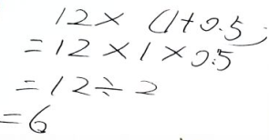
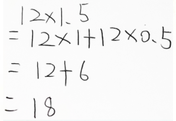
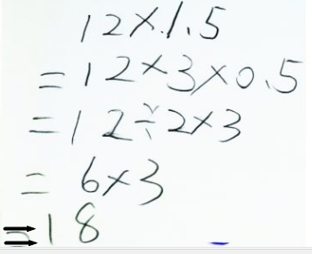
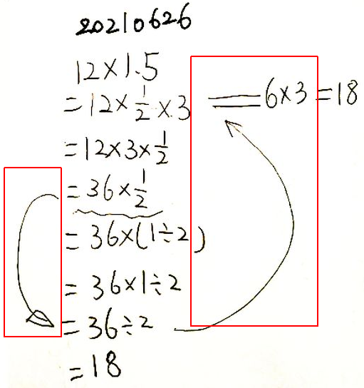
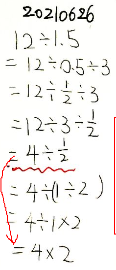

[TOC]

12X1.5？！
看到费力去写这样一个题目，大多数人会觉得不可思议吧？

如果搁在从前，这样毫不起眼、毫无挑战性的小问题，哪里值得一提，哪里会看在眼里？别说陪着孩子折腾，就算孩子自己在这个上面多耽搁一秒，都会嫌弃她磨蹭吧？！

但，自从几个月前加入了王永晖教授的数感群，并有幸参加了“代数恒等式”的证明课，看着那些已经接触了5年甚至几十年的加减乘除，女生和老妈似乎都有了不一样的感觉。

## 两位数乘法-只知道列竖式！

12X1.5，记得女生最初是列竖式计算的--看到这个情况，当时心里感叹，怪不得算得又慢，错误率又高！
于是，问能不能想到什么简便一点的算法？

## 搞不清乘法分配律

问，如果把1.5分成1和0.5，这个乘法会变成怎样？
竟然写出了这样的过程：

-乘法分配律都会搞错！！！

孩子要去看墙上的恒等式，阻止了，让她自己先想一会儿---
过了一会儿，终于写出了下面的过程：

追问是怎样想出来的？
回答说，想到**12X1.5，和12X(1+0.5)，这两个个式子的含义，就是一个12加上0.5个12！**

## 乘法交换律及除法的定义...

问为什么X0.5可以写成除以2？说以前妈妈提到过，至于为什么？答不出。

## 除法与分数
提示思考下0.5如果写成分数是什么样子？除法写成分数是怎样的？
说0.5可以写成5/10
那这个和2看不出什么关系呀？
说还可以写成1/2
于是，又写出这样的计算过程：

一开始不知道乘以分数和除法的关系！
箭头和红框里面，是后面讨论的过程中补充的。

## 顺便，算了下12/1.5

## 后续...

我想，过一阵子可以让女生再回头重新做一下，也可以再回头看下这些计算方法和计算步骤，从里面寻找代数恒等式的痕迹。
