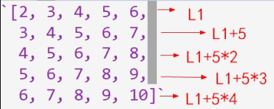

[TOC]

## 一道Python列表生成式题目：

发现这道题如果不用软件辅助，纯粹手撕的话，还是会费点脑筋的--至少，很难一眼看出答案或完全心算。

要想得到第二行打印的结果，需要知道第一行的列表生成式会生成怎样的列表：

后面的任务，就是对这个方阵里的数字求和了。
看着这规律整齐的排列，真让人忍不住多端详琢磨一会儿--突然想到，上周女生曾要求再来点大学生的编程题--说不定对这道题会感兴趣？
果然，女生慨然应允。还要放下期末复习作业，立马动手！

## 女生的思路与计算过程：

女生一边看题，一边发出嗯？嗯！的声音。
不一会儿，就颇有点得意地说，做出来了！
下面是最初的一张纸：

女生告诉我，她的计算思路是这样的：

而且，讲解过程中，发现有笔误或计算错误。于是，又重新写了一份：

## 老妈的思路与计算过程：

对这次出手相助，女生的评价是，这个比学校里的数学作业有意思！