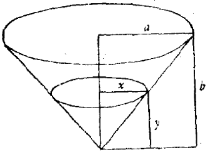

[TOC]

#### 例题

##### [例10]图1.  

##### [例18]．一个作图题
在给定三角形中作一正方形。正方形的两个顶点在三角形的底边上，另二
个顶点分别在三角形的另两边上。

##### [例19]．一个证明题
在不同平面上的两个角，其中一个角的每一边平行于另一角的对应边且方
向相同。证明这两个角相等。

##### [例20]．一个速率问题
水以速率r流进锥形容器。容器具有正圆锥形状，底是水平的，顶点在下
方，底的半径是a，高为b。当水深为y时，求水表面上升的速率。最后，假定a=4
尺，b=3尺，r=2立方尺/分，y=1尺，求未知数的数值。

##### [例III-1.类比]．求重心-三角形+四面体

##### [例(3)辅助线]．
例子。已知三角形一角和由此角顶点向对边所作的高和三角形的周长，
作这个三角形。

##### [例(3)辅助线]．例子。在一长方体中已知由一顶点引出的三个棱的长度，求该长方体
的对角线。

##### [例检验-特殊化]．例子，我们考虑底为正方形的棱台。设下底边长为a，上底边长为b，高为h，则其体积为
(a2+ab+b2)h/3

##### [例 ]．已知长方体的长、宽、高，求外接圆的直径。
已知正八面体的棱，求它的对角线。
已知正四面体的棱，求外接球的半径。
已知地球(假定为球体)表面上两点的几何坐标(经度和纬度)，求两点间的
球面距离。

##### [例 ]．例子：给定三点A，B，C。过A作一线与B，C等距离。

##### [例 ]．(8)例子。在一个纵横填字字谜
的字，关于这个字的线索是：“Do the walls again，back and forth(重新砌
墙，前与后)。

##### [例 ]．(3)例子。已知抛物线的焦点和准线和一直线，求作此抛物线与已知直线
的交点。

##### [例 ]．(2)一个数学例子。在周长一定的所有四边形中找出面积最大的一个。

##### [例 ]．(3)一个非数学的例子。在某个组字的字谜中，要求我们找出有七个字母
”

##### [例 ]．(3)代数说明。求满足方程
8（4x+4-x）一54(2x+2-x)+101=0
的x。

##### [例 ]．组字游戏
DRY OXTAIL IN REAR
将这些字中的字母重新组合成另一个字

#### 审题

2020年10月13日

【LCL 反常识 TODO 案例  人物 @温酒】探寻的是解题的规律和思维模式  题目 审题 破题 整理 逻辑 归纳
来自 <https://zhuanlan.zhihu.com/p/23371542> 

我曾经探索过机械化的解题方法，后来被网上的一句话点醒，大意是解题同时需要方法和经验。个人经验是解题中不可缺少的一部分。对于一个包罗万象的解题过程，需要借助个人相关的东西是比较讨厌的，但是这是绕不开的。

• 题目：就是题目本身
• 审题：审题部分旨在通过阅读题目，提取有价值的关键字，然后把关键字关联到考纲中的相关知识点。
• 破题：破题部分旨在通过题目中有或者没有的信息，推倒出隐含的信息量以及相关知识。
• 整理：整理部分旨在把审题和破题阶段获得的信息进行归并整理，然后通过一定推测来发掘解题思路
• 逻辑：逻辑部分是旨在按照整理出来的思路，结合审题破题的信息和考纲的知识点，互相组合进行推理计算，来得到答案。
• 归纳：通过挖掘题目中的相同点和不同点，来学习解题的套路。通常来说，这是个人觉得最有效的一种抓关键点的方式。

 <https://www.zhihu.com/column/farmthequestions> 

#### 通过大量的样本训练“反三”
2020年10月13日 
我这里要说的填鸭式教育，是不停“反三”，直到明白如何抽象信息量。
我举个例子。
不停举一的填鸭式，就是让孩子们去背诵自然数列。1,2,3,4,5,6...
背诵得越多，能应付的自然数列的填空题越多。
而不停反三的填鸭式，就是给孩子做大量的题目。

希望各位能在自我填鸭式训练的过程当中谨记：
通过大量的样本训练“反三”，而不是给予大量的样本进行“举一”。

 <https://zhuanlan.zhihu.com/p/30184094> 

##### 解题的过程。模拟了一下元认知。  【】openmindclub onenote
一边解题，一边观察自己的。解题过程。提出假设。代入选项进行验证。排除被泽假设。找到焦点假设。

##### 金句
发明活动是多方面的。然而解题——发明基础的基础。——阿奇舒勒

##### 抓谷粒 20191108 豆豆 奥数【】
有一堆谷粒（例如100粒），甲、乙两人轮流抓，每次可抓1－5粒，甲先抓，规定谁抓到最后一把谁赢。
问：甲应该如何抓？•
A.甲应该先抓1粒谷粒• 
B.甲应该先抓2粒谷粒• 
C.甲应该先抓3粒谷粒• 
D.甲应该先抓4粒谷粒
来自 <https://www.icourse163.org/learn/NANKAI-1001637008?tid=1001719013#/learn/content?type=detail&id=1002203209> 这道“抓堆”题在解题思考的过程中，关键词是什么A.3的倍数B.4的倍数C.5的倍数D.6的倍数

当 n=6或者6的倍数，后抓者赢！ 

##### 案例
我大一的时候，就已经是同学们公认的“小老师”了，我随便一节课，上百位同学为我鼓掌，后来直接被辅导员推荐给校领导的子女补课。而这一切都得益于我爷爷是校长，我从小就很注意培养分享知识的技巧。    【豆豆 教育 ZYQ 人物 解题 案例】
余朕昌
 <https://zhuanlan.zhihu.com/p/103388404> 
