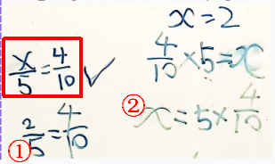
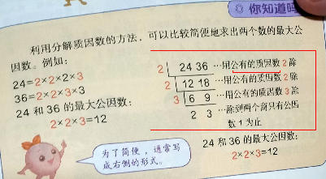

# 一道小学六年级解分数方程题目的过程复盘

【摘要】基本的求解过程颇为曲折，大致是这样的：

## 题目由来

老师要求预习六年级数学上册中计算部分，假期过了大半，小朋友认为已经预习得差不多了。于是一起翻翻后面的课本，在七年级课本封面上看到这样一道分数方程，刚好跟自学内容比较一致。女生迟疑说不会--题目出现在七年级的课本封面上---被吓到了？加上当天已经写过数学作业，不愿意再费脑筋。于是也不勉强，让她写在墙上，准备以后再看看---这一招，是从王永晖教授文章和微信群里学到的：[数学学习策略的两个犄角：攻击题和探马](http://wap.sciencenet.cn/blog-45143-1226065.html?mobile=1)，

## 第一阶段：女生的自行探索与证伪
等着吃早饭的时候，让女生自己想想这个题目，看了一会儿，说不会。
把前些天打印的“怎样解题表”（见文末截图）给她，让她试着用用里面的方法。
看了一会儿，她把题目改写成下面这样横着的除法形式：

再看了一会儿这个新形式，还是没有思路。
又看了眼解题表，写了下面的一个特例，想找出运算规律：

【！看到这个式子的第一眼，心里悲叹了一声---这个坑，貌似不止一次跳进来了】
根据上面发现的规律，女生写出了下面的求解步骤---得出x=420。告诉我自己解出来了！

### 质疑
当我质疑她这个解法的时候，她将420代入原来的题目中，说这样可以得出正确结果。
怎么这么巧---我正懊恼地琢磨着该怎样证伪，并要让女生明白仅仅用一个特例不能说明规律适用于所有的x，突然注意到60*70不是420！

女生在420后面补了个0，将4200代入原来方程，发现等式左边是70-60=10，不等于1。但，对于自己发明的公式还是有点恋恋不舍。

### 证伪
于是又给她一个形式相似的特例10/5-10/2。比较了两种计算式的结果，发现一个是-3，一个是1.

女生泄了气。

## 第二阶段：相关的会做的
又看了眼“解题表”中的策略，想起最近做过的一种解方程。

女生表示还会做：
并用①中的方法（同乘以一个数，商不变）解出来。问还能不能用别的方法？又利用除法的定义写出②的方法。

再前进一小步，改写为下面的题目：

就差了这么一点点，女生有点不是很有把握了，折腾了一会儿才做出来---敢情，她对椭圆里面的这种写法理解不了，方框里的形式还行：

上面的题目解出来后，问她还可以怎样变化？写出了下面两三个（怎么这么保守？！）

又翻了下六年级课本，找到大概10天前写过的类似题目：

认为这类方程现在还会解。

在提示下，终于表示，分母可以不同，于是，写出下面的题目：

刚写出第一行时，认为不对，x会是负数。等写出第二行看了下，反应过来第一行才是对的（没有负数）。

问，这样的题目会做吗？表示会，分母中5和10是倍数关系，只要只要把第一项x/5变成2x/10，就可以解出来了。

## 第三阶段：回到原题

兜兜转转，终于敢回到原题---会做前面的题，这道题会做了吗？
说会了，需要求分母的最小公倍数，然后通分相加。
但是，这么简单的两个数字，最小公倍数算得很"艰难"：

问，为什么不直接除以10？答曰书上都是要求每次只能写质因数，10不是。
讨论后，觉得也可以直接写一个10，更快捷。

## 参考：解题表-波利亚-《怎样解题》

## 验算讨论的现场
