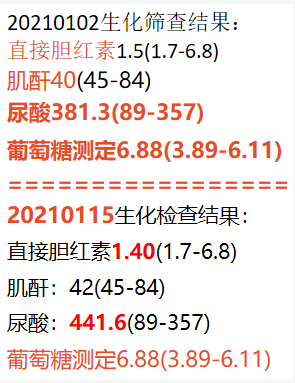

# high_Uric_Acid

7:45左眼疼，热敷冷敷都不行。胸口难受，后来又转为头痛。呕吐一次，绿水。不发烧。急诊科让去眼科或儿科，呕吐一次。眼科，呕吐一次，检查正常，开CT，让去五官科。五官科说CT问题不大，鼻窦轻微炎症堵塞，基本正常，怀疑脑膜炎之类，让去看儿科。喝水，验血，儿科说常规检查也基本没问题。又呕吐一次。五官科和儿科踢皮球，儿科说要么开药要么住院。下午拿到生化检查结果，血糖和尿酸高！问是否肥胖是否吃海鲜过多？喜欢乱吃糖！

高尿酸人群啥都吃不了?专家提醒：少碰2物，不饮4水
1)含贝壳类的海鲜类水产品
2)动物内脏：
蔬菜类的食物不适合吃菠菜、小萝卜等，因为菠菜中含有草酸，容易导致高草酸尿使得尿酸急增加重肾脏的负担;还有扁豆、青豆、豌豆等豆类

1)富含糖分的果汁
2)酒
3)碳酸饮料
4)鱼汤、肉汤

来自 <https://zhuanlan.zhihu.com/p/79805037> 

用海鲜制作的海鲜酱、蚝油、浓缩鸡汁等，嘌呤含量也非常高
高嘌呤食物为原材料的汤汁，嘌呤易溶于水，导致汤汁嘌呤远高于肉类

泡沫尿：肾脏受损后对蛋白质的代谢受到影响，会出现泡沫尿。

来自 <https://zhuanlan.zhihu.com/p/157270003> 

