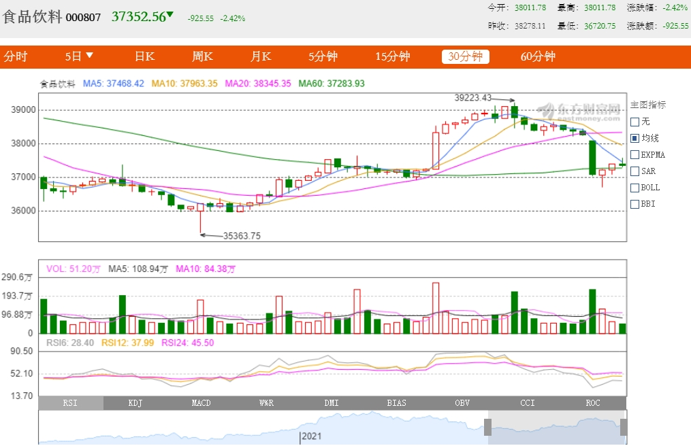

------------------------------------------------

## 老唐《价值实战》笔记
2019年9月10日  13:18

投资的定义： 把现在的消费转移到未来！   选择>努力
A股：1991~2014:  -- 年化10%
美股：1802~2012: -- 6.6%

股模式 vs. 票模式 !!!  --- 短线 vs. 长线

股票的收益包括：
1）企业增值
2）（子公司分割）发行新股，IPO融资 -- 拆分上市或卖出
3）股市波动--已证明长期不可行 ???

经济商誉G:  增加，有形资产下降 ==> 伟大企业！   ???
无风险收益率 == 国债收益率 C
购买股票，只买收益 大于 2C的！

1995~2014年，
上市公司：12%的年化；   全部公司：10%年化

估值公式：
1）两段式折现法：
永续增长率???=无风险利率 4%
折现率=2*4% ???
净利润=自由现金流
估算例子： 假设近四个季度??? 的利润分别为：100 ，120,140,180
则，前段= 120/104% + 140/ (104%^2) = 244.8225 = 245
后段= [ 180/(8%-4%) ] /  (104%)^3  =  4000 
总值=4245
预留50%的安全边际，买入点 4245/2=2123

简化估值公式： 180/(8%-4%)=4,500   
买入点 4500/2=2250

20190904

-----------------------------------------------

# E大交易体系

原则总结：没有仓位，就左侧买仓位。有了仓位就右侧买仓位，右侧卖仓位。新高不买，因为无法猜顶。

## 新高不卖
> ETF拯救世界 ：新高不卖的意思，是不要因为你持仓的品种涨的不错你就惊慌失措害怕坐电梯赶紧卖掉。如果你有各种投资策略，比如再平衡啊，比如网格啊等等，当然要坚定执行。不是说一分钱都不能卖，而是说不要主观猜顶随意清仓新高品种。
> https://weibo.com/chinaetfs?is_all=1#1600681103074  20200921

https://www.ershicimi.com/p/bae8bcb04d7fb063ad98e28c46079f07   E大的发车和我的目标市值策略重大更新   精髓：估值 + 趋势中轨 下轨  小鱼-E大-指数趋势监控系统.jpg  小鱼-E大-指数估值监控系统-加权等权2020-04和05.jpg  小鱼-E大-指数趋势监控系统-中轨下轨？.png  小鱼-E大-指数趋势-标普500趋势上轨2020.jpg   小鱼-E大-2015+2020牛市对比.jpg   【表头：指数名称 指数代码 当日点位 趋势中轨  距离中轨需下跌  趋势下轨  距离下轨需下跌   ||  中轨和下轨会缓慢变动！  || python 更新写入.xls ???  每天 每周 每月更新频率  ???   一张表】   公号ID：xiaoyulianghua 小鱼量化【】  20200725   E大的发车和我的目标市值策略重大更新  小鱼量化 2020-04-30 16:12  150份计划中买入中证红利1份，卖出全指医药1份。  <https://www.ershicimi.com/p/bae8bcb04d7fb063ad98e28c46079f07>  

## 恒生

网格交易示例表一159920（恒生ETF）

> 恒生指数从1964年最初的100点，上涨到2019年的27800点，整整翻了278倍，长期来看绝对是个赚钱的优质投资品种。 另外，恒生指数目前的PB只有0.94倍，这是个什么概念呢？1998年金融危机，恒生指数PB最低跌到0.93倍；2016年美联储加息和人民币汇率贬值，当时最低的PB是0.98倍；20200613

1月15日，恒生开始挑战第一压力位**29200**。 ​​​​如果能够站稳，第二压力位是**31400**左右。再往上就进入可减仓区域。
恒生指数的 **23000/21000/17000 **  https://weibo.com/chinaetfs?is_all=1#1600929892082 20200924

> 恒生开始挑战第一压力位29200。 ​​​​1月15日
> 1月19日，如果能够站稳，第二压力位是31400左右。再往上就进入可减仓区域。

20200925：
21000、17500依然有效。//@ETF拯救世界:刚才看了一下，几个月过去，最下面的极限点位17000已经上升至17500左右。更容易达到了。

预告一下。
150会在23000以下买1-4份恒生。21000以下买4-10份。
S会在23000以下持续买入。 ​​​​
2019-8-26 10:08  https://weibo.com/chinaetfs?is_all=1

------------------------------------------------
## 环保

辣鸡环保新高了。哪儿说理去。20200​​​​917  https://weibo.com/chinaetfs?is_all=1

如果站稳1910一线，下一明显压力位在2250一线。 1月25日​​​​最高冲到2250.93回调。
E大：2020-12-25 14:41 

------------------------------------------------
## 食品饮料

> 食品饮料前几天的低点会不会破非常关键。
> 如果破了，就是一个典型的_____。（5分） ​​​​
> ETF拯救世界 20210127 

食品饮料000807交易中 （2021-01-27 星期三 11:13:43） 37385.90 -892.21-2.33%
行情曲线，不知道应该看怎样的尺度？想起一个名词，头肩顶，搜了下，似乎日K线提到的更多。然后又回来比对了下各个尺度的行情线，发现30日线更清晰看到头部形态的末尾（前面已经有一个肩部形态）。

> 这是之前的一条微博：出货还要再拉起来。最高800，跌到600，多数人还是不敢买。再拉到750，这时候接盘的就冲进来了。所以历史大顶大多数都是M。右边的高点会比左边的低一点。不信你翻翻。

有人贴了一段对“头肩顶”的解读，注意到还提到成交量，对照行情曲线看了下，成交量总是在波动，一片茫然--看不出什么规律。
> 对此型态的分析是：
> （1）这是一个长性趋势的转向型态，通常会在牛市的尽头出现。
> （2）当最近的一个高点的成交量较前一个高点为低时，就暗示了头肩顶出现的可能性；当第三次回升股价没法升抵上次的高点，成交继续下降时，有经验的投资者就会把渥会沽出。
> （3）当头顶颈线击破时，就是一个真正的沽出讯号，虽然股价和最高点比较，已回落了相当的幅度，但趺势只是刚刚开始，未出货的投资者继续沽出。
> （4）当颈线跌破后，我们可棖据这型态的最少跌幅度方法预测股价会跌至哪一水平。这量度的方法一一从头部的最高点画一条直线到颈线，然后在完成右肩突破颈线的一点开始，向下量出同样的长度，由此量出的价格就是该股将下跌的最小幅度。
> 
在食品饮料的行情曲线上比划了一下，照这个说法，貌似要跌不少啊。

东方热线股吧：
> 今天站不上20日线就废了，中继下跌开始
> 等33200点上面一点点梭哈
> 三只绿乌鸦，后期暴跌

看到这些点评中提到20日线，想起有一段时间看“茶话”还是另一个人在知乎论股，也好多次强调10日和20日线，才注意到行情上那些彩色均线有标注说明：MA5,MA10,MA20,MA60！在日K图中，注意到，5日10日均线在头顶后早已变成下跌趋势，20日均线也在下跌的临界点了！

------------------------------------------------

## 医药

> 医药下方重要支撑线是**12000点**。上方压力线依然是**15500**。一切尽在掌握。//@ETF拯救世界:折腾了一个半月，我军15500防线固若金汤。//@ETF拯救世界:回来了老弟。//@ETF拯救世界:在大气层激烈争夺。15500不是那么容易过的。
>
> 2020年9月9日
>
>  <https://weibo.com/chinaetfs?is_all=1#_rnd1599621197615> 
>
> 
>
> [**@ETF****拯救世界**](https://weibo.com/chinaetfs?refer_flag=1005055013_)
>
> 医药基本已经脱离我能理解的范畴，进入“外太空”区域。 
>
> 在这个区域，我将用**新的交易策略**处理剩下的仓位。 
>
> 踏踏实实的。 
>
> [7月13日 11:26](https://weibo.com/5687069307/JaZgDapRK) 

搜了下，发现E大说的是全指医药“**全指医药(000991.SH)**”

五月底，从11900进入加速上涨：

E大发表评论的7月13日，收盘超过E大说的压力线15500：

7月13日前的半年时间里，长赢计划卖出4份医药：

**目前持仓还有6份，已经盈利73%**。从7月13日到今天，9月9日，多次穿越15500压力线，在“外太空”和内太空之间来回穿梭。E大所说的“新交易策略”，应该是说，现在E大的止盈策略这一轮有了更新，虽然估值已经非常高，但剩下的6份医药，不会轻易卖出。具体新策略是怎样的呢？好奇ing...

------------------------------------------------

> 医药下方重要支撑线是**12000点**。上方压力线依然是**15500**。一切尽在掌握。//@ETF拯救世界:折腾了一个半月，我军15500防线固若金汤。//@ETF拯救世界:回来了老弟。//@ETF拯救世界:在大气层激烈争夺。15500不是那么容易过的。
>
> 2020年9月9日
>
>  <https://weibo.com/chinaetfs?is_all=1#_rnd1599621197615> 
>
> 
>
> [**@ETF****拯救世界**](https://weibo.com/chinaetfs?refer_flag=1005055013_)
>
> 医药基本已经脱离我能理解的范畴，进入“外太空”区域。 
>
> 在这个区域，我将用**新的交易策略**处理剩下的仓位。 
>
> 踏踏实实的。 
>
> [7月13日 11:26](https://weibo.com/5687069307/JaZgDapRK) 

搜了下，发现E大说的是全指医药“**全指医药(000991.SH)**”

五月底，从11900进入加速上涨：

E大发表评论的7月13日，收盘超过E大说的压力线15500：

7月13日前的半年时间里，长赢计划卖出4份医药：

**目前持仓还有6份，已经盈利73%**。从7月13日到今天，9月9日，多次穿越15500压力线，在“外太空”和内太空之间来回穿梭。E大所说的“新交易策略”，应该是说，现在E大的止盈策略这一轮有了更新，虽然估值已经非常高，但剩下的6份医药，不会轻易卖出。具体新策略是怎样的呢？好奇ing...【20210128，根据最近微博评论，感觉应该是**新高不卖+...**！】

------------------------------------------------

# 两融余额margin_trading+short_selling_in_A_share_market

[E大提示两融数据](https://weibo.com/chinaetfs?is_all=1#_rnd1609903878809)

[两融资金](http://finance.sina.com.cn/stock/s/2017-10-11/doc-ifymuukv1715082.shtml)

# 20年3月长赢仓位EDA_Investment_Qieman

[ETF拯救世界的微博-长赢150三月份仓位](https://weibo.com/chinaetfs?is_all=1)

[E大长赢150在2020年三月份的仓位占比20200327](https://github.com/l00c00l/Notes_Cards/blob/master/CD20200327-math_formula_howto.md)

> ----------------------------------------

## 通胀与加息

> 通胀高央行加息的话债券就完蛋了。
> 关心大葱价格——关心通胀——关心下一步持有什么资产。是这个逻辑。

> 阿呆cy：回复@东江晓色xx:加息是一般经济数据或预期向好，这个时候股市一般已经上涨了一段时间。会吸引场外的资金进来，上涨的惯性会保持一段时间，直到惯性减弱到达顶点，最后调整。

> 上图是国家统计后发布的，2020年CPI的变化情况》2020年度CPI增速为2.5％。
> 我们来算一笔账，假设2020年初，我们有10000块在银行卡里，银行活期利息
> 0.35％，那么到了年末，我们账上有10035。
> 你以大賺了一杯奶茶，事实上你亏了一顿火锅。
> 然而
> 10035/(1+2.5％)=9790（元）
> 也就是说，经过了2020年，银行卡里的10000块“縮水”了约210块。

## E大语录

[E大-ETF拯救世界](https://github.com/l00c00l/chinaetfs_public_saying/blob/master/README.md)

## E大网格

[E大网格策略1](https://github.com/l00c00l/NetTrade/blob/master/README.md)

[E大网格策略2](https://github.com/l00c00l/grid-trading/blob/master/README.md)

## 八卦
> ETF慢慢变好：e大可能在西城区，曾自己说过是方庄塔格利安家族西城央妈守护者。

