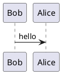
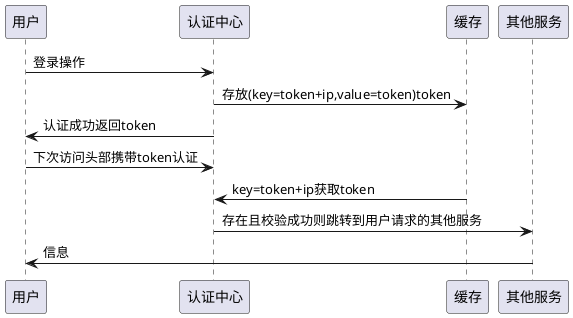
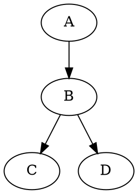
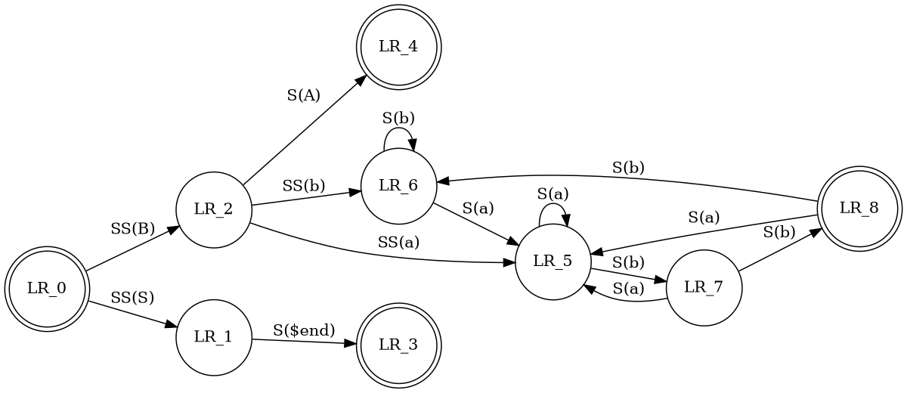

# 用Vnote记录VNote学习笔记

onenote用了十几年了，这两天因为年终总结整理时的不便，萌生了找新工具的念头，onenotegem还是不能那定主意购入（除了移动端，只能用于一台电脑？！）
在一个笔记软件的讨论下面，看到有人放弃onenote，入了vnote...

## VNote的口碑-优点及问题

> 2019-06-05 08:24:34 +08:00   ❤️ 1
我丢过两次内容，是彻底丢失某个 markdown 文件的全部文本内容。【！】

> Raul7   307 天前
@smilzman vnote 在 win10 下用经常卡死退出【...希望现在这个问题已经解决了--有两位资深用户说没有遇到过这个问题】

> 用了一年多了，win10 专业工作站 1909 + Vnote 2.8.2，功能全的：Vnote （目前在使用，感觉各方面比较均衡的一个）

> gdm   306 天前   ❤️ 2
我觉得喜欢用 markdown 的人其实缺的是一个笔记管理及浏览软件，而不是笔记编辑软件
用自己的文本编辑器肯定最舒服，笔记软件自带的编辑器没法比
这一点上，vnote 比较友好

> onedrive/坚果云+joplin+typora，分别解决云存储，笔记管理搜索 tagging 以及同步和加密等功能，markdown 写作三个问题

> typora一次排版可以放在好多个平台？！【向往... 
希望我能用vnote实现这个功能】

想起已经安装了Typora，有点纠结... 突然冒出一个念头：
VNote可以代替Typora?！
这样的话，不必安装两个markdown编辑器了

### 图片管理问题

据说vnote的图片管理最便捷：
> 1+3。默认在本地同目录创建文件夹收录所有的图片，同时可以选择右键一键上传md文档中的图片并自动替代网址图片路径为网页链接！


### 从网页拖放？
最初新建笔记本和文件夹并试用时，可以从网页拖放到笔记中
后来关闭软件，取消原先的文件夹，把笔记根文件夹选择为已经存在的git本地文件夹“LCL_Github"，
把刚才的.md文件移动到这个新的根文件夹中，重新打开这个文件，发现不能拖放了？！
试着新建一个.md文件，也不行？！
根文件夹有只读属性，去掉以后，重新开启vnote软件，又可以拖放了

### undo与redo-撤销最后修改的功能？！  
ctrl-Z可以
但ctrl-shift-Z不可以，也没有找到菜单或功能键！
右键菜单里看到了，是ctrl +Y !

## 了解VNote特色
VNote使用笔记本、文件夹和笔记层次结构进行笔记管理。


### 片段snippet
片段旨在方便重复输入一些词组。
通过 Tools 工具栏小部件管理片段

### 幻词magic words
是一些具有特殊含义的字符。date可以识别为今天的日期
%da% work log.md将识别为20180128 work log.md ，因为%da%是一个幻词，它以YYYYMMDD的形式定义为今天的日期。
键入以下单词：
Today is %da%
然后按 Ctrl+E M，它将更改为：
Today is 20180128

### 全局搜索功能？

按Ctrl+E C 或Ctrl+Alt F 激活搜索坞小部件。您也可以通过编辑或查看菜单激活它。 【试了一下，没反应？！】

全局定位 Ctrl+G  【试了一下，没反应？！】

在设置，杂项里面勾选启用 【设置里没有“杂项”？！配置文件还看不明白 】


### 可以编辑 vnote.ini 
[magic_words]
1\name=vnote
1\definition="vnote is a great tool! -- Written %datetime%"

## PlantUML、Graphviz、Mermaid 和Flowchart 四种文本绘图格式

### mermaid & flowchart ?!

据说这两个都是绘图插件，VNote可以直接预览，但github似乎不支持？！

mermaid流程图的定义仅由graph开始，但是方向的定义不止一种。

1. TB（ top bottom）表示从上到下
2. BT（bottom top）表示从下到上
3. RL（right left）表示从右到左
4. LR（left right）表示从左到右
5. TD与TB一样表示从上到下


```flowchart
st=>start: Start:>http://www.google.com[blank]
e=>end:>http://www.google.com
op1=>operation: My Operation
sub1=>subroutine: My Subroutine
cond=>condition: Yes
or No?:>http://www.google.com
io=>inputoutput: catch something...

st->op1->cond
cond(yes)->io->e
cond(no)->sub1(right)->op1
```


### puml是什么？

PlantUML
`ctrl-e i`打开实时预览，双击 puml 代码块里面某个类名之类的，预览里面会对应高亮相关元素

把限制宽度去掉，按住 ctrl 拖动鼠标就能平移查看预览或图片，ctrl-j/k 上下移动。

一边读源码, 一边用 puml 简单的语法记笔记, vnote 原地预览出 uml 图, 感觉效率非常高







### Graphviz

其它三个画图插件不需要任何配置，vnote直接就可以把代码渲染出图形，但这个没反应？！

graphviz 图实体主要分三类：
1）**digraph** {...} 定义有向图；
2）**graph** {...}定义无向图；
3) **subgraph{...}** 定义子图；

[“设置 vnote，配置界面如下”](https://zhuanlan.zhihu.com/p/208476690)
最新版VNote貌似设置界面简化了很多。这些配置也许都转移到配置文件中了？网上很多经验都过期了，估计只能看官方V3.0的最新说明了。
已经下载安装了graphviz，得到“C:\Program Files\Graphviz 2.44.1\bin\dot.exe”，暂时不知如何修改VNote中的相关配置。

刚才VNote出现卡死（？不肯定，反正ctrl-j,k没反应），关闭重新打开后，打开这个文档，在阅读模式下，突然注意到，这一段的**dot绘图代码都成功显示出图形了！
只要安装了graphviz，无需配置，自动支持？！ 
但是，在编辑模式下，其它三种绘图插件都显示图形，这个不显示。**




```dot
digraph G {
size="4,4";
main [shape=box];/*注释*/
main -> parse[weight=8];
parse -> execute;
main -> init [style=dotted];
main -> cleanup;
execute -> {makestring; printf}
init -> makestring;
edge [color=red];
main -> printf[style=bo1d,label="100 times"];
make_string[label="make a\nstring"];
node [shape=box,style=filled,color=".7 .3 1.0"J;
execute -> compare;
}
```



本来打算用坚果云同步VNote笔记，突然又一个念头：要么
## 直接将VNote笔记同步到github上？！

> 使用 私有仓库 + VNote 实现笔记备份 将VNote 根目录 /root/文档/vnote_notebooks 初始化私有仓库
希望不需要这么折腾，直接用VNote编写，然后gitKraken或者github桌面版管理一下就好。


## 一次排版可以放在好多个平台？！
期待，希望自己能尽快实现这个。


## 问题与解决

1） [手动重构笔记本之后无法识别笔记本
](https://github.com/vnotex/vnote/issues/1563)
刚开始接触。
在建立根文件夹以后复制进来一个vnote1.md，也在VNote中打开编辑过两次，但是，在vnote里一直看不到这个文件！
这个问题，大概跟题主说的是同一个问题？
还有，vnote里看不到最近打开文件？有点点不适应。
2）不知是否graphviz的原因，现在VNote在浏览模式下，无法滚动页面--而且CPU发出一种负重的声音。切换回编辑模式，立马好了。没有安装graphviz之前，没有发现这个问题。


## 参考资料
> [VNote创作者的介绍及问答](https://www.v2ex.com/t/570883)

> [VNote指南](https://vnote.readthedocs.io/zh_CN/latest/user_docs/template.html)

> [VNote github--奇怪，这个打不开了](https://tamlok.github.io/vnote/zh_cn/)

> [可同步的markdown笔记软件讨论](https://www.v2ex.com/t/648954#reply127)

> [笔记软件讨论](https://www.v2ex.com/t/533840?p=1)

> [vnote + github](https://blog.diqigan.cn/posts/build-your-personal-notebook-with-vnote.html)

> [mermaid绘图插件](https://blog.csdn.net/Subson/article/details/78054689)

> [graphviz-install-2.44.1-win64.exe](https://www2.graphviz.org/Packages/stable/windows/10/cmake/Release/x64/graphviz-install-2.44.1-win64.exe)

> [Graphviz与VNote](https://c.m.163.com/news/a/FKO20APH0526W5Q0.html)

> [Graphviz-digraph](https://github.com/vnotex/vnote/issues/239)

> [VNote的图片管理功能！](https://www.hitdn110.club/2019/12/485.html)

> [全局搜索？](https://github.com/vnotex/vnote/issues/204)


