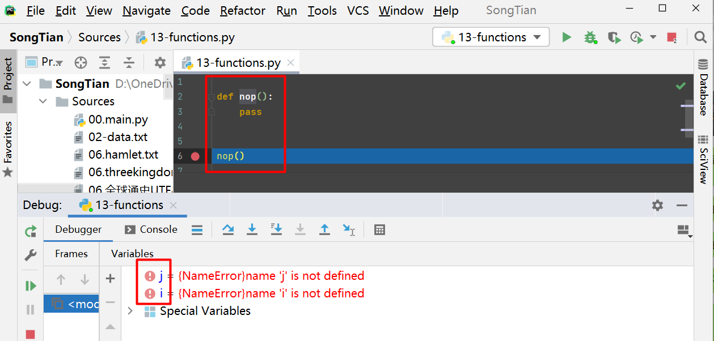
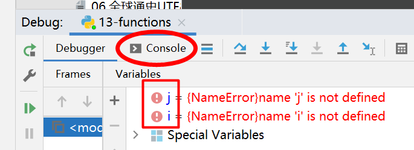

最近用pycharm时，遇到一个诡异的毛病

> Pycharm {NameError}name 'i' is not defined
（如下图所示---错误原因在文字最后）

调试的时候，老是冒出i,j的报错---代码里面根本没有i，j这两个变量？！
直接运行，不会报错，在其它环境（IDLE，或cmd-python.exe命令行）下运行或调试，都不会报错！
{NameError}name 'j' is not defined     Python中对错误NameError: name ‘xxx‘ is not defined进行总结  【】pycharm中报错！即使是已经删除了j！但，放在IDLE中运行就不报错 ???

在Pycharm中调试其它源代码，也报告这个毛病！

看不出是怎么回事？！搜了半天，网上没找到相同情况！
跟女生讨论了一阵，也没找到问题所在：

就这么一个毛病，折腾了一个多星期了...不甘心啊，又跟办公室说起。同事过来一看，发现虽然有这两个报错，但并不影响程序执行！然后，同事在左下角点了下Console：

切换到控制台，一下就发现了罪魁祸首--原来，是我在某次调试程序时，在控制台输入了i,j，给学生看当时的迭代数值，后面忘记删除了。没想到，Pycharm竟然会跨程序保留这个东西在控制台上！

#### 类似报错-其它情形

Pycharm {NameError}name 'i' is not defined   Pycharm-debug-i,j不知从哪里冒出来的变量？！20210503162327.jpg 【】找到的一些，全都不跟自己情况一致 

谷歌一下stack overflow之类的会有
直接谷歌报错
PyCharm for Python gives error for self is not defined
This is blocking any debugging I can do.
However, when I execute my code the app functions as expected.
How can I get rid of that error message_
python 3.x - "NameError: name 'answer' is not defined" PyCharm 
Move your code line global answer to the first line of your method.Check if you defined all your classes before you use them, else you can also end up with a NameError. more detailsThe error might be outside of the code you provided. Where do you declare the global variable answer?
python - NameError in Pycharm?  [Python3 没这个问题了？]
When you click run (in pycharm) it executes the file in a different instance of python for debugging and all that. The python console window, is totally different. Its not linked to your code. Its there to execute python commands and tests stuff just like you would do in IDLE.

When you do Execute Selection in Console, this basically executes your file in the console instead of running it on its own.

Its something like this you would do in IDLE when you want to execute your file: exec(open("mycode.py").read())

Edit: In your python console, you can execute the above command to load your file in the console. But this is basically the same thing as selecting Execute Selection in Console
"NameError name 'x' is not defined" Pycharm using Python 3.9
define functions before the main

def run():
    test()
    return

def test():
    print("test")
    return
if __name__ == '__main__':
    run()
NameError: name “ ” is not defined -
NameError: name 'XX' is not defined
Python错误]NameError: name ‘name’ is not defined_sinat_