[TOC]

# 加法-乘法-幂

## 王永晖教授幼小数觉群里看到一个题目：
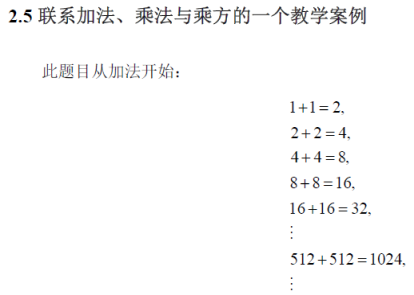

## 加加乘乘找规律
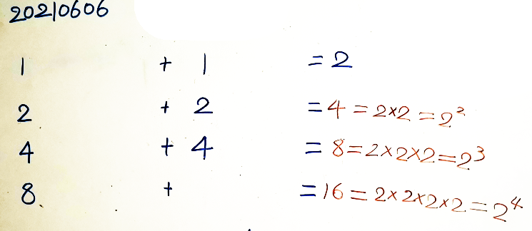
## 算到四位数-两数相加改成乘2
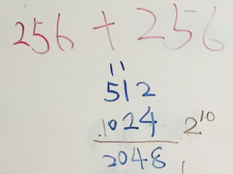

## 一直乘2--每天增加两位数：

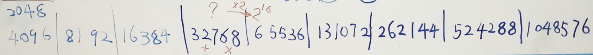

除了1024和65536，其它结果妈妈也不熟悉。如果中间出现错误，后面会全都错了！
后来想到一个办法，每天的最后一个结果，用计算器验证一下。

## 发现乘方运算的规律

太多2相加，得到乘法--5年级的学生已经非常熟悉这个规律；
太多2相乘了... 很容易看错，数也数不清... 讨论中，提到引入乘方记号
问，一大串2相乘---可怎样计算2的20次方呢？
小朋友灵光一闪，说可以分成两组，分别乘起来，再把前后两组相乘！
把这个意思用符号表示：

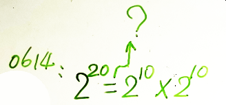

2的20次方究竟怎样算？上面的结论，并不很牢固，过两天再讨论，又冒出其它想法：
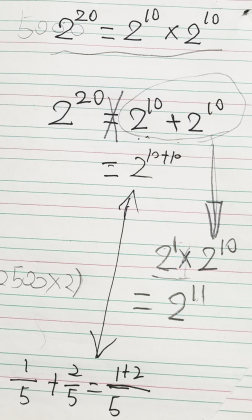
尝试找到一般规律，写成代数式的形式：
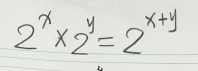

# 一直除以2...一道Python作业

## Python选择题：
k=10000
while k>1:
 print(k)
 k=k/2
哪个选项给出了上述程序的输出次数？
a. 16
b. 1000
c. 12
d. 14

## 小朋友手撕编程题：
小朋友听说是大学生的作业，看到刚好和最近的幂次方练习相关，蛮感兴趣，跃跃欲试：

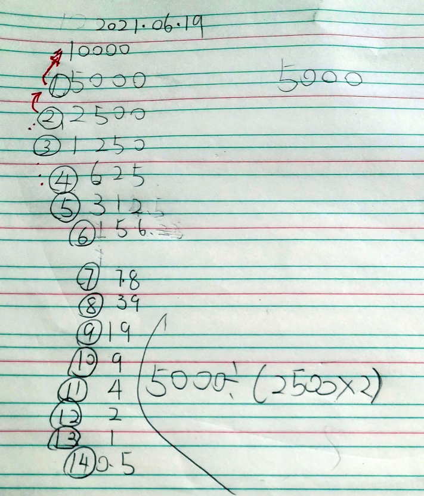

经过一番写写画画，转头看过来，充满期待又迟迟疑疑地说，14？
于是

## 在网页上检查答案：

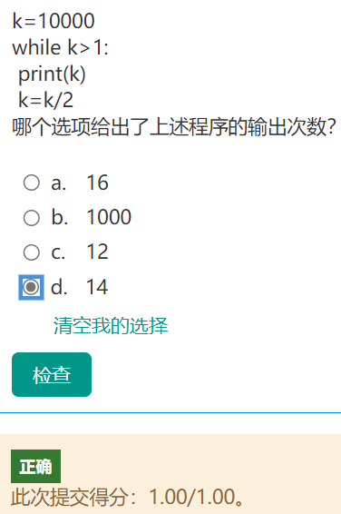

发现自己的回答正确，好不兴奋！
然后，又

## 查看Python代码的运行结果：
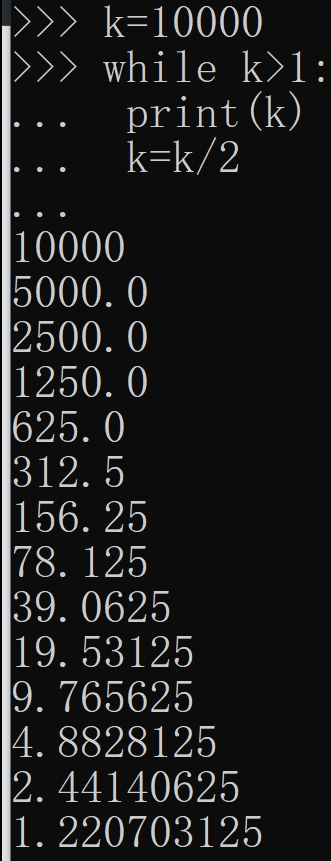
数了一下，果然是打印了14行数字！

又跑去查看前几天的计算结果，14个2相乘是8192，

## 再验算一下：
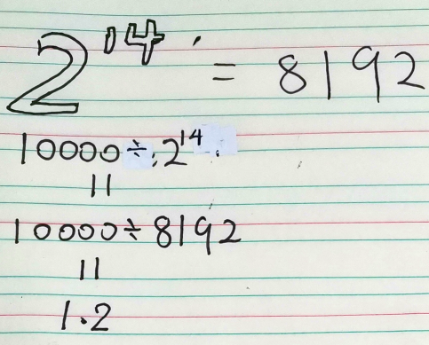
