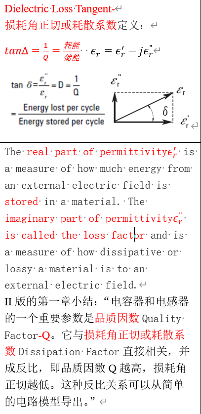
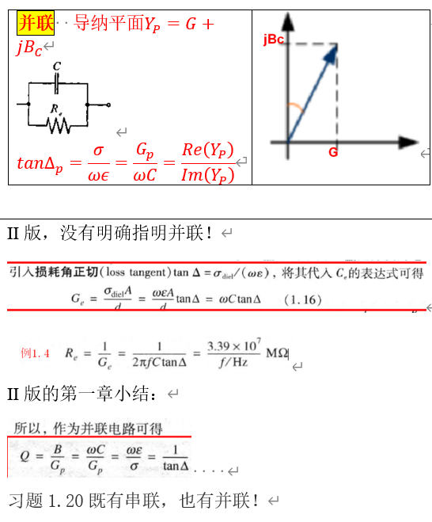
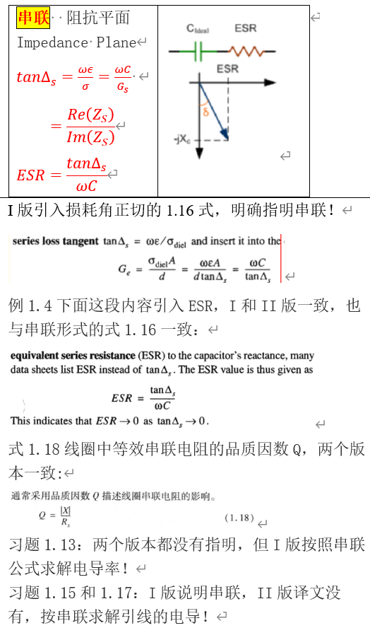

>```
>---
>layout: post
>title:关于损耗角正切（耗散系数）
>categories: [电路, 射频]
>description: 日拱一卒...
>keywords: Dielectric Loss Tangent, 损耗角正切, 耗散系数, 品质因数Q
>---
>```
>------------------------------------------------

## 摘要
Ludwig的《射频电路设计-理论与应用RF Circuit Design Theory  Appliacations》对于损耗角正切有较多变动，有的地方第2版反而没有第1版写得清晰明确。这篇短文从损耗角正切的定义、串并联电路中的计算、相关习题等角度做了点梳理。

## Dielectric Loss Tangent-损耗角正切或耗散系数定义：

tanΔ=耗能/储能=1/Q

第2版的一章小结中讲道：“电容器和电感器的一个重要参数是品质因数Quality Factor-Q。它与损耗角正切或耗散系数Dissipation Factor直接相关，并成反比，即品质因数Q越高，损耗角正切越低。这种反比关系可以从简单的电路模型导出。”
  

## 并联形式及相关公式


##  串联形式及相关公式


## 参考资料


https://www.electronics-notes.com/articles/basic_concepts/capacitance/esr-dissipation-factor-loss-tangent-q.php
http://academy.cba.mit.edu/classes/input_devices/meas.pdf


