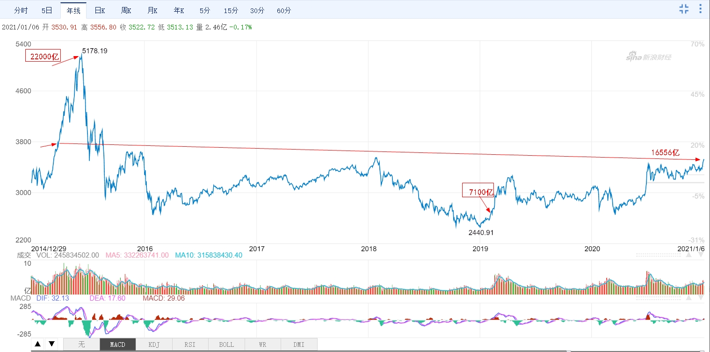

# 两融余额目前16556亿，再创2015年7月以来新高

>```
>---
>layout: post
>title:两融余额目前16556亿，再创2015年7月以来新高... 
>categories: [投资, 量化，理财]
>description: 滚雪球...
>keywords: 理财, 量化
>---
>```
>------------------------------------------------


[E大提示两融数据](https://weibo.com/chinaetfs?is_all=1#_rnd1609903878809)




